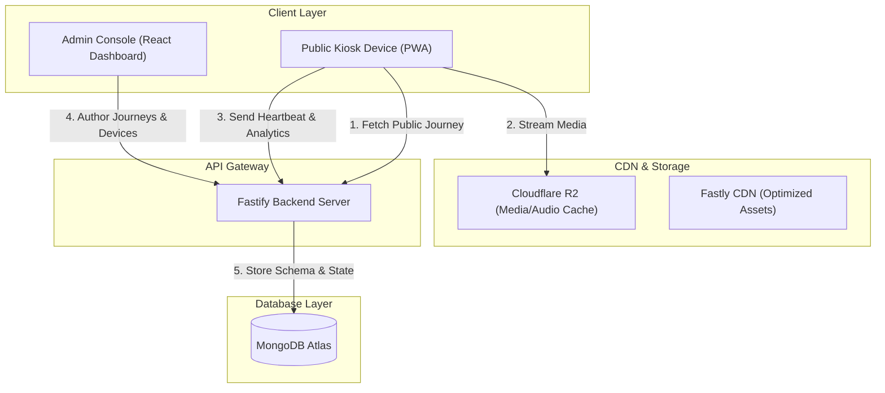
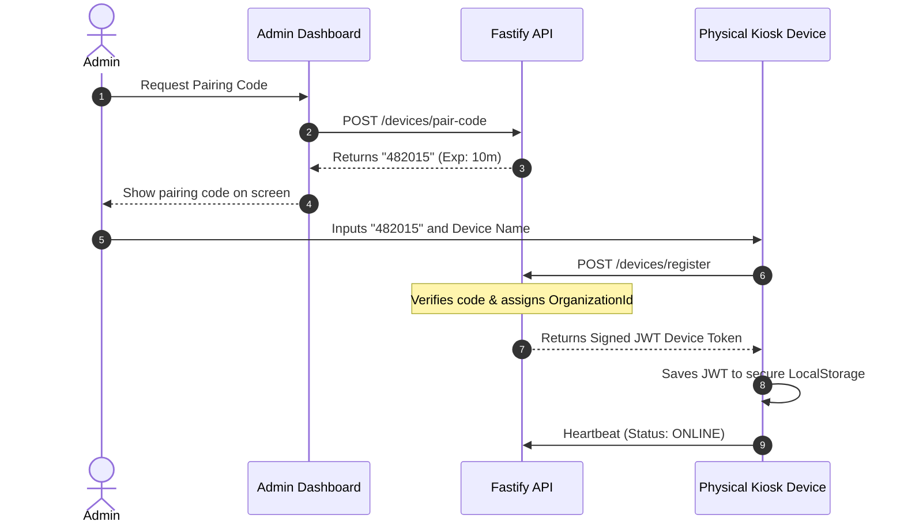
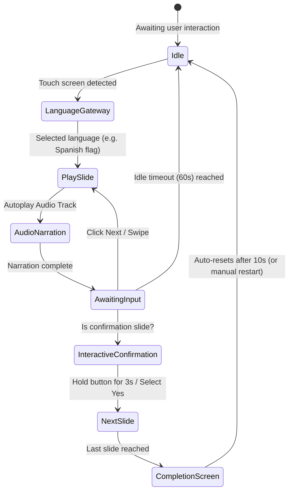

# 13 — Public Kiosk Journey Specification

**Version:** 1.0.0

**Status:** Proposed Architecture Specification

**Module Namespace:** `kiosk`

---

# Purpose

This document outlines the architecture, data models, API endpoints, user experience, and technical specifications for the **Public Kiosk Journey** module. 

This module is designed for enterprise organizations deploying frontline kiosks (e.g., factory floors, warehouse terminals, construction safety sites) where workers may have low literacy, language barriers, or physical constraints like wearing gloves. 

Unlike the standard Talnova onboarding journey, which is assessment-driven and authenticated, the Public Kiosk Journey is an unauthenticated, highly visual, audio-first instruction engine focused on safety induction, PPE guidelines, operating procedures, and emergency briefings.

---

# Architectural Overview

The Kiosk Journey module is built on the existing Talnova stack (React, Fastify, MongoDB, Cloudflare R2, TypeScript) but operates on a separate frontend route and database collections.



---

# 1. User Personas

### Persona A: Frontline Operator (The Learner)
* **Name:** Manuel Silva
* **Role:** Warehouse Picker / Forklift Operator
* **Context:** Work environment is high-noise, fast-paced, and requires heavy PPE (gloves, steel-toe boots).
* **Constraints:** Low literacy (difficulty reading instruction manuals). Native language is Portuguese, but working in a German facility.
* **Goal:** Understand forklift inspection procedures before starting his shift without needing an email address or password to log in.
* **Key Needs:** Large touch targets, immediate audio instructions in Portuguese, flag-based language selection, minimal text, and simple confirmation actions (e.g., "Hold button to confirm").

### Persona B: EHS Safety Manager (The Author)
* **Name:** Sarah Jenkins
* **Role:** Environment, Health & Safety Manager
* **Context:** Creates standard operating procedures (SOPs) and safety briefs. Has no design or coding background.
* **Goal:** Easily create a 5-step PPE briefing flow and publish it instantly to all tablets mounted at warehouse entryways.
* **Key Needs:** Drag-and-drop step ordering, instant step preview, AI-assisted text-to-speech generation for multiple languages, and a library of standard safety icons (OSHA/ISO compliant).

### Persona C: IT Operations Administrator (The Fleet Manager)
* **Name:** David Vance
* **Role:** Systems Administrator & Device Manager
* **Context:** Responsible for IT assets across 3 regional manufacturing facilities (approx. 150 terminal displays).
* **Goal:** Monitor device online status, update content versions remotely, and ensure public URLs are protected from malicious access.
* **Key Needs:** Device health telemetry (CPU, battery, cache status), automated registration using 6-digit pair codes, IP/device whitelisting, and remote reload commands.

---

# 2. Functional Requirements

### Journey Builder & Authoring
* **Unauthenticated Access Setup:** Authors can generate a signed public URL, configure expiration dates, and restrict access by IP range or registered device ID.
* **Step Creation Engine:** Authors can create a sequential path containing:
  * **Large Image Blocks:** Supports zoom, high-contrast markers, and carousel-style multiple images.
  * **Illustrations:** Embedded vectors (SVG) or images with high visual contrast.
  * **Video Blocks:** Optimized for autoplay, loop, landscape/portrait aspect ratios, and custom subtitle tracks.
  * **Audio Narration:** Automated voice synthesis (Text-to-Speech) or custom audio uploads per language.
  * **Minimal Text:** Support for optional short headings (designed for low-literacy).
* **Multi-Language Localization:** Direct mapping of custom text, subtitles, and audio files to standard ISO-639 language codes.
* **Template Engine:** Save journeys as reusable organizational templates (e.g., "Standard Hazard Warning Template").

### Kiosk Player
* **Zero Auth Execution:** Launching the player directly loads the journey config without prompting for standard Talnova login credentials.
* **Language Selection Gateway:** Displays large national flag buttons at startup if multiple languages are configured.
* **Oversized Glove-Friendly UI:** Control bars occupy a minimum of 20% of the screen height, with massive navigation buttons.
* **Interactive Confirmations:** Step verification via Yes/No inputs, image hotspot clicking, or a 3-second hold button.
* **Auto-Reset & Timeout:** Automatically returns to the language gateway after a configurable idle timeout period.

### Device Fleet Management
* **Device Pairing:** Registration of physical terminals using a 6-digit numeric pairing code generated in the Admin Dashboard.
* **Telemetry Heartbeat:** Devices report local storage cache utilization, battery status, current journey version, and latency every 60 seconds.
* **Remote Actions:** Administrator-triggered actions: Refresh Content Cache, Restart App, Clear Local Storage.

---

# 3. Non-Functional Requirements

### Performance & Latency
* **Offline Capability:** Must run as a Progressive Web Application (PWA) with Cache API and Service Workers, ensuring 100% functionality during complete network blackout.
* **Fast Transitions:** Slide-to-slide load times must be sub-100ms once media is cached locally.
* **Asset Compression:** Automated server-side transcoding (WebM/MP4, WebP/AVIF, Opus audio) to keep slide payloads below 1.5MB.

### Security & Privacy
* **Cryptographic URL Signing:** Public URLs must use SHA-256 signatures with expiration timestamps (`t`), tenant parameters (`o`), and signature keys (`sig`).
* **Device Identity Verification:** Registered kiosks authenticate using JSON Web Tokens (JWT) signed with a device-specific hardware fingerprint key.
* **No PII Collection:** The system must not capture or store any Personally Identifiable Information of kiosk users.

### Accessibility (WCAG 2.1 AA/AAA)
* **Touch Targets:** Minimum target size of 64px x 64px (approx. 9mm x 9mm at standard resolution) to allow glove-friendly interaction.
* **Contrast Ratios:** Essential warning blocks and text elements must maintain a minimum contrast ratio of 7:1 against background colors.
* **Audio Interventions:** Visual alerts must be accompanied by synchronized audio narration; screen reader attributes (`aria-live`, `aria-label`) must be dynamically updated.

---

# 4. UX Wireframe Descriptions

### Wireframe A: Admin Device Management Dashboard
```text
+--------------------------------------------------------------------------------+
|  [TALNOVA LOGO]  Admin Dashboard > Kiosk Module > Devices                       |
+--------------------------------------------------------------------------------+
|  +-------------------+  +---------------------------------------------------+  |
|  |  Quick Telemetry  |  |  Registered Kiosk Fleet                           |  |
|  |  Online: 142/150  |  |  [Search Devices...]  [+ Register New Device]     |  |
|  |  Sync Status: 98% |  +---------------------------------------------------+  |
|  |  Alerts: 2 critical|  | Device Name | Location | Status | Battery | Version |  |
|  +-------------------+  |-------------|----------|--------|---------|---------|  |
|                         | Tablet-001  | Hall A   | ONLINE | 95%     | v1.0.4  |  |
|                         | Terminal-04 | Gate B   | OFFLIN | 12%     | v1.0.3  |  |
|                         | TV-Display  | Lunchroom| ONLINE | AC      | v1.0.4  |  |
|                         +---------------------------------------------------+  |
|                         | Actions: [Restart Selected]  [Push Updates]       |  |
+--------------------------------------------------------------------------------+
```

### Wireframe B: Visual Journey Builder Canvas
```text
+--------------------------------------------------------------------------------+
|  Back to List  |  Journey: Forklift Safety SOP      [Save Draft]  [Publish]    |
+--------------------------------------------------------------------------------+
|  +------------------+  +----------------------------------------------------+  |
|  | Steps Timeline   |  | Step Editor (Canvas Preview)                       |  |
|  |                  |  | +------------------------------------------------+ |  |
|  |  [1. Language]   |  | | [!] SAFETY WARNING (High Contrast Yellow)      | |  |
|  |  [2. PPE Warning] |  | |                                                | |  |
|  |  [3. Engine Chk] |  | |            [ ICON: Wear Safety Glasses ]       | |  |
|  |  [4. Emergency]  |  | |                                                | |  |
|  |  [5. Completed]  |  | | Audio: "Wear safety glasses before operating"  | |  |
|  |                  |  | +------------------------------------------------+ |  |
|  |  [+ Add Step]    |  | Blocks: [ + Image ]  [ + Video ]  [ + Audio ]      |  |
|  +------------------+  +----------------------------------------------------+  |
|                        | Property Panel: Lang: [EN v] [PT]  [+] Narration:  |  |
|                        | [Auto-TTS Generator] [Upload Custom File]          |  |
+--------------------------------------------------------------------------------+
```

### Wireframe C: Kiosk Player Interface (Landscape Mode)
```text
+--------------------------------------------------------------------------------+
|  [🏠 HOME]                  [🗣️ PORTUGUÊS]                      [⚡ EMERGENCY]  |
+--------------------------------------------------------------------------------+
|                                                                                |
|                                                                                |
|                           [   WARNING ICON   ]                                 |
|                                                                                |
|                      Mantenha a distância de 2 metros!                         |
|                                                                                |
|                                                                                |
|                            [🔊 REPLAY AUDIO]                                   |
|                                                                                |
+--------------------------------------------------------------------------------+
|  [◀ VOLTAR]              ●   ●   ●   ●   ●   ●   ●             [SEGUINTE ▶]   |
+--------------------------------------------------------------------------------+
```

---

# 5. Frontend Component Hierarchy

The client-side module will reside within `src/features/kiosk` to avoid interference with standard user onboarding paths:

```text
src/features/kiosk/
├── components/
│   ├── builder/
│   │   ├── KioskBuilderCanvas.tsx       # Main drag-and-drop workspace
│   │   ├── StepTimelineList.tsx         # Left sidebar showing flow of steps
│   │   ├── BlockLibrary.tsx             # Panel with available visual/audio blocks
│   │   ├── PropertyInspector.tsx        # Configuration panel for selected steps
│   │   └── TTSGeneratorModal.tsx        # Interface for AI narration configuration
│   ├── player/
│   │   ├── KioskPlayerContainer.tsx     # Full-screen wrapper with layout controls
│   │   ├── LanguageSelectGateway.tsx    # Big flag buttons language prompt
│   │   ├── StepRenderer.tsx             # Resolves step types and content blocks
│   │   ├── OversizedControlBar.tsx      # Bottom bar (Next, Prev, Audio Replay)
│   │   └── CountdownOverlay.tsx         # Auto-advancing visual progress circle
│   └── admin/
│       ├── DeviceListTable.tsx          # Device grid with heartbeat telemetry
│       ├── PairDeviceModal.tsx          # 6-digit registration dialog
│       └── AnalyticsHeatmap.tsx         # Heatmap showing where users drop off
├── hooks/
│   ├── useKioskAudioPlayer.ts           # Speech engine & Audio Context manager
│   ├── useKioskDeviceTelemetry.ts       # Service worker health reporting
│   └── useKioskOfflineCache.ts          # Cache storage API state synchronizer
└── pages/
    ├── AdminKioskConsole.tsx            # Main management route
    ├── KioskBuilderPage.tsx             # Journey design panel
    └── KioskExecutionPlayer.tsx         # Distraction-free browser player
```

---

# 6. Database Schema Design

The schemas comply with Talnova's MongoDB patterns. Models are scoped by `organizationId`, contain timestamps, support soft deletes, and represent complete aggregates.

### Zod Validator: Kiosk Journey Schema
```ts
import { z } from "zod";

export const KioskBlockSchema = z.object({
  id: z.string(),
  type: z.enum(["image", "illustration", "animation", "video", "audio", "icon", "text"]),
  order: z.number(),
  // Multi-lingual references (key is ISO 639 language code e.g. "en", "pt")
  mediaReferences: z.record(
    z.string(), 
    z.object({
      uploadId: z.string().optional(), // Reference to uploads collection
      textValue: z.string().optional(), // Fallback text / subtitle caption
      audioUploadId: z.string().optional(), // Localized narration audio file
      embedUrl: z.string().optional()
    })
  ),
  settings: z.object({
    zoomable: z.boolean().default(false),
    autoplay: z.boolean().default(true),
    loop: z.boolean().default(false),
    contrastMode: z.boolean().default(false)
  }).optional()
});

export const KioskStepSchema = z.object({
  id: z.string(),
  type: z.enum([
    "image_step", "video_step", "audio_step", "animation_step",
    "warning_step", "instruction_step", "interactive_confirmation",
    "countdown_step", "emergency_step", "info_step", "completion"
  ]),
  title: z.string(),
  order: z.number(),
  blocks: z.array(KioskBlockSchema),
  interaction: z.object({
    type: z.enum(["none", "tap_to_continue", "hold_to_confirm", "yes_no", "hotspot", "swipe"]),
    holdDurationMs: z.number().default(2000),
    hotspots: z.array(z.object({
      x: z.number(),
      y: z.number(),
      radius: z.number(),
      actionStepId: z.string()
    })).optional(),
    correctStepId: z.string().optional() // For Yes/No or icon selection routing
  }).default({ type: "tap_to_continue" })
});

export const KioskJourneySchema = z.object({
  _id: z.any(),
  organizationId: z.any(),
  title: z.string(),
  description: z.string().optional(),
  languages: z.array(z.string()).min(1), // Array of supported ISO language codes
  steps: z.array(KioskStepSchema),
  settings: z.object({
    autoPlay: z.boolean().default(false),
    loopForever: z.boolean().default(false),
    idleTimeoutSeconds: z.number().default(60),
    autoReturnHome: z.boolean().default(true),
    hideNavigation: z.boolean().default(false),
    disableExit: z.boolean().default(true),
    security: z.object({
      protectionType: z.enum(["none", "pin", "qr", "device_only", "signed_url"]),
      pinCode: z.string().optional(),
      expiresAt: z.date().optional()
    })
  }),
  publishing: z.object({
    status: z.enum(["draft", "published", "archived"]),
    version: z.number().default(1),
    publishedAt: z.date().optional()
  }),
  createdAt: z.date(),
  updatedAt: z.date(),
  createdBy: z.any(),
  updatedBy: z.any().optional(),
  isDeleted: z.boolean().default(false),
  deletedAt: z.date().optional()
});
```

### Mongoose Database Schema definitions
```ts
import mongoose, { Schema } from "mongoose";

const KioskDeviceSchema = new Schema({
  organizationId: { type: Schema.Types.ObjectId, ref: "organizations", required: true, index: true },
  deviceId: { type: String, required: true, unique: true }, // Hardware GUID
  name: { type: String, required: true },
  location: { type: String, default: "Factory Floor" },
  status: { type: String, enum: ["online", "offline", "decommissioned"], default: "offline" },
  lastSeen: { type: Date, default: Date.now },
  ipAddress: { type: String },
  macAddress: { type: String },
  pairedAt: { type: Date },
  currentJourneyId: { type: Schema.Types.ObjectId, ref: "kiosk_journeys" },
  currentContentVersion: { type: Number, default: 0 },
  telemetry: {
    batteryLevel: { type: Number },
    isCharging: { type: Boolean },
    storageUsedBytes: { type: Number },
    storageFreeBytes: { type: Number },
    appVersion: { type: String },
    networkLatencyMs: { type: Number }
  }
}, { timestamps: true });

const KioskAnalyticsSchema = new Schema({
  organizationId: { type: Schema.Types.ObjectId, ref: "organizations", required: true, index: true },
  deviceId: { type: Schema.Types.ObjectId, ref: "kiosk_devices", index: true },
  journeyId: { type: Schema.Types.ObjectId, ref: "kiosk_journeys", index: true },
  journeyVersion: { type: Number, required: true },
  languageUsed: { type: String, required: true },
  metrics: {
    launchesCount: { type: Number, default: 1 },
    completedCount: { type: Number, default: 0 },
    durationSeconds: { type: Number, default: 0 },
    abortedStepId: { type: String } // Where the user walked away (idle timeout trigger)
  },
  interactions: [{
    stepId: { type: String, required: true },
    elementClicked: { type: String, required: true }, // "next", "prev", "replay_audio", "yes", "no"
    timestamp: { type: Date, default: Date.now }
  }],
  dateKey: { type: String, required: true, index: true } // "YYYY-MM-DD" for aggregation efficiency
}, { timestamps: true });

export const KioskDeviceModel = mongoose.model("kiosk_devices", KioskDeviceSchema);
export const KioskAnalyticsModel = mongoose.model("kiosk_analytics", KioskAnalyticsSchema);
```

---

# 7. Fastify API Endpoints

All endpoints are prefix-grouped under `/api/v1/kiosk` and execute within Fastify's route schemas.

### Route definitions:
```ts
import { FastifyInstance, FastifyReply, FastifyRequest } from "fastify";

export default async function KioskRoutes(fastify: FastifyInstance) {
  
  // JOURNEY MANAGEMENT (Authors & Devices)
  
  // Create a new kiosk journey
  fastify.post("/journeys", {
    preHandler: [fastify.authenticate], // Admin Authenticated
    schema: {
      body: { type: "object", required: ["title"], properties: { title: { type: "string" } } }
    },
    handler: async (request: FastifyRequest, reply: FastifyReply) => {
      // Logic for building journey
      return reply.code(201).send({ status: "success" });
    }
  });

  // Get single journey for player execution
  fastify.get("/journeys/:id/play", {
    schema: {
      params: { type: "object", properties: { id: { type: "string" } } },
      query: { type: "object", properties: { token: { type: "string" } } } // Signature Validation
    },
    handler: async (request: FastifyRequest, reply: FastifyReply) => {
      // Validates cryptographically signed parameters OR checks if requesting Device is whitelisted.
      // Skips typical admin/user authorization.
      return reply.send({ journey: {} });
    }
  });

  // DEVICE TELEMETRY & HEARTBEAT

  // Heartbeat endpoint called by device service worker every 60s
  fastify.post("/devices/heartbeat", {
    schema: {
      body: {
        type: "object",
        required: ["deviceId", "batteryLevel", "storageFreeBytes"],
        properties: {
          deviceId: { type: "string" },
          batteryLevel: { type: "number" },
          storageFreeBytes: { type: "number" },
          currentJourneyVersion: { type: "number" }
        }
      }
    },
    handler: async (request: FastifyRequest, reply: FastifyReply) => {
      // Update device state, return pending commands (e.g. reload cache, restart)
      return reply.send({ command: null, forceSync: false });
    }
  });

  // DEVICE REGISTRATION

  // Generate pair code (Admin Portal)
  fastify.post("/devices/pair-code", {
    preHandler: [fastify.authenticate],
    handler: async (request: FastifyRequest, reply: FastifyReply) => {
      // Generates a short-lived 6 digit code stored in redis/cache
      return reply.send({ pairCode: "482015", expiresAt: new Date(Date.now() + 10 * 60000) });
    }
  });

  // Execute pairing (Kiosk Device Console)
  fastify.post("/devices/register", {
    schema: {
      body: {
        type: "object",
        required: ["pairCode", "deviceId", "name"],
        properties: {
          pairCode: { type: "string" },
          deviceId: { type: "string" },
          name: { type: "string" }
        }
      }
    },
    handler: async (request: FastifyRequest, reply: FastifyReply) => {
      // Pair device token generation and return JWT device token
      return reply.send({ status: "paired", token: "jwt_device_token_xxxx" });
    }
  });

  // ANONYMOUS ANALYTICS SYNC

  // Analytics ingestion endpoint (Buffered bulk sync from Offline LocalStorage)
  fastify.post("/analytics/sync", {
    schema: {
      body: {
        type: "array",
        items: {
          type: "object",
          required: ["journeyId", "journeyVersion", "languageUsed", "metrics"],
          properties: {
            deviceId: { type: "string" },
            journeyId: { type: "string" },
            journeyVersion: { type: "number" },
            languageUsed: { type: "string" },
            metrics: { type: "object" },
            interactions: { type: "array" }
          }
        }
      }
    },
    handler: async (request: FastifyRequest, reply: FastifyReply) => {
      // Ingest multiple offline session objects into kiosk_analytics collection
      return reply.send({ status: "synced", count: 1 });
    }
  });
}
```

---

# 8. User & System Workflows

### Admin Workflow: Device Registration


### Builder Workflow: Content Creation with AI Automation
* **Upload Media:** Admin uploads a high-resolution safety illustration.
* **Auto-Compression:** The background job transcodes the image to WebP (60% compression) and updates CDN routes.
* **TTS Generation:** Admin enters a fallback descriptive text: *"Danger: Wear safety harness before stepping onto platform."*
* **AI Narration Trigger:** The system sends request to text-to-speech service, returning optimized audio files for all configured languages (EN, PT, ES).
* **AI Subtitle Generation:** The system matches audio timestamps to generate caption tracks.

### Player Workflow: User Run-time Interaction


---

# 9. Responsive & Visual Design Strategy

### CSS Layout Principles
* **Adaptive Aspect Ratios:** Uses container containers styled with Tailwind's `aspect-video` or custom viewport units (`vh`, `vw`) to prevent clipping on 4:3 industrial tablets, 16:9 widescreen TV panels, and vertical kiosk stands.
* **Glove-Friendly Target Sizes:** All interactive elements incorporate a minimum padding footprint:
  ```css
  .kiosk-btn-nav {
    min-height: 80px;
    min-width: 80px;
    padding: 1.5rem;
    font-size: 1.5rem;
  }
  ```
* **Color Palettes & Contrast (Safety/Industrial Mode):**
  * Normal background: Dark theme (`#0F172A` Slate-900) to prevent glare exhaustion in dark factories.
  * Safety Warnings: Industrial safety yellow (`#F59E0B` Amber-500) and danger red (`#EF4444` Red-500) combined with crisp white headings (`#FFFFFF`).
  * Contrast check: High contrast override toggles are built directly into the player interface.

---

# 10. Accessibility Strategy (Low-Literacy & Physical Constraints)

* **Multi-sensory Instructions:** Reading is never assumed. Every screen uses:
  * Primary: High-fidelity illustrations/video.
  * Secondary: Automatically triggered audio voice narration.
  * Tertiary: Large subtitle text caption overlays below the media block.
* **Screen Reader & Keyboard Bindings:**
  * Interactive components map to standard key codes (e.g., Spacebar maps to "Play/Pause", Left Arrow to "Previous", Right Arrow to "Next").
  * Barcode scanner inputs mimic keyboard input; scanning a special barcode label mounted at the station triggers an action (e.g., advancing to the next step or playing the emergency safety sequence).
* **Interactive Assistive Cues:**
  * Pulsing micro-animations highlight primary interaction targets (e.g., a pulsating ring around the "Hold to Confirm" button).

---

# 11. Security Configurations

* **Cryptographically Signed Public URLs:**
  * Accessing public links checks signature hashes:
  ```text
  URL: https://talnova.io/kiosk/play/6573c09?o=org_123&exp=1783094400&sig=abcdef123456...
  ```
  * Signature verification formula:
  ```text
  sig = HMAC_SHA256(secret_key, journeyId + organizationId + expirationTimestamp)
  ```
  * Invalid or expired signatures immediately redirect to a "Link Expired" warning layout.
* **Kiosk Terminal Lockdown:**
  * Prevents window breakouts. Frontends intercept functional keyboard shortcuts (like F11, Escape, Ctrl+Alt+Del) via local wrapper software (e.g., Kiosk Browser apps) and block standard browser contexts from revealing system prompts.

---

# 12. Device Management & Sync Infrastructure

* **Telemetry Payload Structure:**
  ```json
  {
    "deviceId": "KIOSK-W-01",
    "timestamp": "2026-07-03T15:03:00Z",
    "networkStatus": "online",
    "localCacheUsedBytes": 12409000,
    "batteryStatus": {
      "level": 0.88,
      "charging": true
    },
    "logs": [
      { "level": "warn", "message": "Failed loading audio asset, retrying..." }
    ]
  }
  ```
* **Offline Sync & Storage Strategy:**
  * Local database (IndexedDB via Dexie.js) stores offline logs and journey models.
  * Network listener monitors `navigator.onLine`. On reconnection, it syncs queued analytics payloads back to `/api/v1/kiosk/analytics/sync` via a non-blocking background queue.

---

# 13. Edge Cases & Handling Protocols

| Edge Case | Impact | Mitigation Strategy |
|:---|:---|:---|
| **Sudden Network Interruption** | Media loads fail, app crashes | Service worker pre-caches the entire step collection (images, video, audio) immediately when a new content version is detected. App degrades gracefully, drawing from Cache API. |
| **Dirty/Wet Screen Ghost Touches** | Unintended screen advances | Disable tap navigation on warning slides. Require "Hold to Confirm" (2+ seconds threshold) or manual confirmation to prevent accidental advancement. |
| **Expired Signature Mid-Session** | User locked out mid-onboarding | Allow sessions started before expiration to complete. Perform signature validation only on fresh session starts (at the language selection page). |
| **Device Power Blackout** | Loss of analytics data | Write every click event to LocalStorage/IndexedDB immediately before running component logic. Restore last state on boot. |

---

# 14. Agile Implementation Plan

### Sprint 1: Data Engine & Fastify Core API (Est. Velocity: 13 SP)
* **User Story 1.1:** Setup Mongoose Schema and validation logic (Zod) for Kiosk Journeys and Device metrics. (3 SP)
* **User Story 1.2:** Implement Secure Signatures and public endpoint routes (`/play` and `/heartbeat`). (5 SP)
* **User Story 1.3:** Setup unit tests for signature expiration and verification. (5 SP)

### Sprint 2: Drag-and-Drop Visual Builder (Est. Velocity: 21 SP)
* **User Story 2.1:** Build Step Timeline navigation panel in React. (5 SP)
* **User Story 2.2:** Build multi-language configuration cards and assets catalog bindings. (8 SP)
* **User Story 2.3:** Build Text-to-Speech integration pipeline in the backend. (8 SP)

### Sprint 3: Player UI & Offline Core (Est. Velocity: 21 SP)
* **User Story 3.1:** Create Kiosk Player container supporting portrait/landscape viewports. (5 SP)
* **User Story 3.2:** Build Oversized Controls, Flag Gateway, and Gesture Swipe handling. (8 SP)
* **User Story 3.3:** Integrate Service Worker caching rules for binary files. (8 SP)

### Sprint 4: Fleet Console & Ingestion (Est. Velocity: 13 SP)
* **User Story 4.1:** Build Admin Device Monitoring grid showing telemetry parameters. (5 SP)
* **User Story 4.2:** Implement offline analytics queuing and server-side aggregation. (8 SP)

---

# 15. Acceptance Criteria (Gherkin Scenarios)

### Scenario 1: Launching Kiosk Journey via Signed Public URL
```gherkin
Given a user accesses a Kiosk Journey URL
When the signature parameter "sig" matches HMAC_SHA256 of parameters
And the current time is before expiration timestamp "exp"
Then the application renders the Language Selection Gateway
And does not request username or password credentials.
```

### Scenario 2: Registering a Device Console
```gherkin
Given an unassigned physical terminal displays the registration window
When the Administrator enters a valid 6-digit pair code from the active console
Then the backend returns a signed device JWT
And the terminal state changes to "online" with health metrics cached.
```

### Scenario 3: Audio-First Auto-Play Action
```gherkin
Given a worker selects "Spanish" on the gateway screen
When the player advances to the next step
Then the player automatically loads the Spanish audio narration file
And starts playback at normal speed
And displays corresponding Spanish subtitles in the caption area.
```

---

# 16. Future Roadmap

* **Voice Cloning for Branding:** Support integration with ElevenLabs to clone the company safety officer's voice for custom narration.
* **Machine Vision Access Control:** QR Code sign-in via terminal cameras for physical verification of safety glove deployment.
* **PLC Hardware triggers:** Direct integration with smart hardware (e.g. pressure mats on the factory floor) via WebUSB or WebSocket gateways.
