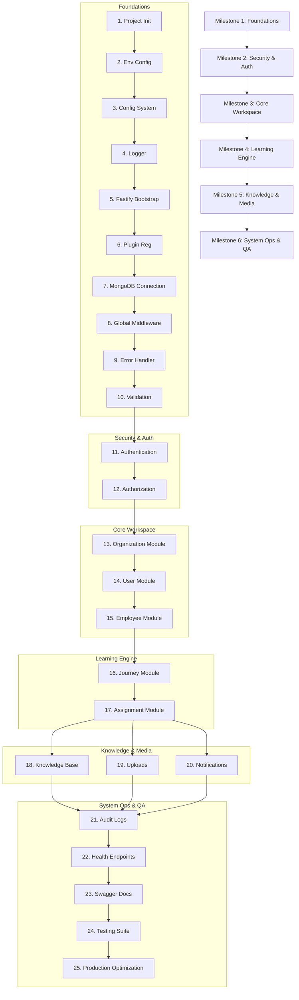

# Talnova Onboarding — Backend Implementation Plan

This document defines the implementation order, dependency structure, milestones, and complexities for building the backend application.

---

## 1. Dependency Graph

---

## 2. Implementation Milestones

### Milestone 1: Foundations (Complexity: Low) [COMPLETED]
Prerequisites: Node 22 runtime, MongoDB Atlas sandbox database instance.

1. **[x] Project Initialization**
   * Setup npm workspace, `package.json`, TypeScript config (`tsconfig.json`), ESLint, and Prettier configurations.
   * Target Complexity: Very Low (1 hour)
2. **[x] Environment Configuration**
   * Define `.env.example`, bootstrap `.env` loader.
   * Target Complexity: Very Low (0.5 hours)
3. **[x] Configuration System**
   * Build strongly-typed configuration module (`server/src/config/`) reading from env.
   * Target Complexity: Low (1 hour)
4. **[x] Logger**
   * Configure Pino logger options for development (pretty print) and production (JSON stream).
   * Target Complexity: Low (1 hour)
5. **[x] Fastify Bootstrap**
   * Build core Fastify instance lifecycle hooks and startup script (`server/src/app.ts`, `server/src/server.ts`).
   * Target Complexity: Low (2 hours)
6. **[x] Plugin Registration**
   * Register Fastify standard plugins (Helmet, CORS, Cookie, Compress).
   * Target Complexity: Low (1 hour)
7. **[x] MongoDB Connection**
   * Initialize Mongoose connection management, reconnection strategies, and graceful shutdown handlers.
   * Target Complexity: Low (2 hours)
8. **[x] Global Middleware**
   * Setup request-id injection, request duration logging, and context hooks.
   * Target Complexity: Low (2 hours)
9. **[x] Error Handler**
   * Build centralized Fastify error handler to format standard error responses and log internal details.
   * Target Complexity: Medium (3 hours)
10. **[x] Validation**
    * Map custom Zod Fastify validation compiler and parser for incoming request bodies, params, and queries.
    * Target Complexity: Medium (3 hours)

---

### Milestone 2: Security & Authentication (Complexity: Medium) [COMPLETED]
Prerequisites: Milestone 1 complete.

11. **[x] Authentication**
    * Build `auth` module routes, handlers, and services.
    * Set up Argon2id password hashing.
    * Implement access token and rotating refresh token generation.
    * Set up session management and cookie options.
    * Target Complexity: High (8 hours)
12. **[x] Authorization**
    * Enforce RBAC middlewares and user decorators.
    * Implement token validation hooks on protected routes.
    * Target Complexity: Medium (4 hours)

---

### Milestone 3: Core Workspace (Complexity: Medium) [COMPLETED]
Prerequisites: Milestone 2 complete.

13. **[x] Organization Module**
    * Implement Mongoose schema, repository, service, and routes.
    * Handle default branding, locations, and organization profile.
    * Target Complexity: Medium (5 hours)
14. **[x] User Module**
    * Implement profiles, user settings, password reset flows, and settings.
    * Target Complexity: Medium (4 hours)
15. **[x] Employee Module**
    * Implement invitation system, directory listing, and department/team structures.
    * Target Complexity: Medium (6 hours)

---

### Milestone 4: Learning Engine (Complexity: High) [COMPLETED]
Prerequisites: Milestone 3 complete.

16. **[x] Journey Module**
    * Build Journey Builder routes, schemas, and nested models (Modules, Lessons, ContentBlocks, Quizzes).
    * Implement publishing workflows (Draft, Publish, Archive) and optimistic versioning.
    * Target Complexity: Very High (12 hours)
17. **[x] Assignment Module**
    * Track employee journey assignments, progress percentages, time tracking, and completion evaluations.
    * Evaluate quiz submission attempts.
    * Target Complexity: High (10 hours)

---

### Milestone 5: Knowledge & Media (Complexity: Medium) [COMPLETED]
Prerequisites: Milestone 4 complete.

18. **[x] Knowledge Base**
    * Build KB Articles Mongoose schema, full-text search, and department/team visibility checks.
    * Target Complexity: Medium (6 hours)
19. **[x] Uploads**
    * Integrate Cloudflare R2 bucket connection.
    * Build upload metadata tracker database schema, upload endpoint, and visibility controls.
    * Target Complexity: Medium (6 hours)
20. **[x] Notifications**
    * Setup In-app, Email event channels, TTL expiration indexes, and read status modifiers.
    * Target Complexity: Medium (5 hours)

---

### Milestone 6: System Ops & QA (Complexity: Medium) [COMPLETED]
Prerequisites: Milestone 5 complete.

21. **[x] Audit Logs**
    * Implement immutable audit log recording service and resource historical tracking.
    * Target Complexity: Medium (4 hours)
22. **[x] Health Endpoints**
    * Implement public unauthenticated `/health`, `/ready`, `/live` hooks checking DB and storage states.
    * Target Complexity: Low (2 hours)
23. **[x] Swagger Docs**
    * Setup `@fastify/swagger` and `@fastify/swagger-ui` auto-generation.
    * Target Complexity: Low (2 hours)
24. **[x] Testing Suite**
    * Setup Vitest and build integration tests for critical authentication, organization isolation, and learning progression routes.
    * Target Complexity: High (10 hours)
25. **[x] Production Optimization**
    * Prepare PM2 configuration reload commands, compression tuning, and environment variable audits.
    * Target Complexity: Low (3 hours)
