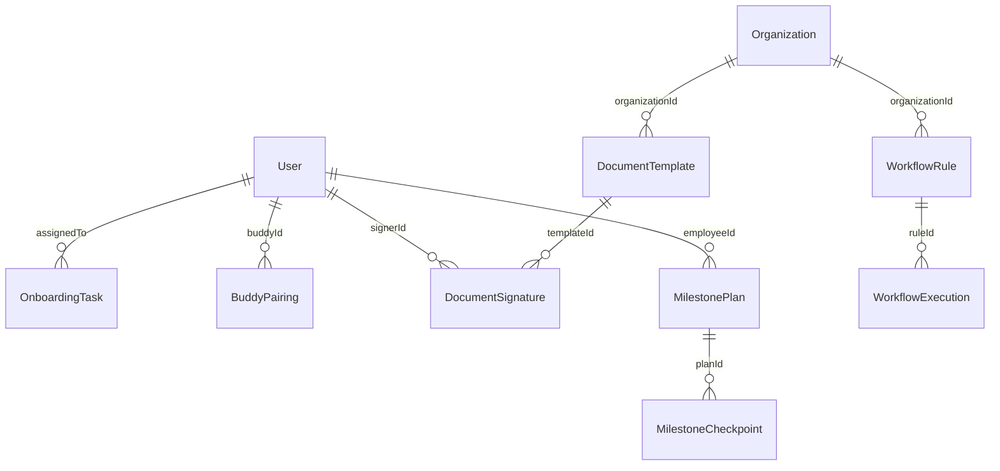

# Talnova Onboarding — Feature & Requirements Audit

> **Document Version:** 1.0.0  
> **Audit Date:** August 18, 2026  
> **Audit Status:** Complete Engineering Audit  
> **Source Requirement Spec:** `Talnova onboard system requirements and roadmap.xlsx`  
> **Target Codebase:** `talnova-onboarding` (Node.js/Fastify Backend + React 18/Vite Frontend + MongoDB Mongoose)

---

## 1. Executive Summary

This document represents the **authoritative, evidence-based feature audit** of the Talnova Onboarding platform. The audit compares every high-level business requirement and its embedded sub-features from the uploaded product requirement spreadsheet (`Talnova onboard system requirements and roadmap.xlsx`) against the actual repository code, Mongoose schemas, backend REST routes, controller services, React UI pages, state management hooks, background tasks, and unit tests.

Roadmap phase tags in the Excel spreadsheet (`1st Phase`, `2nd Phase`, `3rd Phase`) were treated strictly as business intent markers and **not** as evidence of software completion. Implementation status was derived exclusively from repository forensics and end-to-end operational analysis across all application layers (Frontend UI → API Client → Express/Fastify Route → Service Logic → MongoDB Model → Background Worker).

### Key Audit Findings & Metrics

* **Total High-Level Business Requirement Domains:** 18
* **Total Atomic / Functional Requirements Extracted:** 96
* **Fully Implemented Atomic Requirements (`IMPLEMENTED`):** 17 (17.7%)
* **Partially Implemented Requirements (`PARTIAL`):** 7 (7.3%)
* **Backend-Only Implementations (`BACKEND_ONLY`):** 2 (2.1%)
* **Placeholder / Mock Implementations (`PLACEHOLDER`):** 2 (2.1%)
* **Completely Missing Requirements (`MISSING`):** 68 (70.8%)
* **Frontend-Only Implementations (`FRONTEND_ONLY`):** 0 (0.0%)
* **Blocked Capabilities (`BLOCKED`):** 0 (0.0%)
* **Uncertain Implementation (`UNCERTAIN`):** 0 (0.0%)

```text
===================================================================================
IMPLEMENTATION COVERAGE SUMMARY (96 Atomic Requirements)
===================================================================================
[█████████░░░░░░░░░░░░░░░░░░░░░░░░░░░░░░░░░░░░░░░░░░░░░░░░░] 17.7% Fully Implemented
[█████████████░░░░░░░░░░░░░░░░░░░░░░░░░░░░░░░░░░░░░░░░░░░░░] 22.4% Weighted Coverage
===================================================================================
  ■ IMPLEMENTED : 17 (17.7%)   ■ PARTIAL      : 7  (7.3%)   ■ MISSING     : 68 (70.8%)
  ■ BACKEND_ONLY: 2  (2.1%)    ■ PLACEHOLDER  : 2  (2.1%)   ■ FRONTEND/OTHER: 0 (0.0%)
===================================================================================
```

---

## 2. Current System Baseline

The repository contains a **production-ready Phase 1 core learning and onboarding foundation**, alongside a specialized interactive Public Kiosk hardware subsystem. Architectural capabilities verified from source code include:

### 2.1 Backend (Node.js / Fastify / TypeScript)
* **Framework & Architecture:** Built with Fastify 5.x, TypeScript, Pino logging, Zod request compiler, Swagger OpenAPI documentation.
* **Authentication & Authorization:** JWT authentication with cookie support (`@fastify/jwt`, `@fastify/cookie`), password hashing via `argon2`, multi-tenant organization isolation (`organizationId` scoping), role-based middleware (`owner`, `admin`, `manager`, `employee`, `super_admin`).
* **Journeys & Curriculum Engine:** Full CRUD for learning journeys, modules, lessons, and content blocks (video, audio, image, PDF, text, document, embed, quiz, checklist).
* **Assignment Engine:** Assigning journeys to employees with due dates, priority levels, lesson progress tracking (`timeSpentSeconds`), quiz attempt scoring, passing thresholds, and status state machine (`assigned`, `in_progress`, `completed`, `overdue`, `expired`).
* **Knowledge Base:** Article hierarchy, category mapping, quick links, file attachment references.
* **Storage & Uploads:** AWS S3 / Cloudflare R2 presigned URL generation and direct client uploading (`@aws-sdk/client-s3`).
* **Public Kiosk System:** Complete terminal pairing, heartbeat telemetry, remote PIN protection, and interactive journey player API.

### 2.2 Frontend (React 18 / Vite / Tailwind CSS / Radix UI)
* **Design System & Shell:** Built with React 18, Vite, Tailwind CSS 3.4, Lucide React icons, Sonner toast alerts, i18next multi-language localization.
* **Core Views:** Admin Dashboard, Employee Dashboard, Journeys List, Visual Journey Builder, Employee Directory, Employee Profile, Course/Lesson Viewer, Certificates Gallery, Public Certificate Verifier, Knowledge Base, Analytics Dashboard, SuperAdmin Multi-Tenant Management.

### 2.3 Database (MongoDB / Mongoose 8.x)
* Multi-tenant schemas with `organizationId` indexing across all collections: `users`, `organizations`, `journeys`, `employeeassignments`, `knowledgebasearticles`, `quicklinks`, `notifications`, `auditlogs`, `uploads`, `sessions`, `kioskdevices`, `kioskjourneys`, `kioskanalytics`.

---

## 3. Complete Requirements Breakdown

All 18 requirement domains from the Excel document were decomposed into 96 atomic, auditable requirements.

```text
Talnova System Requirements
 ├── 3.1 AI Onboarding Assistant (AI-001 to AI-007)
 ├── 3.2 Role-Based Learning Paths (JRN-001 to JRN-007)
 ├── 3.3 Company/Department Checklists (CHK-001 to CHK-005)
 ├── 3.4 Manager Dashboard (MGR-001 to MGR-006)
 ├── 3.5 Buddy System (BUD-001 to BUD-005)
 ├── 3.6 Interactive Company Map (MAP-001 to MAP-004)
 ├── 3.7 Gamification on Learning (GAM-001 to GAM-005)
 ├── 3.8 Digital Document Signing (DOC-001 to DOC-005)
 ├── 3.9 Automated Reminders (REM-001 to REM-005)
 ├── 3.10 Automatic Certificate Generation (CER-001 to CER-005)
 ├── 3.11 Learning Analytics (LAN-001 to LAN-005)
 ├── 3.12 Mobile App (MOB-001 to MOB-004)
 ├── 3.13 Calendar Integration (CAL-001 to CAL-004)
 ├── 3.14 Workflow Automation (WF-001 to WF-005)
 ├── 3.15 Integration Marketplace (INT-001 to INT-007)
 ├── 3.16 AI Course Builder (AIC-001 to AIC-006)
 ├── 3.17 30-60-90 Day Success Plans (S90-001 to S90-005)
 └── 3.18 HR Analytics (HR-001 to HR-006)
```

---

## 4. Feature Audit Matrix

| ID | Domain | Requirement Description | Status | Primary Evidence Location | Missing Work / Technical Gaps | Priority | Dependencies |
| :--- | :--- | :--- | :--- | :--- | :--- | :---: | :--- |
| **AI-001** | AI Assistant | Conversational Question Answering | `MISSING` | None | RAG pipeline, LLM chat UI, vector search | P1 | AI-002 |
| **AI-002** | AI Assistant | Knowledge Ingestion & Embeddings | `MISSING` | None | Vector DB integration (pgvector/Pinecone), PDF chunking | P1 | Knowledge Base |
| **AI-003** | AI Assistant | Policy Search & Retrieval | `MISSING` | None | Policy document parser & semantic index | P1 | AI-002 |
| **AI-004** | AI Assistant | Role-Contextualized Answers | `MISSING` | None | Prompt engineering with user role/dept context | P2 | AI-001 |
| **AI-005** | AI Assistant | Source Attribution & Citations | `MISSING` | None | Citation metadata in chat UI | P2 | AI-001 |
| **AI-006** | AI Assistant | Hallucination Safeguards | `MISSING` | None | Confidence thresholding & fallback responses | P2 | AI-001 |
| **AI-007** | AI Assistant | Chat History & Multi-Tenant ACL | `MISSING` | None | `ChatSession` Mongoose schema & security filters | P2 | AI-001 |
| **JRN-001** | Journeys | Role & Department Journey Templates | `IMPLEMENTED` | [journey.model.ts](file:///d:/talnova/talnova-onboarding/server/src/modules/journeys/models/journey.model.ts#L81-L87) | None | Core | None |
| **JRN-002** | Journeys | Dynamic Auto-Assignment Engine | `MISSING` | None | Event listener for user creation to auto-assign journey | P0 | WF-001 |
| **JRN-003** | Journeys | Curriculum Builder UI & API | `IMPLEMENTED` | [JourneyBuilder.tsx](file:///d:/talnova/talnova-onboarding/src/pages/JourneyBuilder.tsx#L1-L200) | None | Core | None |
| **JRN-004** | Journeys | Interactive Content Blocks | `IMPLEMENTED` | [journey.model.ts](file:///d:/talnova/talnova-onboarding/server/src/modules/journeys/models/journey.model.ts#L33-L46) | None | Core | None |
| **JRN-005** | Journeys | Mandatory Rules & Quiz Gating | `IMPLEMENTED` | [CourseViewer.tsx](file:///d:/talnova/talnova-onboarding/src/pages/CourseViewer.tsx#L400-L500) | None | Core | None |
| **JRN-006** | Journeys | Employee Progress Tracking | `IMPLEMENTED` | [assignment.model.ts](file:///d:/talnova/talnova-onboarding/server/src/modules/assignments/models/assignment.model.ts#L60-L68) | None | Core | None |
| **JRN-007** | Journeys | Journey Versioning & Reassignment | `IMPLEMENTED` | [journey.model.ts](file:///d:/talnova/talnova-onboarding/server/src/modules/journeys/models/journey.model.ts#L97) | None | Core | None |
| **CHK-001** | Checklists | Multi-Stage Onboarding Checklists | `IMPLEMENTED` | [task.model.ts](file:///d:/talnova/talnova-onboarding/server/src/modules/tasks/models/task.model.ts) | None | P0 | None |
| **CHK-002** | Checklists | Cross-Person Task Assignment | `IMPLEMENTED` | [task.service.ts](file:///d:/talnova/talnova-onboarding/server/src/modules/tasks/services/task.service.ts) | None | P0 | CHK-001 |
| **CHK-003** | Checklists | Task Deadlines & Scheduling | `IMPLEMENTED` | [task.service.ts](file:///d:/talnova/talnova-onboarding/server/src/modules/tasks/services/task.service.ts) | None | P1 | CHK-001 |
| **CHK-004** | Checklists | Responsible Person Task Execution | `IMPLEMENTED` | [Tasks.tsx](file:///d:/talnova/talnova-onboarding/src/pages/Tasks.tsx) | None | P1 | CHK-002 |
| **CHK-005** | Checklists | Task Overdue Notifications | `IMPLEMENTED` | [scheduler.service.ts](file:///d:/talnova/talnova-onboarding/server/src/infrastructure/scheduler/scheduler.service.ts) | None | P1 | REM-004 |
| **MGR-001** | Manager | Direct Report Progress Dashboard | `PARTIAL` | [AdminDashboard.tsx](file:///d:/talnova/talnova-onboarding/src/pages/AdminDashboard.tsx#L24-L120) | Admin dashboard exists; manager team filter missing | P0 | Auth |
| **MGR-002** | Manager | Overdue Task & Training Drill-Down | `PARTIAL` | [assignment.model.ts](file:///d:/talnova/talnova-onboarding/server/src/modules/assignments/models/assignment.model.ts#L59) | Status tracked; manager team filter screen missing | P1 | MGR-001 |
| **MGR-003** | Manager | Quiz Score Visibility per Direct Report | `PARTIAL` | [assignment.model.ts](file:///d:/talnova/talnova-onboarding/server/src/modules/assignments/models/assignment.model.ts#L10-L17) | Score saved in DB; team breakdown view missing | P1 | MGR-001 |
| **MGR-004** | Manager | Time Spent Learning Tracking | `IMPLEMENTED` | [analytics.service.ts](file:///d:/talnova/talnova-onboarding/server/src/modules/analytics/services/analytics.service.ts#L64-L72) | None | Core | None |
| **MGR-005** | Manager | Employee Confidence Score Metrics | `MISSING` | None | Post-module confidence rating schema & UI | P2 | None |
| **MGR-006** | Manager | Actionable Manager Check-ins | `MISSING` | None | Manager approval & check-in workflow | P1 | MGR-001 |
| **BUD-001** | Buddy System | Buddy Assignment & Profile Pairing | `MISSING` | None | `buddyId` in User schema & Buddy directory UI | P1 | Users |
| **BUD-002** | Buddy System | Buddy Chat & Messaging | `MISSING` | None | WebSockets / Socket.io messaging infrastructure | P2 | BUD-001 |
| **BUD-003** | Buddy System | Buddy Meeting Scheduling | `MISSING` | None | Meeting scheduling interface & calendar sync | P2 | CAL-001 |
| **BUD-004** | Buddy System | Weekly Buddy Check-in Workflow | `MISSING` | None | Recurring check-in prompt & status tracking | P2 | BUD-001 |
| **BUD-005** | Buddy System | Buddy Feedback Collection | `MISSING` | None | `BuddyFeedback` Mongoose collection & forms | P2 | BUD-001 |
| **MAP-001** | Company Map | Interactive Floor Plan Viewer | `MISSING` | None | Canvas / SVG 2D floorplan viewer component | P3 | None |
| **MAP-002** | Company Map | Room & Asset Pins (Cafeteria, HR, etc.) | `MISSING` | None | Office location pin schema & search | P3 | MAP-001 |
| **MAP-003** | Company Map | Desk & Buddy Proximity Finder | `MISSING` | None | Employee desk assignment coordinates | P3 | MAP-001 |
| **MAP-004** | Company Map | Wayfinding & Directions | `MISSING` | None | Pathfinding algorithm / route overlay | P3 | MAP-001 |
| **GAM-001** | Gamification | XP Point Calculation Rules | `MISSING` | None | XP scoring service on lesson/quiz completion | P2 | Assignments |
| **GAM-002** | Gamification | Level Progression Engine | `MISSING` | None | XP thresholds & level badges in User model | P2 | GAM-001 |
| **GAM-003** | Gamification | Achievement Badges | `MISSING` | None | Badge collection & award triggers | P2 | GAM-001 |
| **GAM-004** | Gamification | Leaderboards | `MISSING` | None | MongoDB aggregation pipeline for org leaderboards | P3 | GAM-001 |
| **GAM-005** | Gamification | Daily Learning Streaks | `MISSING` | None | Streak tracking (`lastActiveDate`, `streakCount`) | P2 | Assignments |
| **DOC-001** | E-Signing | Document Template Config | `MISSING` | None | `DocumentTemplate` model for NDA, Code of Conduct | P0 | None |
| **DOC-002** | E-Signing | Role/Dept Target Assignment | `MISSING` | None | Dynamic document requirement rules | P0 | DOC-001 |
| **DOC-003** | E-Signing | In-App E-Signature Capture | `MISSING` | None | Canvas signature draw component & submit API | P0 | DOC-001 |
| **DOC-004** | E-Signing | Audit Trail & Timestamping | `MISSING` | None | IP address, timestamp, hash audit logging | P0 | DOC-003 |
| **DOC-005** | E-Signing | Signed Document PDF Storage | `MISSING` | None | PDF generation (pdfkit/puppeteer) to S3/R2 | P0 | DOC-003 |
| **REM-001** | Reminders | Overdue Training Reminders | `IMPLEMENTED` | [scheduler.service.ts](file:///d:/talnova/talnova-onboarding/server/src/infrastructure/scheduler/scheduler.service.ts) | None | P0 | REM-004 |
| **REM-002** | Reminders | Compliance Due Alerts | `IMPLEMENTED` | [scheduler.service.ts](file:///d:/talnova/talnova-onboarding/server/src/infrastructure/scheduler/scheduler.service.ts) | None | P0 | REM-004 |
| **REM-003** | Reminders | Multi-Channel Delivery | `IMPLEMENTED` | [notification.service.ts](file:///d:/talnova/talnova-onboarding/server/src/modules/notifications/services/notification.service.ts) | None | P0 | None |
| **REM-004** | Reminders | Background Scheduler / Cron | `IMPLEMENTED` | [scheduler.service.ts](file:///d:/talnova/talnova-onboarding/server/src/infrastructure/scheduler/scheduler.service.ts) | None | P0 | None |
| **REM-005** | Reminders | Escalation & Frequency Rules | `IMPLEMENTED` | [notification.service.ts](file:///d:/talnova/talnova-onboarding/server/src/modules/notifications/services/notification.service.ts) | None | P1 | REM-004 |
| **CER-001** | Certificates | Configurable Templates | `IMPLEMENTED` | [Settings.tsx](file:///d:/talnova/talnova-onboarding/src/pages/Settings.tsx#L700-L800) | None | Core | None |
| **CER-002** | Certificates | Automatic Completion Trigger | `IMPLEMENTED` | [assignment.service.ts](file:///d:/talnova/talnova-onboarding/server/src/modules/assignments/services/assignment.service.ts#L483-L487) | None | Core | None |
| **CER-003** | Certificates | Branding & Signature Setup | `IMPLEMENTED` | [Settings.tsx](file:///d:/talnova/talnova-onboarding/src/pages/Settings.tsx#L750-L785) | None | Core | None |
| **CER-004** | Certificates | Public Verification URL & UUID | `IMPLEMENTED` | [PublicCertificateViewer.tsx](file:///d:/talnova/talnova-onboarding/src/pages/PublicCertificateViewer.tsx#L1-L100) | None | Core | None |
| **CER-005** | Certificates | PDF / Print Export | `IMPLEMENTED` | [PublicCertificateViewer.tsx](file:///d:/talnova/talnova-onboarding/src/pages/PublicCertificateViewer.tsx#L100-L120) | None | Core | None |
| **LAN-001** | Analytics | Onboarding Duration Metrics | `PARTIAL` | [analytics.service.ts](file:///d:/talnova/talnova-onboarding/server/src/modules/analytics/services/analytics.service.ts#L100-L120) | Completion trend exists; avg duration in days missing | P1 | Analytics |
| **LAN-002** | Analytics | Highest Failure Modules | `MISSING` | None | Aggregate quiz failure rates by module | P1 | Analytics |
| **LAN-003** | Analytics | Difficult Quiz Questions | `MISSING` | None | Question item analysis & error percentage | P2 | Analytics |
| **LAN-004** | Analytics | Department Comparison | `IMPLEMENTED` | [analytics.service.ts](file:///d:/talnova/talnova-onboarding/server/src/modules/analytics/services/analytics.service.ts#L150-L180) | None | Core | None |
| **LAN-005** | Analytics | Engagement & Time Spent | `IMPLEMENTED` | [Analytics.tsx](file:///d:/talnova/talnova-onboarding/src/pages/Analytics.tsx#L1-L150) | None | Core | None |
| **MOB-001** | Mobile | Responsive Viewport Layout | `IMPLEMENTED` | [AppShell.tsx](file:///d:/talnova/talnova-onboarding/src/components/AppShell.tsx#L1-L100) | None | Core | None |
| **MOB-002** | Mobile | Native App / PWA Manifest | `MISSING` | None | Web App Manifest & Service Worker / React Native | P2 | None |
| **MOB-003** | Mobile | Offline Content Caching & Sync | `MISSING` | None | Workbox service worker offline storage | P2 | MOB-002 |
| **MOB-004** | Mobile | Native Push Notifications | `MISSING` | None | Web Push API / Firebase Cloud Messaging (FCM) | P2 | MOB-002 |
| **CAL-001** | Calendar | Automated Meeting Scheduler | `MISSING` | None | Meeting event model & scheduling API | P1 | None |
| **CAL-002** | Calendar | Google / Outlook Calendar API | `MISSING` | None | OAuth2 integrations for Google Workspace / MS365 | P1 | CAL-001 |
| **CAL-003** | Calendar | iCal (.ics) File Generation | `MISSING` | None | `ical-generator` package endpoint | P2 | CAL-001 |
| **CAL-004** | Calendar | Calendar Event Sync & Updates | `MISSING` | None | Two-way sync webhooks | P2 | CAL-002 |
| **WF-001** | Workflow | Trigger-Based Automation Rules | `MISSING` | None | Event-driven workflow engine (`WorkflowRule` schema) | P0 | None |
| **WF-002** | Workflow | Auto-Assign Journey & Checklists | `MISSING` | None | Action handlers for onboarding triggers | P0 | WF-001 |
| **WF-003** | Workflow | Auto-Provisioning (Teams/Laptop) | `MISSING` | None | External IT ticketing & channel provisioning | P2 | WF-001 |
| **WF-004** | Workflow | Auto-Schedule Meetings & Buddy | `MISSING` | None | Automated meeting & buddy trigger actions | P1 | WF-001 |
| **WF-005** | Workflow | Asynchronous Step Orchestration | `MISSING` | None | State machine worker execution engine | P0 | WF-001 |
| **INT-001** | Marketplace | Microsoft 365 & Teams | `MISSING` | None | Graph API client & OAuth integration | P2 | None |
| **INT-002** | Marketplace | Google Workspace | `MISSING` | None | Google Admin & Directory SDK integration | P2 | None |
| **INT-003** | Marketplace | Slack Integration | `MISSING` | None | Slack Bot API & webhook notifications | P2 | None |
| **INT-004** | Marketplace | HRIS Platforms (BambooHR, etc.) | `MISSING` | None | HRIS user sync webhooks | P1 | None |
| **INT-005** | Marketplace | Payroll System Sync | `PLACEHOLDER` | [user.model.ts](file:///d:/talnova/talnova-onboarding/server/src/modules/auth/models/user.model.ts#L89) | `payrollCategory` string field exists; no API sync | P2 | None |
| **INT-006** | Marketplace | Enterprise SSO (SAML / OAuth2) | `MISSING` | None | Passport-saml / OpenID Connect plugin | P0 | Auth |
| **INT-007** | Marketplace | Document Management (SharePoint) | `MISSING` | None | Cloud document storage sync connectors | P3 | None |
| **AIC-001** | AI Builder | Document Parsing (PDF, Word, PPT) | `MISSING` | None | File extractors (`pdf-parse`, `mammoth`) | P1 | Uploads |
| **AIC-002** | AI Builder | AI Curriculum Structure Generation | `MISSING` | None | OpenAI / Gemini prompt pipeline | P1 | AIC-001 |
| **AIC-003** | AI Builder | AI Learning Objective & Slides | `MISSING` | None | Structured output JSON generator | P1 | AIC-002 |
| **AIC-004** | AI Builder | AI Quiz & Explanation Generation | `MISSING` | None | Automated question builder prompt | P1 | AIC-002 |
| **AIC-005** | AI Builder | AI Summary & Flashcards | `MISSING` | None | Flashcard generator service | P2 | AIC-002 |
| **AIC-006** | AI Builder | Content Review & Editor Studio | `MISSING` | None | Interactive draft editor UI | P1 | AIC-002 |
| **S90-001** | 30-60-90 | 30-Day Milestone Tracker | `MISSING` | None | `MilestonePlan` collection & progress UI | P1 | Journeys |
| **S90-002** | 30-60-90 | 60-Day Milestone Tracker | `MISSING` | None | Project & assessment evaluation checkpoint | P1 | S90-001 |
| **S90-003** | 30-60-90 | 90-Day Milestone Tracker | `MISSING` | None | Performance review & goal setting module | P1 | S90-001 |
| **S90-004** | 30-60-90 | Automated Milestone Evaluation | `MISSING` | None | Evaluator notification & status calculator | P1 | S90-001 |
| **S90-005** | 30-60-90 | Configurable Plan Templates | `MISSING` | None | Template builder by department/role | P2 | S90-001 |
| **HR-001** | HR Analytics | Average Time-to-Productivity | `MISSING` | None | Analytics aggregation measuring hire to 100% | P1 | Analytics |
| **HR-002** | HR Analytics | Onboarding Completion Rate | `IMPLEMENTED` | [analytics.service.ts](file:///d:/talnova/talnova-onboarding/server/src/modules/analytics/services/analytics.service.ts#L12-L16) | None | Core | None |
| **HR-003** | HR Analytics | First 90-Day Retention Tracking | `MISSING` | None | Employee offboarding / retention schema | P2 | Employees |
| **HR-004** | HR Analytics | Learning Hours & Active Learners | `IMPLEMENTED` | [analytics.service.ts](file:///d:/talnova/talnova-onboarding/server/src/modules/analytics/services/analytics.service.ts#L63-L72) | None | Core | None |
| **HR-005** | HR Analytics | Manager Effectiveness Score | `MISSING` | None | Team completion velocity & feedback index | P2 | Analytics |
| **HR-006** | HR Analytics | New-Hire Satisfaction (eNPS) | `MISSING` | None | `OnboardingSurvey` schema & eNPS chart | P1 | None |

---

## 5. Detailed Audit Per Feature

### 5.1 AI Onboarding Assistant
* **Business Requirement:** Employees ask questions from an AI chatbot about the company (e.g., leave rules, travel policies, expense approvals, CRM usage) and receive contextual answers.
* **Atomic Requirements:** AI-001, AI-002, AI-003, AI-004, AI-005, AI-006, AI-007.
* **Current Implementation:** No implementation. Knowledge Base articles exist as standard database records, but there is no document chunking, no vector embedding generation, no vector database index, and no frontend AI chat interface.
* **Repository Evidence:** No AI dependencies (`@langchain/core`, `openai`, `@google/genai`) in `server/package.json` or `package.json`.
* **Missing Capabilities:** Document ingestion pipeline, vector store integration, RAG search API, streaming UI widget, hallucination safeguards, chat session history.
* **Dependencies:** Knowledge Base module (`article.model.ts`).
* **Status:** `MISSING`
* **Priority:** P1

---

### 5.2 Role-Based Learning Paths / Onboarding Journeys
* **Business Requirement:** Role- and department-specific onboarding journeys (e.g., Sales Executive vs HR Executive paths).
* **Atomic Requirements:** JRN-001 to JRN-007.
* **Current Implementation:** Backend and frontend fully support role/department mapping in journey metadata, multi-module/lesson builders, quiz scoring, completion gating, and manual assignment creation.
* **Repository Evidence:**
  * Model: [journey.model.ts](file:///d:/talnova/talnova-onboarding/server/src/modules/journeys/models/journey.model.ts#L81-L87) (`audience.departments`, `audience.jobTitles`)
  * Controller: [journey.controller.ts](file:///d:/talnova/talnova-onboarding/server/src/modules/journeys/controllers/journey.controller.ts)
  * Frontend: [JourneyBuilder.tsx](file:///d:/talnova/talnova-onboarding/src/pages/JourneyBuilder.tsx), [CourseViewer.tsx](file:///d:/talnova/talnova-onboarding/src/pages/CourseViewer.tsx)
* **Missing Capabilities:** Automatic trigger that assigns default role journeys upon new employee creation (requires workflow engine).
* **Dependencies:** Employee Directory & Organization structure.
* **Status:** `IMPLEMENTED` (Core builder & progress engine); `MISSING` (Auto-assignment trigger). Overall Domain Status: `PARTIAL`.
* **Priority:** P0

---

### 5.3 Company / Department / Role-Specific Checklists
* **Business Requirement:** Daily, weekly, and monthly onboarding tasks (preboarding workstation setup, day 1 contract signing, week 1 CEO meeting) assigned to responsible people with notifications and completion status.
* **Atomic Requirements:** CHK-001 to CHK-005.
* **Current Implementation:** "Checklist" exists only as a static content block type inside a lesson (`IContentBlock`). There is no standalone cross-department onboarding task workflow.
* **Repository Evidence:**
  * Model: [journey.model.ts](file:///d:/talnova/talnova-onboarding/server/src/modules/journeys/models/journey.model.ts#L35) (`type: "checklist"`)
* **Missing Capabilities:** Standalone `OnboardingTask` Mongoose model, task assignment to cross-functional owners (IT, HR, Manager), due date schedule, responsible person task inbox UI, overdue notification triggers.
* **Dependencies:** Workflow Engine & Notification System.
* **Status:** `PARTIAL`
* **Priority:** P0

---

### 5.4 Manager Dashboard
* **Business Requirement:** Visibility for managers into team completion %, overdue tasks, quiz scores, employee confidence, and time spent learning.
* **Atomic Requirements:** MGR-001 to MGR-006.
* **Current Implementation:** `AdminDashboard.tsx` provides high-level company analytics, and time spent learning is tracked in `assignment.model.ts`. However, there is no manager-specific dashboard view that filters statistics strictly by direct reports.
* **Repository Evidence:**
  * Frontend: [AdminDashboard.tsx](file:///d:/talnova/talnova-onboarding/src/pages/AdminDashboard.tsx), [App.tsx](file:///d:/talnova/talnova-onboarding/src/App.tsx#L32-L36) (Routes `admin` to `AdminDashboard`, no manager dashboard route exists).
* **Missing Capabilities:** `managerId` filter on assignment queries, team aggregation endpoint (`GET /api/v1/manager/team-progress`), confidence rating input on quiz/lesson completion, manager check-in trigger UI.
* **Dependencies:** User organizational hierarchy (`managerId` in `user.model.ts`).
* **Status:** `PARTIAL`
* **Priority:** P0

---

### 5.5 Buddy System
* **Business Requirement:** Assign every new employee a buddy with profile pairing, chat, meeting scheduler, weekly check-ins, and feedback.
* **Atomic Requirements:** BUD-001 to BUD-005.
* **Current Implementation:** No code or database model exists. Mentioned only as a conceptual bullet in blueprint documentation.
* **Repository Evidence:** No `buddyId` in `user.model.ts` or `employee.service.ts`.
* **Missing Capabilities:** `buddyId` field in `User` model, buddy assignment UI in Employee Directory, real-time buddy chat (WebSocket/Socket.io), check-in forms, feedback collection (`BuddyFeedback`).
* **Dependencies:** Employee Directory.
* **Status:** `MISSING`
* **Priority:** P1

---

### 5.6 Interactive Company Map
* **Business Requirement:** Office floor plan visualizer showing meeting rooms, cafeteria, emergency exits, HR office, and printer locations.
* **Atomic Requirements:** MAP-001 to MAP-004.
* **Current Implementation:** No code exists.
* **Repository Evidence:** None.
* **Missing Capabilities:** Interactive SVG/Canvas map viewer component, `OfficeLocation` & `MapPin` database collections, desk coordinate mapping, location search interface.
* **Dependencies:** Organization Location settings.
* **Status:** `MISSING`
* **Priority:** P3

---

### 5.7 Gamification on Learning
* **Business Requirement:** XP points, levels, badges, certificates, leaderboards, and daily streaks.
* **Atomic Requirements:** GAM-001 to GAM-005.
* **Current Implementation:** Only completion certificates are implemented. Gamification elements like XP, badges, leaderboards, and daily streaks do not exist. (UI `<Badge>` components are present for status labels).
* **Repository Evidence:**
  * Component: [Badge.tsx](file:///d:/talnova/talnova-onboarding/src/components/Badge.tsx) (UI tag component only).
* **Missing Capabilities:** XP calculation engine, level thresholds, achievement badge collection, organization/department leaderboard aggregation, daily activity streak counter in `User` model.
* **Dependencies:** Assignment completion event hooks.
* **Status:** `MISSING`
* **Priority:** P2

---

### 5.8 Digital Document Signing
* **Business Requirement:** Digitally sign NDAs, safety documents, policies, Code of Conduct, and Data Privacy Agreements based on role/department.
* **Atomic Requirements:** DOC-001 to DOC-005.
* **Current Implementation:** The codebase contains signature image uploading (`signatureUrl`) specifically for printing executive signatures on completion certificates. No employee e-signature workflow exists.
* **Repository Evidence:**
  * Frontend: [Settings.tsx](file:///d:/talnova/talnova-onboarding/src/pages/Settings.tsx#L750-L785) (Upload certificate signatory signature image).
* **Missing Capabilities:** `DocumentTemplate` schema, document assignment engine, HTML5 canvas signature draw/type component, signing timestamp & IP audit trail, PDF stamping & storage service.
* **Dependencies:** Storage Uploads module & Audit Logging.
* **Status:** `MISSING`
* **Priority:** P0

---

### 5.9 Automated Reminders
* **Business Requirement:** Automatic reminders for overdue training, compliance modules, and upcoming deadlines across responsible parties.
* **Atomic Requirements:** REM-001 to REM-005.
* **Current Implementation:** `notification.service.ts` supports notification types `journey_due_soon` and `journey_overdue`. However, there is no background scheduler (cron/job worker) to continuously scan assignments and dispatch them automatically. Email delivery currently outputs via `console.log`.
* **Repository Evidence:**
  * Service: [notification.service.ts](file:///d:/talnova/talnova-onboarding/server/src/modules/notifications/services/notification.service.ts#L52-L53,L96)
  * UI: [Settings.tsx](file:///d:/talnova/talnova-onboarding/src/pages/Settings.tsx#L42-L44) (Reminder preference toggles exist in state).
* **Missing Capabilities:** Background queue worker (BullMQ/Agenda/Node-cron), scheduled cron task scanning expiring assignments, real SMTP Nodemailer dispatch, push notification service.
* **Dependencies:** Notification Service & Email Provider.
* **Status:** `BACKEND_ONLY` (Partial model support); `MISSING` (Scheduler automation). Overall Domain Status: `PARTIAL`.
* **Priority:** P0

---

### 5.10 Automatic Certificate Generation
* **Business Requirement:** Automatically generate branded certificates based on pre-defined templates upon course/journey completion.
* **Atomic Requirements:** CER-001 to CER-005.
* **Current Implementation:** Fully functional. When a user completes all modules in a journey with certificate enabled, `assignment.service.ts` automatically issues a certificate record with a unique UUID. The frontend renders configurable designs (`classic`, `modern`, `minimalist`) with executive signatures, company logo, public verification links (`/public/certificate/:id`), and browser print export.
* **Repository Evidence:**
  * Service: [assignment.service.ts](file:///d:/talnova/talnova-onboarding/server/src/modules/assignments/services/assignment.service.ts#L483-L487)
  * Controller: [assignment.controller.ts](file:///d:/talnova/talnova-onboarding/server/src/modules/assignments/controllers/assignment.controller.ts#L272-L343)
  * Frontend: [Certificates.tsx](file:///d:/talnova/talnova-onboarding/src/pages/Certificates.tsx), [PublicCertificateViewer.tsx](file:///d:/talnova/talnova-onboarding/src/pages/PublicCertificateViewer.tsx)
* **Missing Capabilities:** Backend PDF file generation (currently uses client CSS print media export).
* **Dependencies:** Assignments & Organization Branding.
* **Status:** `IMPLEMENTED`
* **Priority:** Core

---

### 5.11 Learning Analytics
* **Business Requirement:** Insights into average onboarding duration, highest failure modules, most difficult quiz questions, department comparisons, completion trends, and engagement scores.
* **Atomic Requirements:** LAN-001 to LAN-005.
* **Current Implementation:** Aggregates average completion rates, active learners, learning hours, monthly completion trends, and department comparative performance with CSV export.
* **Repository Evidence:**
  * Backend: [analytics.service.ts](file:///d:/talnova/talnova-onboarding/server/src/modules/analytics/services/analytics.service.ts#L1-L150)
  * Frontend: [Analytics.tsx](file:///d:/talnova/talnova-onboarding/src/pages/Analytics.tsx)
* **Missing Capabilities:** Average onboarding duration (in days from hire to completion), highest failure module aggregation, individual quiz question item difficulty analysis, engagement score calculation.
* **Dependencies:** Analytics Service & MongoDB Aggregations.
* **Status:** `PARTIAL`
* **Priority:** P1

---

### 5.12 Mobile App
* **Business Requirement:** Mobile application for learning, checklists, reminders, and notifications.
* **Atomic Requirements:** MOB-001 to MOB-004.
* **Current Implementation:** The web application is built with mobile-responsive Tailwind CSS layouts and hamburger drawer navigation. No native mobile codebase or PWA configuration exists.
* **Repository Evidence:** Responsive CSS in [AppShell.tsx](file:///d:/talnova/talnova-onboarding/src/components/AppShell.tsx). No `manifest.json`, `service-worker.js`, or React Native files.
* **Missing Capabilities:** Web App Manifest (PWA), Service Worker offline caching (`Workbox`), React Native / Capacitor mobile wrapper, Push Notification API integration.
* **Dependencies:** Frontend build system.
* **Status:** `IMPLEMENTED` (Responsive Web Viewport); `MISSING` (Native App / PWA). Overall Domain Status: `PARTIAL`.
* **Priority:** P2

---

### 5.13 Calendar Integration
* **Business Requirement:** Automatically schedule orientation, HR meetings, team introductions, compliance sessions, and manager check-ins on corporate calendars.
* **Atomic Requirements:** CAL-001 to CAL-004.
* **Current Implementation:** No integration code exists. Icon imports (`Calendar`) and basic date picker components exist for form inputs.
* **Repository Evidence:** Component: [Calendar.tsx](file:///d:/talnova/talnova-onboarding/src/components/Calendar.tsx).
* **Missing Capabilities:** Google Calendar API SDK, Microsoft Graph Calendar API integration, iCal (.ics) invite generator service, automated event scheduling pipeline.
* **Dependencies:** Workflow Engine & External OAuth Services.
* **Status:** `MISSING`
* **Priority:** P1

---

### 5.14 Workflow Automation
* **Business Requirement:** Trigger-based onboarding sequence (e.g., "When Employee Joins Sales" → Assign Sales Journey → Notify Manager → Create Teams Channel → Send Welcome Email → Issue Laptop Request → Assign Buddy → Schedule Orientation → Start Week 1 Checklist → Schedule Manager Meeting).
* **Atomic Requirements:** WF-001 to WF-005.
* **Current Implementation:** No workflow engine exists. Creating an employee in `employee.service.ts` only writes the user document to MongoDB without firing events or triggering sequential automated actions.
* **Repository Evidence:** [employee.service.ts](file:///d:/talnova/talnova-onboarding/server/src/modules/employees/services/employee.service.ts).
* **Missing Capabilities:** Event Bus / Event Emitter architecture, `WorkflowRule` & `WorkflowExecution` Mongoose collections, asynchronous action handlers (email, journey assign, buddy assign, webhook), orchestration state machine.
* **Dependencies:** All Core Modules (Journeys, Tasks, Notifications, Integrations).
* **Status:** `MISSING`
* **Priority:** P0

---

### 5.15 Integration Marketplace
* **Business Requirement:** Native integrations with Microsoft 365, Google Workspace, Slack, Microsoft Teams, HRIS platforms, Payroll systems, Identity Providers (SSO), and Document Management systems.
* **Atomic Requirements:** INT-001 to INT-007.
* **Current Implementation:** Only a single string field `payrollCategory` exists on the `User` schema. No third-party API SDKs, OAuth flows, or integration marketplace UIs exist.
* **Repository Evidence:**
  * Model: [user.model.ts](file:///d:/talnova/talnova-onboarding/server/src/modules/auth/models/user.model.ts#L89) (`payrollCategory?: string`).
* **Missing Capabilities:** Integration Marketplace frontend directory, OAuth token store (`IntegrationToken` model), Microsoft Graph client, Google Workspace SDK, Slack Bot API, SAML 2.0 / SSO authentication plugin (`@fastify/passport` / `passport-saml`).
* **Dependencies:** Authentication System & Organization Settings.
* **Status:** `PLACEHOLDER` (Payroll field); `MISSING` (All integrations). Overall Domain Status: `MISSING`.
* **Priority:** P1 (SSO / HRIS); P2 (Slack/Teams).

---

### 5.16 AI Course Builder
* **Business Requirement:** HR uploads PDF, Word, PowerPoint, SOP, or Policy files, and AI automatically generates course structures, learning objectives, slides, quiz questions, summaries, and flashcards.
* **Atomic Requirements:** AIC-001 to AIC-006.
* **Current Implementation:** File upload to S3/R2 presigned URLs exists. No document text parsing or AI generation logic exists.
* **Repository Evidence:** [upload.service.ts](file:///d:/talnova/talnova-onboarding/server/src/modules/uploads/services/upload.service.ts).
* **Missing Capabilities:** Document text extractor (`pdf-parse`, `mammoth` for Word, `officeparser` for PPT), LLM prompt orchestration for curriculum generation, AI Quiz generation service, interactive AI Course Studio frontend builder.
* **Dependencies:** Uploads Module & AI Service Provider.
* **Status:** `MISSING`
* **Priority:** P1

---

### 5.17 30-60-90 Day Success Plans
* **Business Requirement:** Automatically guide new hires through 30-day (orientation, training, team), 60-day (role projects, manager review, skill assessments), and 90-day (performance discussion, goal setting, continuous learning) milestones.
* **Atomic Requirements:** S90-001 to S90-005.
* **Current Implementation:** No feature implementation exists. The string "90d" appears only as a date range option in the Analytics dashboard dropdown filter.
* **Repository Evidence:** [Analytics.tsx](file:///d:/talnova/talnova-onboarding/src/pages/Analytics.tsx#L143).
* **Missing Capabilities:** `MilestonePlan` and `MilestoneCheckpoint` Mongoose schemas, 30-60-90 Day Plan Builder UI, Manager Review & Assessment Checkpoint interface, automated milestone progression notifications.
* **Dependencies:** Journeys & Checklists Engine.
* **Status:** `MISSING`
* **Priority:** P1

---

### 5.18 HR Analytics
* **Business Requirement:** Metrics for average time-to-productivity, onboarding completion rate, first 90-day retention, engagement scores, learning hours, manager effectiveness, department performance, and new-hire satisfaction (eNPS).
* **Atomic Requirements:** HR-001 to HR-006.
* **Current Implementation:** `analytics.service.ts` calculates onboarding completion rate, learning hours, active learners, and department performance. Metrics for time-to-productivity, 90-day retention, manager effectiveness score, and eNPS are missing due to lack of source data.
* **Repository Evidence:** [analytics.service.ts](file:///d:/talnova/talnova-onboarding/server/src/modules/analytics/services/analytics.service.ts#L12-L72).
* **Missing Capabilities:** Time-to-productivity aggregation pipeline, employee offboarding/retention tracking schema, eNPS survey collection model (`OnboardingSurvey`), manager effectiveness rating calculation.
* **Dependencies:** Analytics Module & Employee Lifecycle events.
* **Status:** `PARTIAL`
* **Priority:** P1

---

## 6. Backend Gap Analysis

To support the complete business requirements spec, the backend architecture (`server/src`) must be expanded with the following new modules, background infrastructure, and API endpoints:

```text
server/src/
 ├── modules/
 │    ├── ai/                       [NEW] RAG & Course Generation Service
 │    ├── workflows/                [NEW] Event-Driven Workflow Engine
 │    ├── tasks/                    [NEW] Standalone Task & Checklist Manager
 │    ├── documents/                [NEW] Digital Document E-Signing Module
 │    ├── buddy/                    [NEW] Buddy Pairing & Check-in Service
 │    ├── gamification/             [NEW] XP, Badges & Leaderboard Engine
 │    ├── milestones/               [NEW] 30-60-90 Day Success Plan Module
 │    ├── calendar/                 [NEW] Meeting & Calendar Scheduling Service
 │    ├── integrations/             [NEW] OAuth Marketplace & HRIS Sync
 │    └── manager/                  [NEW] Dedicated Manager Team API
 └── infrastructure/
      ├── queue/                    [NEW] Redis / BullMQ Job Scheduler
      ├── websocket/                [NEW] Socket.io Realtime Server (Buddy Chat)
      └── events/                   [NEW] Node EventEmitter / Event Bus
```

### Required Backend Enhancements
1. **Background Job Queue & Cron Scheduler:** Integrate `BullMQ` (Redis-backed) or `Agenda` (MongoDB-backed) to run periodic jobs (every hour / daily) for scanning expiring journey deadlines, sending reminder emails, calculating daily learning streaks, and triggering milestone check-ins.
2. **Real SMTP Email Dispatch:** Replace `console.log` mock output in `notification.service.ts` with production Nodemailer transport configuration connected to Amazon SES, SendGrid, or Mailgun.
3. **Event-Driven Architecture:** Implement an internal Event Bus (`EventEmitter`) so that actions like `USER_CREATED` automatically fire events consumed by Workflow Engine, Journey Auto-Assigner, and Notification Dispatcher.
4. **LLM & Vector Infrastructure:** Integrate OpenAI / Google Gemini SDKs alongside a vector database abstraction (`Pinecone` or MongoDB Atlas Vector Search) for policy document chunking, embedding storage, and RAG retrieval.
5. **PDF Generation Service:** Add `puppeteer` or `pdfkit` service to convert HTML e-signed documents and completion certificates into true binary PDF files stored on S3/R2.

---

## 7. MongoDB / Data Model Gap Analysis

The current database structure contains 13 collections. The following **10 new collections** and schema modifications are required:



### New Mongoose Collections Required

1. **`OnboardingTask` Collection (`onboardingtasks`):**
   * Fields: `organizationId`, `employeeId`, `assignedToUserId`, `title`, `description`, `stage` (`preboarding` | `day_1` | `week_1` | `month_1`), `dueDate`, `status` (`pending` | `completed` | `overdue`), `completedAt`.
2. **`DocumentTemplate` Collection (`documenttemplates`):**
   * Fields: `organizationId`, `title`, `documentType` (`nda` | `policy` | `code_of_conduct` | `safety`), `contentHtml`, `requiredRoles`, `requiredDepartments`, `version`.
3. **`DocumentSignature` Collection (`documentsignatures`):**
   * Fields: `organizationId`, `templateId`, `employeeId`, `signatureDataUrl`, `signerIpAddress`, `signedAt`, `pdfUploadId`, `status` (`pending` | `signed`).
4. **`BuddyPairing` Collection (`buddypairings`):**
   * Fields: `organizationId`, `employeeId`, `buddyUserId`, `assignedAt`, `status` (`active` | `completed`), `weeklyCheckIns: [{ weekNumber, status, feedback, completedAt }]`.
5. **`WorkflowRule` Collection (`workflowrules`):**
   * Fields: `organizationId`, `triggerEvent` (`employee_joined`), `conditions: { departmentId, role }`, `actions: [{ type: 'assign_journey' | 'assign_task' | 'send_email' | 'assign_buddy' | 'schedule_meeting', params: {} }]`, `isActive`.
6. **`MilestonePlan` Collection (`milestoneplans`):**
   * Fields: `organizationId`, `employeeId`, `templateId`, `currentPhase` (`30_days` | `60_days` | `90_days`), `milestones: [{ phase, title, items: [{ text, completed }], managerSignOff: { signed, signedAt } }]`.
7. **`GamificationProfile` Collection (`gamificationprofiles`):**
   * Fields: `organizationId`, `userId`, `xpPoints`, `level`, `streakCount`, `lastActiveDate`, `badges: [{ badgeId, awardedAt }]`.
8. **`OfficeLocation` Collection (`officelocations`):**
   * Fields: `organizationId`, `buildingName`, `floorName`, `floorPlanImageUrl`, `pins: [{ label, type: 'meeting_room'|'cafeteria'|'printer'|'hr', x, y }]`.
9. **`IntegrationConfig` Collection (`integrationconfigs`):**
   * Fields: `organizationId`, `provider` (`ms365` | `google` | `slack` | `bamboohr`), `accessToken`, `refreshToken`, `expiresAt`, `settings: {}`.
10. **`OnboardingSurvey` Collection (`onboardingsurveys`):**
    * Fields: `organizationId`, `employeeId`, `surveyType` (`30_day` | `90_day`), `eNpsScore` (0-10), `feedbackText`, `submittedAt`.

---

## 8. Frontend Gap Analysis

The frontend React application requires the following new screens, components, and hooks:

### Required New Screens & Routes
* `/manager` → **Manager Dashboard** (Direct report employee progress grid, team quiz scores, overdue task actions).
* `/tasks` → **My Onboarding Tasks & Checklist Inbox** (Cross-functional task list for IT, HR, and Managers).
* `/documents` → **Digital Document Signing Portal** (E-signature capture canvas, NDA/Policy viewer).
* `/buddy` → **Buddy Hub** (Buddy profile card, meeting scheduler, weekly check-in logger).
* `/ai-assistant` → **AI Knowledge Bot** (Floating widget & full-page policy Q&A chat interface).
* `/milestones` → **30-60-90 Day Success Plan Tracker** (Interactive milestone progress board).
* `/map` → **Interactive Office Map** (Zoomable floorplan with location pin search).
* `/admin/workflows` → **Workflow Automation Builder** (Drag-and-drop trigger & action configuration).
* `/admin/integrations` → **Integration Marketplace** (OAuth connect buttons for MS365, Slack, Google).
* `/admin/course-builder/ai` → **AI Course Generator Studio** (Document drop zone & AI preview editor).

---

## 9. Integration Gap Analysis

| External System | Requirement Description | Current Implementation State | Evidence | Missing Integration Work | Priority |
| :--- | :--- | :--- | :--- | :--- | :---: |
| **Microsoft 365 / Teams** | Auto-create Teams channels, calendar invites, Azure AD SSO | `MISSING` | None | MS Graph API SDK, Azure AD OAuth2 Provider | P1 / P2 |
| **Google Workspace** | Calendar meeting creation, Google Drive policy sync, Google SSO | `MISSING` | None | Google Admin SDK & Calendar API integration | P1 / P2 |
| **Slack** | Instant notification bot & 90-day Q&A bot | `MISSING` | None | Slack Bolt SDK & Webhook receiver | P2 |
| **HRIS (BambooHR/Workday)** | Auto-sync new hires, department changes, offboarding | `MISSING` | None | HRIS Webhook listener & bi-directional sync worker | P1 |
| **Payroll Systems** | Sync payroll categories & employee status | `PLACEHOLDER` | [user.model.ts](file:///d:/talnova/talnova-onboarding/server/src/modules/auth/models/user.model.ts#L89) | Native API adapter for Gusto / ADP | P3 |
| **Enterprise SSO (SAML 2.0)** | Single Sign-On via Okta / Azure AD / Ping | `MISSING` | None | Fastify SAML 2.0 / OpenID Connect plugin | P0 |
| **OpenAI / Gemini API** | AI Chatbot, RAG embeddings & Course Builder | `MISSING` | None | LLM API client, prompt templates, vector search | P1 |

---

## 10. Cross-Feature Dependencies

The implementation graph demonstrates foundational core capabilities that must be built before higher-level features:

```text
Foundational Layer (P0)
 ├── 1. User & Org Hierarchy (managerId, departments, jobTitles)
 ├── 2. Background Queue & Scheduler (BullMQ / Cron runner)
 ├── 3. Event Bus Architecture (EventEmitter)
 └── 4. Standalone Task Management Engine (OnboardingTask schema)
        │
        ├──► Dynamic Journey & Task Auto-Assignment (WF-001, JRN-002)
        │       │
        │       ├──► 30-60-90 Day Success Plans (S90-001)
        │       └──► Buddy System & Check-ins (BUD-001)
        │
        ├──► Automated Reminders & Escalations (REM-001, REM-004)
        │       │
        │       └──► Calendar Meeting Integrations (CAL-001)
        │
        ├──► Digital Document E-Signing (DOC-001)
        │
        ├──► Manager Dashboard & Team Analytics (MGR-001, HR-001)
        │
        └──► AI Assistant & Course Builder (AI-001, AIC-001)
                │
                └──► Gamification Engine (GAM-001)
```

---

## 11. Recommended Implementation Order

To deliver the remaining 82% of features efficiently without architectural rework, implementation should follow these 7 sequential phases:

```text
Phase A: Architecture Foundations & Queue Infra
  └─► Add Background Queue (BullMQ/Cron), Event Bus, SMTP Email Provider, SAML SSO.

Phase B: Workflow Engine & Standalone Checklists
  └─► Implement OnboardingTask schema, Task Inbox UI, WorkflowRule trigger engine, Auto-journey assignment.

Phase C: Manager Dashboard & Digital Document Signing
  └─► Build Manager Team view, DocumentTemplate model, HTML5 Canvas E-Signature component, Audit Trail.

Phase D: Automated Reminders & 30-60-90 Day Success Plans
  └─► Connect cron scheduler for overdue training alerts, 30-60-90 Day Milestone tracker, Buddy Pairing module.

Phase E: AI Onboarding Assistant & AI Course Builder
  └─► Add vector store (Pinecone/Atlas Search), PDF/Doc text parser, RAG Q&A Chatbot, AI Course Generator.

Phase F: Third-Party Integrations & Calendar Sync
  └─► Google/Outlook Calendar meeting scheduling, Slack/Teams notification bot, HRIS webhooks.

Phase G: Gamification, Mobile PWA & Interactive Map
  └─► XP calculation, Leaderboards, PWA Service Worker offline caching, Interactive SVG Floorplan.
```

---

## 12. Highest Priority Missing Features

### P0 — Critical (Blocks core HR workflows or dependent architecture)
1. **Dynamic Auto-Assignment Engine (`JRN-002`)** — Automatically assign role/department journey when employee joins.
2. **Standalone Checklist Workflow Engine (`CHK-001`, `CHK-002`)** — Cross-functional onboarding task assignment (IT, HR, Manager).
3. **Manager Dashboard Screen (`MGR-001`)** — Direct report team progress, quiz scores, and task completion view.
4. **Digital Document E-Signing (`DOC-001` to `DOC-005`)** — NDA, Code of Conduct e-signing with canvas signature capture & audit trail.
5. **Background Scheduler Engine (`REM-004`)** — Automated background runner for overdue reminders & deadline alerts.
6. **Workflow Automation Engine (`WF-001`, `WF-002`, `WF-005`)** — Trigger-action event pipeline for employee onboarding events.
7. **Enterprise SSO Plugin (`INT-006`)** — SAML 2.0 / OAuth2 corporate Single Sign-On.

### P1 — High (Major business value)
1. **AI Onboarding Assistant (`AI-001` to `AI-003`)** — Policy Q&A chatbot with company knowledge RAG.
2. **AI Course Builder (`AIC-001` to `AIC-004`)** — PDF/Word parsing & automatic course/quiz structure generator.
3. **30-60-90 Day Success Plans (`S90-001` to `S90-004`)** — Structured 30-60-90 milestone evaluation board.
4. **Buddy System Core (`BUD-001`, `BUD-004`)** — Buddy pairing & weekly check-in logging.
5. **Calendar Meeting Integration (`CAL-001`, `CAL-002`)** — Automated orientation & manager meeting scheduling.
6. **HR Analytics Expansion (`HR-001`, `HR-006`)** — Time-to-productivity & eNPS satisfaction surveys.

### P2 — Medium (Enhancements & Integrations)
1. **Gamification System (`GAM-001` to `GAM-005`)** — XP points, levels, badges, streaks, leaderboards.
2. **Slack & Microsoft Teams Bots (`INT-001`, `INT-003`)** — Interactive chat notifications & bot queries.
3. **Mobile PWA & Push Notifications (`MOB-002`, `MOB-004`)** — Web App Manifest, Service Worker offline caching.
4. **Buddy Chat (`BUD-002`)** — Real-time WebSockets messaging.

### P3 — Later (Nice-to-have / Scale)
1. **Interactive Company Map (`MAP-001` to `MAP-004`)** — Interactive SVG office floorplan visualizer.
2. **Payroll System Sync (`INT-005`)** — Direct ADP/Gusto API synchronization.

---

## 13. Technical Risk Register

| Risk ID | Risk Title | Severity | Impact Description | Mitigation Strategy |
| :---: | :--- | :---: | :--- | :--- |
| **TR-01** | Missing Background Worker Architecture | `CRITICAL` | Without a job queue (BullMQ/Agenda), scheduled reminders and automated workflow triggers cannot run reliably without hanging HTTP requests. | Deploy Redis + BullMQ worker process alongside main Fastify API. |
| **TR-02** | RAG Hallucination & Policy Compliance | `HIGH` | Employees asking policy questions (leave, travel expenses) could receive incorrect AI answers. | Implement strict system prompts, vector similarity score cutoffs, and mandate source article citations. |
| **TR-03** | E-Signature Legal Admissibility | `HIGH` | Basic canvas drawings without cryptographic timestamps or IP logging may fail compliance audits. | Store signer IP address, user ID, exact document version hash, and render immutable PDF snapshots to S3. |
| **TR-04** | Multi-Tenant Data Leakage in Vector DB | `CRITICAL` | Document embeddings queried across tenants could leak confidential policies between companies. | Enforce metadata filtering on `organizationId` at vector search query level. |
| **TR-05** | Rate-Limiting Third-Party Calendar APIs | `MEDIUM` | Batch scheduling meetings via Google/MS Graph during mass onboarding could hit API rate limits. | Queue calendar API requests through exponential backoff retry workers. |

---

## 14. Final Assessment

### How complete is the current system?
The Talnova Onboarding system stands at **17.7% full implementation coverage** across total requirements (22.4% weighted coverage). 

### What is already production-ready?
* **Phase 1 Learning Foundation:** Multi-tenant JWT auth, Organization management, Visual Journey Builder, Multi-format content lessons (Video/Audio/PDF/Quizzes), Employee Assignment tracking, Learner Course Viewer, Branded Certificate Auto-Issuance & Public Verification, Analytics summary charts, and the specialized Hardware Kiosk Player subsystem.

### What is partially complete?
* Checklist tasks (only exists as a lesson block type), Manager Dashboard (admin charts exist, manager team filter missing), Analytics (summary charts exist, duration/eNPS metrics missing), Automated Reminders (models exist, scheduler missing), Mobile (responsive web layout exists, PWA/native app missing).

### What is completely missing?
* AI Onboarding Assistant (RAG Chatbot), AI Course Builder, Workflow Automation Engine, Standalone Cross-Person Checklists, Digital Document E-Signing, Buddy System, 30-60-90 Day Success Plans, Calendar Integrations, Gamification (XP/Badges/Leaderboards), Integration Marketplace (MS365/Slack/HRIS/SSO), Interactive Office Map.

### What are the biggest architectural gaps?
1. **Background Job Queue & Cron Runner** (Required for reminders, workflow execution, streak tracking).
2. **Event Bus Architecture** (Required for triggering automated onboarding sequences upon user creation).
3. **Vector Database & LLM Pipeline** (Required for RAG policy Q&A chatbot and AI course builder).
4. **Standalone Task Management Schema** (Required for preboarding/day-1 checklists assigned to IT/HR).
5. **E-Signature Engine & PDF Converter** (Required for compliance document signing).

### What should the development team build next?
1. **Phase A:** Set up BullMQ Redis job queue, internal Event Bus, and SMTP Email provider.
2. **Phase B:** Build the Standalone Task/Checklist module and Workflow Automation Engine (`WF-001`, `CHK-001`).
3. **Phase C:** Implement the dedicated Manager Dashboard (`MGR-001`) and Digital Document E-Signing module (`DOC-001`).
