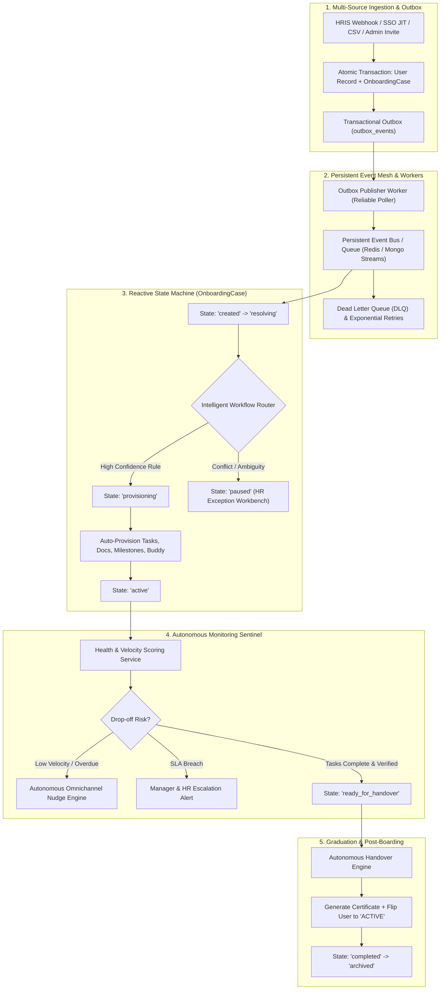

# Master Architectural Blueprint: Autonomous & Agentic Onboarding Engine

> **Document Status:** Authoritative Architectural Blueprint & System Specification  
> **Target System:** Talnova Onboarding Enterprise B2B SaaS Platform  
> **Architectural Mission:** Complete Transformation from Human-in-the-Loop Administration to an Autonomous, Event-Driven, Agentic Platform while Preserving Mission-Critical Customization Layers.

---

## 1. Executive Summary & Forensic Automation Debt Analysis

Talnova Onboarding is an enterprise-grade multi-tenant platform designed to manage the end-to-end employee lifecycle across 49 distinct user journeys. A rigorous forensic audit of the application source code (`server/src/`, `src/`) and authoritative product contracts (`docs/product/`) reveals an engine with solid foundational CRUD capabilities and domain modeling, but burdened by substantial **automation debt** and **human-in-the-loop bottlenecks**.

Currently, administrative personas (HR Admins, Team Managers, IT Specialists) spend considerable operational bandwidth performing mundane, repetitive tracking, manual triage, ad-hoc reminder nudging, sequential milestone sign-offs, and disjointed task verifications. Furthermore, while sophisticated patterns like the **Transactional Outbox Pattern** (`server/src/modules/onboarding/models/outbox-event.model.ts`) and **Onboarding Case State Machines** (`server/src/modules/onboarding/models/onboarding-case.model.ts`) have been drafted in the schema layer, they remain **completely unintegrated** into the primary employee lifecycle (`server/src/modules/employees/services/employee.service.ts`).

### Current State vs. Target Agentic State

| Architectural Dimension | Current Baseline State | Target Agentic State |
| :--- | :--- | :--- |
| **Event Reliability** | In-memory `EventBus` (`Map<EventType, Set<EventHandler>>`) and in-memory `QueueService` (`jobQueue: []`). Events and jobs are volatile and lost on process restart or node recycling. | Durable Distributed Event Mesh backed by MongoDB Change Streams / Redis Streams + Transactional Outbox with guaranteed at-least-once delivery, retry exponential backoff, and Dead Letter Queues (DLQ). |
| **Lifecycle Orchestration** | Scattered point-to-point service calls (`handleUserCreated` sequentially calls 6 independent services without saga rollback or compensation). | Unified Reactive Finite State Machine (`OnboardingCase`) orchestrating provisioning, resolving, active monitoring, exception quarantine, and graduation. |
| **Journey Assignment** | Split brain: `workflowEngine.processEvent` and `smartAssignmentService.autoEnrollNewHire` execute simultaneously without deterministic arbitration or priority resolution. | Centralized Agentic Decision Engine combining deterministic boolean rules, priority indexes, and fallback ML inference for optimal journey resolution. |
| **Operational Monitoring** | Periodic polling scheduler (60-second interval) doing coarse DB queries for overdue items; managers must manually click "Nudge" or "Verify". | Proactive Autonomous Sentinel continuously tracking user velocity, predicting drop-off risk, issuing escalating smart nudges across channels, and auto-verifying low-risk tasks. |
| **Customization & Overrides** | Overrides are often unconstrained direct DB mutations without semantic audit trails or reconciliation rollback safeguards. | Formal **Three-Tier Execution Model**: Autonomous by default, smart hybrid escalation on low confidence, and cryptographically audited manual override channels. |

---

## 2. The Three-Tier Architectural Classification Model

Every workflow, journey, and background process across the Talnova ecosystem is categorized into one of three execution tiers:

```
+----------------------------------------------------------------------------------------------------+
|                                    THREE-TIER EXECUTION MODEL                                      |
|                                                                                                    |
|  [ TIER 1: FULLY AUTOMATED ]    --> Zero human touch. Driven by triggers, webhooks, state machines  |
|                                      and background jobs. (e.g. provisioning, auto-enrollment).    |
|                                                                                                    |
|  [ TIER 2: SMART HYBRID ]       --> Automated by default with continuous health & risk scoring.    |
|                                      Surfaces to humans ONLY when confidence < 0.85, SLA breached,  |
|                                      or anomaly detected. (e.g. milestone review, buddy matching). |
|                                                                                                    |
|  [ TIER 3: PRESERVED MANUAL ]   --> Immutable human authority. Bespoke template authoring, legal   |
|                                      e-signatures, disciplinary actions, and executive overrides.   |
+----------------------------------------------------------------------------------------------------+
```

1. **Fully Automated (Target State):** Processes that require zero human intervention. Driven by domain triggers, external webhooks, state machines, and reliable asynchronous workers.
2. **Smart Hybrid / Exception-Driven:** Processes that execute autonomously under normal operating parameters (e.g., auto-evaluating standard milestones, smart buddy pairing, auto-approving verified tasks) but intelligently escalate to human supervisors when confidence drops below safety thresholds, conflicting conditions emerge, or deadlines lapse.
3. **Preserved Manual (Customization Layer):** Architectural boundaries where human agency is legally, ethically, or strategically mandatory. These include custom template authoring, final legal digital signatures, performance dispute arbitration, and administrative policy definitions.

---

## 3. Comprehensive Feature Audit Matrix (49 User Journeys)

Below is the authoritative evaluation of all 49 user journeys mapped against current implementation, target agentic state, forced bottlenecks, and mandatory customization preservation rules.

| ID | Journey Name | Primary Role | Current State | Target Agentic State | Tier | Forced Manual Bottlenecks | Mandatory Customization Hook & Preservation Rule |
| :--- | :--- | :--- | :--- | :--- | :---: | :--- | :--- |
| **UJ-AUTH-001** | User Login (Credentials) | All Users | Manual email/password form | Risk-based MFA & adaptive device trust | **Tier 1** | None | Preserve manual password override & admin account reset capabilities. |
| **UJ-AUTH-002** | User Logout & Session Invalidation | All Users | Manual click or JWT expiration | Auto-logout on security anomaly / role revocation event | **Tier 1** | None | Preserve user-initiated deliberate sign-out action. |
| **UJ-AUTH-003** | User Self-Registration | Public | Manual form submit | JIT domain-matched self-onboarding | **Tier 2** | Admin must manually verify email domain if invite link missing | Domain whitelist rules customizable by organization admins. |
| **UJ-AUTH-004** | Password Reset & Recovery | All Users | Manual request + token email | Automated token generation & audit | **Tier 1** | Manual admin intervention if email fails | Admin manual temporary password override preserved. |
| **UJ-AUTH-005** | Enterprise SSO Discovery & Initiation | Owner / Employee | Auto-discover email domain; external IdP mocked | Production JIT auto-provisioning & SAML assertion role sync | **Tier 1** | IT admin manually maps SAML groups to platform roles | SAML attribute mapping table must remain completely customizable in `/settings/sso`. |
| **UJ-AUTH-006** | Token Refresh & Session Renewal | All Users | Silent Axios refresh token | Transparent background sliding session rotation | **Tier 1** | None | Security session revocation hook preserved. |
| **UJ-AUTH-007** | Unauthorized Access & Route Rejection | All Users | Static 403 route guards | Real-time RBAC evaluation + auto-elevation request | **Tier 2** | User must manually contact admin outside platform | Custom role-permission definitions in RBAC matrix preserved. |
| **UJ-ONB-001** | View Personal Roadmap & Active Phase | Employee | Static roadmap display | Adaptive dynamic roadmap responsive to task velocity | **Tier 1** | Admin must manually adjust phase dates if hire date shifts | Manager manual phase unlock/lock override preserved. |
| **UJ-ONB-002** | Mandatory Compliance E-Signature | Employee | Canvas drawing submission + SHA256 audit | Automated reminders + auto-countersigning trigger | **Tier 3** | Admin manually reviews signature completeness | **LEGAL HOOK:** The physical/canvas act of signing MUST remain a human action. |
| **UJ-ONB-003** | Execute Personal Checklist Tasks | Employee | Manual checklist toggle | Smart auto-completion on correlated system events | **Tier 2** | Employee clicks "Complete" on tasks system already knows are done | Ad-hoc personal task creation preserved. |
| **UJ-ONB-004** | Complete LMS Course Lessons | Employee | Video player + 90% watch rule | Adaptive learning pacing & automated lesson progression | **Tier 1** | None | HR Admin custom lesson re-ordering preserved. |
| **UJ-ONB-005** | Take LMS Assessment Quiz | Employee | Form submit + automatic scoring | AI-generated remediation quizzes on failed attempts | **Tier 2** | Manager must manually unlock step if max attempts exceeded (UQ-02) | HR Admin passing score threshold & question pool configuration preserved. |
| **UJ-ONB-006** | Submit Day 30-60-90 Self-Rating | Employee | Form submit; sits in pending review indefinitely | Sentiment extraction + auto-scheduling manager check-in | **Tier 2** | Manager must manually review and approve before next phase unlocks | Employee self-reflection comments & qualitative feedback preserved. |
| **UJ-ONB-007** | View & Connect with Onboarding Buddy | Employee | Static view of paired buddy | Automated calendar sync + icebreaker bot prompts | **Tier 2** | Admin/Manager must manually match buddy if queue empty | Employee/Manager can request buddy swap anytime. |
| **UJ-ONB-008** | Complete Handover & Receive Certificate | Employee | Certificate generated; requires manager sign-off | Autonomous graduation engine triggering cert generation & HRIS status flip | **Tier 2** | Manager must manually click sign-off to mark onboarding complete | Manager final qualitative sign-off note & formal ceremony preserved. |
| **UJ-ONB-009** | Offline Learning Progress Sync via PWA | Employee | IndexedDB queue; manual or online flush | Reliable Background Sync with conflict resolution | **Tier 1** | User must re-open browser while online | Local offline cache settings & clear cache preserved. |
| **UJ-ADM-001** | Author & Manage Journey Templates | Admin / Owner | Drag-and-drop template builder | AI-assisted journey synthesis with auto-dependency graphs | **Tier 3** | Admin manually creates every step and rule from scratch | **CORE CUSTOMIZATION HOOK:** Full editorial authority over template structure, steps, and prerequisites. |
| **UJ-ADM-002** | Employee Directory & Invite New Hire | Admin / Owner | Manual invite form + email dispatch | Continuous HRIS event sync (BambooHR/Workday) + JIT provisioning | **Tier 2** | Admin must manually type employee info and assign journeys | Manual invite button and custom invitation message preserved. |
| **UJ-ADM-003** | Bulk Import Employees via CSV | Admin / Owner | CSV upload + synchronous parse loop | Asynchronous batch worker + automatic fuzzy schema mapping | **Tier 2** | Admin must manually resolve unmapped CSV column headers | Admin manual column mapping preview preserved. |
| **UJ-ADM-004** | Workflow Automation Rule Configuration | Admin / Owner | Boolean condition builder | Autonomous rule conflict detection & execution simulation | **Tier 3** | Admin must manually resolve contradictory rule priorities (UQ-06) | **CORE CUSTOMIZATION HOOK:** Full rule-authoring authority (Trigger -> Conditions -> Actions). |
| **UJ-ADM-005** | HR Ops Handover Verification & Analytics | Admin / Owner | Manual table review of graduated hires | Autonomous exception workbench highlighting stuck cases | **Tier 2** | HR Admin must manually inspect each completed case | Admin manual audit approval & exception override preserved. |
| **UJ-ADM-006** | Compliance Document Template Authoring | Admin / Owner | Rich-text builder with `{{handlebars}}` | AI template variable validator + legal version diffing | **Tier 3** | Admin manually authors legal text and dispatches assignments | **CORE CUSTOMIZATION HOOK:** Legal text, mandatory toggles, and template versions. |
| **UJ-ADM-007** | Standalone Task Template Creation | Admin / Manager | Manual modal creation | AI template generator from role descriptions | **Tier 3** | Admin manually sets relative offsets and categories | Custom task templates and category definitions preserved. |
| **UJ-ADM-008** | AI Course Builder Generation | Admin / Owner | OpenAI/Gemini prompt -> JSON curriculum | Autonomous PDF/DOCX ingestion with automated quiz synthesis | **Tier 2** | Admin must manually copy-paste raw text if parser fails (UQ-05) | Admin curriculum editing & approval before publishing preserved. |
| **UJ-ADM-009** | Org Branding & Department Settings | Admin / Owner | Manual settings forms | Auto-palette extraction from logo + auto-org chart sync | **Tier 3** | Manual form entry | **CORE CUSTOMIZATION HOOK:** Company branding, colors, logos, and department schemas. |
| **UJ-ADM-010** | Enterprise SSO Settings Configuration | Owner / Admin | Manual metadata & certificate paste | Auto-federation via IdP metadata URL (.well-known) | **Tier 3** | Admin manually rotates certificates and validates SAML URLs | Certificate overrides and domain exclusion lists preserved. |
| **UJ-ADM-011** | HRIS Marketplace Integration Sync | Admin / Owner | Connector card + simulated webhook receiver | Production bi-directional event sync via Transactional Outbox | **Tier 2** | Admin must click "Sync Now" to ingest changes | Manual credential configuration and field-mapping overrides preserved. |
| **UJ-ADM-012** | Company Analytics & Drop-off Monitoring | Admin / Manager | Static charts & milestone drop-off counters | Autonomous drop-off forecasting & proactive alert agent | **Tier 1** | Admins must manually inspect dashboards to detect bottlenecks | Custom report filters and metric export preserved. |
| **UJ-MGR-001** | Direct Report Progress Monitoring | Manager | Dashboard table of reports | Autonomous manager digest: highlights only blocked or overdue reports | **Tier 2** | Manager must review all reports daily | Filterable team roster view preserved. |
| **UJ-MGR-002** | Evaluate & Approve 30-60-90 Milestones | Manager | Manual form rating + approval click | Auto-approve if rating >= 4 and no blockers; escalate on delay | **Tier 2** | Milestone stuck forever until manager clicks "Approve" | Manager qualitative feedback & performance dispute override preserved. |
| **UJ-MGR-003** | Approve & Verify Direct Report Tasks | Manager | Manual "Verify" button click | Auto-verify if linked artifact exists (signed doc, quiz pass) | **Tier 2** | Manager manually verifies routine administrative tasks | Manager right to reject or request task revision preserved. |
| **UJ-MGR-004** | Schedule & Log 1-on-1 Check-in Meetings | Manager | Manual date picker & notes form | Autonomous calendar slot finder + AI meeting notes summary | **Tier 2** | Manager must manually find mutual free time and log notes | Private manager notes and agenda adjustments preserved. |
| **UJ-MGR-005** | Assign Onboarding Buddy to New Hire | Manager / Admin | Manual buddy selection modal | Intelligent multi-factor matching (department, capacity, skills) | **Tier 2** | Manager manually browses buddy directory | Manager veto and manual pairing override preserved. |
| **UJ-BUD-001** | Register Buddy Profile & Availability | Buddy / Employee | Manual toggle & mentee count form | Autonomous availability tracking based on calendar load | **Tier 2** | Buddy must manually update availability | Buddy profile bio, skills, and personal limits preserved. |
| **UJ-BUD-002** | Review Mentee Progress & Checklists | Buddy | Read-only checklist view | Proactive buddy coach bot suggesting discussion topics | **Tier 1** | Buddy must manually track mentee progress | Buddy custom checklist items preserved. |
| **UJ-BUD-003** | Log Buddy Check-in Notes & Sentiment | Buddy | Manual form submission | Smart voice/slack check-in logger + sentiment analysis | **Tier 2** | Buddy must remember to log meeting notes | Confidential buddy feedback channel preserved. |
| **UJ-KSK-001** | Pair Kiosk Device via 6-Digit Code | Admin / Device | Manual 6-digit code entry on terminal | Zero-touch fleet provisioning via pre-signed QR or MDM enrollment | **Tier 1** | Admin manually types code on touch screen | Manual re-pairing & device revocation preserved. |
| **UJ-KSK-002** | Launch Touch Kiosk Journey Player | Frontline Worker | Touch badge entry -> unauthenticated player | Biometric / NFC badge tap + dynamic shift-scoped session | **Tier 1** | Operator must manually search worker in list | Manual worker search override preserved. |
| **UJ-KSK-003** | SOP Playback & Touch PPE Confirmation | Frontline Worker | Video loop + touch checkbox | Auto-logging compliance + supervisor shift notification | **Tier 1** | None | Physical PPE checklist toggle preserved. |
| **UJ-KSK-004** | Kiosk Device Heartbeat & Analytics Sync | Kiosk Device | 60-second ping to server | Edge-cached telemetry + auto-health diagnostic & self-heal | **Tier 1** | Admin only notices dead kiosk when workers complain | Manual kiosk maintenance mode trigger preserved. |
| **UJ-SUP-001** | Tenant Provisioning & Health Oversight | SuperAdmin | Manual tenant creation form | Autonomous tenant provisioning on Stripe/Salesforce webhook | **Tier 1** | SuperAdmin manually provisions DB workspace | SuperAdmin workspace configuration override preserved. |
| **UJ-SUP-002** | Manage Tenants & Subscriptions | SuperAdmin | Manual tier upgrade / feature toggles | Autonomous usage metering & auto-tier scaling alerts | **Tier 2** | Manual plan upgrades | SuperAdmin custom feature flags & license overrides preserved. |
| **UJ-SUP-003** | Cross-Tenant Finance & Billing Tracking | SuperAdmin | Read-only revenue dashboard | Autonomous invoice generation & dunning workflow | **Tier 1** | Manual billing discrepancy audits | Custom enterprise billing contracts preserved. |
| **UJ-OPS-001** | View Leaderboard & Earn Points/Badges | All Users | Gamification service awards points on events | Real-time agentic streak notifications & team milestones | **Tier 1** | None | HR Admin custom badge creation preserved. |
| **UJ-OPS-002** | Navigate Interactive Workplace Office Map | All Users | Interactive SVG map viewer | Geofenced welcome triggers & desk-finding assistant | **Tier 1** | None | HR Admin office desk & map floorplan editor preserved. |
| **UJ-OPS-003** | Public Certificate Verification via QR | Public | Public route checking SHA-256 hash | Autonomous certificate revocation check & verification | **Tier 1** | None | Cryptographic certificate audit verification preserved. |
| **UJ-KB-001** | Browse KB Articles & Policy Slideshow | All Users | Categorized article viewer | Contextual policy recommendations based on active step | **Tier 1** | None | Admin KB article authoring and publishing preserved. |
| **UJ-KB-002** | Query AI Assistant for Policies | All Users | Gemini chat querying KB embeddings | Proactive AI Co-pilot answering queries and executing tasks | **Tier 2** | User must manually ask questions | Admin knowledge source curation and prompt grounding preserved. |
| **UJ-IT-001** | IT Hardware Provisioning Workflow | IT Admin / Assignee | Generic task tagged `category: "it_setup"` | Autonomous MDM webhook dispatch + hardware tracking integration | **Tier 2** | IT admin manually types serial numbers in task comments | IT admin manual hardware exception handling preserved. |

---

## 4. Deep-Dive Gap Analysis & Forensic Discoveries

### 4.1 Forced Manual Bottlenecks
1. **Manual Task Verification Gridlock (`task.service.ts`):** Tasks requiring verification (`status: "verified"`) cannot transition without a human manager explicitly making an API call. For standardized tasks like "Sign NDA" or "Complete Security Training", where the system already holds cryptographic proof (a `DocumentAssignment` with SHA-256 hash or an LMS Quiz score >= 80%), this forces hundreds of unnecessary manual clicks per month.
2. **Milestone Review Deadlock (`milestone.service.ts`):** When an employee submits their Day 30/60/90 evaluation, the milestone state enters `pending_manager_review`. If the manager is on annual leave or unresponsive, the milestone sits locked indefinitely, blocking roadmap progress. There is no automated reminder escalation ladder or autonomous sign-off threshold.
3. **Manual Drop-Off Monitoring & Ad-Hoc Nudges (`manager.service.ts`):** Managers must remember to log into `/manager`, browse the list of direct reports, identify who has overdue items, and manually click "Send Nudge". The system lacks an autonomous drop-off predictor that automatically sends escalating omnichannel nudges (email -> in-app -> Slack -> manager alert).
4. **Rudimentary Buddy Assignment (`buddy.service.ts`):** Line 376 of `buddy.service.ts` simply selects `availableBuddies[0]`. If no buddy is available, it silently fails. Admins and managers are forced into manual pairing via `/buddy` without any automated scoring of department, capacity, location, or shared language.
5. **Operational Handover Stall (`docs/product/04-unified-onboarding-lifecycle.md` Stage 10):** When all journey items reach 100%, the employee profile remains in `status: "invited"` or `"onboarding"` until an HR admin manually verifies the record and flips their status to `"active"`.

### 4.2 Mandatory Customization Hooks (Where Manual Control Must Be Preserved)
1. **Custom Journey Templates & Curriculums (`UJ-ADM-001`):** HR Admins must retain unconstrained authority to build bespoke templates, re-order steps, define custom milestones, and attach specialized learning modules. The agentic system can recommend or draft templates, but never publish without admin authorization.
2. **Manager Qualitative Milestone Feedback & Revision Requests (`UJ-MGR-002`):** Managers must always retain the power to reject an evaluation, flag developmental gaps, request revisions, or conduct a private 1-on-1 interview. Autonomous sign-off must only trigger when explicit criteria are met and manager non-action thresholds elapse without dissent.
3. **Bespoke Assignment Overrides:** Admins must be able to assign an ad-hoc journey or task to any employee, bypassing active automated workflow rules.
4. **Legal Compliance E-Signatures (`UJ-ONB-002`):** While delivery, reminders, and archiving are fully automated, the actual canvas signature capture is legally binding and must remain an unalterable human action.
5. **Exception Resolution Workbench:** When AI models or automated rules encounter conflicts (such as conflicting rule priority index or unrecognized job title), the case must be routed to a dedicated human exception queue with full diagnostic visibility.

### 4.3 Missed / Partial Automations & Technical Debt
1. **In-Memory Volatility:**
   - `server/src/infrastructure/events/event-bus.ts`: Uses an in-memory `Map` of event handlers. Any event published during a server restart is lost.
   - `server/src/infrastructure/queue/queue.service.ts`: Uses an in-memory `jobQueue = []`. Enqueued background jobs do not persist across restarts.
2. **Disconnected `OnboardingCase` & Outbox:**
   - `OnboardingCase` (`server/src/modules/onboarding/models/onboarding-case.model.ts`) defines an enterprise state machine (`created`, `resolving`, `provisioning`, `ready`, `active`, `paused`, `ready_for_handover`, `completed`, `archived`), but `employee.service.ts` creates users and directly calls `eventBus.publish("USER_CREATED")` without ever instantiating an `OnboardingCase` or writing to `outbox_events`.
3. **Missing Workflow Triggers:**
   - `employee.service.ts` contains `updateEmployee()`, but it emits **zero events** (`USER_UPDATED`, `USER_ROLE_CHANGED`, `USER_DEPARTMENT_CHANGED` are defined in `event-types.ts` but never dispatched). Changing an employee's department never re-evaluates workflow rules!
4. **The "Dummy Delay" Action Bug (`workflow.engine.ts` Line 377):**
   - The `delay` action type simply returns `{ status: "delayed", message: "Execution step delayed" }` without enqueuing a delayed job or pausing downstream actions! The pipeline immediately executes step $i+1$.
5. **Split-Brain Auto-Enrollment:**
   - `event-subscribers.ts` executes both `workflowEngine.processEvent("user_created")` and `smartAssignmentService.autoEnrollNewHire()`. If both match, duplicate assignments or race conditions occur.

---

## 5. Target Event-Driven Architecture Specification



### 5.1 Standardized Event Envelope
All domain events must conform to the strict enterprise event envelope:

```typescript
export interface AutonomousEventEnvelope<T = any> {
  eventId: string;             // UUID v4
  eventName: string;           // e.g. "onboarding.case.created", "workflow.rule.matched"
  eventVersion: string;        // SemVer, e.g. "2.0.0"
  occurredAt: Date;            // ISO Timestamp
  organizationId: string;      // Multi-tenant isolation boundary
  actorId?: string;            // Initiating user ID or "system.autonomous.sentinel"
  entityId: string;            // Primary entity ID (e.g. caseId, userId, taskId)
  causationId?: string;        // ID of the event that caused this event
  correlationId: string;       // Trace ID across distributed flows
  idempotencyKey: string;      // Deduplication key: `${orgId}:${entityId}:${eventName}:${version}`
  payload: T;                  // Typed event data
}
```

### 5.2 Core Domain Event Catalog

| Event Name | Producer | Payload Essentials | Primary Subscribers |
| :--- | :--- | :--- | :--- |
| `employee.invited` | `EmployeeService` | `userId, email, department, role, hireDate` | `OnboardingCaseService`, Outbox Publisher |
| `employee.profile_updated`| `EmployeeService` | `userId, previousValues, updatedValues` | Workflow Engine (dynamic re-evaluation) |
| `onboarding.case.created` | `OnboardingCaseService`| `caseId, employeeId, source` | Workflow Router Engine |
| `onboarding.case.resolved`| `WorkflowEngine` | `caseId, templateId, ruleId, confidence`| Provisioning Orchestrator |
| `onboarding.case.paused` | `WorkflowEngine` | `caseId, reason, conflictDetails` | Exception Workbench, Admin Alert |
| `provisioning.dispatched` | `ProvisioningService` | `caseId, tasksCreated, docsAssigned` | Notification Service, Calendar Service |
| `task.verification_requested`| `TaskService` | `taskId, employeeId, verificationType` | Autonomous Verification Sentinel |
| `task.auto_verified` | `VerificationSentinel` | `taskId, verifiedBy: "system.sentinel"` | Gamification Service, Onboarding Case |
| `milestone.self_check_submitted` | `MilestoneService` | `milestoneId, employeeId, rating` | Manager Sentinel, Calendar Scheduler |
| `milestone.auto_approved` | `MilestoneSentinel` | `milestoneId, rating, reason` | Gamification Service, Roadmap Engine |
| `compliance.anomaly_detected` | `MonitoringSentinel`| `caseId, velocity, overdueDays, riskScore` | Omnichannel Nudge Engine |
| `onboarding.graduated` | `HandoverEngine` | `caseId, employeeId, certificateUrl` | HRIS Sync Worker, User Status Worker |

---

## 6. Blueprint Implementation Roadmap

To systematically eliminate the identified automation gaps, create the resilient event layer, and wire up the intelligent workflows without endangering existing manual overrides, the execution is divided into four strategic phases:

1. **Phase 1: Resilient Event-Driven Foundation & Transactional Outbox**
   - Migrate in-memory bus and queue to durable MongoDB change streams / Redis worker queue.
   - Wire `OnboardingCase` and `OutboxEvent` into `employee.service.ts` and `auth.service.ts`.
   - Fix missing event dispatches (`employee.profile_updated`, `employee.department_changed`).
2. **Phase 2: Intelligent Multi-Factor Routing & Arbitration Engine**
   - Consolidate `workflowEngine` and `smartAssignmentService` into an integrated decision matrix.
   - Implement deterministic conflict arbitration (UQ-06) and fallback ML inference for ambiguous metadata.
   - Implement true persistent delayed workflow execution (`delay` action).
3. **Phase 3: Autonomous Monitoring, Smart Verification & Omnichannel Escalations**
   - Stand up the Autonomous Sentinel background worker for continuous velocity scoring.
   - Implement autonomous task verification based on cryptographic document and LMS proof.
   - Implement milestone auto-escalation ladders and auto-approval policies.
   - Replace manual nudges with predictive omnichannel nudge campaigns.
4. **Phase 4: Hybrid Customization Hooks & Unified Exception Workbench**
   - Create a dedicated HR Ops Exception Workbench in the frontend for quarantined cases (`status: "paused"`).
   - Ensure all manual overrides (journey swap, milestone revision, buddy reassignment, custom template editing) preserve full audit telemetry.

---

## 7. Autonomous Prompt Library Directory Mapping

The companion prompt library inside `prompts/automation/` provides strict, execution-ready prompts targeting each discovered gap:

1. `prompts/automation/01-event-driven-architecture.md`: Durable event mesh, transactional outbox pattern, and persistent job queue.
2. `prompts/automation/02-intelligent-workflow-routing.md`: Unified assignment engine, priority arbitration, and persistent delay scheduling.
3. `prompts/automation/03-autonomous-monitoring-alerts.md`: Proactive velocity scoring, predictive drop-off detection, and omnichannel nudges.
4. `prompts/automation/04-hybrid-manual-override-layer.md`: HR Exception Workbench, manager veto channels, and safe manual overrides.
5. `prompts/automation/05-autonomous-compliance-verification.md`: Cryptographic e-signature linkage, auto-verification of prerequisite tasks, and LMS proof reconciler.
6. `prompts/automation/06-milestone-evaluations-escalations.md`: 30-60-90 milestone auto-approval thresholds, manager PTO escalation, and AI reflection summarizer.
7. `prompts/automation/07-intelligent-buddy-matching-coaching.md`: Multi-factor buddy scoring (department, capacity, skills, language) and proactive buddy coaching bot.
8. `prompts/automation/08-it-ops-hardware-lifecycle.md`: IT hardware provisioning automation, asset receipt processing, and webhook dispatch.
9. `prompts/automation/09-kiosk-edge-offline-reconciliation.md`: Frontline kiosk session handling, unauthenticated safety briefs, and offline PWA synchronization.
10. `prompts/automation/10-enterprise-hris-sync-outbox.md`: Bi-directional HRIS integration sync (BambooHR/Workday), JIT SSO provisioning, and lifecycle termination handling (UQ-03).
