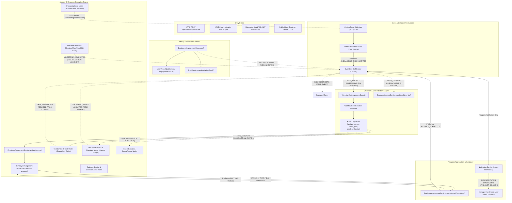

# 04 — Actual Unified Runtime Architecture

> **Document Status:** Authoritative Architectural Trace  
> **Target Application:** Talnova Onboarding Enterprise B2B SaaS Platform  
> **Purpose:** Ground-Truth Mapping of actual code execution paths, event pipelines, and integration breaks across the unified platform.

---

## 1. Master Runtime Architecture Diagram

---

## 2. Detailed Execution Path Audit

### Stage A: Employee Entry & Identity Creation
* **Actual Path:** `POST /api/v1/employees/invite` invokes `EmployeeService.inviteEmployee()` (`server/src/modules/employees/services/employee.service.ts:L106-169`).
* **Result:** Creates `User` document with `employment.status: "invited"`. Sends invitation email via `EmailService`.
* **Break:** `EmployeeService.inviteEmployee()` **omits** calling `eventBus.publish({ eventName: "USER_CREATED", ... })`.

---

### Stage B: Trigger Emission & Workflow Engine Resolution
* **Actual Path:** `registerEventSubscribers()` (`server/src/infrastructure/events/event-subscribers.ts:L148-177`) listens to `USER_CREATED` and invokes `WorkflowEngine.processEvent()`, `SmartAssignmentService.autoEnrollNewHire()`, `DocumentService.autoAssignDocumentsToNewHire()`, `MilestoneService.autoAssignMilestonesToNewHire()`, and `BuddyService.autoAssignBuddyToNewHire()`.
* **Break:** Because Stage A fails to emit `USER_CREATED`, this entire workflow and auto-enrollment pipeline is **never executed** in runtime.

---

### Stage C: Journey & Resource Dispatch
* **Actual Path:** When an admin manually calls `POST /api/v1/assignments/assign`, `EmployeeAssignmentService.assignJourney()` (`server/src/modules/assignments/services/assignment.service.ts:L14-153`) initializes an `EmployeeAssignment` record containing LMS modules and lessons.
* **Break:** `assignJourney()` initializes **only** LMS course modules. It ignores standalone `Task` checklists, compliance `DocumentSignature` forms, and `MilestonePlan` check-ins.

---

### Stage D: Execution & Progress Aggregation
* **Actual Path:** Employee streams videos and completes quizzes via `EmployeeAssignmentService.completeLesson()` and `submitQuiz()`. `IEmployeeAssignment.progress` updates lesson view percentages.
* **Break:** Standalone `Task` completion (`TaskService.updateTaskStatus`) and E-Signature completion (`DocumentService.signDocument`) publish `TASK_COMPLETED` and `DOCUMENT_SIGNED` events to `eventBus`, but `EmployeeAssignmentService` **never subscribes** to them to update journey step progress.

---

### Stage E: Completion Verification & Handover
* **Actual Path:** `EmployeeAssignmentService.checkOverallCompletion()` (`assignment.service.ts:L487-533`) checks `assignment.modules.every(m => m.completed)`. When true, sets `assignment.status = "completed"` and publishes `JOURNEY_COMPLETED`.
* **Break 1:** Completion evaluates **only** LMS course modules. Mandatory IT tasks, legal NDAs, and milestone check-ins are bypassed.
* **Break 2:** `event-subscribers.ts:L29` receives `JOURNEY_COMPLETED` and dispatches an in-app notification to the manager. It **never** updates `User.employment.status` to `"active"` and **never** triggers operational handover.
