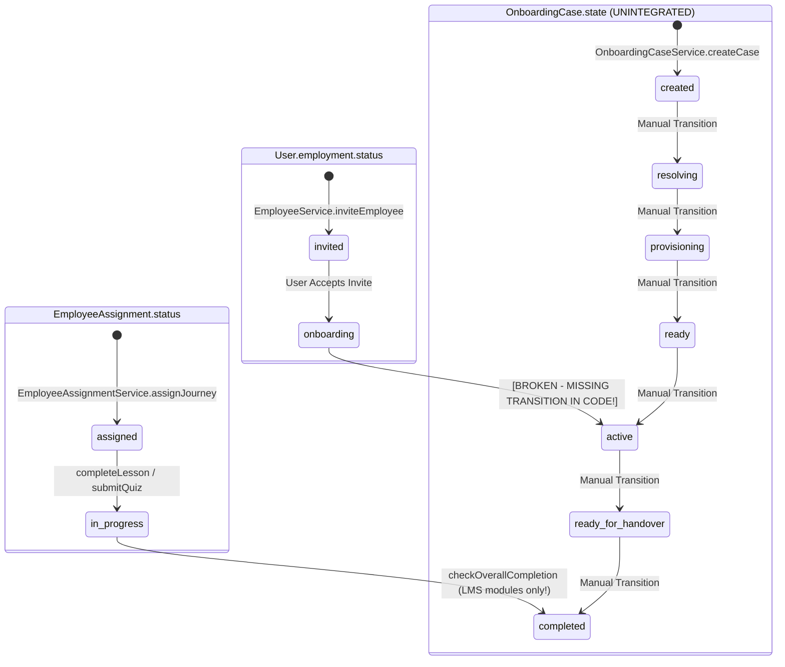

# 07 — State Machine Collision Map

> **Document Purpose:** Forensic Comparison of Codebase State Machines vs Unified Product Contract State Requirements

---

## 1. Master State Machine Comparison Matrix

| Entity | State Machine Field | Codebase Allowed Values | Product Contract Value | Transition Trigger | Guard / Precondition | State Consumer | Architectural Collision |
| :--- | :--- | :--- | :--- | :--- | :--- | :--- | :--- |
| **`User`** | `employment.status` | `"invited"`, `"active"`, `"onboarding"`, `"offboarding"`, `"archived"` | `INVITED`, `ONBOARDING`, `ACTIVE`, `OFFBOARDING`, `ARCHIVED` | `EmployeeService.inviteEmployee`, `acceptInvite` | Invitation token validation | Auth Middleware, Profile Views | **COLLISION 1:** `JOURNEY_COMPLETED` does **not** update `employment.status` to `"active"`. Status stays `"onboarding"` or `"invited"`. |
| **`EmployeeAssignment`** | `status` | `"assigned"`, `"in_progress"`, `"completed"`, `"overdue"`, `"expired"` | `NOT_STARTED`, `IN_PROGRESS`, `PAUSED`, `OVERDUE`, `COMPLETED` | `completeLesson`, `submitQuiz`, `checkOverallCompletion` | `allModulesCompleted` (LMS modules only) | Employee Journey View, Manager Progress Dashboard | **COLLISION 2:** Evaluates **only** LMS module completion. Ignores tasks, documents, and milestones. Lacks `"paused"` state. |
| **`OnboardingCase`** | `state` | `"created"`, `"resolving"`, `"provisioning"`, `"ready"`, `"active"`, `"paused"`, `"ready_for_handover"`, `"completed"` | N/A (Internal Orchestration State) | `OnboardingCaseService.transition` | Matrix `transitions[state].includes(to)` | None (Unexposed via HTTP API) | **COLLISION 3:** Operates as a parallel, unintegrated state engine with zero links to `EmployeeAssignment`. |
| **`Task`** | `status` | `"pending"`, `"in_progress"`, `"completed"`, `"overdue"`, `"cancelled"` | `PENDING`, `IN_PROGRESS`, `COMPLETED`, `VERIFIED`, `OVERDUE` | `TaskService.updateTaskStatus` | Prerequisite task check (`prerequisiteTaskIds`) | Task List Portal, Task Notifications | **COLLISION 4:** Completed task emits `TASK_COMPLETED`, but `EmployeeAssignment` does **not** consume event to update step progress. |
| **`DocumentSignature`**| `status` | `"pending"`, `"viewed"`, `"signed"`, `"declined"` | `PENDING`, `VIEWED`, `SIGNED` | `DocumentService.signDocument` | Valid canvas signature & PDF hash generation | Document Viewer, E-Signature Audit Log | **COLLISION 5:** Signed document emits `DOCUMENT_SIGNED`, but `EmployeeAssignment` does **not** consume event to update step progress. |
| **`MilestonePlan`** | `status` | `"pending"`, `"submitted"`, `"approved"` | `PENDING`, `SUBMITTED`, `APPROVED` | `MilestoneService.submitRating` | Dual rating input (Employee & Manager) | Milestone Plan View | **COLLISION 6:** Milestone approval does **not** participate in journey completion verification. |

---

## 2. State Transition Owner Summary

---

## 3. Recommended State Machine Alignment

1. **Establish `EmployeeAssignment` as Canonical Runtime Progress Owner:** Standardize `EmployeeAssignment.status` to support `NOT_STARTED`, `IN_PROGRESS`, `PAUSED`, `OVERDUE`, `COMPLETED`.
2. **Bridge `EmployeeAssignment` to `User.employment.status`:** Upon `JOURNEY_COMPLETED`, update `User.employment.status` to `"active"` and trigger manager handover.
3. **Bridge `EmployeeAssignment` to `OnboardingCase`:** When `EmployeeAssignment` completes, update `OnboardingCase.state` to `"completed"`.
