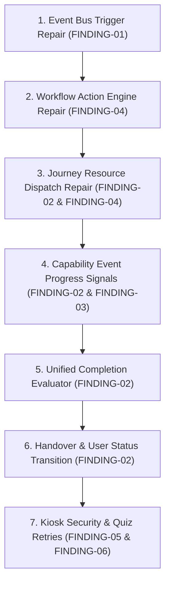

# 08 — Repair Dependency Graph

> **Document Purpose:** Architectural Repair Ordering Derived from Actual Code Dependencies

---

## 1. Architectural Repair Dependency Graph

---

## 2. Detailed Phase Breakdown & Dependency Rationale

### Phase 1: Event Bus Trigger Repair (`USER_CREATED`)
* **Target:** `server/src/modules/employees/services/employee.service.ts`
* **Action:** Inject `eventBus.publish({ eventName: "USER_CREATED", ... })` inside `inviteEmployee()`.
* **Dependency Rationale:** All downstream workflow rules, smart journey assignments, task dispatches, buddy pairings, and meeting scheduler listeners depend on `USER_CREATED`. Until this event is published, the downstream engine remains orphaned.

### Phase 2: Workflow Action Engine Repair
* **Target:** `server/src/modules/workflows/services/workflow.engine.ts`
* **Action:** Connect action handlers for `trigger_buddy` (calling `BuddyService`), `assign_document` (calling `DocumentService`), and `trigger_webhook`.
* **Dependency Rationale:** Workflow rules triggered by `USER_CREATED` must be capable of executing all assigned action types rather than skipping or returning dummy success stubs.

### Phase 3: Journey Resource Dispatch Repair
* **Target:** `server/src/modules/assignments/services/assignment.service.ts`
* **Action:** Enhance `assignJourney()` to create associated `TaskItem` checklists, `DocumentSignature` requests, and `MilestonePlan` records based on journey step definitions.
* **Dependency Rationale:** An assigned journey must instantiate all required child resources (tasks, compliance documents, milestones) alongside LMS course modules upon creation.

### Phase 4: Capability Event Progress Signals
* **Target:** `server/src/infrastructure/events/event-subscribers.ts` & `EmployeeAssignmentService`
* **Action:** Subscribe `EmployeeAssignmentService` to `TASK_COMPLETED`, `DOCUMENT_SIGNED`, and `MILESTONE_COMPLETED` events to update step completion states in `IEmployeeAssignment`.
* **Dependency Rationale:** Progress tracking in `IEmployeeAssignment` must reflect non-LMS capability completions.

### Phase 5: Unified Completion Evaluator
* **Target:** `server/src/modules/assignments/services/assignment.service.ts`
* **Action:** Update `checkOverallCompletion()` to verify that all mandatory `Task`, `DocumentSignature`, and `MilestonePlan` items achieve completed/verified status before marking journey assignment as completed.
* **Dependency Rationale:** Journey completion must be granted only when all mandatory onboarding items across all capabilities are finished.

### Phase 6: Handover & User Status Transition
* **Target:** `server/src/infrastructure/events/event-subscribers.ts`
* **Action:** Update `JOURNEY_COMPLETED` subscriber to transition `User.employment.status` from `"onboarding"` to `"active"` and trigger PDF completion certificate generation and manager handover logs.
* **Dependency Rationale:** Onboarding completes only when the employee reaches active status.

### Phase 7: Kiosk Security & Quiz Retries
* **Target:** `server/src/modules/kiosk/` & `server/src/modules/assignments/`
* **Action:** Enforce signed URL token validation middleware on unauthenticated kiosk routes and enforce max attempt limits on quiz submissions.
* **Dependency Rationale:** Auxiliary security and quiz evaluation rules.
