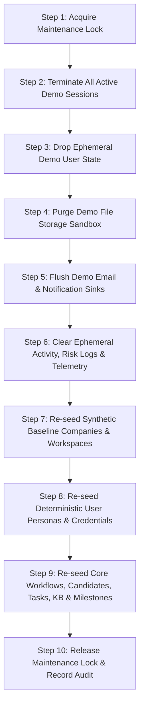

# Talnova Secure Isolated Demo Environment Architecture & Operations Guide

## 1. Overview & Architectural Philosophy

The **Talnova Demo Environment** provides prospective customers, partners, and sales engineering teams with an immersive, true-to-life onboarding experience without compromising the security, integrity, or privacy of production data.

### Core Architectural Axioms
1. **Physical & Logical Database Isolation**: Demo data lives in a completely segregated database connection pool. Under no circumstances will demo traffic route or fall back to the production database. If the demo connection is absent or unreachable, demo requests fail immediately and safely (`503 DEMO_DB_DISCONNECTED`).
2. **Attributable User Personas**: Shared `demo@example.com` accounts are explicitly banned. Every prospective user logs into an assigned individual demo identity with verifiable credentials, session attribution, and deterministic entitlements.
3. **Zero Outbound Data Leakage**: Demo transactional emails and notifications are captured into an in-memory & database sink (`demo-email-log`), preventing external emails from reaching real customer inboxes. File uploads are sandboxed to an isolated directory with zero access to production S3/GCS buckets.
4. **Active Super Admin Control**: Platform Super Administrators have centralized visibility over all live demo sessions, anomaly risk scores, tenant entitlements, and the ability to trigger a zero-impact 10-step deterministic reset.

---

## 2. Production vs Demo Environment Topology

| Dimension | Production Environment (`/`) | Demo Environment (`/demo`) |
| :--- | :--- | :--- |
| **Client Entrypoint** | `http://localhost:5173/` | `http://localhost:5173/demo/` |
| **API Namespace** | `/api/v1/*` | `/api/v1/demo/*` |
| **Super Admin API** | `/api/v1/super-admin/*` | `/api/v1/super-admin/demo/*` |
| **Database Pool** | `mongoose.connection` (MongoDB Atlas `Talnova-Prod`) | `demoConnection` (Isolated Mongoose pool `Talnova-Demo`) |
| **JWT Secrets** | `JWT_ACCESS_SECRET` / `JWT_REFRESH_SECRET` | `DEMO_JWT_SECRET` / `DEMO_JWT_REFRESH_SECRET` |
| **Token Payload** | `{ userId, tenantId, role }` | `{ userId, tenantId, role, sessionId, isDemo: true }` |
| **Session Tracking** | Redis / Mongo Active Refresh | Real-time `DemoSession` with Device/IP Anomaly Detection |
| **Session Policy** | Multi-device allowed per user tier | Max 1 active concurrent session per user; auto-expiration on inactive (15m) |
| **Email Sink** | SendGrid / Resend Production SMTP | Dedicated `DemoEmailSinkService` + In-App Sandbox Inbox |
| **File Storage** | Cloud Storage Bucket / S3 | Local isolated sandbox `storage/demo-uploads/` |
| **Watermark** | None | Full-screen dynamic repeating security watermark overlay |

---

## 3. Configuration & Environment Variables

All configuration is strictly validated on startup using Zod in [`server/src/config/env.schema.ts`](file:///server/src/config/env.schema.ts).

### Key Variables

| Variable | Type | Default / Fallback | Description |
| :--- | :--- | :--- | :--- |
| `DEMO_ENABLED` | `boolean` | `true` (in dev) / `false` (in prod) | Master switch to enable demo API endpoints and background hooks. |
| `DEMO_DATABASE_URL` | `string` (URI) | Auto-derived from `DATABASE_URL` with `-demo` database suffix if omitted | Fully qualified MongoDB connection URI for the demo database. **Must never point to production.** |
| `DEMO_JWT_SECRET` | `string` | Min 32-char generated secret | Secret used exclusively for signing and verifying demo access tokens. |
| `DEMO_JWT_REFRESH_SECRET` | `string` | Min 32-char generated secret | Secret used exclusively for demo refresh tokens. |
| `DEMO_SESSION_TIMEOUT_MINUTES` | `number` | `15` | Maximum idle inactivity before demo session auto-expires. |
| `DEMO_MAX_CONCURRENT_SESSIONS` | `number` | `1` | Max simultaneous active sessions allowed per individual demo user persona. |
| `DEMO_WATERMARK_ENABLED` | `boolean` | `true` | Enforces attribution headers and client-side canvas watermark rendering. |
| `DEMO_UPLOAD_DIR` | `string` | `storage/demo-uploads` | Isolated filesystem path for demo documents and temporary attachments. |

---

## 4. Deterministic Seed Data & Personas

The demo baseline comes prepopulated with realistic multi-tenant data for two distinct enterprise profiles:

### Tenant 1: Acme Corp (`acme-corp`)
- **Tier:** Enterprise (`FULL_SUITE`)
- **Features Enabled:** `analytics_dashboard`, `checklist_tasks`, `digital_signatures`, `document_sharing`, `candidate_portal`, `team_invitations`, `hr_sync`, `bulk_export`, `audit_reports`, `custom_workflows`
- **Authentic Personas (with 1-Click Switcher in Top Navigation):**
  - **Sarah Connor (`sarah.connor@demo.talnova.com` / `DemoPassword123!`):** HR Administrator with full administrative oversight across journeys, candidates, tasks, employee directory, HR operations, and company analytics.
  - **John Doe (`john.doe@demo.talnova.com` / `DemoPassword123!`):** HR Manager guiding departmental onboarding, candidate review, milestone tracking, and task approvals.
  - **Alice Smith (`alice.smith@demo.talnova.com` / `DemoPassword123!`):** Team Lead & Mentor in Engineering, showcasing buddy programs, team check-ins, and direct report onboarding.
  - **Bob Vance (`bob.vance@demo.talnova.com` / `DemoPassword123!`):** New Hire Employee experiencing the authentic employee onboarding portal, personalized journeys, knowledge base, checklists, and document submissions.

### Tenant 2: Globex Industries (`globex-ind`)
- **Tier:** Standard (`STANDARD`)
- **Features Enabled:** `checklist_tasks`, `document_sharing`, `candidate_portal` (Restricted: `digital_signatures`, `hr_sync`, `bulk_export`)
- **Personas:**
  - **Bob Manager (`bob.manager@globex-demo.talnova.com` / `DemoPassword123!`):** Operations manager showcasing how restricted feature attempts trigger the non-intrusive Guided Sales Demo modal and generate commercial upgrade intent telemetry.

---

## 5. The 10-Step Deterministic Reset Engine

Located in [`server/src/modules/demo/services/demo-reset.service.ts`](file:///server/src/modules/demo/services/demo-reset.service.ts), the reset engine executes atomically in 10 sequential phases:



### Safety Confirmations
- Any call to `/api/v1/super-admin/demo/reset` requires:
  1. Super Admin authentication (`requireSuperAdmin` middleware).
  2. Request body containing `{ "confirmation": "RESET DEMO" }`.
- Execution verifies that the target connection host and database name match `demoConnection.name !== mongoose.connection.name`, completely preventing catastrophic production drops.

---

## 6. Super Admin Demo Management Portal & Telemetry Analytics

Super Administrators access the central dashboard at `/super-admin/demo`.

### Features & Capabilities:
1. **Live Environment Overview:**
   - Active user count, active concurrent sessions, email sink counter, anomaly alerts count, and DB health indicators.
2. **Session Termination & Anomaly Triaging:**
   - Real-time list of all active demo sessions with device fingerprints, IP addresses, risk statuses (`NORMAL`, `SUSPICIOUS`, `HIGH_RISK`, `BLOCKED`).
   - One-click **Terminate Session** button to instantly invalidate suspicious demo tokens.
3. **Suspicious Activity Feed:**
   - Real-time timeline of detected risk events:
     - Simultaneous logins from conflicting IP addresses or user agents.
     - Privilege escalation attempts against high-risk paths (`/admin/danger-zone`, `/api-keys/generate`).
     - Cross-tenant data exfiltration attempts.
4. **Feature Adoption & Telemetry Analytics Tab:**
   - **Engagement & Dwell Time:** Visualizes top platform features by total user interaction events and cumulative dwell time.
   - **Commercial Upgrade Intent Signals:** Aggregates and surfaces high-intent triggers when prospective buyers attempt to access locked or restricted features (e.g. HRIS sync, enterprise bulk exports, advanced analytics).
   - **Real-Time Telemetry Stream:** Live audit log of prospect interactions, page navigations, action clicks, and persona switches.
5. **Company & Feature Entitlement Controls:**
   - Inspect and toggle granular permissions (`digital_signatures`, `hr_sync`, `bulk_export`) per demo company in real-time.
6. **Interactive Seed Reset Console:**
   - Safe interactive reset modal with confirmation phrase validation (`RESET DEMO`), executing the 10-step atomic restore in seconds.

---

## 7. True-to-Life UI/UX Duplication & Route Parity Architecture

Rather than maintaining a disconnected or simplified mock portal, the demo application reproduces the **exact visual design system, navigation, typography, and interactive user experience** of the production application:

```
/demo (Redirects based on persona role)
├── /demo/admin-dashboard      (Authentic Executive & People Ops Dashboard)
├── /demo/manager-dashboard    (Authentic Team Leader & Manager Dashboard)
├── /demo/employee-dashboard   (Authentic New Hire & Employee Dashboard)
├── /demo/journeys             (Interactive Onboarding Journey Builder)
├── /demo/tasks                (Workflow Checklists & Stage Verifications)
├── /demo/directory            (Full Enterprise Employee Directory)
├── /demo/knowledge-base       (Interactive Company Guides & Policies)
├── /demo/milestones           (Recognition & Onboarding Milestones)
├── /demo/analytics            (Talent Analytics & Retention Insights)
├── /demo/documents            (Document Submission & Compliance Hub)
├── /demo/hr-ops               (HRIS Integration & Operations Hub)
├── /demo/inbox                (Sandbox Email Sink & Notification Center)
└── /demo/login                (Attributable Demo Authentication Portal)
```

### Architectural Highlights:
1. **Transparent API Interception (`src/api/client.ts`):**
   - When on `/demo/*` routes, the global HTTP client automatically attaches the isolated `demo_token` and rewrites relative requests (e.g., `/journeys` $\rightarrow$ `/demo/journeys`).
   - This allows existing production components to execute seamlessly without code changes, rendering deterministic synthetic demo records.
2. **Instant 1-Click Persona Switcher (`DemoAppShell.tsx`):**
   - Sales reps and prospective buyers can effortlessly switch between **Sarah Connor (Admin)**, **John Doe (Manager)**, **Alice Smith (Lead)**, and **Bob Vance (Employee)** from the persistent top navigation dropdown.
   - Sessions re-authenticate in under 200ms and immediately transition the view to the corresponding dashboard.
3. **Dynamic Security Watermark Overlay (`DemoWatermark.tsx`):**
   - Semi-transparent, tamper-resistant canvas watermark rendered at -25 degrees across the viewport, embedding the prospect's company, active persona email, session ID, and timestamp.
4. **Behavioral Telemetry Engine (`useDemoTelemetry.ts`):**
   - Automatically tracks page views, dwell duration, button clicks, and locked feature attempts without degrading client performance.
   - Pushes telemetry events to `/api/v1/demo/telemetry` for sales leadership and Super Admin analytics.
5. **Guided Sales Demo Modal (`DemoRestrictedModal.tsx`):**
   - Non-intrusive modal that intercepts unentitled features (e.g. enterprise integrations or data exports), providing sales context and registering upgrade intent.

---

## 8. Verification & Test Suite

The entire demo subsystem is covered by 7 comprehensive automated test suites located in `server/src/tests/`:

```bash
# Run all demo test suites
npx vitest run src/tests/demo-
```

### Test Coverage Summary:
- **`demo-database-isolation.test.ts`**: Verifies that demo models execute on a distinct connection pool, production collections remain unpolluted, and missing demo configs fail closed.
- **`demo-auth-session.test.ts`**: Verifies attributable logins, single active concurrent session enforcement, IP/device anomaly detection, and session termination.
- **`demo-authorization-entitlements.test.ts`**: Verifies granular feature checks, restricted feature modal interception, high-risk route guarding, and email sink capturing.
- **`demo-reset.test.ts`**: Verifies 10-step deterministic reset atomicity, idempotency, and production zero-impact safety.
- **`demo-super-admin-integration.test.ts`**: Verifies Super Admin metrics endpoint, session listing, remote kill switch, alert triaging, and protected reset triggers.
- **`demo-security-boundaries.test.ts`**: Penetration testing against token forgery, cross-tenant leaks, token re-use after reset, and invalid signatures.
- **`demo-telemetry.test.ts`**: Verifies feature usage event ingestion, dwell-time aggregation, and Super Admin telemetry analytics reporting.
