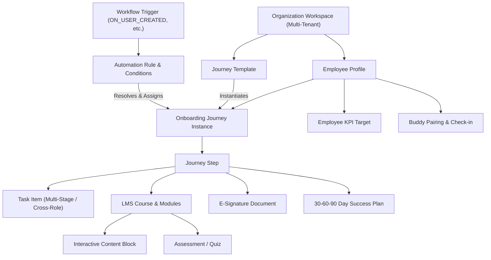

# 00 — Unified Product Model

> **Document Status:** Authoritative Product Architecture Blueprint  
> **Target System:** Talnova Onboarding Enterprise B2B SaaS Platform  
> **Product Architecture:** Unified V1 Foundation + V2 Automation & Orchestration

---

## 1. Product Purpose & Vision

### 1.1 Core Mission
**Talnova Onboarding** is an enterprise-grade multi-tenant B2B SaaS platform designed to transform corporate employee onboarding, operational enablement, digital document compliance, and frontline training into a unified, dynamic, automated experience.

The platform bridges traditional Learning Management Systems (LMS), HR Operations portals, workflow automation engines, and frontline field execution systems. It delivers context-aware onboarding journeys, cross-departmental task checklists, AI-assisted content parsing and Q&A, e-signatures, buddy matching, milestone success tracking, and real-time operational reporting.

### 1.2 The Unified Product Concept
Talnova Onboarding is **one single evolving product**. It combines foundational capabilities with intelligent automation and dynamic orchestration:

```
                                TALNOVA ONBOARDING PLATFORM
                                             │
                       ┌─────────────────────┴─────────────────────┐
                       │                                           │
             FOUNDATIONAL CAPABILITIES                  AUTOMATION & ORCHESTRATION
                       │                                           │
         - Core Onboarding & Workspace              - Trigger-Action Rule Engine
         - LMS, Courses & Quizzes                   - Dynamic Journey Assignment
         - Interactive Content & KB                 - Standalone Multi-Stage Tasks
         - KPIs & Outcome Tracking                  - Automated Meeting Scheduler
         - Handover & Sign-off                      - HRIS Marketplace Integrations
                       │                                           │
                       └─────────────────────┬─────────────────────┘
                                             │
                                             ▼
                             UNIFIED ONBOARDING EXPERIENCE
```

* **Foundational Layer:** Original core capabilities—including learning delivery, course authoring, task management, knowledge base articles, compliance documentation, and employee handovers—provide the functional substrate of the platform.
* **Orchestration Layer:** Advanced automation engines, workflow rules, dynamic assignment algorithms, calendar synchronization, and AI assistants operate directly on top of foundational capabilities to determine **when, how, and for whom** onboarding resources are delivered.

---

## 2. Core Product Actors

The platform enforces strict role-based access control (RBAC) and tenant isolation (`organizationId`) across all interactions:

| Actor / Persona | System Namespace | Primary Scope & System Privilege |
| :--- | :--- | :--- |
| **SuperAdmin** | `super_admin` | Global platform administration, multi-tenant workspace provisioning, system health oversight. |
| **Organization Owner** | `owner` | Enterprise tenant owner, billing, SSO security configuration (SAML 2.0 / OIDC), global org settings. |
| **HR Administrator** | `admin` | HR Operations manager, employee directory lifecycle, journey template authoring, milestone plan design, compliance monitoring. |
| **Department / Team Manager** | `manager` | Direct report oversight, 30-60-90 day milestone evaluations, 1-on-1 check-ins, confidence scoring, task approvals. |
| **Employee / New Hire** | `employee` | Main consumer of onboarding; executes journey steps, completes interactive content, signs digital documents, completes quizzes, logs 1-on-1s. |
| **Onboarding Buddy** | `buddy` | Senior peer matched with new hire; conducts weekly social check-ins, logs feedback, facilitates cultural integration. |
| **IT / Ops Administrator** | `it_admin` | Multi-stage task executor (hardware provisioning, credential issuance, security clearance, tool access). |
| **Frontline Kiosk Worker** | `kiosk_operator` | Unauthenticated worker utilizing public kiosk displays for safety briefs, PPE compliance, and SOP visual instruction. |
| **Automation Engine** | `system` | Background engine evaluating triggers (`ON_USER_CREATED`, `ON_STEP_COMPLETED`), assigning journeys, scheduling meetings, and syncing HRIS. |

---

## 3. Core Domain Concepts

The platform is structured around a unified set of core domain concepts:



1. **Organization Workspace:** The top-level multi-tenant boundary. All user data, journeys, courses, tasks, and configurations belong exclusively to one tenant workspace.
2. **Employee Profile:** Represents a worker within a tenant workspace, enriched with metadata (department, role, location, hire date, employment type, manager ID) used for dynamic targeting.
3. **Workflow Trigger & Rule Engine:** Evaluates business events (e.g., user creation, step completion, date milestone) against configurable conditions to dynamically assign journeys, dispatch tasks, or schedule meetings.
4. **Journey Template & Instance:** The structured roadmap of onboarding activities assigned to an employee. An instance tracks an individual employee's progression through ordered or gated steps.
5. **Journey Step:** A container within a journey containing tasks, LMS courses, e-signature documents, or milestone evaluations. Steps may enforce prerequisite dependencies.
6. **Task Item:** A discrete operational checklist item assigned to an employee, manager, IT admin, or HR admin, featuring relative due dates (`hire_date + 3 days`) and completion tracking.
7. **LMS Course & Content Block:** Educational modules composed of interactive content blocks (rich text, video, audio, PDF) and knowledge checks.
8. **Assessment & Quiz:** Knowledge validation tools with configurable passing scores, retry policies, and manager score visibility.
9. **Digital Document & E-Signature:** Cryptographically verifiable document templates dispatched to new hires for canvas signature capture and audit logging.
10. **30-60-90 Day Milestone Plan:** Structured check-in frameworks enabling employee self-ratings and manager evaluations at day 30, 60, and 90.
11. **Buddy Pairing:** Automated or manual matching between a new hire and an experienced peer for cultural onboarding and 1-on-1 check-ins.
12. **Public Kiosk Sub-System:** Unauthenticated, signed-URL visual display mode designed for frontline, factory, or warehouse terminal access.

---

## 4. Unified Architecture Concept

The architecture unifies core domain capabilities with real-time workflow orchestration:

```
+-----------------------------------------------------------------------------------+
|                            CLIENT PRESENTATION LAYER                              |
|   +-------------------+   +--------------------+   +--------------------------+   |
|   |  React SPA Portal |   | Mobile PWA         |   | Public Kiosk Display     |   |
|   |  (Desktop / Web)  |   | (Offline Sync)     |   | (Signed URL Kiosk Mode)  |   |
|   +-------------------+   +--------------------+   +--------------------------+   |
+-----------------------------------------------------------------------------------+
                                         │
                                   HTTPS / WSS API
                                         │
+-----------------------------------------------------------------------------------+
|                             API & SECURITY GATEWAY                                |
|   +-------------------+   +--------------------+   +--------------------------+   |
|   | Multi-Tenant Auth |   | RBAC Permissions   |   | Zod Input Validation     |   |
|   | (JWT / SAML / OIDC|   | Middleware         |   | & Pino Structured Logs   |   |
|   +-------------------+   +--------------------+   +--------------------------+   |
+-----------------------------------------------------------------------------------+
                                         │
+-----------------------------------------------------------------------------------+
|                         CORE BUSINESS DOMAINS & SERVICES                          |
|   +-------------------+   +--------------------+   +--------------------------+   |
|   | Onboarding &      |   | LMS & Course       |   | Standalone Task          |   |
|   | Journey Engine    |   | Delivery Engine    |   | Checklist Engine         |   |
|   +-------------------+   +--------------------+   +--------------------------+   |
|   +-------------------+   +--------------------+   +--------------------------+   |
|   | Workflow & Rule   |   | E-Signatures &     |   | AI RAG Assistant &       |   |
|   | Automation Engine |   | Document Compliance|   | Course Builder           |   |
|   +-------------------+   +--------------------+   +--------------------------+   |
+-----------------------------------------------------------------------------------+
                                         │
+-----------------------------------------------------------------------------------+
|                        PERSISTENCE & INTEGRATION LAYER                            |
|   +-------------------+   +--------------------+   +--------------------------+   |
|   | Relational DB     |   | Vector Database    |   | External HRIS & Calendar |   |
|   | (Tenant Isolation)|   | (RAG Embeddings)   |   | Connectors & Webhooks    |   |
|   +-------------------+   +--------------------+   +--------------------------+   |
+-----------------------------------------------------------------------------------+
```

The system ensures that foundational domain capabilities (LMS, Tasks, Documents) remain decoupled and reusable, while the Workflow Automation Engine orchestrates their delivery dynamically across the employee onboarding lifecycle.
