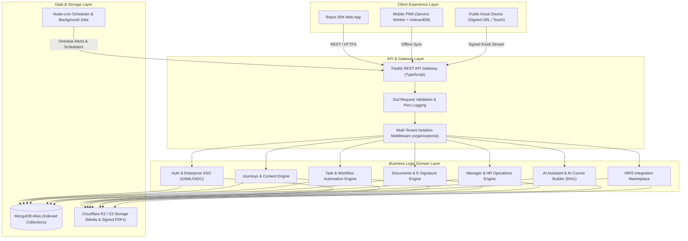

# 01 — Product Blueprint

> **Document Version:** Consolidated Baseline (v1.0.0 + v2.0.0)  
> **Status:** Authoritative Product Architecture Blueprint  
> **Module Namespace:** System Core

---

## 1. Executive Summary & Product Vision

### 1.1 Purpose & Mission
**Talnova Onboarding** is an enterprise-grade, multi-tenant B2B SaaS platform designed to transform corporate onboarding, employee enablement, digital document compliance, and frontline operational training. 

The platform bridges the gap between traditional Learning Management Systems (LMS), HR Operations portals, and frontline field execution engines by delivering structured, role-contextualized learning journeys, automated cross-departmental tasks, AI-assisted content authoring, and real-time operational telemetry.

```text
+------------------------------------------------------------------------------------+
|                                TALNOVA ONBOARDING                                  |
|                                                                                    |
|  +--------------------+  +--------------------+  +------------------------------+  |
|  | HR & MANAGER OPS   |  | AUTOMATION & AI    |  | FRONTLINE & FIELD ACCESS     |  |
|  | - 30-60-90 Day Plan|  | - Workflow Rules   |  | - Public Kiosk (Audio/Visual)|  |
|  | - Buddy Matching   |  | - AI RAG Assistant |  | - PWA Offline IndexedDB      |  |
|  | - E-Signature Docs |  | - AI Course Creator|  | - Interactive Office Map     |  |
|  | - Calendar Sync    |  | - HRIS Marketplace |  | - Gamification & Streaks     |  |
|  +--------------------+  +--------------------+  +------------------------------+  |
+------------------------------------------------------------------------------------+
```

### 1.2 Product Vision
Build the simplest, fastest, and most intelligent employee onboarding platform for modern enterprise organizations. Talnova balances consumer-grade user experience for new hires with rigorous enterprise security, multi-tenant isolation, and automated administrative governance for HR operations.

### 1.3 Core Product Objectives
* **Accelerate Time-to-Productivity:** Reduce standard new-hire ramp time through structured 30-60-90 day milestones and automated task execution.
* **Eliminate Administrative Overhead:** Automate recurring HR tasks, buddy pairings, document signing, and calendar scheduling via event-driven workflow rules.
* **Standardize Operational Compliance:** Guarantee 100% auditable completion of mandatory legal documents, safety SOPs, and compliance training.
* **Empower Frontline & Hybrid Workers:** Deliver unauthenticated, audio-first visual kiosks for factory/warehouse terminals and offline PWA access for field staff.
* **Intelligent Knowledge Delivery:** Provide an AI-powered RAG assistant for instant policy Q&A and an AI Course Builder for rapid document-to-curriculum parsing.

---

## 2. Target Users & Persona Summary

| Persona / Role | System Namespace | Key Scope & Responsibilities |
| :--- | :--- | :--- |
| **SuperAdmin** | `super_admin` | Multi-tenant platform management, global tenant creation, subscription status, system audit log oversight. |
| **Organization Owner** | `owner` | Organization workspace owner, enterprise settings, SAML/OIDC SSO, branding, top-level administrative authority. |
| **HR Administrator** | `admin` | HR Operations dashboard, employee lifecycle management, document template authoring, milestone plan templates, analytics. |
| **Department / Team Manager** | `manager` | Direct report progress tracking, milestone evaluation, quiz score visibility, 1-on-1 check-ins, confidence scoring. |
| **Employee / New Hire** | `employee` | Consumes onboarding journeys, completes interactive content blocks, signs digital documents, logs 1-on-1s, earns XP badges. |
| **Onboarding Buddy** | `buddy` | Senior peer matched with new hire; conducts weekly check-ins, logs meeting feedback, guides cultural integration. |
| **IT Administrator** | `it_admin` | Cross-person task execution (laptop provisioning, account creation, hardware setup, security access). |
| **Frontline Kiosk Operator** | `kiosk_operator` | Unauthenticated worker utilizing public kiosk displays for safety briefs, PPE warnings, and SOP visual instruction. |

---

## 3. Product Scope & Non-Goals

### 3.1 In-Scope Functional Domains
1. **Multi-Tenant Workspace & Identity:** Strict `organizationId` data isolation, local JWT auth, SAML 2.0 / OIDC SSO, user directory.
2. **Visual Journey & Curriculum Builder:** Role/department targeting, interactive content blocks (video, audio, PDF, quiz, rich text), prerequisite gating, adaptive versioned branching.
3. **Standalone Task Engine:** Multi-stage checklists, cross-person assignment (IT, HR, Manager, Employee), relative due-date scheduling, overdue notifications.
4. **Workflow Automation Engine:** Trigger-action rule engine (`ON_USER_CREATED`, `ON_JOURNEY_COMPLETED`), automated assignments, meeting creation, provisioning simulation.
5. **Manager Operations Suite:** Direct report analytics, quiz score drilldown, time-to-productivity metrics, confidence scoring, manager check-in workflows.
6. **Digital Documents & E-Signatures:** Canvas signature capture, role-targeted template dispatch, cryptographic audit trails, signed PDF storage.
7. **30-60-90 Day Success Plans:** Structured milestone templates, employee self check-ins, manager ratings, formal sign-off transitions.
8. **Buddy Program Engine:** Smart buddy profile matching (skills, department, language), check-in agendas, 1-on-1 meeting logging.
9. **Calendar & Meeting Integration:** Personal iCal feeds, OAuth sync (Google Workspace, MS Outlook), automated onboarding meeting scheduler.
10. **HR Operations & HRIS Marketplace:** HR central dashboard, exception queues, connectors (BambooHR, Workday, Gusto, ADP), webhook receiver, DLQ retry queue.
11. **AI Onboarding Assistant & AI Builder:** RAG vector search over Knowledge Base articles, action suggestions, PDF/DOCX document parsing to curriculum.
12. **Gamification & Engagement:** XP points engine, level progression, achievement badges, organization leaderboards, daily learning streaks.
13. **Mobile PWA & Field Access:** Web App Manifest, Service Worker offline caching, IndexedDB offline task queue & background sync.
14. **Office Map & Location Experience:** Interactive floorplan visualizer, room/asset pins, desk search, pathfinding wayfinding.
15. **Public Kiosk Sub-System:** Signed unauthenticated URLs (`sig`, timestamp, IP whitelist), 6-digit device pairing codes, audio-first visual player, 64px touch targets.

### 3.2 Out-of-Scope Non-Goals
* **Public Course Marketplace:** Talnova does **not** host public course listings or sell third-party content.
* **Consumer Learning Accounts:** No B2C individual user registration without an organizational tenant workspace.
* **Public Instructor Profiles & Reviews:** No public rating or instructor review mechanisms.
* **Public Search Engine Indexing:** All workspace content is protected behind authentication or signed tenant URLs.

---

## 4. Conceptual Architecture & Major Domains



---

## 5. Version Consolidation Summary (v1.0.0 + v2.0.0)

```text
===================================================================================
TALNOVA CONSOLIDATION METRICS SUMMARY
===================================================================================
* Baseline v1.0.0 Requirements: 25 Core Capabilities & System Specifications
* Extended v2.0.0 Requirements: 19 Execution Phases (96 Atomic Requirements)
* Consolidated Requirements Catalog: 96 Atomic Functional Requirements (100% Mapped)
* Requirement Status Breakdown:
  - BASELINE   : 22 Requirements (Core Auth, Workspace, Knowledge Base, Journeys)
  - EXTENDED   : 28 Requirements (Adaptive Journeys, Reminders, Analytics, Gamification)
  - MODIFIED   : 14 Requirements (Cross-Person Tasks, Digital E-Signatures)
  - NEW        : 32 Requirements (AI Assistant, AI Builder, Milestones, Buddy, SSO, HRIS, PWA, Map)
* Reconciled Version Conflicts: 5 Formal Conflict Entries (All Resolved with Context)
===================================================================================
```

---

## 6. Key Non-Functional Requirements Summary

* **Performance & Latency:** Slide transitions < 100ms; REST API response time < 200ms (P95); static asset payload compression < 1.5MB.
* **Security & Multi-Tenancy:** Multi-tenant workspace data isolation enforced at service layer via `organizationId`; Argon2 password hashing; SAML 2.0 / OIDC support; cryptographic HMAC SHA-256 signatures for public kiosk links and e-document audit logs.
* **Accessibility:** Kiosk interface WCAG 2.1 AA/AAA compliant with minimum 64px x 64px touch targets for glove-friendly operation and 7:1 contrast ratio.
* **Reliability & Offline Support:** PWA Service Worker caching and IndexedDB offline queue guarantee field staff task sign-off capability during network disconnects.
