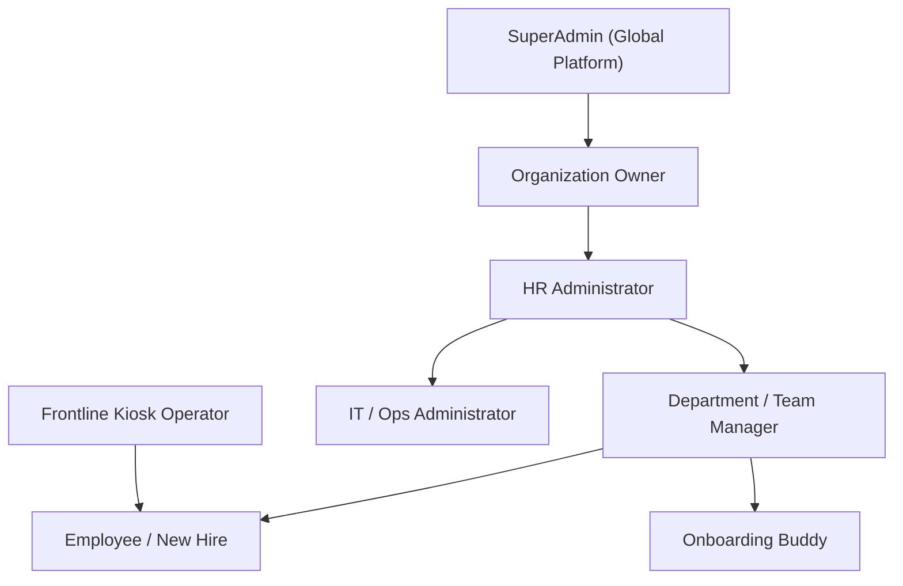

# 02 — Actors, Personas & Role Model

> **Document Status:** Authoritative System Specification  
> **Target System:** Talnova Onboarding Enterprise B2B SaaS Platform  
> **Security Baseline:** Enterprise RBAC & Multi-Tenant Isolation Boundaries

---

## 1. System Personas & User Profiles

The platform supports 8 system roles operating within multi-tenant workspace boundaries:

### 1.1 SuperAdmin (`super_admin`)
* **Scope:** Cross-tenant system administration.
* **Responsibilities:** Provisions organization tenants, manages global subscription tiers, monitors platform health, and reviews system security audit logs.
* **Access Level:** Global system root access (bypasses tenant boundaries for platform management endpoints).

### 1.2 Organization Owner (`owner`)
* **Scope:** Single organization tenant workspace.
* **Responsibilities:** Highest organizational authority. Manages enterprise SSO integration (SAML 2.0 / OIDC), workspace branding, custom domains, HRIS marketplace connectors, and billing settings.
* **Access Level:** Full administrative control over all organization data and user accounts within their `organizationId`.

### 1.3 HR Administrator (`admin`)
* **Scope:** Organization-wide HR operations.
* **Responsibilities:** Manages employee directory onboarding lifecycle, authors journey templates, builds LMS courses, designs digital document templates, configures workflow automation rules, pairs buddies, and monitors company-wide onboarding analytics.
* **Access Level:** Administrative access to all HR, journey, task, course, document, and user management features within their `organizationId`.

### 1.4 Department / Team Manager (`manager`)
* **Scope:** Assigned team members and direct reports.
* **Responsibilities:** Tracks direct report journey progress, conducts 30-60-90 day milestone check-ins, evaluates quiz scores and self-confidence ratings, approves completed manager tasks, and conducts 1-on-1 check-in meetings.
* **Access Level:** Scoped visibility over direct reports (`managerId == current_user.id`) and assigned department teams.

### 1.5 Employee / New Hire (`employee`)
* **Scope:** Individual onboarding journey and workspace resources.
* **Responsibilities:** Consumes assigned onboarding journeys, views interactive content blocks, completes LMS courses and quizzes, fills signature document templates, executes employee checklist tasks, logs 1-on-1 meetings, and reviews milestone goals.
* **Access Level:** Scoped read/write access strictly over self-assigned journeys, tasks, and personal profile data.

### 1.6 Onboarding Buddy (`buddy`)
* **Scope:** Assigned new hire peer pairing.
* **Responsibilities:** Welcomes new hire, conducts informal weekly check-ins, guides cultural integration, executes buddy-specific task items, and logs meeting feedback.
* **Access Level:** Scoped read access to assigned buddy's basic profile, onboarding progress, and shared buddy check-in logs.

### 1.7 IT / Ops Administrator (`it_admin`)
* **Scope:** Operational provisioning tasks.
* **Responsibilities:** Receives automatically generated operational tasks (laptop provisioning, email account setup, security badge issuance, tool provisioning), marks task stages as completed, and attaches verification files.
* **Access Level:** Scoped administrative access over IT and operational task queues within their `organizationId`.

### 1.8 Frontline Kiosk Operator (`kiosk_operator`)
* **Scope:** Public kiosk device terminals.
* **Responsibilities:** Manages kiosk device pairing, launches touch-first unauthenticated visual player mode for safety briefs, PPE compliance, and SOP instructional playback.
* **Access Level:** Unauthenticated signed URL or 6-digit device code access scoped strictly to assigned kiosk content.

---

## 2. Role-Based Access Control (RBAC) Authority Matrix

The system enforces permission checks on all API endpoints and UI components. The matrix below defines capability permissions across roles:

| Domain Capability | SuperAdmin | Owner | Admin | Manager | Employee | Buddy | IT Admin | Kiosk |
| :--- | :---: | :---: | :---: | :---: | :---: | :---: | :---: | :---: |
| **Manage Tenant & SSO** | `WRITE` | `WRITE` | `NONE` | `NONE` | `NONE` | `NONE` | `NONE` | `NONE` |
| **Manage HRIS Integrations**| `WRITE` | `WRITE` | `WRITE` | `NONE` | `NONE` | `NONE` | `NONE` | `NONE` |
| **Author Journey Templates** | `READ` | `WRITE` | `WRITE` | `READ` | `NONE` | `NONE` | `NONE` | `NONE` |
| **Configure Workflow Rules** | `READ` | `WRITE` | `WRITE` | `NONE` | `NONE` | `NONE` | `NONE` | `NONE` |
| **Manage Employee Directory**| `READ` | `WRITE` | `WRITE` | `READ` | `NONE` | `NONE` | `NONE` | `NONE` |
| **Execute Personal Journey** | `NONE` | `READ` | `READ` | `READ` | `WRITE` | `NONE` | `NONE` | `NONE` |
| **Complete Direct Report Task**| `NONE` | `WRITE` | `WRITE` | `WRITE` | `NONE` | `NONE` | `NONE` | `NONE` |
| **Complete IT / Ops Task** | `NONE` | `WRITE` | `WRITE` | `NONE` | `NONE` | `NONE` | `WRITE` | `NONE` |
| **Log Buddy Check-in** | `NONE` | `READ` | `WRITE` | `READ` | `NONE` | `WRITE` | `NONE` | `NONE` |
| **Evaluate 30-60-90 Milestones**| `NONE` | `WRITE` | `WRITE` | `WRITE` | `READ` | `NONE` | `NONE` | `NONE` |
| **Sign Digital Documents** | `NONE` | `WRITE` | `WRITE` | `WRITE` | `WRITE` | `NONE` | `NONE` | `NONE` |
| **View Company Analytics** | `READ` | `WRITE` | `WRITE` | `SCOPED` | `NONE` | `NONE` | `NONE` | `NONE` |
| **Play Public Kiosk SOPs** | `NONE` | `NONE` | `NONE` | `NONE` | `NONE` | `NONE` | `NONE` | `READ` |

---

## 3. Multi-Tenant Isolation Boundaries

1. **Database Isolation Layer:** Every domain table (except global system tables) shall contain an `organizationId` foreign key column.
2. **Query Scoping Enforcement:** All server-side data access services shall automatically inject `WHERE organizationId = context.user.organizationId` into database queries. Frontend filtering shall never be used as a security boundary.
3. **Cross-Tenant Access Rejection:** Any API request targeting a resource belonging to a different `organizationId` than the authenticated session shall immediately return a `403 Forbidden` error and record a security audit log.
4. **Token Security:** Authentication tokens (JWT) shall encode `userId`, `organizationId`, and `role`. Signature verification shall fail if tenant metadata is tampered with.
