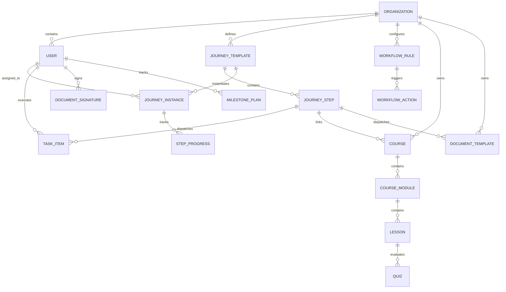
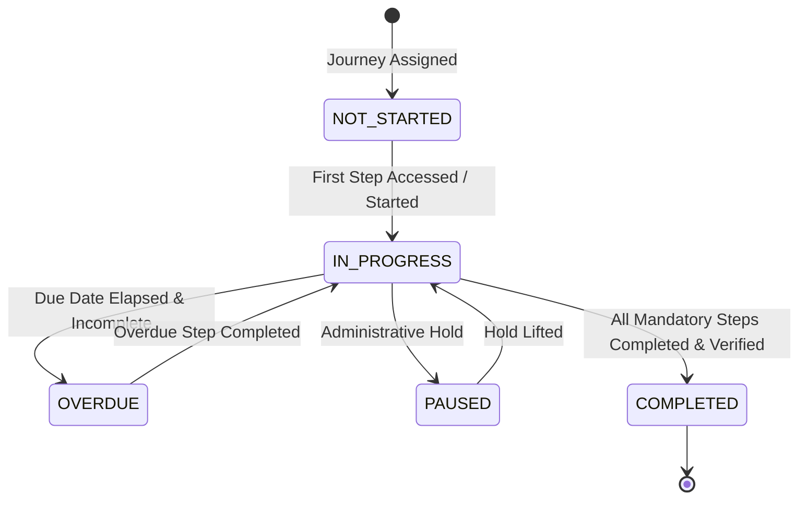
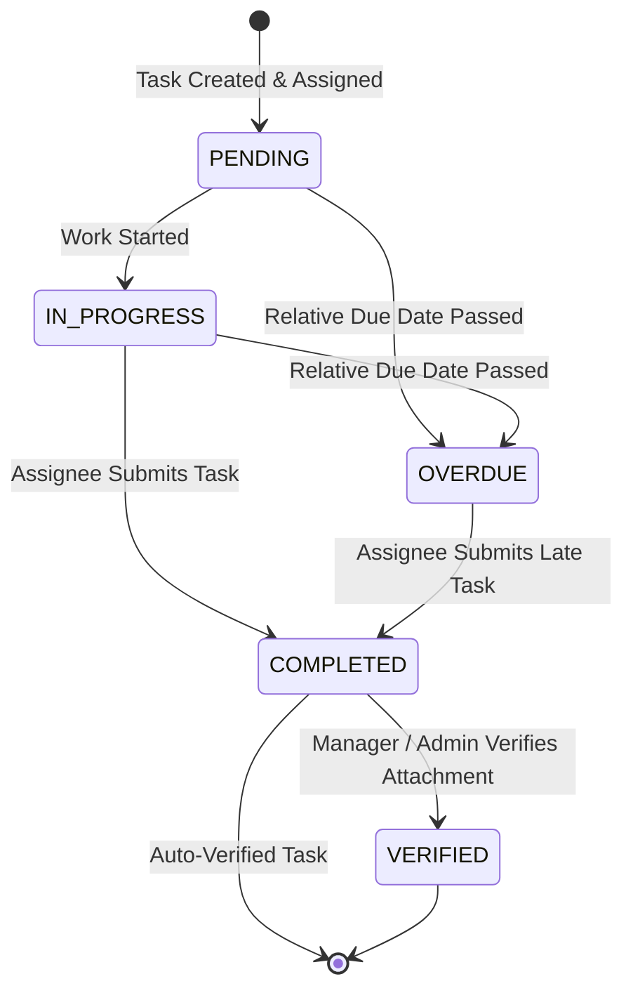
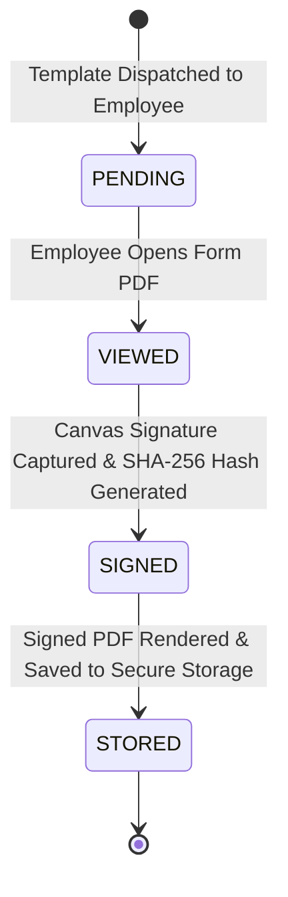

# 03 — Domain & Data Model

> **Document Status:** Authoritative System Specification  
> **Target System:** Talnova Onboarding Enterprise B2B SaaS Platform  
> **Data Model Scope:** Entities, Relationships, ERD & State Machine Models

---

## 1. Domain Entity Architecture

The platform domain is structured into 6 primary entity clusters:

---

## 2. Core Entity Definitions

### 2.1 Identity & Tenant Cluster
* **`Organization`**: Tenant workspace entity. Key fields: `id`, `name`, `slug`, `domain`, `ssoConfig`, `createdAt`, `updatedAt`.
* **`User`**: System account entity. Key fields: `id`, `organizationId`, `email`, `fullName`, `role` (`owner`, `admin`, `manager`, `employee`, `buddy`, `it_admin`), `department`, `location`, `hireDate`, `managerId`, `status` (`INVITED`, `ACTIVE`, `ONBOARDING`, `ARCHIVED`).

### 2.2 Journey & Step Cluster
* **`JourneyTemplate`**: Reusable onboarding roadmap blueprint. Key fields: `id`, `organizationId`, `title`, `description`, `targetDepartment`, `targetRole`, `targetLocation`, `isDefault`, `version`.
* **`JourneyStep`**: Sequential or gated stage within a journey template. Key fields: `id`, `journeyTemplateId`, `title`, `stepType` (`TASK`, `COURSE`, `DOCUMENT`, `MILESTONE`, `CHECK_IN`), `orderIndex`, `prerequisiteStepId`, `relativeDueDays`.
* **`JourneyInstance`**: Active onboarding journey assigned to a specific employee. Key fields: `id`, `organizationId`, `journeyTemplateId`, `userId`, `status` (`NOT_STARTED`, `IN_PROGRESS`, `COMPLETED`, `OVERDUE`, `PAUSED`), `startDate`, `completedAt`.
* **`StepProgress`**: Completion state of a specific step for a user. Key fields: `id`, `journeyInstanceId`, `journeyStepId`, `status` (`LOCKED`, `AVAILABLE`, `IN_PROGRESS`, `COMPLETED`), `completedAt`, `verifiedBy`.

### 2.3 Standalone Task Engine Cluster
* **`TaskItem`**: Multi-stage checklist item. Key fields: `id`, `organizationId`, `journeyInstanceId`, `title`, `description`, `assigneeRole` (`EMPLOYEE`, `MANAGER`, `IT_ADMIN`, `HR_ADMIN`, `BUDDY`), `assigneeUserId`, `dueDate`, `status` (`PENDING`, `IN_PROGRESS`, `COMPLETED`, `VERIFIED`, `OVERDUE`), `attachmentUrl`.

### 2.4 LMS & Content Cluster
* **`Course`**: Educational course unit. Key fields: `id`, `organizationId`, `title`, `description`, `estimatedMinutes`, `isPublished`.
* **`CourseModule`**: Ordered section within a course. Key fields: `id`, `courseId`, `title`, `orderIndex`.
* **`Lesson`**: Instructional unit containing content blocks. Key fields: `id`, `courseModuleId`, `title`, `contentType` (`TEXT`, `VIDEO`, `AUDIO`, `PDF`, `QUIZ`), `contentData`, `orderIndex`.
* **`Quiz`**: Assessment associated with a lesson or step. Key fields: `id`, `lessonId`, `title`, `passingScorePercent`, `maxAttempts`, `questionsJson`.

### 2.5 Workflow Automation Cluster
* **`WorkflowRule`**: Automated trigger-action rule. Key fields: `id`, `organizationId`, `name`, `triggerType` (`ON_USER_CREATED`, `ON_JOURNEY_ASSIGNED`, `ON_STEP_COMPLETED`, `ON_DATE_MILESTONE`), `conditionsJson`, `isActive`.
* **`WorkflowAction`**: Executable action triggered by a rule. Key fields: `id`, `workflowRuleId`, `actionType` (`ASSIGN_JOURNEY`, `CREATE_TASK`, `SCHEDULE_MEETING`, `SEND_NOTIFICATION`, `TRIGGER_WEBHOOK`), `actionPayloadJson`.

### 2.6 Compliance, Milestones & Buddy Cluster
* **`DocumentTemplate`**: PDF form template for e-signatures. Key fields: `id`, `organizationId`, `title`, `pdfUrl`, `formFieldsJson`.
* **`DocumentSignature`**: Signed document instance. Key fields: `id`, `organizationId`, `documentTemplateId`, `userId`, `signatureData`, `signedPdfUrl`, `signedAt`, `ipAddress`, `sha256Hash`.
* **`MilestonePlan`**: 30-60-90 day milestone evaluation plan. Key fields: `id`, `organizationId`, `userId`, `period` (`DAY_30`, `DAY_60`, `DAY_90`), `employeeRating`, `managerRating`, `managerNotes`, `status` (`PENDING`, `SUBMITTED`, `APPROVED`).
* **`BuddyPairing`**: Match between a new hire and an onboarding buddy. Key fields: `id`, `organizationId`, `employeeUserId`, `buddyUserId`, `startDate`, `status` (`ACTIVE`, `COMPLETED`).

---

## 3. Core State Machine Models

### 3.1 Onboarding Journey Instance State Machine

### 3.2 Task Item Lifecycle State Machine

### 3.3 E-Signature Document State Machine

