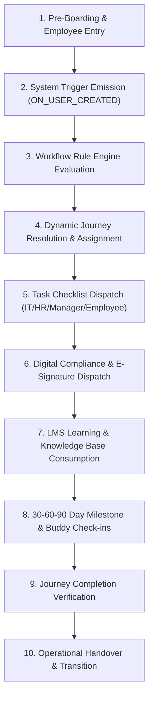

# 04 — Unified Onboarding Lifecycle

> **Document Status:** Authoritative System Specification  
> **Target System:** Talnova Onboarding Enterprise B2B SaaS Platform  
> **Lifecycle Model:** End-to-End Operational Lifecycle Combining V1 Foundation & V2 Orchestration

---

## 1. Unified Onboarding Lifecycle Overview

The **Unified Onboarding Lifecycle** defines the standard operational sequence an employee undergoes from pre-boarding entry to formal post-onboarding handover.

The lifecycle integrates foundational capabilities (LMS courses, tasks, document signing, buddy check-ins) with real-time workflow orchestration:

---

## 2. Lifecycle Stage Specifications

### Stage 1: Pre-Boarding & Employee Entry
* **Event:** HR Administrator invites a new hire or employee record is ingested via HRIS synchronization (BambooHR, Workday, Gusto, ADP).
* **State:** User status initialized to `INVITED` or `ACTIVE`. User record includes metadata: `department`, `role`, `location`, `employmentType`, `hireDate`, `managerId`.

### Stage 2: Trigger Emission
* **Event:** System emits `ON_USER_CREATED` or `ON_ONBOARDING_INITIATED` event to the internal Workflow Automation Engine.

### Stage 3: Workflow Rule Engine Evaluation
* **Event:** Automation engine queries active `WorkflowRule` records matching `ON_USER_CREATED`.
* **Logic:** Evaluates rule conditions against employee profile attributes (e.g. `department == 'Sales' AND location == 'Chicago'`).

### Stage 4: Dynamic Journey Resolution & Assignment
* **Event:** Resolved `JourneyTemplate` is instantiated as an active `JourneyInstance` linked to the employee.
* **State:** `JourneyInstance.status` transitions from `NOT_STARTED` to `IN_PROGRESS`.

### Stage 5: Task Checklist Dispatch
* **Event:** Journey steps and automated rule actions dispatch initial operational tasks with relative due dates (`hire_date - 7 days`, `hire_date + 1 day`).
* **Distribution:**
  * **IT Admin Tasks:** Laptop provisioning, credential setup, hardware shipment.
  * **HR Admin Tasks:** Benefits enrollment, security clearance.
  * **Manager Tasks:** Welcome message preparation, 1-on-1 meeting scheduling.
  * **Employee Tasks:** Profile completion, equipment receipt confirmation.

### Stage 6: Digital Compliance & E-Signature Dispatch
* **Event:** Required compliance documents (NDAs, Employee Handbooks, Safety SOPs) are dispatched to the employee's onboarding dashboard.
* **Action:** Employee views PDF, captures canvas signature, and generates cryptographically signed PDF record.

### Stage 7: LMS Learning & Knowledge Base Consumption
* **Event:** Employee completes sequential or gated LMS courses embedded in journey steps.
* **Progression:** Video watch time thresholds are validated, quizzes are completed, and Knowledge Base articles (supported by the AI RAG assistant) are consulted.

### Stage 8: 30-60-90 Day Milestone & Buddy Check-ins
* **Event:** Time-based triggers (`ON_DATE_MILESTONE`) prompt milestone evaluations at Day 30, 60, and 90.
* **Action:** Employee fills self-confidence rating; manager completes performance evaluation; onboarding buddy logs weekly 1-on-1 check-ins.

### Stage 9: Journey Completion Verification
* **Event:** All mandatory journey steps, LMS courses, compliance documents, and IT/HR tasks achieve `COMPLETED` or `VERIFIED` status.
* **System Action:** System emits `ON_JOURNEY_COMPLETED` trigger event.

### Stage 10: Operational Handover & Transition
* **Event:** Manager conducts formal final sign-off check-in.
* **State Transition:** `JourneyInstance.status` transitions to `COMPLETED`; user status transitions from `ONBOARDING` to `ACTIVE` full-fledged team member.

---

## 3. Unresolved Ordering & Execution Scenarios

> [!WARNING]
> **UNRESOLVED LIFECYCLE DECISIONS**  
> The following execution order scenarios are currently underspecified in requirements and require formal product clarification:

1. **`[UNRESOLVED]` Automated Pre-boarding Kiosk Access:**  
   * *Question:* Should unauthenticated frontline kiosk mode allow workers to sign legal compliance documents before their official `hireDate`, or must SSO authentication occur first?  
   * *Impact:* Frontline factory workers without corporate email accounts.

2. **`[UNRESOLVED]` Failed Quiz Retry Lockout Policy:**  
   * *Question:* When an employee fails an LMS quiz max retry threshold (e.g. 3 failed attempts), does the workflow engine pause the entire onboarding journey (`PAUSED`), or does it allow non-dependent task steps to proceed while notifying the manager?  
   * *Impact:* Journey step prerequisite gating logic.

3. **`[UNRESOLVED]` HRIS Termination Event Handling:**  
   * *Question:* When an HRIS sync emits an `EMPLOYEE_TERMINATED` event mid-onboarding, should incomplete e-signature document tasks be revoked immediately or archived in pending state for legal audit retention?  
   * *Impact:* Document signature audit compliance.
