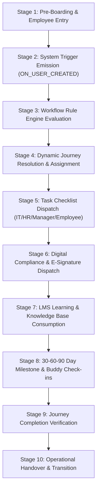

# 04 — Unified Onboarding Lifecycle

> **Document Status:** Authoritative System Specification  
> **Target System:** Talnova Onboarding Enterprise B2B SaaS Platform  
> **Lifecycle Model:** End-to-End Operational Lifecycle Combining V1 Foundation & V2 Orchestration

---

## 1. Unified Onboarding Lifecycle Architecture

The **Unified Onboarding Lifecycle** defines the standard operational sequence an employee undergoes from pre-boarding entry to formal post-onboarding handover.

The lifecycle integrates foundational capabilities (LMS courses, tasks, document signing, buddy check-ins) with real-time workflow orchestration:

---

## 2. Comprehensive Stage Transition Contracts

### Stage 1: Pre-Boarding & Employee Entry
* **Trigger:** HR Administrator creates employee record via HR Portal, CSV import, or HRIS synchronization (BambooHR, Workday, Gusto, ADP).
* **Actor:** HR Administrator or System Integration.
* **Preconditions:** Valid tenant workspace (`organizationId`) exists; required metadata provided (`email`, `fullName`, `role`, `department`, `location`, `employmentType`, `hireDate`).
* **Action:** System validates fields and creates `User` record.
* **System Behavior:** Instantiates `User` record with `status: INVITED` or `status: ONBOARDING`.
* **Result:** User record created and saved in workspace database.
* **Downstream Effects:** Emits `ON_USER_CREATED` domain trigger event.
* **Exceptions:** If email already exists in tenant, return `409 Conflict`.

### Stage 2: System Trigger Emission
* **Trigger:** System detects `User` record creation.
* **Actor:** System / Event Bus.
* **Preconditions:** `User` record saved successfully.
* **Action:** Event bus dispatches `ON_USER_CREATED` payload to Workflow Automation Engine.
* **System Behavior:** Places event payload on internal asynchronous event queue.
* **Result:** Event queued for rule evaluation.
* **Downstream Effects:** Initiates Stage 3 rule matching.
* **Exceptions:** Queue service failure dispatches alert to system log.

### Stage 3: Workflow Rule Engine Evaluation
* **Trigger:** Receipt of `ON_USER_CREATED` event payload.
* **Actor:** Workflow Automation Engine.
* **Preconditions:** Active `WorkflowRule` records exist for tenant workspace.
* **Action:** Engine evaluates rule conditions against target user's metadata using boolean AND/OR logic.
* **System Behavior:** Ranks matching rules by `priorityIndex`.
* **Result:** Selects highest-priority matching rule or resolves fallback default.
* **Downstream Effects:** Triggers Stage 4 journey resolution.
* **Exceptions:** If no rule matches, fall back to default workspace template (`isDefault == true`).

### Stage 4: Dynamic Journey Resolution & Assignment
* **Trigger:** Resolution of matching rule or default fallback.
* **Actor:** Journey Engine.
* **Preconditions:** Resolved `JourneyTemplate` exists and is published (`version`).
* **Action:** Instantiates `JourneyInstance` linked to employee `userId`.
* **System Behavior:** Copies template step structure to instance; initializes `StepProgress` records (`status: NOT_STARTED` or `LOCKED`).
* **Result:** `JourneyInstance` created (`status: IN_PROGRESS`).
* **Downstream Effects:** Emits `ON_JOURNEY_ASSIGNED` event and unlocks initial available steps.
* **Exceptions:** Missing journey template raises admin alert and pauses journey assignment.

### Stage 5: Task Checklist Dispatch
* **Trigger:** `ON_JOURNEY_ASSIGNED` event or step availability transition.
* **Actor:** Standalone Task Engine.
* **Preconditions:** Journey steps contain embedded task items.
* **Action:** System creates `TaskItem` records routed to target `assigneeRole` (`IT_ADMIN`, `HR_ADMIN`, `MANAGER`, `EMPLOYEE`, `BUDDY`).
* **System Behavior:** Calculates relative due dates (`hire_date - 7 days`, `hire_date + 1 day`).
* **Result:** Tasks appear in respective persona portal queues.
* **Downstream Effects:** Sends notification dispatches to assignees.
* **Exceptions:** Unassigned manager defaults task routing to HR Admin queue.

### Stage 6: Digital Compliance & E-Signature Dispatch
* **Trigger:** Initial journey step entry or onboarding milestone trigger.
* **Actor:** Employee (`employee`).
* **Preconditions:** Required compliance document templates exist.
* **Action:** Employee opens PDF form, reviews text, and captures canvas signature.
* **System Behavior:** Generates cryptographically signed PDF; records timestamp, IP address, user ID, and SHA-256 hash checksum.
* **Result:** `DocumentSignature` created (`status: SIGNED`); signed PDF saved to read-only object storage.
* **Downstream Effects:** Step progress updated to `COMPLETED`.
* **Exceptions:** Invalid signature canvas vectors prompt retry.

### Stage 7: LMS Learning & Knowledge Base Consumption
* **Trigger:** Employee selects available LMS course step.
* **Actor:** Employee (`employee`).
* **Preconditions:** Step prerequisites satisfied (`prerequisiteStepId == COMPLETED`).
* **Action:** Employee streams video content blocks, reviews rich text lessons, and completes quizzes.
* **System Behavior:** Validates video view duration (>= 90%) and evaluates quiz attempt score against `passingScorePercent`.
* **Result:** Lesson and quiz progress saved (`status: COMPLETED`).
* **Downstream Effects:** Unlocks downstream dependent steps.
* **Exceptions:** Exceeding quiz `maxAttempts` locks step and notifies manager (`UQ-02`).

### Stage 8: 30-60-90 Day Milestone & Buddy Check-ins
* **Trigger:** Time-based scheduler trigger (`ON_DATE_MILESTONE`) at Day 30, Day 60, Day 90.
* **Actor:** Employee, Manager, and Onboarding Buddy.
* **Preconditions:** Employee active in workspace post-hire date.
* **Action:** Employee submits self-confidence rating; buddy logs 1-on-1 check-in; manager submits performance rating.
* **System Behavior:** Validates dual rating inputs and updates milestone plan.
* **Result:** `MilestonePlan` updated to `APPROVED`.
* **Downstream Effects:** Milestone goal unlocked in roadmap.
* **Exceptions:** Missing manager sign-off flags milestone as overdue.

### Stage 9: Journey Completion Verification
* **Trigger:** Final journey step item completed.
* **Actor:** System / Verification Service.
* **Preconditions:** All mandatory steps, tasks, LMS courses, and compliance documents achieved `COMPLETED` or `VERIFIED` status.
* **Action:** System evaluates journey completion rules.
* **System Behavior:** Transitions `JourneyInstance.status` from `IN_PROGRESS` to `COMPLETED`.
* **Result:** Emits `ON_JOURNEY_COMPLETED` domain trigger event.
* **Downstream Effects:** Triggers Stage 10 operational handover.
* **Exceptions:** Unfinished mandatory tasks block completion.

### Stage 10: Operational Handover & Status Transition
* **Trigger:** Receipt of `ON_JOURNEY_COMPLETED` event.
* **Actor:** Team Manager & System.
* **Preconditions:** Journey instance `status == COMPLETED`.
* **Action:** Manager conducts final 1-on-1 sign-off check-in.
* **System Behavior:** Generates PDF Completion Certificate; transitions user profile `status` from `ONBOARDING` to `ACTIVE`.
* **Result:** Employee fully integrated into active team status.
* **Downstream Effects:** Dispatches completion certificate to HR archive and manager.
* **Exceptions:** None.

---

## 3. Inventory of Unresolved Lifecycle Scenarios

> [!WARNING]
> **UNRESOLVED LIFECYCLE DECISIONS**  
> The following execution order scenarios are currently underspecified in requirements and require formal product clarification:

1. **`[UNRESOLVED]` Automated Pre-boarding Kiosk Access (UQ-01):** Should unauthenticated frontline kiosk mode allow workers to sign legal compliance documents before their official `hireDate`, or must SSO authentication occur first?
2. **`[UNRESOLVED]` Failed Quiz Retry Lockout Policy (UQ-02):** When an employee fails an LMS quiz max retry threshold (3 attempts), does the workflow engine pause the entire onboarding journey (`PAUSED`), or does it allow non-dependent task steps to proceed while notifying the manager?
3. **`[UNRESOLVED]` HRIS Termination Event Handling (UQ-03):** When an HRIS sync emits an `EMPLOYEE_TERMINATED` event mid-onboarding, should incomplete e-signature document tasks be revoked immediately or archived in pending state for legal audit retention?
