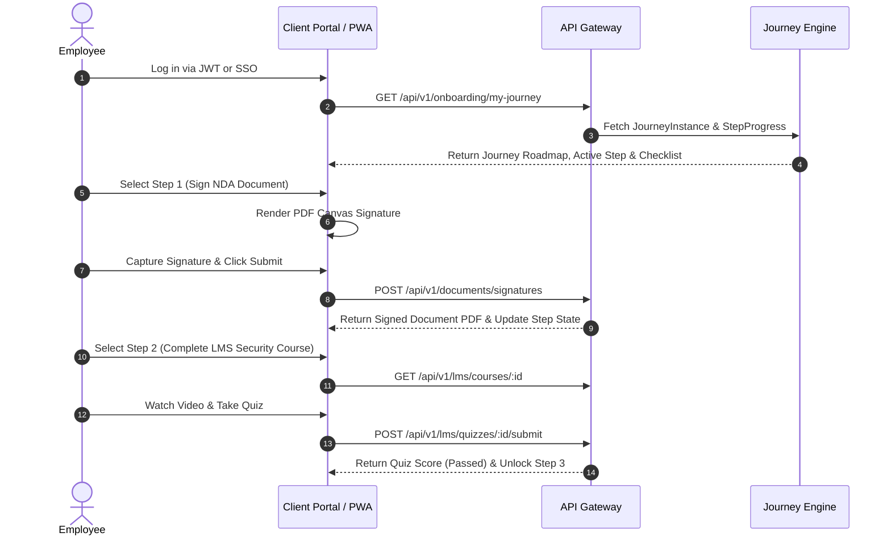

# 05 — User Journeys & Workflows

> **Document Status:** Authoritative System Specification  
> **Target System:** Talnova Onboarding Enterprise B2B SaaS Platform  
> **Journey Focus:** End-to-End Operational Flows Across Key System Personas

---

## 1. Persona Journey Overview

User journeys detail how each persona interacts with the platform during the onboarding lifecycle:

```
+------------------------------------------------------------------------------------+
|                                OPERATIONAL JOURNEYS                                |
|                                                                                    |
|  UJ-01: New Hire Onboarding Journey         UJ-04: IT Admin Provisioning Workflow |
|  UJ-02: HR Admin Template & Rule Setup     UJ-05: Buddy Cultural Check-in Flow   |
|  UJ-03: Manager 30-60-90 Evaluation Flow    UJ-06: Kiosk Operator Safety Brief      |
+------------------------------------------------------------------------------------+
```

---

## 2. Detailed User Journey Specifications

### UJ-01: New Hire Employee Onboarding Flow

* **Primary Persona:** Employee / New Hire (`employee`)
* **Preconditions:** Employee account created and onboarding journey assigned.



* **Postconditions:** Step progress updated to `COMPLETED`; prerequisite locks for downstream steps removed.

---

### UJ-02: HR Administrator Template & Automation Setup Flow

* **Primary Persona:** HR Administrator (`admin`)
* **Preconditions:** Authenticated as HR Admin with template management privileges.

1. **Journey Template Authoring:** Admin accesses Journey Builder UI, creates a template (e.g. "Engineering Onboarding v2"), and defines steps (Task, Course, Document, Milestone).
2. **Workflow Rule Configuration:** Admin navigates to Automation Rules UI, creates a rule titled "Assign Eng Journey", sets trigger to `ON_USER_CREATED`, and configures condition `department == 'Engineering'`.
3. **Action Mapping:** Admin maps rule action to `ASSIGN_JOURNEY` referencing "Engineering Onboarding v2".
4. **Publishing:** Admin saves and activates the rule. Sub-sequent new hires matching criteria automatically receive the journey.

---

### UJ-03: Manager 30-60-90 Day Milestone Evaluation Flow

* **Primary Persona:** Team Manager (`manager`)
* **Preconditions:** Direct report has submitted Day 30 self-confidence rating.

1. **Notification Received:** Manager receives in-app and email notification: "Day 30 Milestone Evaluation Due for [Employee Name]".
2. **Manager Dashboard Drilldown:** Manager navigates to Manager Operations portal, selects direct report profile, and views submitted self-rating and quiz scores.
3. **Evaluation Form Submission:** Manager enters performance ratings, comments, and developmental goals.
4. **Sign-off Execution:** Manager clicks "Approve Milestone". System updates milestone status to `APPROVED` and unlocks Day 60 roadmap goals.

---

### UJ-04: IT Administrator Operational Provisioning Flow

* **Primary Persona:** IT Administrator (`it_admin`)
* **Preconditions:** New hire journey dispatch triggered IT provisioning tasks.

1. **Queue View:** IT Admin logs into IT Task Portal and views pending task queue (e.g. "Order Laptop & Provision Access").
2. **Task Execution:** IT Admin provisions hardware and configures corporate accounts.
3. **Attachment Upload & Verification:** IT Admin uploads asset serial number receipt PDF and marks task as `COMPLETED`.
4. **State Transition:** System updates task status to `VERIFIED` and notifies the new hire that hardware is dispatched.

---

### UJ-05: Onboarding Buddy Cultural Check-in Flow

* **Primary Persona:** Onboarding Buddy (`buddy`)
* **Preconditions:** Buddy matched with new hire via `BuddyPairing`.

1. **Check-in Reminder:** Buddy receives weekly notification to conduct informal 1-on-1 check-in.
2. **Agenda Review:** Buddy views recommended agenda topics (e.g. "Week 2: Team Culture & Tools Q&A").
3. **Check-in Logging:** Following meeting, buddy accesses Buddy Portal and submits check-in notes and sentiment rating.

---

### UJ-06: Frontline Kiosk Safety Briefing Flow

* **Primary Persona:** Frontline Kiosk Worker (`kiosk_operator`)
* **Preconditions:** Kiosk terminal paired using 6-digit device code.

1. **Kiosk Launch:** Kiosk operator opens touch display rendering unauthenticated signed kiosk URL.
2. **Worker Identification:** Worker taps name or inputs badge ID.
3. **Audio/Visual Playback:** Terminal plays audio-first video safety briefing for shift SOPs.
4. **PPE Confirmation:** Worker completes 64px high-contrast touch checkbox confirming PPE compliance.
5. **Log Submission:** Kiosk sends completion event payload to backend gateway.
