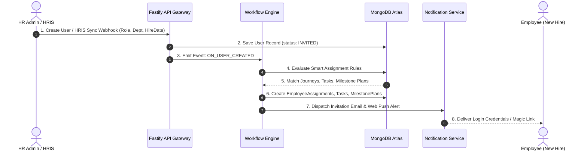
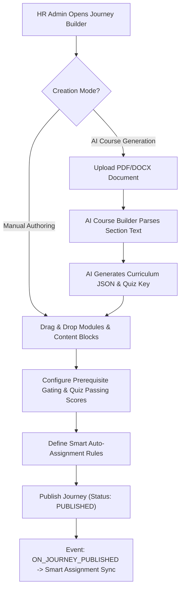
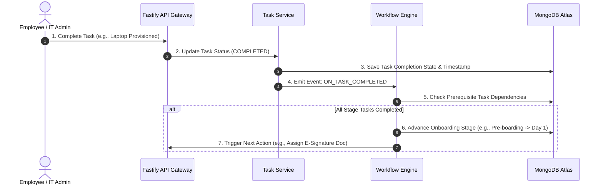
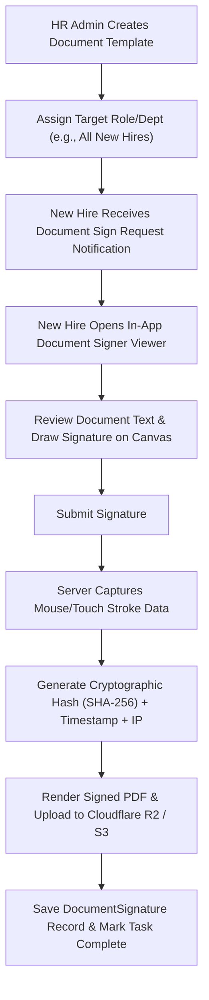

# 06 — User Journeys & Workflows

> **Document Version:** Consolidated Baseline (v1.0.0 + v2.0.0)  
> **Status:** Authoritative Operational Workflow Specification  
> **Module Namespace:** System Core

---

## 1. Overview of Canonical Workflows

This document defines the 8 end-to-end operational workflows that govern user interaction and system behavior across the Talnova Onboarding platform.

---

## 2. Detailed Operational Workflows

### 2.1 Workflow WF-001: New Hire User Provisioning & Smart Auto-Assignment

- **Workflow ID:** `WF-001`
- **Name:** New Hire Provisioning & Smart Auto-Assignment
- **Actor:** HR Admin / HRIS Connector (`BambooHR`, `Workday`), New Hire Employee
- **Trigger:** HR creates user manually in directory or HRIS sync webhook fires on `ON_USER_CREATED`.
- **Preconditions:** Active organization tenant workspace; target smart assignment rules configured.
- **Steps:**
  1. System creates user record in `users` collection with `organizationId` and `status: INVITED`.
  2. Event bus emits `ON_USER_CREATED` event payload asynchronously.
  3. `smart-assignment.service.ts` queries active journeys matching user's `role`, `department`, and `officeLocationId`.
  4. Task engine attaches standard onboarding checklist template to user.
  5. Milestone engine instantiates hire-date relative 30-60-90 day milestone plan.
  6. Notification service dispatches multi-channel invitation email with secure token.
  7. Employee logs in via SAML SSO or password setup, landing on Employee Dashboard.
- **Success State:** User activated, assigned journeys/tasks initialized, invitation dispatched.
- **Failure States:** Invalid email formatting, duplicate user error, zero matching smart rules (triggers default fallback journey).

---

### 2.2 Workflow WF-002: Visual Journey Curriculum Authoring & AI Generation

- **Workflow ID:** `WF-002`
- **Name:** Journey Authoring & AI Generation
- **Actor:** HR Administrator (`admin`)
- **Trigger:** Admin initiates new journey creation in Journey Builder UI.
- **Preconditions:** Admin permissions verified (`organizationId` scoping).
- **Steps:**
  1. Admin selects manual builder or AI Document-to-Course generator.
  2. If AI mode: Admin uploads PDF/DOCX policy document. `ai-course-builder.service.ts` parses section text and returns structured curriculum JSON with quizzes.
  3. Admin edits content blocks (video streams, audio files, PDFs, rich text, quizzes).
  4. Admin sets quiz passing thresholds (e.g., 80% minimum score) and prerequisite lock rules.
  5. Admin configures smart assignment target criteria (e.g., `role: Sales`, `dept: Engineering`).
  6. Admin clicks "Publish Journey". Status updates from `DRAFT` to `PUBLISHED`.
- **Success State:** Published journey available in library and auto-assigned to matching employees.

---

### 2.3 Workflow WF-003: Standalone Task Execution & Cross-Person Handoff

- **Workflow ID:** `WF-003`
- **Name:** Standalone Task Execution & Cross-Person Handoff
- **Actor:** IT Administrator (`it_admin`), Manager (`manager`), Employee (`employee`)
- **Trigger:** Assigned actor toggles task status to `COMPLETED`.
- **Preconditions:** Task exists in `onboardingtasks` collection; executing user matches `responsiblePersonId` or `assignedRole`.
- **Steps:**
  1. IT Admin views pending hardware setup tasks in IT task queue.
  2. IT Admin checks "Ship Laptop & Issue Security Token" as completed.
  3. API validates user authorization and updates task status with completion timestamp.
  4. Event bus checks dependent tasks. If IT setup task was blocking Employee Day 1 access, dependency flag clears.
  5. System notifies new hire that IT equipment has been dispatched.
- **Success State:** Task marked completed, dependencies unblocked, downstream stage activated.

---

### 2.4 Workflow WF-004: Digital Document E-Signature Execution

- **Workflow ID:** `WF-004`
- **Name:** Digital Document Template Dispatch & E-Signing
- **Actor:** HR Administrator, Employee
- **Trigger:** User creation or workflow rule triggers `DOCUMENT_SIGN_REQUEST`.
- **Preconditions:** Published `DocumentTemplate` exists for organization tenant.
- **Steps:**
  1. System creates individual `DocumentSignature` record in `PENDING` state.
  2. Employee receives notification and clicks link to open `DocumentSigner.tsx`.
  3. Employee reviews document pages and draws signature on interactive HTML5 canvas.
  4. Client submits base64 PNG signature vector payload to `/api/v1/documents/:id/sign`.
  5. Server compiles signee IP address, user agent, UTC timestamp, signature canvas image, and document UUID.
  6. PDF rendering engine stamps cryptographic audit trail onto final PDF document.
  7. Signed PDF uploads to Cloudflare R2 / AWS S3 storage; record status updates to `SIGNED`.
- **Success State:** Cryptographically verifiable signed PDF stored, audit log recorded, task completed.

---

### 2.5 Workflow WF-005: 30-60-90 Day Milestone Review & Sign-Off

- **Workflow ID:** `WF-005`
- **Name:** 30-60-90 Day Milestone Evaluation
- **Actor:** Employee, Department Manager
- **Trigger:** System scheduler detects milestone date reached (`hireDate + 30 days`).
- **Preconditions:** Active `MilestonePlan` bound to employee profile.
- **Steps:**
  1. System notifies employee that 30-Day Milestone Check-in is open.
  2. Employee completes self-evaluation rating (1-5 stars) and qualitative goal check-in notes.
  3. Notification alerts Manager that employee self-evaluation is ready for review.
  4. Manager opens `Milestones.tsx`, reviews self-rating, inputs manager assessment score and feedback.
  5. Manager clicks "Approve Milestone Transition". Status advances to `COMPLETED`.
- **Success State:** Milestone phase closed, metrics logged in manager dashboard, 60-day milestone unlocked.

---

### 2.6 Workflow WF-006: Public Kiosk SOP Visual Execution

- **Workflow ID:** `WF-006`
- **Name:** Public Kiosk Terminal SOP Player Execution
- **Actor:** Frontline Kiosk Operator / Learner
- **Trigger:** Learner approaches registered kiosk terminal display.
- **Preconditions:** Kiosk terminal paired via 6-digit PIN code; valid signed public URL (`sig`, timestamp, IP whitelist).
- **Steps:**
  1. Kiosk display runs PWA player in fullscreen kiosk mode.
  2. Learner taps large national flag button to select preferred audio narration language (e.g., Portuguese).
  3. Player loads sequential high-contrast safety slides with synchronized audio playback.
  4. Learner completes visual step verification (e.g., 3-second hold button or image hotspot selection).
  5. Upon slide sequence completion, kiosk records anonymous telemetry heartbeat and auto-resets after idle timeout.
- **Success State:** Safety SOP visually delivered, zero password prompts, terminal auto-reset to home screen.
