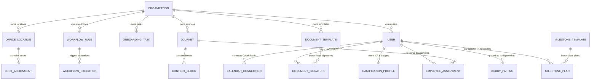

# 07 — Domain & Data Model

> **Document Version:** Consolidated Baseline (v1.0.0 + v2.0.0)  
> **Status:** Authoritative Domain Entity & Database Specification  
> **Module Namespace:** System Core

---

## 1. Domain Entity Relationship Diagram

---

## 2. Canonical Entity Specifications

### 2.1 Core Platform & Security Entities

#### Entity: `Organization` (`organizations`)
- **Purpose:** Top-level tenant workspace container.
- **Attributes:**
  - `_id`: ObjectId (PK)
  - `name`: String (Required)
  - `slug`: String (Unique, Indexed)
  - `domain`: String (Indexed)
  - `logoUrl`: String (Optional)
  - `primaryColor`: String (Optional)
  - `secondaryColor`: String (Optional)
  - `settings`: Object (Timezone, Language, MaxUsers)
  - `createdAt`: Date
  - `updatedAt`: Date
- **Tenant Scope:** Self-contained top-level entity.

#### Entity: `User` (`users`)
- **Purpose:** System user accounts across all roles.
- **Attributes:**
  - `_id`: ObjectId (PK)
  - `organizationId`: ObjectId (FK -> Organization, Indexed)
  - `email`: String (Required, Lowercase, Indexed)
  - `passwordHash`: String (Argon2, Optional for SSO users)
  - `firstName`: String (Required)
  - `lastName`: String (Required)
  - `role`: Enum (`super_admin`, `owner`, `admin`, `manager`, `employee`)
  - `title`: String
  - `department`: String (Indexed)
  - `managerId`: ObjectId (FK -> User, Indexed, Optional)
  - `officeLocationId`: ObjectId (FK -> OfficeLocation, Optional)
  - `hireDate`: Date (Indexed)
  - `status`: Enum (`INVITED`, `ACTIVE`, `SUSPENDED`, `ARCHIVED`)
  - `ssoProvider`: Enum (`LOCAL`, `SAML`, `OIDC`)
  - `createdAt`: Date
  - `updatedAt`: Date
- **Indexes:** `{ organizationId: 1, email: 1 }` (Unique), `{ organizationId: 1, managerId: 1 }`.

---

### 2.2 Journeys & Content Entities

#### Entity: `Journey` (`journeys`)
- **Purpose:** Onboarding curriculum container.
- **Attributes:**
  - `_id`: ObjectId (PK)
  - `organizationId`: ObjectId (FK -> Organization, Indexed)
  - `title`: String (Required)
  - `description`: String
  - `category`: String
  - `targetRoles`: Array<String>
  - `targetDepartments`: Array<String>
  - `targetLocations`: Array<ObjectId>
  - `status`: Enum (`DRAFT`, `PUBLISHED`, `ARCHIVED`)
  - `version`: Number (Default: 1)
  - `modules`: Array<ModuleSchema>
  - `estimatedMinutes`: Number
  - `createdBy`: ObjectId (FK -> User)
  - `createdAt`: Date
  - `updatedAt`: Date
- **Lifecycle States:** `DRAFT` -> `PUBLISHED` -> `ARCHIVED`.

#### Entity: `EmployeeAssignment` (`employeeassignments`)
- **Purpose:** Individual learner journey progress state machine.
- **Attributes:**
  - `_id`: ObjectId (PK)
  - `organizationId`: ObjectId (FK -> Organization, Indexed)
  - `userId`: ObjectId (FK -> User, Indexed)
  - `journeyId`: ObjectId (FK -> Journey, Indexed)
  - `assignedBy`: ObjectId (FK -> User)
  - `status`: Enum (`NOT_STARTED`, `IN_PROGRESS`, `COMPLETED`, `OVERDUE`)
  - `dueDate`: Date (Indexed)
  - `completedAt`: Date
  - `progressPercent`: Number (0-100)
  - `completedBlockIds`: Array<String>
  - `quizScores`: Map<QuizId, ScoreSchema>
  - `certificateUrl`: String (Optional)
  - `createdAt`: Date
  - `updatedAt`: Date
- **Indexes:** `{ organizationId: 1, userId: 1, journeyId: 1 }` (Unique).

---

### 2.3 Standalone Task & Workflow Entities

#### Entity: `OnboardingTask` (`onboardingtasks`)
- **Purpose:** Individual checklist task tracking item.
- **Attributes:**
  - `_id`: ObjectId (PK)
  - `organizationId`: ObjectId (FK -> Organization, Indexed)
  - `title`: String (Required)
  - `description`: String
  - `stage`: Enum (`PRE_BOARDING`, `DAY_1`, `WEEK_1`, `MONTH_1`, `CUSTOM`)
  - `assignedUserId`: ObjectId (FK -> User, Indexed) -- New hire recipient
  - `responsiblePersonId`: ObjectId (FK -> User, Indexed) -- Executing actor (IT/HR/Manager)
  - `assignedRole`: Enum (`EMPLOYEE`, `IT_ADMIN`, `HR_ADMIN`, `MANAGER`, `BUDDY`)
  - `status`: Enum (`PENDING`, `IN_PROGRESS`, `COMPLETED`, `OVERDUE`)
  - `relativeDays`: Number (Hire-date offset, e.g., -7, +1, +30)
  - `dueDate`: Date (Indexed)
  - `completedAt`: Date
  - `prerequisiteTaskIds`: Array<ObjectId>
  - `createdAt`: Date
  - `updatedAt`: Date
- **Lifecycle States:** `PENDING` -> `IN_PROGRESS` -> `COMPLETED` / `OVERDUE`.

#### Entity: `WorkflowRule` (`workflowrules`)
- **Purpose:** Event-driven automation rule definition.
- **Attributes:**
  - `_id`: ObjectId (PK)
  - `organizationId`: ObjectId (FK -> Organization, Indexed)
  - `name`: String (Required)
  - `triggerEvent`: Enum (`ON_USER_CREATED`, `ON_TASK_OVERDUE`, `ON_JOURNEY_COMPLETED`, `ON_MILESTONE_DUE`)
  - `conditions`: Array<ConditionSchema> (Field, Operator, Value)
  - `actions`: Array<ActionSchema> (ActionType, Parameters)
  - `isActive`: Boolean (Default: true)
  - `createdAt`: Date
  - `updatedAt`: Date

---

### 2.4 Digital Document & E-Signature Entities

#### Entity: `DocumentTemplate` (`documenttemplates`)
- **Purpose:** E-signature template layout definition.
- **Attributes:**
  - `_id`: ObjectId (PK)
  - `organizationId`: ObjectId (FK -> Organization, Indexed)
  - `title`: String (Required)
  - `description`: String
  - `fileUrl`: String (PDF Base template in R2/S3)
  - `signatureFields`: Array<SignatureFieldSchema> (X, Y, Page, Required)
  - `targetRoles`: Array<String>
  - `targetDepartments`: Array<String>
  - `createdAt`: Date
  - `updatedAt`: Date

#### Entity: `DocumentSignature` (`documentsignatures`)
- **Purpose:** Executed e-signature instance and audit trail.
- **Attributes:**
  - `_id`: ObjectId (PK)
  - `organizationId`: ObjectId (FK -> Organization, Indexed)
  - `templateId`: ObjectId (FK -> DocumentTemplate, Indexed)
  - `userId`: ObjectId (FK -> User, Indexed)
  - `status`: Enum (`PENDING`, `SIGNED`, `REJECTED`, `EXPIRED`)
  - `signedPdfUrl`: String (Completed PDF in R2/S3)
  - `signatureData`: String (Base64 stroke vector image)
  - `ipAddress`: String
  - `userAgent`: String
  - `signedAt`: Date
  - `documentHash`: String (SHA-256 cryptographic hash)
  - `createdAt`: Date
  - `updatedAt`: Date

---

### 2.5 Manager, Milestone & Buddy Entities

#### Entity: `MilestonePlan` (`milestoneplans`)
- **Purpose:** Employee 30-60-90 Day Success Plan.
- **Attributes:**
  - `_id`: ObjectId (PK)
  - `organizationId`: ObjectId (FK -> Organization, Indexed)
  - `userId`: ObjectId (FK -> User, Indexed)
  - `managerId`: ObjectId (FK -> User, Indexed)
  - `day30`: MilestonePhaseSchema (Goals, SelfRating, ManagerRating, SignOff)
  - `day60`: MilestonePhaseSchema (Goals, SelfRating, ManagerRating, SignOff)
  - `day90`: MilestonePhaseSchema (Goals, SelfRating, ManagerRating, SignOff)
  - `status`: Enum (`ACTIVE`, `COMPLETED`)
  - `createdAt`: Date
  - `updatedAt`: Date

#### Entity: `BuddyPairing` (`buddypairings`)
- **Purpose:** Onboarding buddy mentor pairing instance.
- **Attributes:**
  - `_id`: ObjectId (PK)
  - `organizationId`: ObjectId (FK -> Organization, Indexed)
  - `newHireId`: ObjectId (FK -> User, Indexed)
  - `buddyId`: ObjectId (FK -> User, Indexed)
  - `matchScore`: Number (0-100)
  - `matchReason`: String
  - `status`: Enum (`ACTIVE`, `COMPLETED`, `UNPAIRED`)
  - `meetingLogs`: Array<MeetingLogSchema> (Date, AgendaTopic, Notes, Rating)
  - `startDate`: Date
  - `endDate`: Date
  - `createdAt`: Date
  - `updatedAt`: Date

---

### 2.6 Kiosk Hardware Entity

#### Entity: `KioskDevice` (`kioskdevices`)
- **Purpose:** Physical frontline kiosk terminal registration & telemetry.
- **Attributes:**
  - `_id`: ObjectId (PK)
  - `organizationId`: ObjectId (FK -> Organization, Indexed)
  - `deviceName`: String (Required)
  - `locationName`: String
  - `pairingPin`: String (6-digit numeric, Unique)
  - `status`: Enum (`UNPAIRED`, `ONLINE`, `OFFLINE`, `MAINTENANCE`)
  - `hardwareFingerprint`: String
  - `currentJourneyId`: ObjectId (FK -> Journey)
  - `batteryPercent`: Number
  - `storageUsagePercent`: Number
  - `appVersion`: String
  - `lastHeartbeatAt`: Date (Indexed)
  - `createdAt`: Date
  - `updatedAt`: Date
