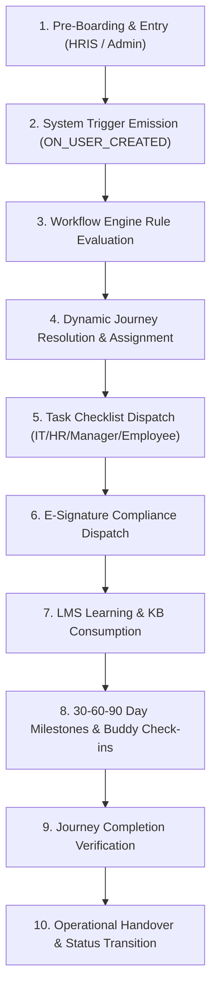

# 09 — Unified Product Contract

> **Document Status:** Authoritative System Specification & Product Contract  
> **Target Application:** Talnova Onboarding Enterprise B2B SaaS Platform  
> **Master Architecture:** Unified V1 Foundation + V2 Automation & Orchestration

---

## 1. Product Purpose & Core Value Proposition

**Talnova Onboarding** is an enterprise-grade multi-tenant B2B SaaS platform designed to manage, automate, deliver, and measure employee onboarding, corporate enablement, digital document compliance, and frontline operational training.

The platform operates as **ONE UNIFIED PRODUCT**:

```
                       TALNOVA UNIFIED ONBOARDING PLATFORM
                                        │
           ┌────────────────────────────┴────────────────────────────┐
           │                                                         │
 FOUNDATIONAL CAPABILITIES                                AUTOMATION & ORCHESTRATION
 (LMS, Courses, Tasks, Content,                           (Workflow Engine, Triggers,
  E-Signatures, KPIs, Handover)                            Rules, Dynamic Assignment)
           │                                                         │
           └────────────────────────────┬────────────────────────────┘
                                        │
                                        ▼
                         UNIFIED ONBOARDING LIFECYCLE
```

1. **Foundational Capabilities:** Original core features (LMS course delivery, standalone task checklists, digital e-signature templates, Knowledge Base articles, 30-60-90 day milestone evaluations, buddy check-ins, frontline kiosk player) provide the operational substrate.
2. **Orchestration & Automation:** Real-time workflow engines, trigger event emitters, boolean rule evaluators, and AI assistants operate directly on top of foundational primitives to determine **when, how, and for whom** onboarding resources are delivered.

---

## 2. System Actors & Persona Taxonomy

The platform enforces strict role-based access control (RBAC) and tenant data isolation (`organizationId`) across 8 system personas:

1. **SuperAdmin (`super_admin`):** Cross-tenant platform supervisor; provisions workspace tenants and oversees system health.
2. **Organization Owner (`owner`):** Highest workspace authority; manages enterprise SAML 2.0 / OIDC SSO, branding, and billing.
3. **HR Administrator (`admin`):** HR Operations supervisor; authors journey templates, builds LMS courses, configures workflow rules, pairs buddies, and monitors company-wide analytics.
4. **Department / Team Manager (`manager`):** Direct report supervisor; conducts 30-60-90 milestone check-ins, evaluates quiz scores, approves manager tasks, and executes 1-on-1 check-ins.
5. **Employee / New Hire (`employee`):** Primary consumer of onboarding; executes journey steps, streams LMS content, completes quizzes, signs digital documents, and fills self-ratings.
6. **Onboarding Buddy (`buddy`):** Senior peer paired with new hire; conducts informal weekly social check-ins and logs meeting feedback.
7. **IT / Ops Administrator (`it_admin`):** Provisioning task executor; processes hardware, account credentials, and security access task queues.
8. **Frontline Kiosk Operator (`kiosk_operator`):** Unauthenticated worker utilizing public touch kiosk terminals for safety briefs, PPE compliance, and SOP visual instruction.

---

## 3. Canonical Domain Entities & Relationships

* **`Organization`**: Multi-tenant workspace entity. All user data, journeys, courses, rules, and tasks belong exclusively to one tenant (`organizationId`).
* **`User` / `Employee` (Canonical Entity)**: Unified identity aggregate representing employees, managers, admins, buddies, and IT operators.
  * **Canonical MongoDB Collection:** `users` (Single authoritative source of truth).
  * **Canonical API Surface:** `/api/v1/employees/*` (Consolidated from legacy `/api/v1/users` alias).
  * **Deprecated Collection:** `employee` / `employees` (Decommissioned; zero duplicate collections).
* **`JourneyTemplate`**: Reusable blueprint defining ordered journey steps and targeting criteria.
* **`JourneyInstance`**: Active onboarding roadmap assigned to an employee, tracking overall progress and step completion states.
* **`JourneyStep`**: Container within a journey specifying prerequisite dependencies and holding embedded tasks, courses, documents, or milestones.
* **`TaskItem`**: Multi-stage checklist item assigned to specific roles (`EMPLOYEE`, `MANAGER`, `IT_ADMIN`, `HR_ADMIN`, `BUDDY`) with relative due dates (`hire_date + N days`).
* **`Course` / `Module` / `Lesson`**: LMS educational unit containing rich text, video (>=90% view duration threshold), audio, PDF, and quiz items.
* **`WorkflowRule` & `WorkflowAction`**: Event-driven rules (`ON_USER_CREATED`, `ON_STEP_COMPLETED`) that evaluate conditions against employee metadata to dynamically assign journeys, create tasks, schedule meetings, or dispatch dispatches.
* **`DocumentTemplate` & `DocumentSignature`**: PDF form templates and cryptographically signed PDF records (capturing signature vector, timestamp, IP address, and SHA-256 hash).
* **`MilestonePlan`**: Structured 30-60-90 day milestone check-in requiring employee self-ratings and manager sign-off.

---

## 4. Reconstructed Canonical Onboarding Lifecycle



### Stage Transition Contracts:
1. **Entry -> Trigger:** Employee record created via HRIS sync or HR invite -> System emits `ON_USER_CREATED` event.
2. **Trigger -> Rule Evaluation:** Background workflow engine evaluates matching `WorkflowRule` records using employee metadata (`department`, `role`, `location`, `employmentType`).
3. **Rule Evaluation -> Journey Assignment:** Matching rule resolves target `JourneyTemplate` -> System instantiates `JourneyInstance` (`status: IN_PROGRESS`). Fallback to default workspace template if no rule matches.
4. **Assignment -> Resource Initialization:** System dispatches initial operational tasks (IT provisioning, manager welcome meeting) with relative due dates (`hire_date - 7 days`, `hire_date + 1 day`).
5. **Execution -> Progression:** Employee consumes LMS courses, completes quizzes, signs compliance PDFs, and marks checklist items. Step prerequisite locks (`prerequisiteStepId`) automatically release as upstream steps achieve `COMPLETED` status.
6. **Progression -> Milestones:** Time-based triggers (`ON_DATE_MILESTONE`) initiate Day 30, 60, and 90 evaluations requiring dual employee/manager ratings.
7. **Milestones -> Completion:** When all mandatory journey steps, courses, documents, and tasks achieve `COMPLETED` or `VERIFIED` status, the system emits `ON_JOURNEY_COMPLETED`.
8. **Completion -> Handover:** System issues PDF Completion Certificate, manager conducts final sign-off check-in, and employee profile status transitions from `ONBOARDING` to `ACTIVE`.

---

## 5. Conceptual Role of Journeys vs Automation

* **Journey Role:** A Journey is an **executable onboarding roadmap container** that holds ordered steps, tasks, LMS courses, compliance documents, and milestones. It tracks individual progress and manages prerequisite step locks.
* **Automation Role:** Automation is the **orchestration engine** that sits above Journeys. It evaluates business events (`ON_USER_CREATED`, `ON_STEP_COMPLETED`), resolves which Journey Template to assign, dispatches operational tasks, schedules calendar meetings, and triggers notifications.

---

## 6. V1 Capability Integration Model

Foundational capabilities participate directly within the unified onboarding lifecycle:
* **LMS & Courses:** Embedded within journey steps as mandatory or elective learning items.
* **Standalone Tasks:** Dispatched by journey steps or workflow rule actions to IT admins, managers, buddies, or HR.
* **E-Signatures:** Dispatched as mandatory compliance steps before or during early onboarding execution.
* **Knowledge Base & AI Assistant:** Provides embedded Q&A policy support throughout journey execution.
* **30-60-90 Day Milestones:** Evaluated as formal gated steps at day 30, 60, and 90 post-hire date.
* **Public Kiosk Player:** Serves frontline workers via touch-first visual display terminals for SOP playback and PPE compliance.

---

## 7. Core Business Rules & Precedence Model

1. **Multi-Tenant Isolation (BR-SEC-001):** Every query must enforce `WHERE organizationId = context.organizationId`.
2. **Rule Evaluation Precedence (BR-WFK-002):** Rules match using boolean AND logic across metadata attributes. Higher `priorityIndex` rules evaluate first.
3. **Default Journey Fallback (BR-WFK-003):** If no workflow rule condition matches a new employee, the default workspace journey template (`isDefault == true`) is assigned.
4. **Prerequisite Step Locking (BR-JRN-001):** Steps with incomplete prerequisites (`prerequisiteStepId != null`) remain `LOCKED`.
5. **E-Signature Audit Trail (BR-SIG-001):** Canvas signatures generate cryptographically signed PDFs capturing timestamp, IP address, user ID, and SHA-256 PDF hash.

---

## 8. Failure & Exception Model

| Exception Condition | System Response | User-Visible Effect | Lifecycle Effect |
| :--- | :--- | :--- | :--- |
| **Workflow Action Failure** | Retries 3 times with exponential backoff; routes to DLQ if unhandled. | Admin exception alert on HR Operations dashboard. | Journey assignment paused until resolved or default assigned. |
| **No Rule Match** | Assigns default workspace template (`isDefault == true`). | Employee receives standard default onboarding roadmap. | Journey initializes normally. |
| **Failed LMS Quiz** | Increments attempt counter; locks step if `maxAttempts` exceeded. | Error prompt displaying score and retry button. | Step remains incomplete; notifies manager if max attempts exceeded. |
| **Overdue Task Item** | Emits `TASK_OVERDUE` trigger event. | Red overdue badge rendered on task list; escalation email sent. | Task status transitions to `OVERDUE`. |
| **HRIS Sync Disconnect** | Retries webhook payload; logs error in DLQ queue. | HR Admin views connector status indicator as yellow warning. | Ingested employees queued until sync recovers. |

---

## 9. Inventory of Open Decisions (Unresolved Questions)

1. **UQ-01 (Kiosk Pre-boarding Signatures):** Decision required on whether unauthenticated kiosk sessions for frontline workers should create a pending profile or require manager PIN authorization.
2. **UQ-02 (Quiz Failure Lockout Policy):** Decision required on whether max quiz retries lock the entire journey or allow non-dependent task steps to proceed.
3. **UQ-03 (HRIS Termination Retention):** Decision required on whether incomplete e-signature document tasks assigned to terminated employees are revoked immediately or retained in pending state for audit retention.
4. **UQ-04 (SSO JIT Default Journey Fallback):** Decision required on whether unprovisioned users logging in via SAML SSO without department rule matches receive the default journey or raise an admin exception.
5. **UQ-05 (AI Course Creator Parsing Fallbacks):** Decision required on whether corrupted/scanned PDFs trigger an OCR pipeline or return a document re-upload error.
