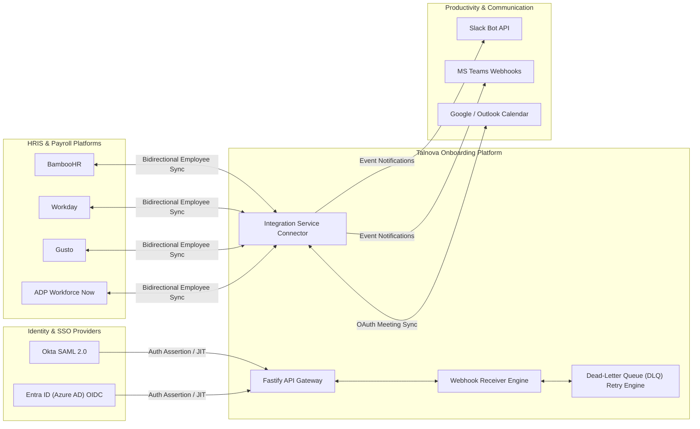

# 10 — Integrations & External Systems

> **Document Version:** Consolidated Baseline (v1.0.0 + v2.0.0)  
> **Status:** Authoritative Integrations & API Architecture Specification  
> **Module Namespace:** System Core

---

## 1. Integration Architecture Overview

The Talnova Onboarding platform provides a modular **Integration Marketplace Framework** (`hris-integration.service.ts`) enabling bidirectional synchronization with HRIS platforms, identity providers, communication suites, calendars, and object storage engines.



---

## 2. Integration Catalog Specifications

### 2.1 Enterprise HRIS Connectors (`BambooHR`, `Workday`, `Gusto`, `ADP`)
- **Integration Names:** BambooHR, Workday Enterprise, Gusto Payroll, ADP Workforce Now.
- **Direction:** Bidirectional (Inbound user sync, outbound onboarding status update).
- **Data Exchanged:** New hire profiles (First/Last name, email, department, role, manager, hire date, office location).
- **Authentication:** OAuth 2.0 Client Credentials / API Key Bearer Tokens.
- **Sync Protocol:** Automated hourly cron poll + real-time inbound webhook receiver (`/api/v1/integrations/webhooks/:provider`).
- **Error & Retry Handling:** Transient network failures trigger 3 exponential backoff retries. Permanent failures divert payloads to Dead-Letter Queue (DLQ) for HR Admin inspection and manual replay.

### 2.2 Enterprise Single Sign-On (`SAML 2.0`, `OIDC`)
- **Protocols:** SAML 2.0 Web Browser SSO Profile, OpenID Connect 1.0 (OAuth 2.0 framework).
- **Supported IdPs:** Okta, Entra ID (Azure AD), PingFederate, OneLogin, Google Workspace SAML.
- **Data Exchanged:** SAML Assertions / OIDC ID Tokens containing `email`, `given_name`, `family_name`, `department`, `role`.
- **Security:** SHA-256 X.509 signature verification, ACS URL endpoint assertion validation.

### 2.3 Productivity & Communication (`Slack`, `Microsoft Teams`)
- **Integration Channels:** Slack Apps & Incoming Webhooks, MS Teams Graph API Bot.
- **Direction:** Outbound dispatches & Inbound interactive action cards.
- **Events Dispatched:** New hire task reminders, 30-60-90 milestone check-in alerts, document sign requests, manager review notifications.
- **Payload Format:** Structured Slack Block Kit / MS Teams Adaptive Cards.

### 2.4 Calendar Synchronization (`Google Calendar`, `Microsoft Outlook`, `iCal`)
- **Integration Protocols:** Google Calendar API v3, Microsoft Graph API Calendar v1.0, RFC 5545 iCalendar feed URLs.
- **Features:** Personal iCal URL generation (`webcal://...`), automated 1-on-1 meeting scheduling, video conference link generation (Google Meet, MS Teams, Zoom).
- **OAuth Scope:** `https://www.googleapis.com/auth/calendar.events`, `Calendars.ReadWrite`.

### 2.5 Cloud Storage Providers (`Cloudflare R2`, `AWS S3`)
- **Integration Types:** S3 API-compatible Object Storage via `@aws-sdk/client-s3`.
- **Purpose:** Storage of uploaded multimedia assets (videos, PDFs, images) and generated cryptographically signed e-signature PDFs.
- **Security:** Presigned upload/download URLs with 15-minute expiration timestamps. No public bucket write access.

---

## 3. Webhook Receiver Specification

### Inbound Endpoint
- **URL Path:** `POST /api/v1/integrations/webhooks/:provider`
- **Headers Required:** `X-Talnova-Signature: sha256=...`, `Content-Type: application/json`

### Signature Verification Algorithm
```typescript
const computedSignature = crypto
  .createHmac('sha256', webhookSecret)
  .update(rawRequestBody)
  .digest('hex');

if (`sha256=${computedSignature}` !== requestHeaders['x-talnova-signature']) {
  throw new UnauthorizedException('Invalid Webhook Signature');
}
```
