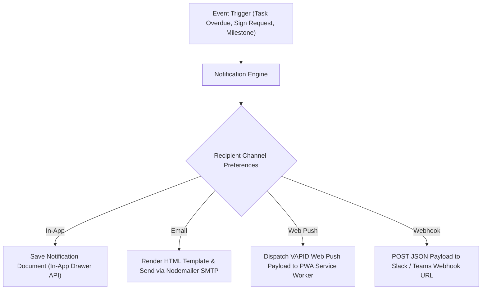

# 12 — Notifications & Communications

> **Document Version:** Consolidated Baseline (v1.0.0 + v2.0.0)  
> **Status:** Authoritative Multi-Channel Notification Specification  
> **Module Namespace:** System Core

---

## 1. Notification System Architecture

The Talnova Onboarding notification engine (`notification.service.ts`) dispatches event-driven and scheduled communications across 4 channels:
1. **In-App Drawer:** Real-time web application notification drawer & badge count.
2. **Email (Nodemailer SMTP):** HTML responsive transactional emails.
3. **Web Push API (Service Worker):** Native desktop & mobile push notifications.
4. **Outbound Webhooks:** Webhook alerts to Slack, MS Teams, and HRIS platforms.

---

## 2. Master Notification Dispatch Matrix

| Event / Trigger | Recipient | Supported Channels | Trigger Condition | Content Template Summary | Escalation & Frequency Rules |
| :--- | :--- | :--- | :--- | :--- | :--- |
| **New Hire Welcome & Invite** | Employee | Email | User created in workspace | "Welcome to [Company]! Click here to activate your account." | Immediate on user creation. |
| **Journey Auto-Assigned** | Employee | In-App, Email, Push | Smart rule triggers assignment | "New Onboarding Journey Assigned: [Journey Title]" | Immediate; reminder at Day 3 if not started. |
| **Task Assigned to Actor** | IT, HR, Manager | In-App, Email | Cross-person task created | "Action Required: Complete task [Task Title] for [Employee]" | Immediate; daily summary digest. |
| **Task Overdue Warning** | Responsible Actor | In-App, Email, Push | `now > task.dueDate` AND task pending | "Overdue Alert: Task [Task Title] is past due date." | Cron scan daily at 08:00 UTC; escalate to Manager at Day 3. |
| **Document Sign Request** | Employee | In-App, Email, Push | Document template assigned | "Action Required: Sign [Document Title] within 48 hours." | Immediate; daily reminder until signed. |
| **Milestone Review Open** | Employee, Manager | In-App, Email | `hireDate + 30/60/90 days` reached | "30-Day Milestone Review is now open for evaluation." | Immediate on milestone due date. |
| **Buddy Pairing Assigned** | Buddy, Employee | In-App, Email | Buddy pairing established | "You have been paired with [Name] as your Onboarding Buddy!" | Immediate on pairing approval. |
| **Weekly Buddy Check-in** | Buddy | In-App, Email | `scheduler.service.ts` weekly trigger | "Weekly Buddy Check-in Agenda ready for [Employee]" | Weekly every Monday morning. |
| **Meeting Invitation Sync** | Employee, Manager | Email, Calendar OAuth | Meeting scheduled | "Calendar Invite: [Meeting Title] scheduled for [Date]" | Immediate on event creation. |
| **Kiosk Device Offline** | IT Admin | In-App, Email | Kiosk missing heartbeat > 5 mins | "Alert: Kiosk Terminal [Name] at [Location] is offline." | Immediate; repeat hourly until online. |

---

## 3. Scheduler & Escalation Logic (`scheduler.service.ts`)

- **Cron Runner Schedule:** In-process `node-cron` job executes every 15 minutes scanning pending tasks, expiring assignments, and due milestones.
- **Escalation Rules:**
  - Tasks overdue by 1-2 days notify the assigned actor.
  - Tasks overdue by 3+ days escalate to the actor's supervisor (`managerId`) with a red warning badge in the Manager Dashboard.
