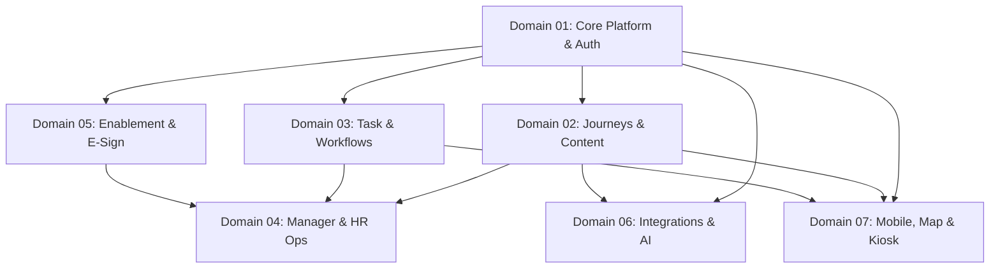
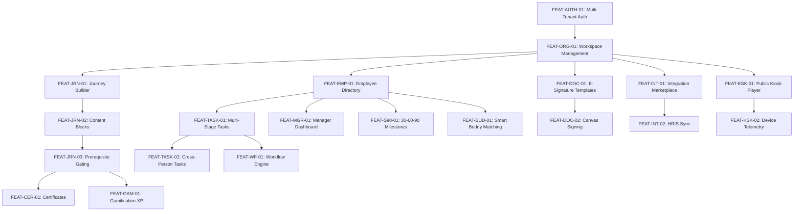

# 15 — Feature Dependency Map

> **Document Version:** Consolidated Baseline (v1.0.0 + v2.0.0)  
> **Status:** Authoritative Feature & Domain Dependency Specification  
> **Module Namespace:** System Core

---

## 1. High-Level Domain Dependency Graph

---

## 2. Feature-Level Dependency Graph

---

## 3. Comprehensive Feature Dependency Catalog

| Feature ID | Feature Name | Immediate Prerequisites | Downstream Dependent Features |
| :--- | :--- | :--- | :--- |
| **FEAT-AUTH-01** | Multi-Tenant JWT & Auth | Base Infrastructure | All System Features |
| **FEAT-ORG-01** | Workspace & Dept Management | `FEAT-AUTH-01` | All Domain Features |
| **FEAT-EMP-01** | Employee Directory & Hierarchy | `FEAT-ORG-01` | `FEAT-TASK-01`, `FEAT-MGR-01`, `FEAT-S90-01`, `FEAT-BUD-01` |
| **FEAT-JRN-01** | Visual Journey Builder | `FEAT-ORG-01` | `FEAT-JRN-02`, `FEAT-JRN-04`, `FEAT-AI-02` |
| **FEAT-JRN-03** | Prerequisite & Quiz Gating | `FEAT-JRN-02` | `FEAT-CER-01`, `FEAT-GAM-01`, `FEAT-ANL-01` |
| **FEAT-TASK-01** | Multi-Stage Checklist Engine | `FEAT-EMP-01` | `FEAT-TASK-02`, `FEAT-TASK-03`, `FEAT-WF-01` |
| **FEAT-WF-01** | Trigger-Action Automation | `FEAT-TASK-01` | Automated assignments, provisionings, alerts |
| **FEAT-DOC-01** | E-Signature Template Authoring | `FEAT-ORG-01` | `FEAT-DOC-02` (Canvas Signing & Signed PDF) |
| **FEAT-S90-01** | 30-60-90 Day Milestone Plans | `FEAT-EMP-01` | `FEAT-S90-02` (Milestone Evaluation & Sign-off) |
| **FEAT-BUD-01** | Smart Buddy Matching Engine | `FEAT-EMP-01` | `FEAT-BUD-02` (Buddy Agendas & 1-on-1 Logger) |
| **FEAT-INT-01** | Integration Marketplace | `FEAT-ORG-01` | `FEAT-INT-02` (HRIS Sync), `FEAT-INT-03` (Webhooks) |
| **FEAT-AI-01** | RAG Conversational AI | `FEAT-KB-01` | Policy Q&A, smart action suggestions |
| **FEAT-KSK-01** | Public Kiosk Visual Player | `FEAT-ORG-01` | `FEAT-KSK-02` (Device Telemetry & PIN Pairing) |
