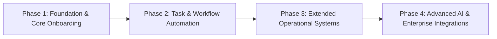

# 18 — Product Roadmap

> **Document Version:** Consolidated Baseline (v1.0.0 + v2.0.0)  
> **Status:** Authoritative Capability Evolution Roadmap  
> **Module Namespace:** System Core

---

## 1. Product Evolution Trajectory

The Talnova Onboarding platform evolves along a 4-phase architectural trajectory, building enterprise capabilities sequentially upon a multi-tenant foundation.

---

## 2. Phase-by-Phase Capability Breakdown

### Phase 1: Foundation & Core Onboarding (`BASELINE`)
- **Focus:** Foundational multi-tenant SaaS application structure and basic onboarding capabilities.
- **Capabilities Included:**
  - Multi-Tenant Workspace & `organizationId` data isolation (`organizations`, `auth`).
  - Local JWT Authentication, Argon2 password hashing, session management.
  - User Directory & Organization Hierarchy (`users`, `employees`).
  - Visual Journey & Curriculum Builder (`journeys`, `courses`).
  - Multi-Format Interactive Content Blocks (video, audio, PDF, rich text, quiz).
  - Categorized Knowledge Base & SOP Policy Articles (`knowledge-base`).
  - Unauthenticated Signed Public Kiosk Safety Player (`kiosk`).

### Phase 2: Task & Workflow Automation (`MODIFIED` / `NEW`)
- **Focus:** Standalone task execution, cross-person handoffs, and event-driven automation rules.
- **Capabilities Included:**
  - Standalone Multi-Stage Task Checklist Engine (`tasks`).
  - Cross-Person Task Assignments for IT Admins, HR, and Managers.
  - Relative Hire-Date Due-Date Scheduling (`H-7`, `H+1`, `H+30`).
  - Event-Driven Workflow Automation Rule Engine (`workflows`).
  - Smart Rule Auto-Assignment Engine targeting roles, departments, locations.

### Phase 3: Extended Operational Systems (`NEW`)
- **Focus:** Administrative governance, compliance documents, milestones, peer mentoring, and calendar sync.
- **Capabilities Included:**
  - Digital Document Template Management & Canvas E-Signatures (`documents`).
  - 30-60-90 Day Success Plan Milestone Engine (`milestones`).
  - Smart Onboarding Buddy Matching Engine & 1-on-1 Logger (`buddy`).
  - Manager Operations Single-Pane Progress Dashboard (`manager`).
  - Personal iCal Export Feeds & Google / Outlook Calendar Sync (`calendar`).
  - Gamification XP Points Engine, Badges, and Organization Leaderboards (`gamification`).

### Phase 4: Advanced AI & Enterprise Integrations (`NEW`)
- **Focus:** AI-powered assistance, rapid course authoring, enterprise SSO, HRIS marketplace, and mobile PWA.
- **Capabilities Included:**
  - Conversational RAG AI Onboarding Assistant (`ai`).
  - AI Document-to-Course & Quiz Builder Studio (`ai`).
  - Enterprise SAML 2.0 & OIDC Single Sign-On (`sso`).
  - HRIS Integration Marketplace Framework (BambooHR, Workday, Gusto, ADP) (`integrations`).
  - Mobile PWA & Offline Field Task Sign-Off via IndexedDB (`pwa`).
  - Interactive Office Floorplan & Desk Search Wayfinding (`locations`).
  - HR Operations Central Command Center & Exception Queue (`hr`).
