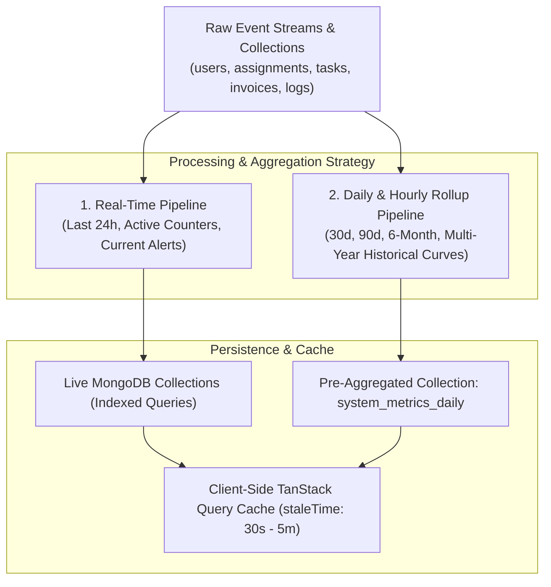

# Super Admin Analytics & Telemetry Aggregation Model

> **Document Status:** Authoritative Analytics Architecture  
> **System:** Talnova Onboarding Enterprise Platform  
> **Scope:** Real-Time vs Pre-Aggregated Metrics, Time-Bucket Rollup Strategy, Caching, Retention, and Performance Guardrails.

---

## 1. Analytics Strategy & Scalability Architecture

In an enterprise platform serving tens of thousands of active employees, hundreds of organizations, and millions of onboarding events, querying raw document collections on every dashboard render will degrade database performance.

The Super Admin Command Center employs a tiered analytics processing architecture:



---

## 2. Real-Time vs. Pre-Aggregated Metrics Matrix

| Metric Category | Query Mode | Data Source | Calculation Frequency | Target Latency | Cache / Stale Time |
| :--- | :---: | :--- | :---: | :---: | :---: |
| **Active Tenants Count** | Real-Time | `Organization.countDocuments({ status: 'Active' })` | On-Demand | `< 15ms` | 30 seconds |
| **Active Users (Current)** | Real-Time | `Session.countDocuments({ isValid: true })` | On-Demand | `< 20ms` | 30 seconds |
| **Open Critical Alerts** | Real-Time | `Alert.find({ status: 'open', severity: 'critical' })` | On-Demand | `< 15ms` | 15 seconds |
| **Recent Audit Activity (24h)**| Real-Time | `AuditLog.find().sort({ createdAt: -1 }).limit(20)` | On-Demand | `< 30ms` | 30 seconds |
| **API Requests (Last 15m)** | Real-Time | In-Memory `TelemetryBuffer` | On-Demand | `< 5ms` | 10 seconds |
| **DAU / WAU / MAU Curves** | Pre-Aggregated | `system_metrics_daily` (Daily Rollup) | Nightly / Hourly | `< 40ms` | 5 minutes |
| **6-Month MRR Trajectory** | Pre-Aggregated | `system_metrics_daily` (Monthly Rollup) | Nightly / Hourly | `< 35ms` | 10 minutes |
| **Journey Completion Rates** | Pre-Aggregated | `system_metrics_daily` (Weekly Rollup) | Nightly | `< 50ms` | 10 minutes |
| **AI Token Consumption Trend** | Pre-Aggregated | `AIUsageRecord` (Hourly Aggregation) | Hourly | `< 45ms` | 5 minutes |
| **Storage Usage by Org** | Pre-Aggregated | `Upload` (Daily Aggregation Pipeline) | Nightly | `< 60ms` | 15 minutes |

---

## 3. Daily Metric Rollup Schema (`system_metrics_daily`)

To eliminate expensive table scans across historical months, historical analytics are written to a specialized rollup collection:

```typescript
export interface ISystemMetricDaily extends Document {
  date: string;                     // "YYYY-MM-DD" primary index
  timestamp: Date;                  // Midnight UTC
  tenants: {
    total: number;
    active: number;
    suspended: number;
    newProvisioned: number;
  };
  users: {
    total: number;
    activeToday (DAU): number;
    activeWeekly (WAU): number;
    activeMonthly (MAU): number;
    newRegistered: number;
  };
  onboarding: {
    activeCases: number;
    completedToday: number;
    averageDaysToCompletion: number;
    overdueTasksCount: number;
  };
  finance: {
    grossInvoicedUsd: number;
    cashCollectedUsd: number;
    outstandingReceivablesUsd: number;
    expensesUsd: number;
    netOperatingResultUsd: number;
  };
  ai: {
    totalCalls: number;
    inputTokens: number;
    outputTokens: number;
    totalCostUsd: number;
  };
  technical: {
    totalApiRequests: number;
    errorRatePct: number;
    p95LatencyMs: number;
    dbPingLatencyMs: number;
  };
}
```

* **Index:** `{ date: 1 }` (unique compound index).
* **Rollup Runner:** A scheduled cron/job runs daily at 00:05 UTC, aggregating yesterday's metrics into a single document.

---

## 4. Performance Guardrails & Query Rules

1. **Mandatory Indexing on Query Filters:** Any field queried in a Super Admin endpoint (such as `organizationId`, `status`, `createdAt`, `isDeleted`, `category`) **must** be indexed in Mongoose.
2. **Server-Side Pagination & Cursor Limits:** Endpoints returning lists enforce a maximum `limit = 100`. Unlimited queries (`limit = 0`) are rejected at the Zod validation layer.
3. **No Unbounded `$lookup` Aggregations:** Joining collections across thousands of documents without a tight `$match` stage is strictly prohibited. Lookups must always be preceded by an indexed `$match` stage.
4. **Zero Frontend Array Filtering:** Filtering by date ranges, search strings, or status tags must occur in MongoDB, not in the React client.
5. **Streaming Exports:** Data exports (CSV/Excel) streaming larger than 1,000 records utilize Fastify stream reply piping to prevent Node.js heap exhaustion.
