# Super Admin System Architecture & Control Plane Blueprint

> **Document Status:** Authoritative Architectural Blueprint  
> **System:** Talnova Onboarding Enterprise Platform  
> **Component:** Super Admin Command Center Control Plane Architecture

---

## 1. High-Level Architectural Diagram

The Super Admin Command Center operates as an out-of-band **Operational Control Plane** and **Telemetry Aggregator** layered directly over the Talnova Onboarding multi-tenant platform:

```mermaid
graph TD
    subgraph ClientLayer ["1. Presentation & Command Shell (React 18 + Vite)"]
        UI_Shell["Super Admin Shell & Universal Header"]
        GlobalSearch["Global Search (Ctrl+K) & Entity Resolver"]
        UniversalFilter["Universal Persistent Filter Context"]
        CommandCenterView["Executive Command Center (KPIs, Telemetry, Alerts)"]
        Org360["Organization 360° Management"]
        User360["User 360° Directory & Security"]
        JourneyObs["Onboarding & Journey Observability"]
        TechObs["Technical & Infrastructure Observability"]
        AIObs["AI Observability & Cost Tracking"]
        FinanceCenter["Internal B2B Finance & Invoicing Center"]
        AuditAlerts["Security Audit & Alert Workbench"]
    end

    subgraph GatewayLayer ["2. API Gateway & Security Plane (Fastify v5)"]
        AuthHook["authenticate Hook (JWT & Cookie Verification)"]
        RoleHook["requireRole(['super_admin']) Enforcement"]
        AuditHook["Audit & Action Logger Hook"]
        RateLimit["Rate Limiting & DDOS Protection"]
        ReqCorrelator["Request ID & Correlation ID Injector"]
        AdminRouter["/api/v1/super-admin/* Domain Routers"]
    end

    subgraph ServiceLayer ["3. Business Domain & Analytics Engine"]
        AdminService["SuperAdmin Management Service"]
        Org360Service["Organization 360 Aggregation Service"]
        User360Service["User 360 Directory Service"]
        JourneyObsService["Journey & Onboarding Observability Service"]
        TelemetryService["System Telemetry & Metrics Aggregator"]
        FinanceService["Internal B2B Billing & Invoicing Service"]
        AuditService["Security Audit & Activity Service"]
        AlertService["Unified Alert & Incident Service"]
        ReportingService["Multi-Domain Reporting & Export Engine"]
        ConfigService["Feature Flag & Platform Config Service"]
    end

    subgraph EventStreamLayer ["4. Event Mesh & Observability Bus"]
        EventBus["Node.js Asynchronous Event Bus"]
        OutboxQueue["Transactional Outbox Engine (MongoDB outbox_events)"]
        MetricsCollector["In-Memory Rolling Window Metrics Buffer"]
        AuditAppender["Immutable Audit Appender"]
    end

    subgraph PersistenceLayer ["5. Persistence & Infrastructure Layer"]
        MongoAtlas["MongoDB Atlas Cluster (47 Collections + Admin Collections)"]
        CloudflareR2["Cloudflare R2 Object Storage (Media & Signed Documents)"]
        AIProviders["External AI Gateways (Gemini, OpenAI, Azure, Anthropic)"]
        SMTPMail["SMTP Email Dispatcher"]
    end

    ClientLayer -->|HTTPS / REST API / WSS| GatewayLayer
    GatewayLayer --> ServiceLayer
    ServiceLayer --> EventStreamLayer
    ServiceLayer --> PersistenceLayer
    EventStreamLayer --> PersistenceLayer
```



---

## 2. The Four Conceptual Operational Layers

### Layer 1: Executive Presentation & Operational Cockpit (Frontend SPA)
* **Design Philosophy:** Dense, information-rich, low-latency, and keyboard-accessible desktop enterprise interface.
* **Component Architecture:** Modular React 18 functional components utilizing `@tanstack/react-query` for asynchronous state synchronization, optimistic mutation updates, background polling, and cache invalidation.
* **Universal Cross-Cutting Shell:**
  * **Global Search (`CommandPalette`):** Rapid entity lookup indexed across Organizations, Users, Journeys, Tasks, Invoices, Alerts, and Audit Events.
  * **Persistent Context Filter Bar:** Unified selector providing global time-range filtering (`1h`, `24h`, `7d`, `30d`, `90d`, `1y`, `custom`), tenant selector, environment flag (`production`, `staging`, `development`), and incident severity filter.
  * **Unified Visual Language:** Sleek dark-mode aesthetic (`#0B0F19` slate background with vibrant semantic status accents), custom KPI cards, sparklines, area trajectories, and data tables with sortable, virtualized server-side pagination.

### Layer 2: API Gateway & Security Authorization Plane (Fastify v5)
* **Authentication:** Validates cryptographic JWT access tokens via Fastify JWT plugin. Non-superadmin requests attempting to call `/api/v1/super-admin/*` are immediately halted with `HTTP 403 Forbidden` and a security alert is recorded.
* **Tenant Isolation Bypass Logic:** Unlike standard endpoints which enforce `WHERE organizationId = context.user.organizationId`, Super Admin endpoints run under root platform authority, enabling cross-tenant aggregation and cross-tenant profile inspection.
* **Correlation Tracking:** The `registerRequestId` middleware attaches a unique `reqId` (UUID v4) and propagates incoming `x-correlation-id` headers through Fastify request context into logs and database audit writes.
* **Rate Limiting:** Dedicated rate limiting tier for administrative endpoints to prevent scraping of sensitive organizational rosters or rapid-fire destructive mutations.

### Layer 3: Business Domain, Aggregation & Observability Services
* **Decoupled Domain Services:** Clean separation of concerns with specialized service classes for Telemetry, Organization 360, User 360, Journey Observability, Finance, Audit, Alerts, and Platform Configuration.
* **Live Aggregation vs. Pre-Aggregated Rollups:**
  * **Live Aggregations:** Used for real-time operational states, active tenant counts, user statuses, open alerts, and recent audit logs (last 24 hours).
  * **Time-Bucket Rollups:** Used for long-term historical trends (30-day, 90-day, 6-month, and annual curves for MRR, active users, journey completion rates, API latency percentiles, and AI token costs). Pre-aggregated via MongoDB aggregation pipelines into daily metric buckets (`system_metrics_daily`).
* **Zero Synthetic Data Policy:** Fallback mock multipliers (`orgsCount * 150`, `totalTenants * 1500`) are eliminated. Where database records are empty, services return zero counts or empty arrays with transparent telemetry status tags (`DATA_EMPTY`).

### Layer 4: Persistence, Infrastructure & External Gateways
* **MongoDB Atlas Database:** 47 core business collections plus specialized Super Admin control plane collections (`PaymentRecord`, `ExpenseRecord`, `AIUsageRecord`, `Alert`, `FeatureFlag`, `SystemMetricDaily`, `CustomerAccount`).
* **Cloudflare R2 Storage:** S3-compatible object store housing employee avatars, compliance PDFs, signed canvas e-signature documents, and video/audio SOP training files. Storage usage is tracked per organization and media type.
* **AI Provider Gateway:** Standardized provider interface (`AIProviderService`) calling external LLMs (Google Gemini, OpenAI, Azure OpenAI, Anthropic) while extracting and recording token consumption, latency, and costs into persistent audit models.

---

## 3. End-to-End Incident & Behavior Investigation Trace

The primary operational superpower of the Super Admin Command Center is its ability to trace any anomaly down to its granular root cause:

```text
[1. Executive Command Center]
   └─ Alert: "Journey Failure Spike in West Coast Tech" (Severity: Critical)
         │
[2. Organization 360°]
   └─ Tenant: "Acme Corp" (ID: 64f8a1... | Enterprise Tier)
         │
[3. User 360° & Onboarding Monitor]
   └─ Employee: "Jane Doe" (User ID: 64f9b2... | Status: ONBOARDING)
         │
[4. Journey Observability]
   └─ Instance: "DevOps Onboarding v2" -> Step 4: "AWS Security Certification" -> FAILED
         │
[5. Platform Activity & Events]
   └─ Event: "QUIZ_FAILED" (Correlation ID: "corr-8f72-9901")
         │
[6. API & Request Observability]
   └─ HTTP POST /api/v1/journeys/quiz/submit -> Status: 500 Internal Server Error (Duration: 1,840ms)
         │
[7. System & Application Logs]
   └─ Pino Error Log [reqId: "req-4a81"]: MongoTimeoutError: connection pool exhausted during quiz evaluation
         │
[8. Administrative Remediation Control]
   └─ Super Admin Action: Reset Quiz Attempt + Scale DB Connection Pool Limit + Dispatch Alert Resolution Note
```

---

## 4. Administrative Action Classification & Safety Gates

Privileged operations inside the Super Admin Command Center are strictly partitioned into safety tiers:

| Tier | Classification | Examples | Safeguard Requirements | Audit Level |
| :---: | :--- | :--- | :--- | :---: |
| **0** | **READ** | View metrics, browse users, inspect organizations, export reports. | Valid super_admin session. | `INFO` |
| **1** | **LOW-RISK WRITE** | Add organization note, adjust non-critical feature flag, acknowledge alert. | Inline action with visual confirmation. | `INFO` |
| **2** | **HIGH-RISK WRITE** | Change user role, suspend organization workspace, record manual payment, issue invoice. | Explicit confirmation modal, mandatory reason field, before/after diff logging. | `WARNING` |
| **3** | **DESTRUCTIVE** | Permanent user deletion, organization purge, cancel invoice, revoke certificate. | Two-step confirmation with typed confirmation string, impact warning modal, reason, and cryptographic audit entry. | `CRITICAL` |

---

## 5. Security & Isolation Boundaries

1. **Root Role Boundary:** Super Admin access is restricted exclusively to authenticated users whose verified JWT payload contains `role: "super_admin"`.
2. **Dedicated Route Prefix:** All administrative operations reside under `/api/v1/super-admin/*` and require both `authenticate` and `requireRole(["super_admin"])` hooks.
3. **Data Minimization in Transit:** API responses scrub sensitive internal secrets (passwords, Argon2 hashes, SSO private keys, provider API keys, session tokens) before dispatching to the client.
4. **Append-Only Auditing:** Financial transactions and security actions cannot be updated or deleted. Any corrections require compensating adjustment records with full audit trail linkage.
