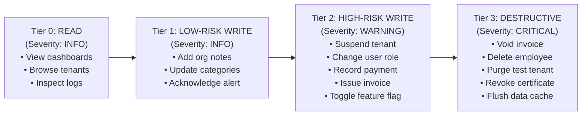

# Super Admin Audit & Governance Architecture

> **Document Status:** Authoritative Security & Audit Specification  
> **System:** Talnova Onboarding Enterprise Platform  
> **Scope:** Privileged Action Tracking, Audit Schema, Immutability, Mutation Diffs, and Export Governance.

---

## 1. Audit Principles & Security Mandate

As the root operational authority of the Talnova Onboarding platform, the Super Admin Command Center must maintain an **uncompromising, tamper-evident, append-only record** of every privileged action.

### Non-Negotiable Audit Laws:
1. **Zero Silent Mutations:** No database record may be created, altered, suspended, or deleted without a corresponding audit event.
2. **Immutable Append-Only Storage:** Audit records cannot be edited or deleted by any user or administrator. Mongoose schemas for audit collections disable `updatedAt` and block `update`, `delete`, and `findOneAndUpdate` operations.
3. **Before & After State Diffs:** For any administrative mutation (such as role modification, tenant plan change, or invoice adjustment), the audit record must capture the exact `before` state and `after` state.
4. **Mandatory Administrative Justification:** Destructive or high-risk administrative operations require a mandatory human reason (minimum 10 characters) explaining why the change was made.
5. **Export Accountability:** Every data export (CSV, XLSX, PDF) containing organizational or employee PII is logged as an auditable event recording the administrator ID, IP, filters, and record count.

---

## 2. Canonical Audit Event Schema

The platform utilizes the `AuditLog` collection (`audit-log.model.ts`), enhanced to support cross-tenant platform events:

```typescript
export interface IAuditLogRecord {
  organizationId?: mongoose.Types.ObjectId;  // Optional: Null for cross-tenant platform events
  actorUserId: mongoose.Types.ObjectId;      // The administrator executing the action
  actorRole: string;                         // Role at time of execution ("super_admin")
  actorEmail: string;                        // Email of administrator
  actorType: "user" | "system" | "api" | "scheduler";
  eventCategory:
    | "authentication"
    | "user"
    | "organization"
    | "journey"
    | "assignment"
    | "content"
    | "finance"
    | "ai"
    | "feature_flag"
    | "security"
    | "system";
  eventType: string;                         // Canonical event (e.g., "TENANT_PROVISIONED")
  resourceType: string;                      // Entity name ("Organization", "User", "Invoice")
  resourceId?: mongoose.Types.ObjectId;      // Target entity ID
  action:
    | "create"
    | "update"
    | "delete"
    | "assign"
    | "complete"
    | "archive"
    | "restore"
    | "login"
    | "logout"
    | "export"
    | "status_change";
  description: string;                       // Human-readable summary of the action
  reason?: string;                           // Mandatory justification for high-risk mutations
  metadata: {
    previousState?: Record<string, any>;     // State prior to mutation
    newState?: Record<string, any>;          // State post mutation
    changes?: Record<string, any>;           // Explicit JSON diff
    exportFilters?: Record<string, any>;     // If action == "export"
    recordCount?: number;                    // If action == "export"
  };
  request: {
    ipAddress?: string;                      // Caller IP
    userAgent?: string;                      // Caller browser/device
    method?: string;                         // HTTP method ("POST", "PATCH")
    endpoint?: string;                       // Request URI
    reqId?: string;                          // Fastify request UUID v4
    correlationId?: string;                  // Cross-service trace ID
  };
  severity: "info" | "warning" | "critical";
  createdAt: Date;                           // Immutable creation timestamp
}
```

---

## 3. Schema Relaxation for Global Platform Auditing

### Identified Gap & Remediation
* **Discovered Issue:** In the legacy schema (`server/src/modules/audit-logs/models/audit-log.model.ts`), `organizationId` was marked as `required: true`. This blocked recording platform-wide events (e.g., initial tenant provisioning, global feature flag changes, platform settings updates).
* **Remediation:**
  ```typescript
  organizationId: { 
    type: Schema.Types.ObjectId, 
    required: false, 
    ref: "Organization" 
  }
  ```
  Global platform actions store `organizationId: null` or `undefined`, allowing cross-tenant querying without validation failure.

---

## 4. Administrative Action Safety Levels & Audit Severity

Every action in the Super Admin Command Center is categorized into one of four safety tiers:



### Safety Requirements per Tier:
* **Tier 0 (READ):** Standard authenticated session check. Read access is recorded only for sensitive PII exports.
* **Tier 1 (LOW-RISK WRITE):** Inline UI interaction with optimistic update and standard audit log.
* **Tier 2 (HIGH-RISK WRITE):** Modal confirmation dialog showing impacted entity, requiring an explicit confirmation click and generating a `WARNING` severity audit event with `previousState` and `newState` diffs.
* **Tier 3 (DESTRUCTIVE):** Two-step destructive confirmation:
  1. Warning modal detailing irreversible impact.
  2. Mandatory human justification text (min 10 characters).
  3. Strict match confirmation input (e.g. typing `"CONFIRM SUSPEND"`).
  4. Generates an immutable `CRITICAL` severity audit log.

---

## 5. Export Governance & PII Protection

Data export actions are treated as privileged, high-risk events:
1. **Export Audit Trail:** Whenever `/api/v1/super-admin/*/export` is called, the system appends an audit record:
   ```json
   {
     "actorUserId": "64f9b2c3d4e5f6a7b8c9d0e1",
     "action": "export",
     "eventCategory": "security",
     "eventType": "DATA_EXPORTED",
     "description": "SuperAdmin exported 250 records from Invoicing Directory (format: CSV)",
     "metadata": {
       "format": "csv",
       "recordCount": 250,
       "exportFilters": { "range": "30d", "status": "all" }
     },
     "severity": "warning"
   }
   ```
2. **Data Minimization:** Export datasets automatically redact sensitive authentication hashes, SSO secrets, private keys, and session tokens.
