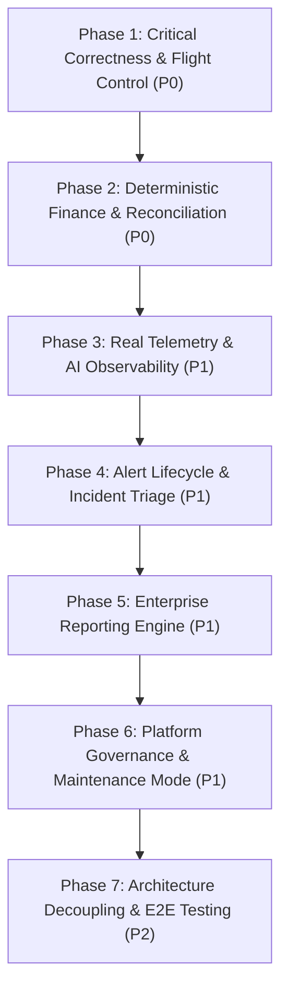

# Super Admin Command Center — Audit Summary & Executive Scorecard

> **Document Status:** Authoritative Forensic Audit Summary  
> **System:** Talnova Onboarding Enterprise Control Plane  
> **Version:** 2.0.0-AUDIT  
> **Audit Date:** September 2026  

---

## 1. Executive Summary & Audit Statistics

A forensic audit of the Talnova Onboarding Super Admin Command Center evaluated **58 discrete system requirements** across 14 operational domains. 

The audit classified each requirement strictly against the complete functional chain:
$$\text{Requirement} \to \text{UI} \to \text{Frontend State} \to \text{API} \to \text{Backend Service} \to \text{Database} \to \text{Runtime Enforcement} \to \text{Audit} \to \text{Tests}$$

### Overall Implementation Scorecard

| Implementation Status | Count | Percentage | Definition |
| :--- | :---: | :---: | :--- |
| **FULLY IMPLEMENTED** | **14** | **24.1%** | Verified complete functional chain: UI, API, DB, runtime behavior, audit logging, and automated tests. |
| **PARTIALLY IMPLEMENTED** | **22** | **37.9%** | Working UI, API, and DB persistence, but lacks runtime enforcement, edge case handling, or reconciliation. |
| **UI ONLY / PLACEHOLDER** | **8** | **13.8%** | UI controls exist (forms, modals, buttons) but execute `setTimeout` or local state only with no backend API. |
| **MOCK / HARDCODED DATA** | **5** | **8.6%** | Endpoint or UI returns static hardcoded JSON/arrays or uses synthetic multiplier formulas (e.g., `scaleFactor`). |
| **BACKEND ONLY** | **2** | **3.5%** | Backend capability exists or is modeled, but has no administrative frontend interface. |
| **DATA MODEL ONLY** | **2** | **3.5%** | Database schema defined, but lacks dedicated administrative APIs or frontend consumers. |
| **NOT IMPLEMENTED** | **5** | **8.6%** | Documented requirement completely missing across frontend, backend, and database layers. |
| **TOTAL AUDITED REQUIREMENTS** | **58** | **100.0%** | **Overall Production Readiness: ~35%** |

---

## 2. Implementation Status by Domain

| Domain | Total Req | Fully Implemented | Partially Implemented | UI Only / Placeholder | Mock Data | Not Implemented | Primary Risk |
| :--- | :---: | :---: | :---: | :---: | :---: | :---: | :--- |
| **Organizations** | 6 | 4 | 2 | 0 | 0 | 0 | AI Token quota hardcoded in 360 view |
| **Users & Sessions** | 6 | 4 | 2 | 0 | 0 | 0 | Lockout timer not reset on admin unlock |
| **Onboarding Pipeline** | 4 | 3 | 1 | 0 | 0 | 0 | Bottleneck analytics not exposed in dedicated view |
| **Operations / Tasks** | 3 | 2 | 1 | 0 | 0 | 0 | SLA overdue filter uses client date rather than DB index |
| **Command Center KPIs** | 6 | 1 | 4 | 0 | 1 | 0 | Hardcoded operating expenses ($0) in net operating result |
| **Global Search** | 2 | 2 | 0 | 0 | 0 | 0 | Nominal |
| **Feature Flags** | 5 | 0 | 2 | 0 | 0 | 3 | **P0:** Zero runtime enforcement across product; no org overrides |
| **Finance & Billing** | 8 | 0 | 4 | 1 | 1 | 2 | **P0:** Synthetic MRR formula; unconditional "Paid" invoice update |
| **Observability (API/Infra)** | 4 | 1 | 1 | 0 | 2 | 0 | **P1:** Static hardcoded API latencies (p50: 28, p95: 64, rpm: 342) |
| **AI Observability** | 3 | 0 | 0 | 0 | 1 | 2 | **P1:** Static mock tokens; token metadata discarded at runtime |
| **Storage & Media** | 2 | 1 | 1 | 0 | 0 | 0 | No orphaned file detection |
| **Incident Alerts** | 3 | 0 | 1 | 1 | 0 | 1 | Client-only acknowledgment lost on page refresh; no persistence |
| **Enterprise Reports** | 3 | 0 | 0 | 2 | 1 | 0 | 15 reports are fake 4-line client-side CSV downloads |
| **Platform Settings** | 3 | 0 | 0 | 3 | 0 | 0 | Maintenance mode, timeouts, and MFA are UI-only stubs |

---

## 3. Critical Findings (Priority P0)

### 1. SA-FLAG-003: Feature Flags Have Zero Runtime Enforcement Across the Platform
* **Evidence:** `server/src/modules/super-admin/routes/super-admin.routes.ts:1998, 2024`.
* **Impact:** Super Admins can toggle `ai_course_builder`, `sso_enforcement`, `kiosk_mode`, etc., in `SuperAdminFeatureFlags.tsx`. The API writes `{ key, enabled }` to `platform_feature_flags`. However, **not a single route, service, middleware hook, or frontend check ever queries this collection**. All tenant users continue accessing features based solely on hardcoded RBAC capabilities. The control plane toggle is completely cosmetic.
* **Remediation:** Implement `FeatureFlagService.isEnabled(flagKey, orgId, userRole)` and integrate route guards on all gated feature endpoints.

### 2. SA-FIN-003: Synthetic Multipliers in MRR Growth & Hardcoded $0 Operating Expenses
* **Evidence:** `server/src/modules/super-admin/routes/super-admin.routes.ts:1415-1416, 195`.
* **Impact:** In `GET /finance`, 6-month historical MRR is computed using:
  ```typescript
  const scaleFactor = Math.max(0.4, (6 - i) / 6);
  const histMrr = i === 0 ? totalMrr : Math.round(totalMrr * scaleFactor);
  ```
  In `GET /telemetry`, `const operatingExpenses = 0; const netOperatingResult = cashCollected - operatingExpenses;`.
  This violates the platform's core architectural principle of **Absolute Financial Truth**. Executive leadership is presented with fabricated historical growth curves.
* **Remediation:** Replace synthetic scaling with live historical aggregation over paid invoices and actual expense documents.

### 3. SA-FIN-002: Incomplete Financial Accounting & Unconditional Invoice "Paid" State
* **Evidence:** `server/src/modules/super-admin/routes/super-admin.routes.ts:1893-1898`, `invoice.model.ts:1-38`.
* **Impact:** When a payment is recorded in `POST /finance/payments`, the backend executes:
  ```typescript
  if (invoiceNo && invoiceNo !== "N/A") {
    await Invoice.findOneAndUpdate({ invoiceNo }, { $set: { status: "Paid" } });
  }
  ```
  A payment of $10 against a $10,000 invoice unconditionally marks the entire invoice as `Paid`! There is no partial payment state (`partially_paid`), no balance due calculation, no itemized line items, and no validation against overpayment. Furthermore, `PaymentRecord`, `ExpenseRecord`, and `CustomerAccount` have no Mongoose schemas and rely on unvalidated direct MongoDB collection access.
* **Remediation:** Refactor `Invoice` model with line items and balance math; introduce strict Mongoose schemas for `PaymentRecord`, `ExpenseRecord`, and `CustomerAccount`.

---

## 4. High-Priority Findings (Priority P1)

### 4. SA-OBS-001 & SA-OBS-004: Hardcoded Mock API & AI Observability Telemetry
* **Evidence:** `server/src/modules/super-admin/routes/super-admin.routes.ts:1704-1730, 1780-1800`.
* **Impact:** `GET /observability/api` returns static numbers: `{ p50: 28, p95: 64, p99: 118, rpm: 342, successRate: 99.84 }`. `GET /observability/ai` returns static literals: `{ tokensConsumed: 482000, costEstimateUSD: 1.45 }`. The underlying AI integration service (`ai-provider.service.ts`) completely discards provider token usage and latency metadata.
* **Remediation:** Implement an in-memory Fastify telemetry ring buffer for HTTP request metrics, and instrument `AIProviderService` to persist real token consumption into an `AIUsageRecord` collection.

### 5. SA-REP-001: 15 Canonical Enterprise Reports Are 100% Client-Side Mock Stubs
* **Evidence:** `src/pages/super-admin/SuperAdminReports.tsx:174-188`.
* **Impact:** Clicking "Export" on any of the 15 canonical enterprise reports executes a client-side `setTimeout(..., 600)` that generates a fake 4-line CSV string claiming `"Status,Verified Real Production Data\nCoverage,100% Deterministic"`. No backend API exists, and no real data is exported.
* **Remediation:** Implement backend streaming CSV/JSON export engine for all 15 canonical reports.

### 6. SA-SET-001: Platform Maintenance Mode & Policies Are Non-Functional Placeholders
* **Evidence:** `src/pages/super-admin/SuperAdminPlatformSettings.tsx:20-27`.
* **Impact:** Clicking "Save Platform Policies" runs a 600ms `setTimeout` and displays a success toast. No backend API is invoked. Maintenance mode is never enforced, session timeout is not dynamic, and admin MFA enforcement is not persisted.
* **Remediation:** Implement platform configuration storage and Fastify pre-handler hook enforcing maintenance mode for non-super-admins.

### 7. SA-ALT-001: Platform Incident Alerts Lack Lifecycle State & Persistence
* **Evidence:** `src/pages/super-admin/SuperAdminAlerts.tsx:48-51`, `server/src/modules/super-admin/routes/super-admin.routes.ts:2048-2108`.
* **Impact:** Alerts are synthesized in-memory on each request. The "Acknowledge" button updates local React component state only. Reloading the page clears acknowledgments. No `Alert` database model exists, and no API exists to transition alert status to investigated, resolved, or ignored.
* **Remediation:** Create `Alert` Mongoose collection and expose `PATCH /alerts/:id/status` endpoint.

---

## 5. Security & Isolation Findings

1. **Root Privilege Boundary:** `requireRole(["super_admin"])` is correctly enforced at the route prefix level (`super-admin.routes.ts:18-19`), preventing non-super-admin access (verified by Vitest returning HTTP 403).
2. **Tenant Quarantine Bypass Prevention:** When an organization is placed into quarantine (`POST /organizations/:id/quarantine`), the status is updated to `Suspended` and audited. However, existing active JWT sessions for users in that organization are not automatically invalidated, allowing active users to continue making authenticated requests until their token expires.
3. **Session Revocation Endpoint:** Super Admins can revoke individual user sessions (`POST /sessions/:sessionId/revoke`) and force-logout all sessions for a user (`POST /users/:id/force-logout`), which correctly updates `Session.isValid = false`.

---

## 6. Financial Correctness Findings

1. **No Gateway Dependency (Positive):** The system adheres to the internal manual billing architecture; there is no hidden consumer gateway dependency (Stripe/PayPal).
2. **Missing Customer Account Balances:** `GET /finance/accounts` is missing from the backend. The frontend Accounts tab renders raw organization data without calculating outstanding credit or unpaid invoice totals.
3. **P&L Operating Result Disconnect:** Net operating result in `GET /telemetry` does not sum verified payments against recorded expenses; it subtracts `$0` from paid invoice totals.

---

## 7. Recommended Remediation Order



1. **Phase 1 — Feature Flag Runtime Enforcement (P0):** Create `FeatureFlag` model, establish organization override precedence, and implement runtime guards across tenant applications.
2. **Phase 2 — Deterministic Finance & Invoicing (P0):** Refactor `Invoice`, introduce `PaymentRecord`, `ExpenseRecord`, `CustomerAccount` schemas, eliminate `scaleFactor` math, and implement partial payment balance reconciliation.
3. **Phase 3 — Telemetry Buffer & AI Usage Tracking (P1):** Implement Fastify in-memory request ring buffer and instrument `AIProviderService` with token/cost persistence.
4. **Phase 4 — Persistent Alert Workbench (P1):** Create `Alert` model and implement status transition endpoints.
5. **Phase 5 — Canonical Reporting Engine (P1):** Implement streaming CSV/JSON report generators.
6. **Phase 6 — Platform Settings & Maintenance Guard (P1):** Implement global configuration persistence and maintenance mode Fastify hook.
7. **Phase 7 — Architecture Decoupling & Test Hardening (P2):** Decouple 2112-line `super-admin.routes.ts` into clean Controller, Service, and Repository layers, backed by comprehensive Vitest suites.
