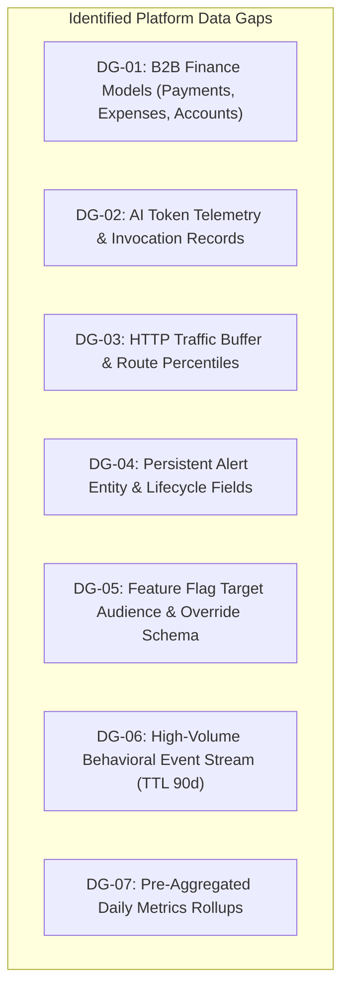

# Super Admin Technical Data Gaps & Model Deficits

> **Document Status:** Authoritative Technical Data Gap Specification  
> **System:** Talnova Onboarding Enterprise Control Plane  
> **Scope:** Granular analysis of missing database schemas, discarded metadata, and telemetry gaps.  

---

## 1. Catalog of Technical Data Gaps

---

## 2. Granular Gap Specifications

### DG-01: B2B Finance Models & Invoicing Schema Gap
* **Current State:** Only `Invoice` exists with 9 flat fields. `payment_records` and `expense_records` are accessed as raw MongoDB collections without schemas. `CustomerAccount` is absent.
* **Missing Data Points:** Itemized line items (`description`, `quantity`, `unitPrice`), `taxAmount`, `discountAmount`, `amountPaid`, `balanceDue`, `currency`, `paymentMethod`, `referenceNumber`, `billingContact`, and `creditLimit`.
* **Remediation:** Implement `PaymentRecord`, `ExpenseRecord`, `CustomerAccount` models, and refactor `Invoice` with line items.

### DG-02: AI Telemetry & Token Attribution Gap
* **Current State:** External LLM calls in `ai-provider.service.ts` discard provider response metadata (`promptTokenCount`, `candidatesTokenCount`, latency). `GET /observability/ai` returns hardcoded numbers.
* **Missing Data Points:** `AIUsageRecord` documents capturing `organizationId`, `userId`, `feature`, `provider`, `model`, `inputTokens`, `outputTokens`, `totalTokens`, `estimatedCostUsd`, `latencyMs`, and `status`.
* **Remediation:** Instrument `ai-provider.service.ts` and create `AIUsageRecord` Mongoose model.

### DG-03: HTTP Request Latency Ring Buffer Gap
* **Current State:** Pino logs to `stdout` only. No queryable in-memory buffer exists for rolling RPM or latency percentiles.
* **Missing Data Points:** Circular buffer retaining the last 5,000 requests with `timestamp`, `method`, `url`, `route`, `statusCode`, and `durationMs`.
* **Remediation:** Implement `TelemetryBuffer` in `server/src/infrastructure/telemetry/`.

### DG-04: Persistent Alert State Machine Gap
* **Current State:** Alerts are computed dynamically from 4 disparate collections. Client acknowledgment exists only in React state and is lost on refresh.
* **Missing Data Points:** `Alert` collection with `alertNo`, `category`, `severity`, `title`, `description`, `sourceService`, `status` ("open", "acknowledged", "investigating", "resolved"), `resolutionNotes`, `acknowledgedBy`, `resolvedBy`.
* **Remediation:** Implement `Alert` Mongoose model and lifecycle API.

### DG-05: Feature Flag Entity & Precedence Schema Gap
* **Current State:** Direct key-value persistence in `platform_feature_flags` without a model.
* **Missing Data Points:** `FeatureFlag` model with `targetAudience` ("global", "organizations", "roles", "percentage"), `targetOrganizationIds: [ObjectId]`, `targetRoles: [String]`, `rolloutPercentage: Number`, and audit history.
* **Remediation:** Create `FeatureFlag` model and evaluation service.

### DG-06: High-Volume Platform Behavioral Event Gap
* **Current State:** Non-audit user behavior (navigation, module access, search queries) is not persisted, preventing drop-off analysis.
* **Missing Data Points:** `PlatformEvent` collection with 90-day TTL index capturing actor, organization, event type, target entity, and client metadata.
* **Remediation:** Implement `PlatformEvent` model with MongoDB TTL index.

### DG-07: Pre-Aggregated Daily Metric Rollup Gap
* **Current State:** `GET /telemetry` runs 24 separate MongoDB queries inside a 6-month loop on every request.
* **Missing Data Points:** `SystemMetricDaily` collection storing historical daily snapshots of active tenants, users, cases, and revenue.
* **Remediation:** Implement daily midnight aggregation worker and `SystemMetricDaily` model.
