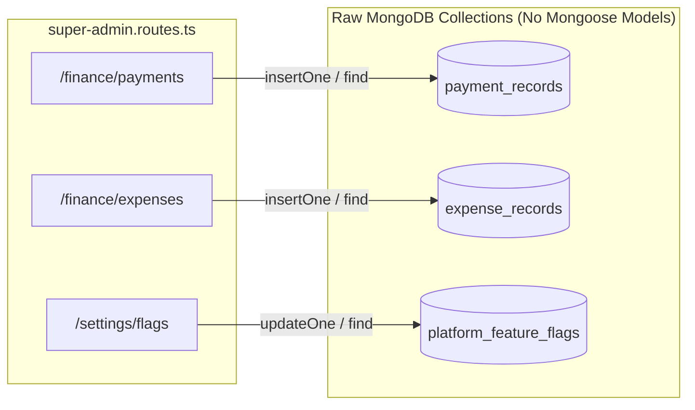

# Super Admin Database & Schema Architecture Audit

> **Document Status:** Authoritative Database Audit  
> **Database Engine:** MongoDB Atlas via Mongoose v8.8.2  
> **Audited Models:** Models in `server/src/modules/*/models/` and direct collection accesses.  

---

## 1. Executive Summary of Database Layer

The database audit evaluated schema completeness, data type integrity, secondary indexes, and model adherence to enterprise standards across the platform.

### Summary Findings:
* **1 Dedicated Model Implemented:** Only `Invoice` exists under `server/src/modules/super-admin/models/invoice.model.ts`.
* **3 Unmodeled Raw Collections in Active Use:** `platform_feature_flags`, `payment_records`, and `expense_records` are queried and mutated using raw `mongoose.connection.db.collection(...)` calls without Mongoose schemas, TypeScript interfaces, validation, or indexes.
* **8 Required Enterprise Models Missing:** `PaymentRecord`, `ExpenseRecord`, `CustomerAccount`, `AIUsageRecord`, `Alert`, `FeatureFlag`, `PlatformEvent`, and `SystemMetricDaily` have no Mongoose schema definitions.

---

## 2. Existing Model Inspection

### 2.1 The Existing `Invoice` Model (`invoice.model.ts`)
* **Current Schema Fields:**
  ```typescript
  invoiceNo: { type: String, required: true, unique: true },
  organizationId: { type: Schema.Types.ObjectId, ref: "Organization" },
  organization: { type: String, required: true },
  amount: { type: Number, required: true },
  type: { type: String, enum: ["Invoice", "Receipt"], required: true },
  status: { type: String, enum: ["Paid", "Pending", "Overdue"], required: true },
  dueDate: { type: String, required: true }, // Stored as STRING rather than Date!
  description: { type: String, required: true },
  isDeleted: { type: Boolean, default: false }
  ```
* **Defects Identified:**
  1. **`dueDate` stored as String:** Prevents indexed date-range queries or native overdue aggregations.
  2. **No Line Items:** Line items (`description`, `quantity`, `unitPrice`, `amount`) cannot be itemized.
  3. **No Balance Tracking:** Lacks `amountPaid`, `balanceDue`, `subtotal`, `taxAmount`, and `discountAmount`.
  4. **No Currency Specification:** Hardcoded assumption of USD with no currency field.
  5. **No Creator Tracking:** Missing `createdBy` and `updatedBy` references for financial auditability.

### 2.2 The `AuditLog` Model (`audit-log.model.ts`)
* **Current Schema Fields:**
  Includes `organizationId` (optional), `actorUserId`, `actorType`, `eventCategory`, `eventType`, `resourceType`, `resourceId`, `action`, `description`, `metadata`, `request`, and `severity`.
* **Verdict: COMPLIANT.** Properly supports platform-wide actions where `organizationId` is undefined, with expanded category enums (`finance`, `ai`, `infrastructure`, `admin`, `feature_flag`).

---

## 3. Unmodeled Collections Analysis

The following collections are actively accessed in `super-admin.routes.ts` via direct raw MongoDB driver calls:



### Risks of Unmodeled Collections:
1. **Zero Schema Validation:** Malformed or missing fields (e.g. negative numbers, missing references) pass silently into production collections.
2. **Missing Secondary Indexes:** Queries on `payment_records` sort by `recordedAt` without an index, resulting in COLLSCANs on large datasets.
3. **No Mongoose Middleware/Hooks:** Lifecycle events (such as balance recalculations or automatic audit logging) cannot be attached.

---

## 4. Required New Mongoose Models

To achieve architectural maturity and satisfy documented requirements in `database-requirements.md`, the following 8 models must be formally implemented:

| Model Name | Target Collection | Primary Fields | Key Indexes |
| :--- | :--- | :--- | :--- |
| **`PaymentRecord`** | `payment_records` | `paymentNo`, `invoiceId`, `organizationId`, `amount`, `currency`, `paymentDate`, `paymentMethod`, `referenceNumber`, `verificationStatus`, `recordedBy` | `{ organizationId: 1, paymentDate: -1 }`, `{ referenceNumber: 1 }` |
| **`ExpenseRecord`** | `expense_records` | `expenseNo`, `category`, `vendor`, `amount`, `currency`, `expenseDate`, `description`, `organizationId`, `isRecurring`, `createdBy` | `{ expenseDate: -1, category: 1 }` |
| **`CustomerAccount`**| `customer_accounts` | `organizationId`, `accountStatus`, `billingContact`, `preferredCurrency`, `billingCycle`, `creditLimit`, `commercialNotes` | `{ organizationId: 1 }` (unique) |
| **`AIUsageRecord`** | `ai_usage_records` | `organizationId`, `userId`, `feature`, `provider`, `model`, `inputTokens`, `outputTokens`, `totalTokens`, `estimatedCostUsd`, `latencyMs`, `status`, `createdAt` | `{ organizationId: 1, createdAt: -1 }`, `{ feature: 1 }` |
| **`Alert`** | `alerts` | `alertNo`, `category`, `severity`, `title`, `description`, `sourceService`, `organizationId`, `status`, `resolutionNotes`, `acknowledgedBy`, `resolvedBy`, `createdAt` | `{ status: 1, severity: 1, createdAt: -1 }` |
| **`FeatureFlag`** | `feature_flags` | `key`, `name`, `description`, `isEnabled`, `environment`, `targetAudience`, `targetOrganizationIds`, `rolloutPercentage`, `auditHistory` | `{ key: 1 }` (unique) |
| **`PlatformEvent`** | `platform_events` | `eventId`, `eventType`, `category`, `actorId`, `organizationId`, `targetId`, `metadata`, `ipAddress`, `timestamp` | `{ timestamp: 1 }` (TTL: 90 days), `{ organizationId: 1, timestamp: -1 }` |
| **`SystemMetricDaily`**| `system_metrics_daily` | `date`, `activeOrganizations`, `platformUsers`, `activeOnboardings`, `totalRevenue`, `totalExpenses`, `p95LatencyMs`, `errorRatePct` | `{ date: 1 }` (unique) |

---

## 5. Indexing & Migration Strategy

1. **Convert `Invoice.dueDate` to `Date`:** Existing string representations (`YYYY-MM-DD`) must be migrated to native ISODate objects.
2. **Add Compound Indexes:**
   * `Invoice`: `{ organizationId: 1, status: 1, isDeleted: 1 }`
   * `PaymentRecord`: `{ invoiceId: 1, verificationStatus: 1 }`
   * `Alert`: `{ status: 1, severity: 1 }`
3. **Establish TTL Indexes:**
   * `PlatformEvent`: `{ timestamp: 1 }` with `expireAfterSeconds: 7776000` (90 days).
