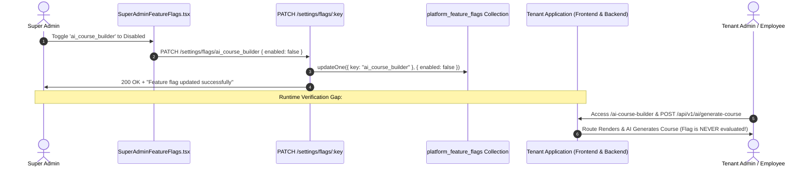

# Super Admin Feature Flag & Flight Control Audit

> **Document Status:** Authoritative Feature Flag Audit  
> **System:** Talnova Onboarding Enterprise Control Plane  
> **Evaluation Standards:** Complete lifecycle verification from admin toggle to runtime tenant application enforcement.  

---

## 1. Executive Summary & Root Finding

A dedicated audit of the feature flag subsystem was conducted per Section 16 of the audit directives.

### Definitive Finding (Critical P0):
The platform feature flag system is **PARTIALLY IMPLEMENTED on the admin control plane, but 100% UNENFORCED at runtime across the platform**.



---

## 2. Complete Lifecycle Evaluation

### 2.1 Administrative UI (`SuperAdminFeatureFlags.tsx`)
* **Controls:** Displays 5 platform feature flags with visual status badges, kill switches, and rollout percentage dropdowns (10%, 25%, 50%, 100%).
* **Missing:** No organization picker or per-tenant override controls exist in the UI.

### 2.2 Backend APIs (`GET /settings/flags`, `PATCH /settings/flags/:key`)
* **Implementation:** `GET /settings/flags` merges 5 hardcoded default flag definitions with documents stored in `platform_feature_flags`. `PATCH /settings/flags/:key` updates the collection and creates a `FLAG_TOGGLED` audit log.
* **Missing:** No endpoints exist to create custom feature flags, delete flags, or configure tenant-specific overrides (`PATCH /settings/flags/:key/organizations/:orgId`).

### 2.3 Database Persistence (`platform_feature_flags`)
* **Implementation:** Persisted directly via `mongoose.connection.db.collection("platform_feature_flags")`.
* **Missing:** No formal Mongoose model (`FeatureFlag`) exists; schema lacks target audience rules, environment selectors, and target organization ID arrays.

### 2.4 Runtime Evaluation & Product Enforcement (The Core Defect)
* An exhaustive search across the entire codebase confirmed that `platform_feature_flags` is referenced in **ONLY TWO LINES** in the entire application:
  * `server/src/modules/super-admin/routes/super-admin.routes.ts:1998` (Read flags in admin API)
  * `server/src/modules/super-admin/routes/super-admin.routes.ts:2024` (Write flags in admin API)
* **Product Impact:**
  * In `src/App.tsx:143`, `/ai-course-builder` is protected solely by `capability="ai_course_builder"`, which is statically granted to `owner`, `admin`, `manager`, and `employee` in `src/utils/rbac.ts`.
  * In `server/src/modules/ai/routes/ai-assistant.routes.ts:27-33`, `/generate-course` and `/course-builder/*` routes enforce only `requireRole(["owner", "admin"])`.
  * Neither the frontend router, command palette, navigation sidebar, nor backend API controllers check whether the feature flag is enabled!
  * **Result:** Super Admin believes the feature is disabled, but all tenants continue using it without restriction.

---

## 3. Flag Precedence & Resolution Specification

To achieve compliance with enterprise multi-tenant standards, the platform must implement deterministic four-tier precedence resolution:

$$\text{Global Kill Switch} \longrightarrow \text{Tenant Organization Override} \longrightarrow \text{Role Override} \longrightarrow \text{User Override} \longrightarrow \text{Default (Disabled)}$$

```text
1. Global Kill Switch:
   IF flag.isEnabled == false -> RETURN FALSE (Global Override)

2. Organization Override:
   IF flag.targetOrganizationIds.includes(currentOrgId) -> RETURN TRUE
   IF flag.excludedOrganizationIds.includes(currentOrgId) -> RETURN FALSE

3. Role Override:
   IF flag.targetRoles.includes(currentUserRole) -> RETURN TRUE

4. Progressive Rollout Percentage:
   hash(flagKey + currentOrgId) % 100 < rolloutPercentage -> RETURN TRUE

5. Default Fallback:
   RETURN flag.isEnabled
```

---

## 4. Caching & Invalidation Architecture

* **Current Reality:** Zero caching exists because flags are never evaluated outside the admin route.
* **Required Architecture:**
  * In-memory LRU cache in backend `FeatureFlagService` with a 60-second TTL.
  * Immediate cache invalidation on `PATCH /settings/flags/:key`.
  * Contextual feature flag payload delivered to frontend during user session bootstrap (`/api/v1/auth/me`).

---

## 5. Auditability & Evidence

* **Admin Mutation Audited:** `super-admin.routes.ts:2030-2039` logs an immutable audit event (`FLAG_TOGGLED`) recording `actorUserId`, `severity: "warning"`, and previous/new state.
* **Remediation Priority:** **P0 — Critical Flight Control Requirement.**
