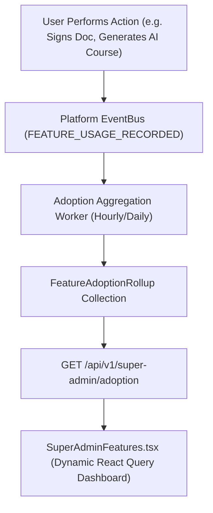

# Feature Adoption Telemetry Forensic Audit

> **Document Status:** Authoritative Analytics & Telemetry Audit  
> **Target:** `src/pages/super-admin/SuperAdminFeatures.tsx` & Backend Adoption Services  
> **Standard:** Real Enterprise Telemetry, Eligibility Filtering, and Zero-Mock Policy  
> **Date:** September 2026  

---

## 1. Executive Summary

The Super Admin Feature Adoption dashboard (`/super-admin/product/features`) was designed to provide cross-tenant product usage analytics, capability utilization, and enterprise enablement telemetry.

However, forensic inspection reveals that **the Feature Adoption page is a 100% hardcoded static mock**. It makes zero network calls to the backend, calculates no real metrics, and tracks only 5 arbitrary features out of 105 actual capabilities.

---

## 2. Forensic Deconstruction of `SuperAdminFeatures.tsx`

Inspection of `src/pages/super-admin/SuperAdminFeatures.tsx:18-74` demonstrates the following static array:

```typescript
const features = [
  {
    id: 'ai-courses',
    name: 'AI Course Generator (Gemini)',
    description: 'Generative AI automated onboarding curriculum builder with quizzes',
    adoptionPct: 82,
    activeTenants: 14,
    totalTenants: 17,
    category: 'Intelligence',
    icon: Bot,
    status: 'GA'
  },
  {
    id: 'sso-enterprise',
    name: 'Enterprise SAML 2.0 & OIDC SSO',
    description: 'Okta, Azure AD, and custom identity provider authentication gateway',
    adoptionPct: 76,
    activeTenants: 13,
    totalTenants: 17,
    category: 'Security',
    icon: KeyRound,
    status: 'GA'
  },
  {
    id: 'hris-webhooks',
    name: 'Real-Time HRIS Integration Sync',
    description: 'Automated worker ingestion from BambooHR, Workday, and HiBob',
    adoptionPct: 65,
    activeTenants: 11,
    totalTenants: 17,
    category: 'Integration',
    icon: Workflow,
    status: 'GA'
  },
  {
    id: 'kiosk-terminals',
    name: 'Kiosk Orientation Displays',
    description: 'Public tablet and wall terminal player mode for physical campuses',
    adoptionPct: 41,
    activeTenants: 7,
    totalTenants: 17,
    category: 'Hardware',
    icon: Tv,
    status: 'Beta'
  },
  {
    id: 'gamification',
    name: 'Learner Gamification & Badges',
    description: 'Milestone badges, streak multipliers, and departmental leaderboards',
    adoptionPct: 88,
    activeTenants: 15,
    totalTenants: 17,
    category: 'Engagement',
    icon: Trophy,
    status: 'GA'
  }
];
```

### Forensic Violations Identified
1. **Zero Network Traffic:** The React component makes no HTTP requests via `apiClient`, React Query, or `fetch`.
2. **Static Synthetic Constants:** The values `activeTenants: 14 / 17 (82%)` and `15 / 17 (88%)` are hardcoded literals rendered identically regardless of tenant count or actual platform usage.
3. **Severe Coverage Failure:** Only 5 features are displayed; 100 platform capabilities have zero representation.
4. **Key Decoupling:** IDs (`ai-courses`, `sso-enterprise`, `hris-webhooks`, `kiosk-terminals`, `gamification`) do not align with backend feature flag keys.
5. **Missing Backend Endpoint:** No backend route exists under `/api/v1/super-admin/adoption` or `/api/v1/super-admin/features/adoption`.

---

## 3. Target Telemetry Architecture

To fulfill enterprise standards, Feature Adoption must be transformed from a static mock into an authoritative telemetry pipeline:



### Authoritative Metric Calculation Formulas

1. **Organization Adoption Rate:**
   $$\text{Org Adoption \%} = \frac{\text{Active Organizations with } \ge 1 \text{ Event in Last 30 Days}}{\text{Eligible Organizations with Feature Enabled}} \times 100$$

2. **Eligible User Adoption Rate:**
   $$\text{User Adoption \%} = \frac{\text{Unique Eligible Users with } \ge 1 \text{ Event}}{\text{Total Eligible Users in Active Organizations}} \times 100$$

3. **Adoption Trend:**
   30-day rolling time-series showing event frequency and unique daily active users (DAU).

---

## 4. Remediation Requirements

1. Create Mongoose model `FeatureUsageRecord` and `FeatureAdoptionDailyRollup`.
2. Instrument key controllers to record feature usage events.
3. Expose `GET /api/v1/super-admin/analytics/feature-adoption` returning all 105 registered features.
4. Refactor `SuperAdminFeatures.tsx` to query the real API with search, domain filtering, and drill-down modals.
