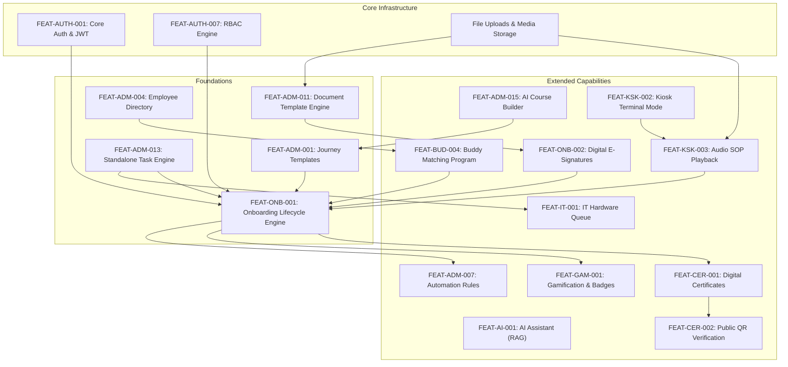

# Feature Dependency & Cascade Impact Map

> **Document Status:** Authoritative Architecture Dependency Specification  
> **System:** Talnova Onboarding Enterprise Control Plane  
> **Target:** Dependency Directed Acyclic Graph (DAG) & Cascading Invalidation Engine  
> **Date:** September 2026  

---

## 1. Executive Summary & Dependency Principles

Features within an enterprise SaaS platform do not exist in isolation. Many capabilities serve as foundational infrastructure for higher-level workflows. 

### Core Dependency Axioms
1. **Upstream Disablement Cascades Downstream:** If a foundational feature is disabled, all dependent child features must either disable automatically or enter a degraded fallback state.
2. **Super Admin Warning Standard:** When an administrator attempts to disable Feature A, the system must warn:
   > *"Disabling Feature A will also affect or degrade Feature B, Feature C, and User Journey X."*
3. **Graceful Degradation vs. Hard Interruption:** Child features should gracefully degrade where possible rather than throwing runtime errors.

---

## 2. Feature Dependency Graph (Mermaid)

---

## 3. Dependency Inventory & Impact Matrix

| Feature | Upstream Prerequisites | Downstream Dependents | Disablement Impact on Dependents | Current Warning in UI? |
| :--- | :--- | :--- | :--- | :---: |
| **`FEAT-AUTH-001` (Core Auth)** | None | All Features | System unavailable. | N/A (Cannot toggle) |
| **`FEAT-ADM-001` (Journeys)** | Core Auth, Roles | AI Course Builder, Candidate Roadmap, Quizzes | Disabling journeys halts candidate progression and AI course publishing. | **NO (Missing)** |
| **`FEAT-ADM-015` (AI Builder)** | `FEAT-ADM-001` (Journeys), Gemini API | None | Disabling AI Builder forces admins to create courses manually. Zero impact on candidate progression. | N/A |
| **`FEAT-ADM-011` (Doc Templates)**| Uploads, Storage | `FEAT-ONB-002` (E-Signatures) | Disabling document templates halts candidate e-signature requests. | **NO (Missing)** |
| **`FEAT-ONB-002` (E-Signatures)** | `FEAT-ADM-011` (Doc Templates) | `FEAT-ONB-001` (Roadmap Step) | Disabling e-signatures blocks mandatory compliance signing steps. | **NO (Missing)** |
| **`FEAT-KSK-002` (Kiosks)** | Storage, Core Auth | `FEAT-KSK-003` (Audio SOP), `FEAT-KSK-004` (PPE) | Disabling kiosks disables physical floor terminal playback. Candidates must use mobile/desktop. | **NO (Missing)** |
| **`FEAT-ADM-013` (Tasks)** | Core Auth, Roles | `FEAT-IT-001` (IT Queue), Candidate Tasks | Disabling tasks halts IT provisioning tracking and employee checklists. | **NO (Missing)** |
| **`FEAT-BUD-004` (Buddy Match)** | `FEAT-ADM-004` (Directory) | `FEAT-ONB-007` (Buddy Connect) | Disabling buddy program skips buddy step on candidate roadmap. | **NO (Missing)** |
| **`FEAT-CER-001` (Certificates)** | `FEAT-ONB-001` (Roadmap) | `FEAT-CER-002` (Public QR) | Disabling certificates disables graduation credential issuance. | **NO (Missing)** |
| **`FEAT-ADM-007` (Workflows)** | Core Auth, EventBus | Auto-assignments, auto-emails | Disabling workflows freezes automated rule triggers; operations must be manual. | **NO (Missing)** |

---

## 4. Architectural Findings & Remediation Requirements

1. **Missing Administrative Warning Modal:**
   When an administrator toggles a feature flag in `SuperAdminFeatureFlags.tsx`, the UI currently executes the patch immediately without checking or displaying downstream dependencies.
2. **Missing Cascade Engine:**
   The backend `FeatureFlagService` evaluates flags independently. If an upstream feature is disabled (e.g. `doc_templates`), a downstream request to `/documents/:id/sign` is not automatically flagged as disabled unless `digital_signatures` is also explicitly toggled.
3. **Recommendation:**
   * Implement `FeatureDependencyService.getImpactedFeatures(flagKey)` in the backend.
   * Add an interactive confirmation modal in `SuperAdminFeatureFlags.tsx` warning of affected features, journeys, and role experiences prior to applying mutations.
