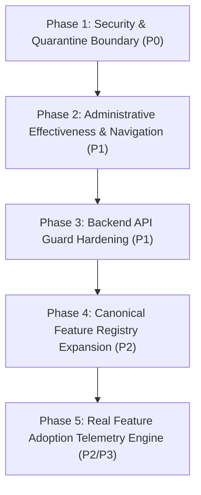

# Second-Generation Strategic Remediation Plan

> **Document Status:** Authoritative Phased Execution Roadmap  
> **System:** Talnova Onboarding Enterprise Control Plane & Platform  
> **Target:** Complete Multi-Layer Governance, Administrative Effectiveness & Real Telemetry  
> **Date:** September 2026  

---

## 1. Executive Roadmap & Phasing

To transform the Super Admin Command Center into an authoritative, end-to-end control plane, remediation is structured into **5 sequential phases**:

---

## 2. Granular Phased Execution Specifications

### Phase 1: Security & Quarantine Session Revocation (P0)
* **Goal:** Eliminate the active JWT session leak when organizations are quarantined.
* **Key Tasks:**
  1. Update `quarantineOrganization(orgId)` to automatically revoke all active sessions in `sessions` collection.
  2. Implement an in-memory/Redis `suspendedOrganizations` Set in Fastify's `authenticate` hook to immediately reject tokens from suspended tenants with HTTP 403.
* **Target Prompts:** `PR-SEC-001`
* **Verification:** Vitest integration test verifying active JWT immediately receives 403 upon organization quarantine.

### Phase 2: Administrative Effectiveness — Navigation, Dashboards & Routes (P1)
* **Goal:** Ensure disabling a feature in Super Admin immediately hides navigation items, removes dashboard cards, and protects frontend routes.
* **Key Tasks:**
  1. Add `featureFlag?: string` to `NavItem` in `src/components/AppShell.tsx` and filter arrays using `hasFeature()`.
  2. Apply dynamic filtering to `MobileBottomNav.tsx` and `CommandPalette.tsx`.
  3. Wrap cards and widgets in `AdminDashboard.tsx`, `ManagerDashboard.tsx`, and `EmployeeDashboard.tsx` with `hasFeature()` conditional rendering.
  4. Add `featureFlag` attributes to all gated routes in `src/App.tsx`.
  5. Resolve key naming mismatches (`gamified_milestones` vs `gamification_badges`).
* **Target Prompts:** `PR-NAV-001`, `PR-ROU-001`, `PR-DSH-001`
* **Verification:** Vitest / component tests proving that setting `features[key] = false` removes the menu item, hides the dashboard card, and renders the friendly unavailable screen on direct route entry.

### Phase 3: Backend API Route Guard Hardening (P1)
* **Goal:** Enforce the security boundary at the API layer across all 25 ungoverned modules.
* **Key Tasks:**
  1. Attach `requireFeatureFlag(key)` pre-handler hooks across Fastify route registrations:
     * `/api/v1/journeys` (`journey_templates`)
     * `/api/v1/documents` (`digital_signatures` / `doc_templates`)
     * `/api/v1/tasks` (`checklist_tasks` / `task_templates`)
     * `/api/v1/workflows` (`workflow_rules`)
     * `/api/v1/milestones` (`milestone_ratings` / `milestone_approval`)
     * `/api/v1/buddy` (`buddy_connection` / `buddy_assignment`)
     * `/api/v1/calendar` (`calendar_integration`)
     * `/api/v1/gamification` (`gamified_milestones`)
     * `/api/v1/locations` (`office_map`)
     * `/api/v1/hr` (`hr_ops_dashboard`)
* **Target Prompts:** `PR-API-001`, `PR-API-002`
* **Verification:** Vitest integration tests verifying direct HTTP requests to disabled feature endpoints return HTTP 403 (`FEATURE_DISABLED`).

### Phase 4: Canonical Feature Registry Expansion & UI Controls (P2)
* **Goal:** Expand the feature flag seed list to encompass all 105 product features and expose role-targeting controls.
* **Key Tasks:**
  1. Expand `DEFAULT_PLATFORM_FLAGS` in `super-admin.service.ts` to include all 105 canonical features.
  2. Add multi-select role checkboxes (`targetRoles`) to the override modal in `SuperAdminFeatureFlags.tsx`.
  3. Add dependency impact warnings in Super Admin before toggling flags.
* **Target Prompts:** `PR-GOV-001`, `PR-GOV-002`
* **Verification:** Verify all 105 features appear in `GET /settings/flags` and can be targeted by role.

### Phase 5: Real Feature Adoption Telemetry Engine (P2 / P3)
* **Goal:** Replace the 5-card static mock with real, authoritative adoption analytics.
* **Key Tasks:**
  1. Implement `FeatureUsageRecord` schema and aggregation worker.
  2. Instrument product controllers to emit `FEATURE_USED` events.
  3. Expose `GET /api/v1/super-admin/adoption` with organization-level and role-level adoption rates.
  4. Refactor `SuperAdminFeatures.tsx` to consume the real API with search, domain tabs, and drill-down modal dossiers.
* **Target Prompts:** `PR-TEL-001`, `PR-TEL-002`
* **Verification:** Seed feature usage records and verify real percentages, tenant counts, and trend graphs render dynamically.
