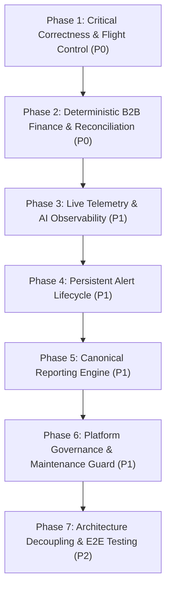

# Super Admin Remediation Roadmap & Implementation Plan

> **Document Status:** Authoritative Remediation Plan  
> **System:** Talnova Onboarding Enterprise Control Plane  
> **Target:** 100% Functional Integrity & Operational Readiness  

---

## 1. Executive Remediation Strategy

Based on the forensic audit findings across the 58 requirements, remediation is structured into **7 sequential phases** ordered by dependency and security/financial severity.

---

## 2. Phased Implementation Roadmap

### Phase 1 — Feature Flag Runtime Flight Control (Priority P0)
* **Goal:** Enable platform kill switches and organization-level feature overrides that actually control tenant application behavior.
* **Deliverables:**
  1. Create `FeatureFlag` Mongoose model with `targetOrganizationIds`, `rolloutPercentage`, and audit history.
  2. Implement `FeatureFlagService.isEnabled(key, orgId, role)` with in-memory caching.
  3. Integrate feature flag route guards on tenant routes (`/ai-course-builder`, `/kiosks`, etc.).
  4. Expose organization-level override UI in `SuperAdminFeatureFlags.tsx`.
* **Companion Prompts:**
  * `prompts/super-admin/feature-flags/001-feature-flag-schema-and-admin-api.md`
  * `prompts/super-admin/feature-flags/002-runtime-organization-feature-enforcement.md`

---

### Phase 2 — Deterministic B2B Finance & Reconciliation (Priority P0)
* **Goal:** Eliminate synthetic multipliers, establish strict accounting models, and implement partial payment balance reconciliation.
* **Deliverables:**
  1. Refactor `Invoice` model to support itemized line items, `currency`, `subtotal`, `taxAmount`, `discountAmount`, `amountPaid`, and `balanceDue`.
  2. Create formal Mongoose models: `PaymentRecord`, `ExpenseRecord`, and `CustomerAccount`.
  3. Implement deterministic payment reconciliation:
     $$\text{amountPaid} \mathrel{+}= \text{payment}; \quad \text{balanceDue} = \text{totalAmount} - \text{amountPaid}; \quad \text{status} = \text{balanceDue} \le 0 \ ? \ \text{"paid"} : \text{"partially_paid"}$$
  4. Connect `GET /telemetry` to real `expense_records` and replace synthetic `scaleFactor` with true historical paid invoice sums.
  5. Implement `GET /api/v1/super-admin/finance/accounts` and connect the frontend Accounts tab.
* **Companion Prompts:**
  * `prompts/super-admin/finance/001-invoice-model-refactoring-and-line-items.md`
  * `prompts/super-admin/finance/002-payment-records-and-balance-reconciliation.md`
  * `prompts/super-admin/finance/003-operating-expenses-and-deterministic-pnl.md`
  * `prompts/super-admin/finance/004-customer-accounts-and-tier-billing.md`
  * `prompts/super-admin/analytics/001-elimination-of-synthetic-telemetry-multipliers.md`

---

### Phase 3 — Live Telemetry Ring Buffer & Real AI Observability (Priority P1)
* **Goal:** Replace hardcoded static constants with live, queryable APM and AI consumption telemetry.
* **Deliverables:**
  1. Implement `TelemetryBuffer` (5,000-slot circular ring buffer) in Fastify `onResponse` hook.
  2. Implement live P50, P95, P99 latency percentiles and RPM throughput in `GET /observability/api`.
  3. Create `AIUsageRecord` Mongoose model.
  4. Instrument `AIProviderService` to capture provider token metadata and latency, and persist them asynchronously.
  5. Connect `GET /observability/ai` to real aggregated `AIUsageRecord` documents.
* **Companion Prompts:**
  * `prompts/super-admin/observability/001-api-telemetry-ring-buffer.md`
  * `prompts/super-admin/observability/002-ai-token-consumption-and-cost-telemetry.md`

---

### Phase 4 — Persistent Alert Workbench & Lifecycle Triage (Priority P1)
* **Goal:** Implement persistent platform incident management with status tracking.
* **Deliverables:**
  1. Create `Alert` Mongoose model with `status: ["open", "acknowledged", "investigating", "resolved", "ignored"]`.
  2. Implement `PATCH /api/v1/super-admin/alerts/:id/status` endpoint with audit logging.
  3. Connect frontend `SuperAdminAlerts.tsx` to persist acknowledgments and resolutions.
* **Companion Prompts:**
  * `prompts/super-admin/alerts/001-persistent-alert-model-and-resolution-workflow.md`

---

### Phase 5 — Canonical Enterprise Reporting Engine (Priority P1)
* **Goal:** Replace fake client-side `setTimeout` CSV generation with real backend streaming report exporters.
* **Deliverables:**
  1. Implement backend report generator service for all 15 canonical enterprise reports.
  2. Expose streaming endpoints returning real CSV/JSON with audit logging (`DATA_EXPORTED`).
  3. Connect `SuperAdminReports.tsx` to dispatch real export requests.
* **Companion Prompts:**
  * `prompts/super-admin/reports/001-canonical-reports-generation-engine.md`

---

### Phase 6 — Platform Governance & Maintenance Guard (Priority P1)
* **Goal:** Implement real platform maintenance windows and active session cascading invalidations.
* **Deliverables:**
  1. Create `PlatformSetting` model for global governance parameters.
  2. Implement Fastify `onRequest` hook blocking non-super-admin traffic when Maintenance Mode is active.
  3. Implement cascading session invalidation upon tenant quarantine.
  4. Connect `SuperAdminPlatformSettings.tsx` to real backend persistence APIs.
* **Companion Prompts:**
  * `prompts/super-admin/settings/001-platform-governance-and-maintenance-mode.md`

---

### Phase 7 — Architecture Decoupling & Test Hardening (Priority P2)
* **Goal:** Decouple monolithic 2,112-line `super-admin.routes.ts` into clean layered architecture and achieve 90%+ integration test coverage.
* **Deliverables:**
  1. Extract routes into dedicated Controllers, Services, and Repositories (`SuperAdminController`, `SuperAdminService`).
  2. Expand Vitest integration test suite to cover feature flag runtime enforcement, multi-tenant negative isolation, and partial payment reconciliation.
* **Companion Prompts:**
  * `prompts/super-admin/architecture/001-super-admin-controller-layer-refactoring.md`
