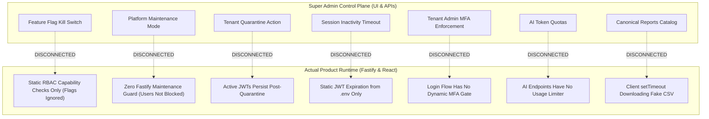

# Super Admin Runtime Integration & Control Plane Disconnect Audit

> **Document Status:** Authoritative Runtime Gap Specification  
> **System:** Talnova Onboarding Enterprise Control Plane  
> **Scope:** Analysis of disconnects where Super Admin settings fail to alter actual tenant-facing application behavior.  

---

## 1. Executive Summary of Runtime Disconnects

A central tenet of an enterprise control plane is that **mutations performed by platform operators must deterministically alter product runtime behavior**.

The audit identified **7 critical runtime disconnects** where the Super Admin UI allows an administrator to configure, toggle, or save a setting, but the underlying product runtime behavior remains completely unchanged:

---

## 2. Granular Runtime Disconnect Analysis

### 2.1 Feature Flags Runtime Disconnect (Critical P0)
* **Control Plane Behavior:** Super Admin navigates to `/super-admin/settings/flags` and disables `ai_course_builder`. The API writes `{ key: "ai_course_builder", enabled: false }` to MongoDB.
* **Product Runtime Reality:**
  * Tenant Admin logs into tenant dashboard and clicks `/ai-course-builder`.
  * `App.tsx:143` checks only `capability="ai_course_builder"`, which resolves to `true` based on the user's role.
  * Tenant Admin submits prompt to `/api/v1/ai/generate-course`.
  * The backend controller executes the Gemini LLM prompt and returns the course draft.
  * **Result:** Disabling the flag in Super Admin had **zero effect** on the tenant application.

### 2.2 Platform Maintenance Mode Disconnect (High P1)
* **Control Plane Behavior:** Super Admin toggles Maintenance Mode to "Enabled" and enters a broadcast message in `SuperAdminPlatformSettings.tsx`.
* **Product Runtime Reality:**
  * Form submission executes a 600ms client `setTimeout` and shows a fake success toast.
  * No Fastify `onRequest` hook exists in `server/src/app.ts` to inspect maintenance state.
  * Non-super-admin users continue logging in and transacting normally.

### 2.3 Tenant Quarantine Active Session Persistence (High P1)
* **Control Plane Behavior:** Super Admin clicks "Quarantine" on Organization 360, setting `Organization.status = "Suspended"`.
* **Product Runtime Reality:**
  * While new logins for that tenant are blocked by `auth.service.ts`, users who already possess active JWT tokens can continue issuing requests for the duration of the token TTL (up to 24h).
  * The quarantine action fails to invalidate active tokens in the `Session` collection.

### 2.4 Session Inactivity Timeout Disconnect (Medium P2)
* **Control Plane Behavior:** Super Admin adjusts "Global Session Inactivity Timeout" from 60 to 15 minutes.
* **Product Runtime Reality:**
  * The value is never sent to the backend.
  * Fastify JWT (`plugins/jwt.ts`) and Cookie (`plugins/cookie.ts`) utilize static expiration parameters configured in environment variables (`JWT_SECRET`, default 7d refresh / 15m access), ignoring admin settings.

### 2.5 Tenant Admin MFA Enforcement Disconnect (Medium P2)
* **Control Plane Behavior:** Super Admin toggles "Enforce Dual-Factor (MFA) for Tenant Admins".
* **Product Runtime Reality:**
  * Setting is not persisted.
  * The authentication flow in `auth.service.ts:login` evaluates MFA solely based on the individual user's `user.security.mfaEnabled` flag, with no platform-wide organizational policy enforcement.

### 2.6 AI Token Quota Limit Disconnect (Medium P2)
* **Control Plane Behavior:** Organization 360 displays an AI Token Budget (e.g. 1,000,000 tokens/month).
* **Product Runtime Reality:**
  * AI endpoints in `ai-assistant.routes.ts` execute LLM requests without checking current token consumption or enforcing quota cutoffs.

### 2.7 Canonical Reports Export Disconnect (High P1)
* **Control Plane Behavior:** Super Admin clicks "Export" on any of the 15 enterprise reports in `SuperAdminReports.tsx`.
* **Product Runtime Reality:**
  * A client-side `setTimeout` creates a synthetic Blob with 4 static lines of text.
  * The backend has no report generation engine, no data query logic, and no streaming endpoints.
