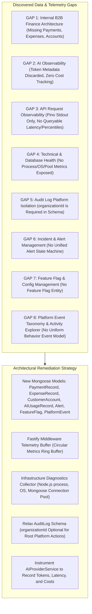

# Super Admin Data & Observability Gap Analysis

> **Document Status:** Authoritative Technical Gap Specification  
> **System:** Talnova Onboarding Enterprise Platform  
> **Scope:** In-depth technical breakdown and remediation roadmap for all data, schema, and telemetry gaps identified during repository discovery.

---

## 1. Executive Summary of Critical Gaps

During repository inspection of the backend (`server/src`) and database models (`mongoose`), 8 foundational data and observability gaps were discovered that must be remediated to achieve an enterprise-grade Super Admin Command Center:



---

## 2. Granular Gap Analysis & Remediation Plans

---

### GAP 1: Internal B2B Finance Architecture Gap (Missing Payments, Expenses, Accounts)

#### Technical Root Cause
The current system has an embryonic `Invoice` model (`invoice.model.ts`) with only 9 fields: `invoiceNo`, `organizationId`, `organization`, `amount`, `type` ("Invoice" | "Receipt"), `status` ("Paid" | "Pending" | "Overdue"), `dueDate`, `description`, `isDeleted`.
* There are **no itemized line items** (quantity, unit price, discounts, taxes).
* There is **no payment tracking model**. Payments cannot be recorded manually with bank transaction references, payment dates, or payment methods.
* There is **no expense tracking model**. Platform costs, cloud hosting fees, software licenses, or contractor payouts cannot be recorded.
* There are **no customer billing accounts** (`CustomerAccount`) tracking commercial agreements, billing cycles, or credit balances.
* The current backend uses arbitrary fallback multipliers (`totalTenants * 1500`, `monthlyRevenue || (orgsCount * 150)`) in `super-admin.routes.ts`, directly violating the platform's strict **NO FAKE DATA** directive.

#### Required Schema & Code Changes
1. **Refactor `Invoice` Model:** Add `currency` (default: "USD"), `subtotal`, `taxAmount`, `discountAmount`, `totalAmount`, `amountPaid`, `balanceDue`, `lineItems: [{ description, quantity, unitPrice, amount }]`, `status: ["draft", "issued", "sent", "partially_paid", "paid", "overdue", "cancelled", "written_off", "refunded", "disputed"]`, `issuedDate`, `notes`, `createdBy`, `updatedBy`.
2. **Create `PaymentRecord` Model:** `paymentNo`, `organizationId`, `invoiceId`, `amount`, `currency`, `paymentDate`, `paymentMethod` ("bank_transfer", "check", "wire", "manual_card", "other"), `referenceNumber` (Bank/Wire reference), `notes`, `recordedBy`, `verificationStatus` ("verified", "pending_reconciliation", "rejected").
3. **Create `ExpenseRecord` Model:** `expenseNo`, `category` ("infrastructure", "ai_compute", "software_licenses", "salaries", "marketing", "office", "legal", "other"), `vendor`, `amount`, `currency`, `expenseDate`, `description`, `organizationId` (optional), `isRecurring`, `recurringInterval`, `receiptUrl`, `createdBy`, `approvalStatus` ("approved", "pending", "rejected").
4. **Create `CustomerAccount` Model:** `organizationId`, `accountStatus` ("good_standing", "delinquent", "credit_hold", "vip"), `billingContact: { name, email, phone, address }`, `preferredCurrency`, `billingCycle` ("monthly", "quarterly", "annual"), `creditLimit`, `commercialNotes`.
5. **Eliminate Synthetic Multipliers:** Replace all hardcoded multipliers with deterministic calculations:
   $$\text{Revenue} = \sum \text{Verified Payments}$$
   $$\text{Receivables} = \sum \text{Balance Due on Unpaid Invoices}$$
   $$\text{Operating Result} = \text{Revenue} - \sum \text{Recorded Expenses}$$

---

### GAP 2: AI Observability & Cost Tracking Gap

#### Technical Root Cause
In `server/src/modules/integrations/services/ai-provider.service.ts`, the `chatCompletion` method calls external LLM providers (OpenAI, Gemini, Anthropic, Azure OpenAI) and returns only raw text (`choices[0].message.content`). It completely discards:
* Provider usage metadata (`prompt_tokens`, `completion_tokens`, `total_tokens` from OpenAI; `promptTokenCount`, `candidatesTokenCount` from Gemini; `input_tokens`, `output_tokens` from Anthropic).
* Invocation latency (milliseconds).
* Request timestamp, caller user ID, caller organization ID, feature context (`ai_assistant`, `ai_course_builder`, `kb_rag`), model name, and estimated cost.
Consequently, Super Admins have zero visibility into AI consumption, cost runaway risks, or per-tenant AI attribution.

#### Required Schema & Code Changes
1. **Create `AIUsageRecord` Model (`ai-usage-record.model.ts`):**
   * Fields: `organizationId`, `userId`, `feature` ("assistant_chat", "course_builder", "kb_retrieval", "test_connection"), `provider` ("openai", "gemini", "anthropic", "azure_openai", "custom"), `model`, `inputTokens`, `outputTokens`, `totalTokens`, `estimatedCostUsd`, `latencyMs`, `status` ("success", "error"), `errorCode`, `errorMessage`, `createdAt`.
2. **Instrument `AIProviderService`:**
   * Capture `start = Date.now()`, parse provider token usage from HTTP response payload, compute `latencyMs = Date.now() - start`.
   * Apply standardized pricing tables (e.g. OpenAI `gpt-4o-mini`: $0.15/1M input, $0.60/1M output; Gemini `gemini-1.5-flash`: $0.075/1M input, $0.30/1M output).
   * Emit asynchronous `AI_PROMPT_EXECUTED` event or write directly to `AIUsageRecord`.

---

### GAP 3: API Request Observability Gap

#### Technical Root Cause
The `logging.middleware.ts` hook logs incoming and outgoing HTTP requests via Pino to `process.stdout`. While suitable for container log drains, Fastify does not persist or buffer these metrics in memory or database.
* There is no mechanism for an administrative dashboard to query:
  * Total Requests Per Minute (RPM) or Requests Per Hour.
  * P50, P95, and P99 latency distribution.
  * Error rate % (4xx and 5xx responses).
  * Traffic volume by endpoint (`/api/v1/auth`, `/api/v1/journeys`, etc.).
  * Traffic volume by customer organization.

#### Required Schema & Code Changes
1. **Implement In-Memory Telemetry Ring Buffer (`TelemetryBuffer`):**
   * Create a lightweight, high-performance circular buffer in `server/src/infrastructure/telemetry/telemetry-buffer.ts` retaining the last 5,000 HTTP requests.
   * Buffer tracks: `timestamp`, `method`, `url`, `route`, `statusCode`, `durationMs`, `organizationId`, `userId`, `ip`.
2. **Fastify Hook Integration:**
   * In `onResponse` hook, record request metadata into the ring buffer.
3. **Telemetry Endpoints in `super-admin.routes.ts`:**
   * `GET /api/v1/super-admin/telemetry/api-traffic`: Returns time-windowed request counts, error rates, top endpoints, and P50/P95/P99 latency percentiles calculated directly from the buffer.

---

### GAP 4: Technical & Database Health Gap

#### Technical Root Cause
Fastify exposes `/live`, `/ready`, and `/health` in `server/src/app.ts`, but these return boolean status flags only (`{ status: "healthy", database: "connected" }`).
* The system does not expose:
  * Process memory usage (`process.memoryUsage()`: RSS, Heap Used, Heap Total, External).
  * Node.js event loop lag and process uptime (`process.uptime()`).
  * OS system metrics (`os.cpus()`, `os.totalmem()`, `os.freemem()`, `os.loadavg()`).
  * MongoDB Atlas connection pool stats (`mongoose.connection.readyState`, pool size, available connections).
  * Database storage and collection metrics (`mongoose.connection.db.stats()`, collection counts, index sizes).

#### Required Schema & Code Changes
1. **Create Diagnostics Service (`InfrastructureDiagnosticsService`):**
   * Exposes methods `getProcessHealth()`, `getSystemHealth()`, `getDatabaseHealth()`.
2. **New Super Admin Diagnostic Routes:**
   * `GET /api/v1/super-admin/infrastructure/system`: Returns CPU, RAM, Node.js heap, and event loop metrics.
   * `GET /api/v1/super-admin/infrastructure/database`: Returns database connection status, ping latency (via `db.admin().ping()`), total collections, document counts across top collections, database data size, and index size.

---

### GAP 5: Audit Log Model Tenant-Boundary Gap

#### Technical Root Cause
In `server/src/modules/audit-logs/models/audit-log.model.ts`, the schema enforces:
```typescript
organizationId: { type: Schema.Types.ObjectId, required: true, ref: "Organization" }
```
When a Super Admin performs a global, platform-wide administrative action (such as creating a new tenant workspace, modifying global platform settings, updating feature flags, or reviewing cross-tenant finance records), there is no specific tenant workspace ID associated with the action. Attempting to save an `AuditLog` without an `organizationId` throws a Mongoose validation error (`organizationId is required`).

#### Required Schema & Code Changes
1. **Modify `AuditLog` Schema:**
   * Make `organizationId` optional: `{ type: Schema.Types.ObjectId, required: false, ref: "Organization" }`.
   * Expand `eventCategory` enum to include `"finance"`, `"ai"`, `"infrastructure"`, `"admin"`, `"feature_flag"`.
   * Ensure compound indexes handle null `organizationId` gracefully.

---

### GAP 6: Unified Alert & Incident Management Gap

#### Technical Root Cause
Currently, incidents and alerts (such as provisioning failures, quiz lockout retries, signature verification anomalies, and overdue milestones) are either printed to server console logs or scattered inside `Notification` documents assigned to specific users.
* There is no centralized collection for platform-wide alerts.
* Administrators cannot view, acknowledge, investigate, assign, or resolve platform incidents.

#### Required Schema & Code Changes
1. **Create `Alert` Model (`alert.model.ts`):**
   * Fields: `alertNo`, `category` ("security", "application", "infrastructure", "database", "ai", "finance", "onboarding", "compliance"), `severity` ("critical", "high", "medium", "low"), `title`, `description`, `sourceService`, `organizationId` (optional), `entityType`, `entityId`, `suggestedRemediation`, `status` ("open", "acknowledged", "investigating", "resolved", "ignored"), `acknowledgedBy`, `acknowledgedAt`, `resolvedBy`, `resolvedAt`, `resolutionNotes`, `createdAt`.
2. **New Super Admin Alert Routes:**
   * `GET /api/v1/super-admin/alerts`: List alerts with filtering by severity, category, status.
   * `PATCH /api/v1/super-admin/alerts/:id/status`: Transition alert state with resolution notes.

---

### GAP 7: Feature Flag & Rollout Management Gap

#### Technical Root Cause
The product supports numerous advanced features (e.g. AI Course Builder, Kiosk Mode, SSO SAML 2.0, HRIS Sync), but feature access is hardcoded in frontend navigation or tied statically to subscription tiers. There is no runtime feature flagging system allowing Super Admins to toggle capabilities per organization or rollout new journeys safely.

#### Required Schema & Code Changes
1. **Create `FeatureFlag` Model (`feature-flag.model.ts`):**
   * Fields: `key`, `name`, `description`, `isEnabled`, `environment` ("all", "production", "staging", "development"), `targetAudience` ("global", "organizations", "roles", "percentage"), `targetOrganizationIds: [ObjectId]`, `targetRoles: [String]`, `rolloutPercentage: Number`, `auditHistory: [{ changedBy, changedAt, previousState, newState, reason }]`.
2. **New Super Admin Feature Flag Routes:**
   * `GET /api/v1/super-admin/settings/flags`: List all feature flags.
   * `POST /api/v1/super-admin/settings/flags`: Create new feature flag.
   * `PATCH /api/v1/super-admin/settings/flags/:id`: Toggle or modify targeting with audit logging.

---

### GAP 8: Standardized Event Taxonomy & Activity Explorer Gap

#### Technical Root Cause
The system currently publishes events to an in-memory `eventBus` and transactional `outbox_events` (for onboarding cases). However, generic platform user behavior (navigation, logins, feature usage, course engagement) is not captured in a uniform queryable event store for behavioral analytics or activity investigation.

#### Required Schema & Code Changes
1. **Create `PlatformEvent` Model (`platform-event.model.ts`):**
   * Fields: `eventId`, `eventType`, `category` ("auth", "onboarding", "journey", "task", "document", "ai", "admin", "system"), `actorId`, `actorRole`, `organizationId`, `targetId`, `targetType`, `metadata: Schema.Types.Mixed`, `reqId`, `correlationId`, `ipAddress`, `userAgent`, `timestamp`.
   * TTL index: Automatically expire non-audit behavioral events after 90 days (`expireAfterSeconds: 90 * 24 * 60 * 60`) while permanent security actions are archived into `AuditLog`.
2. **Activity Explorer Route:**
   * `GET /api/v1/super-admin/activity`: Queryable event stream filtered by organization, actor, event category, date range.
