# Super Admin Domain Map & Capability Matrix

> **Document Status:** Authoritative Architectural Domain Mapping  
> **System:** Talnova Onboarding Enterprise Platform  
> **Scope:** Comprehensive mapping across all 14 product capability clusters, 49 user journeys, models, APIs, events, and administrative views.

---

## 1. Domain Architecture Overview

The Talnova Onboarding platform comprises 14 primary capability domains. The Super Admin Command Center maps each domain to underlying persistence models, business services, event streams, administrative visualization surfaces, and operational metrics:

```mermaid
graph LR
    subgraph ProductCore ["Platform Capability Domains"]
        D1["1. Organizations & Multi-Tenancy"]
        D2["2. Users, Identity & RBAC"]
        D3["3. Onboarding Lifecycle & Engine"]
        D4["4. User Journeys & LMS"]
        D5["5. Tasks & Role Checklists"]
        D6["6. Compliance & E-Signatures"]
        D7["7. Milestones & Check-ins"]
        D8["8. Buddy Program & Mentorship"]
        D9["9. Workflow Automation Rules"]
        D10["10. Knowledge Base & AI"]
        D11["11. Kiosk Sub-System"]
        D12["12. Media & Object Storage"]
        D13["13. Internal B2B Finance"]
        D14["14. Platform Health & Audit"]
    end

    subgraph AdminSurface ["Super Admin Command Center Surface"]
        V1["Executive Command Center"]
        V2["Organization 360° Management"]
        V3["User 360° Management"]
        V4["Onboarding & Journey Observability"]
        V5["Feature Adoption Analytics"]
        V6["Platform Activity Explorer"]
        V7["Technical & Infrastructure Health"]
        V8["AI Observability & Costs"]
        V9["Media & Storage Operations"]
        V10["Internal Finance & Invoicing Center"]
        V11["Audit & Security Center"]
        V12["Alert & Incident Workbench"]
        V13["Centralized Reporting Center"]
        V14["Platform Configuration & Feature Flags"]
    end

    ProductCore <--> AdminSurface
```

---

## 2. Exhaustive Domain Mapping Matrix

### Domain 1: Organizations & Multi-Tenant Workspaces
* **Product Scope:** Tenant workspace lifecycle, enterprise domain isolation, branding, quotas, subscription tiers, custom domains, workspace locales, timezone management.
* **Covered Journeys:** `UJ-SUP-001`, `UJ-SUP-002`, `UJ-ADM-009`, `UJ-ADM-010`.
* **Database Models:** `Organization` (`organizations`), `SSOConfig` (`sso_configs`), `CustomerAccount` (`customer_accounts`).
* **Backend Services & Routes:** `OrganizationService`, `super-admin.routes.ts` (`/api/v1/super-admin/organizations`), `/api/v1/organizations`.
* **Domain Events:** `TENANT_PROVISIONED`, `TENANT_UPDATED`, `TENANT_SUSPENDED`, `TENANT_REACTIVATED`, `TENANT_ARCHIVED`.
* **Admin Views:** **Organization 360° Profile**, Organization Directory, Plan Tier Matrix.
* **Key Metrics:** Total Tenants, Active Tenants, Suspended Tenants, Seat Utilization Rate, Storage Quota Consumption, Churn Rate.
* **Reports:** Organization Growth Report, Tenant Subscription Summary, Organization Health Audit.

### Domain 2: Users, Identity, Sessions & RBAC
* **Product Scope:** Platform user directory, roles (`super_admin`, `owner`, `admin`, `manager`, `employee`, `it_admin`), authentication states, active sessions, password security, MFA enforcement, legal holds.
* **Covered Journeys:** `UJ-AUTH-001` through `UJ-AUTH-007`, `UJ-ADM-002`, `UJ-ADM-003`.
* **Database Models:** `User` (`users`), `Session` (`sessions`).
* **Backend Services & Routes:** `AuthService`, `EmployeeService`, `/api/v1/auth`, `/api/v1/employees`, `/api/v1/super-admin/users`.
* **Domain Events:** `USER_CREATED`, `USER_UPDATED`, `USER_DEACTIVATED`, `USER_ROLE_CHANGED`, `USER_DEPARTMENT_CHANGED`, `USER_LOGIN_SUCCESS`, `USER_LOGIN_FAILED`, `SESSION_REVOKED`.
* **Admin Views:** **User 360° Profile**, Platform User Directory, Active Sessions Workbench, Role & Security Inspector.
* **Key Metrics:** Daily Active Users (DAU), Weekly Active Users (WAU), Monthly Active Users (MAU), Failed Login Spike Anomaly, MFA Adoption %, Locked Account Count.
* **Reports:** User Directory Export, Security Access & Role Matrix, Inactive Account Roster.

### Domain 3: Unified Onboarding Lifecycle & Orchestration
* **Product Scope:** 10-stage unified onboarding lifecycle (Pre-boarding to Handover), onboarding cases, automated provisioning state machine (`created` -> `resolving` -> `provisioning` -> `ready` -> `active` -> `handover` -> `completed`), exception handling, outbox event resilience.
* **Covered Journeys:** `UJ-ONB-001`, `UJ-ONB-008`, `UJ-ADM-005`.
* **Database Models:** `OnboardingCase` (`onboarding_cases`), `OutboxEvent` (`outbox_events`), `OnboardingHealth` (`onboarding_health`).
* **Backend Services & Routes:** `OnboardingCaseService`, `OutboxService`, `/api/v1/onboarding`, `/api/v1/super-admin/onboarding`.
* **Domain Events:** `ONBOARDING_CASE_CREATED`, `ONBOARDING_PROVISIONING_FAILED`, `ONBOARDING_ACTIVATED`, `ONBOARDING_HANDOVER_READY`, `ONBOARDING_COMPLETED`.
* **Admin Views:** **Onboarding Global Command Center**, Onboarding Case Inspector, Bottleneck & Drop-Off Analyzer.
* **Key Metrics:** Active Onboardings, Average Days to Completion, Provisioning Failure Count, Overdue Milestone Rate, At-Risk Employees.
* **Reports:** Onboarding Velocity & Drop-Off Report, Provisioning Failure Incident Log.

### Domain 4: User Journeys, LMS Courses & Content
* **Product Scope:** Visual journey blueprints, multi-module courses, interactive content blocks (video, rich text, audio, PDF), quizzes, passing score enforcement, completion certificates with SHA-256 verification.
* **Covered Journeys:** `UJ-ONB-004`, `UJ-ONB-005`, `UJ-ADM-001`, `UJ-ADM-008`, `UJ-OPS-003`.
* **Database Models:** `Journey` (`journeys`), `EmployeeAssignment` (`assignments`), `Certificate` (`certificates`).
* **Backend Services & Routes:** `JourneyService`, `AssignmentService`, `CertificateService`, `/api/v1/journeys`, `/api/v1/courses`, `/api/v1/assignments`, `/api/v1/certificates`.
* **Domain Events:** `JOURNEY_ASSIGNED`, `JOURNEY_STARTED`, `JOURNEY_COMPLETED`, `JOURNEY_OVERDUE`, `LESSON_COMPLETED`, `QUIZ_COMPLETED`, `QUIZ_FAILED`, `CERTIFICATE_ISSUED`.
* **Admin Views:** **Journey & LMS Observability**, Course Engagement Heatmap, Assessment Failure Drill-down.
* **Key Metrics:** Total Journeys Assigned, Completion Rate %, Average Quiz Score, Quiz Retries Exceeded Count, Certificates Issued.
* **Reports:** Course Completion Audit, Assessment Difficulty Breakdown.

### Domain 5: Standalone Tasks & Role Checklists
* **Product Scope:** Multi-stage checklist engine, cross-person assignees (`EMPLOYEE`, `MANAGER`, `IT_ADMIN`, `HR_ADMIN`, `BUDDY`), relative due-date offsets, autonomous compliance verification, IT hardware tracking (serial, asset tag, MDM status, courier tracking).
* **Covered Journeys:** `UJ-ONB-003`, `UJ-ADM-007`, `UJ-MGR-003`, `UJ-IT-001`.
* **Database Models:** `Task` (`tasks`), `RoleChecklistTemplate` (`role_checklist_templates`).
* **Backend Services & Routes:** `TaskService`, `ITHardwareService`, `/api/v1/tasks`, `/api/v1/tasks/templates`.
* **Domain Events:** `TASK_CREATED`, `TASK_STARTED`, `TASK_COMPLETED`, `TASK_VERIFIED`, `TASK_OVERDUE`, `TASK_QUARANTINED`.
* **Admin Views:** **Operational Tasks & Hardware Queue Monitor**, Task Verification Anomaly Workbench.
* **Key Metrics:** Pending Tasks, Overdue Tasks, Quarantined Verification Count, IT Hardware Provisioning Backlog.
* **Reports:** Task Completion SLA Report, Hardware Provisioning Audit.

### Domain 6: Compliance Documents & E-Signatures
* **Product Scope:** PDF document templates with field coordinates, HTML5 canvas signature capture, cryptographic audit trail (SHA-256 checksum, IP address, timestamp, signer ID), read-only PDF storage in R2.
* **Covered Journeys:** `UJ-ONB-002`, `UJ-ADM-006`.
* **Database Models:** `DocumentTemplate` (`document_templates`), `DocumentAssignment` (`document_assignments`).
* **Backend Services & Routes:** `DocumentService`, `/api/v1/documents`.
* **Domain Events:** `DOCUMENT_ASSIGNED`, `DOCUMENT_VIEWED`, `DOCUMENT_SIGNED`, `DOCUMENT_VERIFICATION_ANOMALY`.
* **Admin Views:** **Compliance & E-Signature Audit Center**, Document Execution History.
* **Key Metrics:** Documents Dispatched, Signed Compliance Rate %, Pending Signatures > 7 Days, Signature Checksum Anomaly Count.
* **Reports:** Legal Compliance & Signature Audit Trail.

### Domain 7: 30-60-90 Day Milestones & Goals
* **Product Scope:** Day 30, 60, and 90 milestone evaluations, employee self-ratings (1-5 confidence score), manager performance ratings and sign-offs, manager review escalations.
* **Covered Journeys:** `UJ-ONB-006`, `UJ-MGR-002`.
* **Database Models:** `MilestoneTemplate` (`milestone_templates`), `EmployeeMilestone` (`employee_milestones`).
* **Backend Services & Routes:** `MilestoneService`, `/api/v1/milestones`.
* **Domain Events:** `MILESTONE_ASSIGNED`, `MILESTONE_SELF_RATED`, `MILESTONE_EVALUATED`, `MILESTONE_COMPLETED`, `MILESTONE_OVERDUE`.
* **Admin Views:** **Milestone Health & Retention Radar**, Milestone Review Queue.
* **Key Metrics:** Scheduled Milestones, Manager Sign-off Pending, Average Confidence Score, Overdue Milestone Reviews.
* **Reports:** Milestone Achievement & Confidence Trend Report.

### Domain 8: Smart Buddy Program & Mentorship
* **Product Scope:** Automated and manual buddy matching (skills, department, language, location), structured 1-on-1 meeting agendas, check-in notes, buddy sentiment tracking.
* **Covered Journeys:** `UJ-ONB-007`, `UJ-MGR-005`, `UJ-BUD-001`, `UJ-BUD-002`, `UJ-BUD-003`.
* **Database Models:** `BuddyProfile` (`buddy_profiles`), `BuddyAssignment` (`buddy_assignments`).
* **Backend Services & Routes:** `BuddyService`, `/api/v1/buddy`.
* **Domain Events:** `BUDDY_PAIRED`, `BUDDY_CHECKIN_LOGGED`, `BUDDY_UNPAIRED`.
* **Admin Views:** **Buddy Program & Mentorship Analytics**.
* **Key Metrics:** Paired New Hires %, Active Mentors, Total Check-ins Logged, Average Sentiment Rating.
* **Reports:** Buddy Program Engagement & Satisfaction Audit.

### Domain 9: Workflow Automation & Rule Engine
* **Product Scope:** Trigger-action rule engine (`ON_USER_CREATED`, `ON_JOURNEY_ASSIGNED`, `ON_STEP_COMPLETED`, `ON_DATE_MILESTONE`), condition evaluation (boolean AND/OR over user attributes), action dispatch (assign journey, create task, schedule meeting, webhook), persistent delayed workflows.
* **Covered Journeys:** `UJ-ADM-004`.
* **Database Models:** `WorkflowRule` (`workflow_rules`), `WorkflowExecutionLog` (`workflow_execution_logs`).
* **Backend Services & Routes:** `WorkflowEngine`, `/api/v1/workflows`.
* **Domain Events:** `WORKFLOW_TRIGGERED`, `WORKFLOW_STEP_EXECUTED`, `WORKFLOW_COMPLETED`, `WORKFLOW_FAILED`, `WORKFLOW_DELAYED`.
* **Admin Views:** **Workflow Automation Engine Console**, Execution Trace Inspector.
* **Key Metrics:** Executions (24h), Execution Success Rate %, Failed Executions, Delayed Workflows in Queue.
* **Reports:** Workflow Execution Performance & Error Report.

### Domain 10: Knowledge Base & Enterprise AI
* **Product Scope:** Organization policy library, article categories, quick links, RAG vector embeddings (`knowledge_chunks`), AI Assistant chat, automated policy gap detection (`knowledge_gaps`), AI Course Builder (document-to-curriculum generation).
* **Covered Journeys:** `UJ-KB-001`, `UJ-KB-002`, `UJ-ADM-008`.
* **Database Models:** `Article` (`articles`), `QuickLink` (`quick_links`), `KnowledgeChunk` (`knowledge_chunks`), `KnowledgeGap` (`knowledge_gaps`), `AIConversation` (`ai_conversations`), `AICourseDraft` (`ai_course_drafts`), `AIUsageRecord` (`ai_usage_records`).
* **Backend Services & Routes:** `KnowledgeRetrievalService`, `AIAssistantService`, `AICourseBuilderService`, `OrganizationIntegrationService`, `/api/v1/knowledge-base`, `/api/v1/ai`.
* **Domain Events:** `AI_PROMPT_EXECUTED`, `AI_RESPONSE_GENERATED`, `KNOWLEDGE_GAP_RECORDED`, `AI_COURSE_DRAFTED`.
* **Admin Views:** **AI Observability & Cost Center**, Knowledge Base Usage & Unanswered Queries Workbench.
* **Key Metrics:** Total AI Invocations, Token Usage (Input/Output/Total), Estimated AI Cost ($), Average Latency (ms), Provider Error Rate, Unresolved Knowledge Gaps.
* **Reports:** AI Consumption & Cost Attribution Report, Knowledge Gap Review.

### Domain 11: Frontline Kiosk Terminals
* **Product Scope:** Unauthenticated public touch kiosks, 6-digit device pairing, cryptographically signed URLs, audio-first SOP instruction playback, PPE safety confirmation check-ins, device heartbeats.
* **Covered Journeys:** `UJ-KSK-001` through `UJ-KSK-004`.
* **Database Models:** `KioskDevice` (`kiosk_devices`), `KioskJourney` (`kiosk_journeys`), `KioskAnalytics` (`kiosk_analytics`).
* **Backend Services & Routes:** `KioskService`, `/api/v1/kiosk`.
* **Domain Events:** `KIOSK_PAIRED`, `KIOSK_HEARTBEAT`, `KIOSK_PLAYBACK_STARTED`, `KIOSK_PPE_CONFIRMED`, `KIOSK_OFFLINE_ALERT`.
* **Admin Views:** **Frontline Kiosk Fleet Telemetry**, Touch Device Status Workbench.
* **Key Metrics:** Total Enrolled Kiosks, Online Kiosks, Offline Alerts (> 15m without heartbeat), SOP Completions Today.
* **Reports:** Frontline Safety & Kiosk Compliance Report.

### Domain 12: Media & Cloudflare R2 Storage
* **Product Scope:** File upload pipeline, presigned S3 URLs, media classification (`video`, `image`, `audio`, `document`), MIME validation, virus scan tracking, storage quotas, orphaned file detection.
* **Covered Journeys:** All media-consuming journeys.
* **Database Models:** `Upload` (`uploads`).
* **Backend Services & Routes:** `UploadService`, `R2StorageClient`, `/api/v1/uploads`.
* **Domain Events:** `FILE_UPLOADED`, `FILE_ARCHIVED`, `FILE_DELETED`, `STORAGE_LIMIT_WARNING`.
* **Admin Views:** **Media & Storage Operations Dashboard**, Tenant Storage Quota Inspector.
* **Key Metrics:** Total Storage Consumed (GB), Total Files, Storage by Media Type (Video %, PDF %), Top Storage Organizations, Upload Failure Rate.
* **Reports:** Media Storage Consumption & Cost Forecast.

### Domain 13: Internal B2B Finance & Invoicing
* **Product Scope:** Fully internal B2B financial control plane (NO external payment gateways), customer accounts, multi-state invoices (`Draft`, `Issued`, `Sent`, `Partially Paid`, `Paid`, `Overdue`, `Cancelled`, `Written Off`, `Refunded`, `Disputed`), itemized line items, manual payment tracking (bank references, payment dates, payment methods), manual expense tracking, operating result calculations, customer statements, printable invoices.
* **Covered Journeys:** `UJ-SUP-003`.
* **Database Models:** `CustomerAccount` (`customer_accounts`), `Invoice` (`invoices`), `PaymentRecord` (`payment_records`), `ExpenseRecord` (`expense_records`), `FinancialAdjustment` (`financial_adjustments`).
* **Backend Services & Routes:** `FinanceService`, `super-admin.routes.ts` (`/api/v1/super-admin/finance`, `/api/v1/super-admin/invoices`, `/api/v1/super-admin/payments`, `/api/v1/super-admin/expenses`).
* **Domain Events:** `INVOICE_CREATED`, `INVOICE_STATUS_CHANGED`, `PAYMENT_RECORDED`, `EXPENSE_LOGGED`, `FINANCIAL_ADJUSTMENT_APPLIED`.
* **Admin Views:** **Finance Command Center**, Invoicing & Receivables Directory, Manual Payment Ledger, Expense Tracker, Profitability & Cash Flow Statement.
* **Key Metrics:** Gross Invoiced Revenue ($), Total Cash Collected ($), Outstanding Receivables ($), Overdue Amount ($), Recorded Expenses ($), Operating Result ($), Collection Efficiency %.
* **Reports:** General Billing Summary (CSV), Aging Receivables Ledger, Profitability & Expense Statement, Organization Statement of Account.

### Domain 14: Platform Health, Audit & Incident Alerts
* **Product Scope:** Centralized system observability, technical uptime (`/live`, `/ready`, `/health`), process metrics (Node.js memory, event loop, CPU), MongoDB latency and connection pool metrics, API traffic percentiles (P50/P95/P99), unified system logs, immutable security audit logs, centralized alert center (`Open`, `Acknowledged`, `Investigating`, `Resolved`, `Ignored`), feature flags.
* **Covered Journeys:** All administrative and platform operational journeys.
* **Database Models:** `AuditLog` (`auditLogs`), `PlatformEvent` (`platform_events`), `Alert` (`alerts`), `FeatureFlag` (`feature_flags`), `SystemMetricDaily` (`system_metrics_daily`).
* **Backend Services & Routes:** `TelemetryService`, `AuditService`, `AlertService`, `FeatureFlagService`, `super-admin.routes.ts`.
* **Domain Events:** `SECURITY_ALERT_OPENED`, `SECURITY_ALERT_RESOLVED`, `FEATURE_FLAG_MUTATED`, `SYSTEM_ANOMALY_DETECTED`.
* **Admin Views:** **Executive Command Center**, Technical Health & Infrastructure Cockpit, API Request Observability, Centralized System Logs Viewer, Security Audit Center, Unified Alert & Incident Workbench, Platform Settings & Feature Flags.
* **Key Metrics:** Platform Availability %, P95 API Latency (ms), Error Rate %, DB Query Latency (ms), Memory RSS (MB), Open Incidents by Severity (Critical/High/Medium/Low).
* **Reports:** Platform Reliability SLA Report, Security Audit Log Export, Incident Post-Mortem Report.
