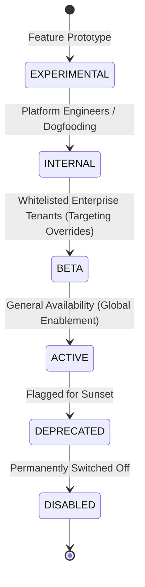

# Canonical Feature Taxonomy & Classification

> **Document Status:** Authoritative Architectural Taxonomy  
> **System:** Talnova Onboarding Enterprise Platform  
> **Version:** 2.0.0-TAXONOMY  
> **Date:** September 2026  

---

## 1. Taxonomic Hierarchy

To prevent granular UI buttons from being improperly classified as independent features, the Talnova platform enforces a 3-tier taxonomic hierarchy:

$$\text{Domain (12)} \longrightarrow \text{Module (27)} \longrightarrow \text{Capability / Feature (105)}$$

* **Domain:** High-level enterprise business area (e.g. `HR Administration`, `Frontline Kiosks`).
* **Module:** Cohesive backend service package and frontend route group (e.g. `modules/journeys`, `modules/kiosk`).
* **Capability / Feature:** Meaningful, user-facing functional unit that can be independently configured, enabled, or measured (e.g. `ai_course_builder`, `digital_signatures`).

---

## 2. Feature Types

Every capability in the registry is assigned an authoritative functional type:

| Type | Definition | Example Capability |
| :--- | :--- | :--- |
| **`MODULE`** | Complete standalone subsystem with dedicated routing and multiple views. | Kiosk Orientation System (`FEAT-KSK-002`) |
| **`WORKFLOW`** | Multi-step sequential business process involving user inputs or sign-offs. | Mandatory E-Signature Flow (`FEAT-ONB-002`) |
| **`PAGE`** | Dedicated full-screen route and interface. | Interactive Office Map (`FEAT-LOC-001`) |
| **`CAPABILITY`**| Discrete functional operation within a broader page or workflow. | Drag-and-Drop Step Reordering (`FEAT-ADM-002`) |
| **`INTEGRATION`**| External third-party connector or cryptographic gateway. | SAML 2.0 / OIDC SSO Gateway (`FEAT-AUTH-005`) |
| **`ANALYTICS`** | Data aggregation, retention tracking, and visual telemetry charts. | Executive Drop-Off Analytics (`FEAT-ADM-018`) |
| **`ADMINISTRATION`**| System configuration, organization settings, and security policies. | Organization Branding & Themes (`FEAT-ADM-016`) |
| **`AUTOMATION`** | Event-driven trigger-action rules executed without manual user action. | Event-Driven Workflow Rules (`FEAT-ADM-007`) |
| **`AI`** | Generative intelligence, LLM curriculum generation, or RAG assistants. | AI Course Builder (`FEAT-ADM-015`) |
| **`COMMUNICATION`**| Multi-channel notifications, emails, and calendar synchronization. | 1-on-1 Calendar Integration (`FEAT-CAL-001`) |
| **`REPORTING`** | Data extraction and RFC-4180 streaming report generation. | 15 Canonical Streaming Reports (`FEAT-SUP-014`) |

---

## 3. Feature Lifecycle States

Features progress through a deterministic lifecycle model:

* **`EXPERIMENTAL`:** Proof-of-concept; isolated to staging environments.
* **`INTERNAL`:** Feature in active development; accessible only by Super Admins and engineers.
* **`BETA`:** Functional feature undergoing validation with select customers (`targetAudience = 'organizations'`).
* **`ACTIVE` (GA):** Fully supported production capability (`isEnabled = true`, `rolloutPercentage = 100`).
* **`DEPRECATED`:** Scheduled for sunset; visible with warning banners; creation of new items disabled.
* **`DISABLED`:** Globally inaccessible across all tenants.
