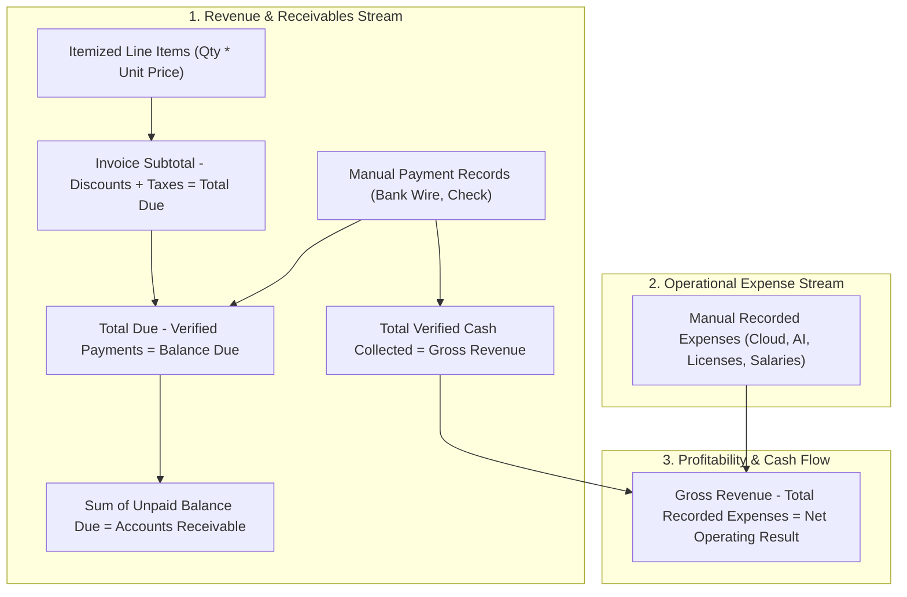
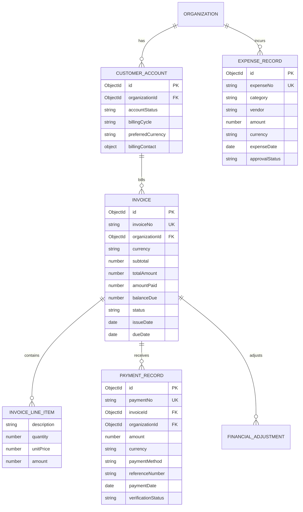
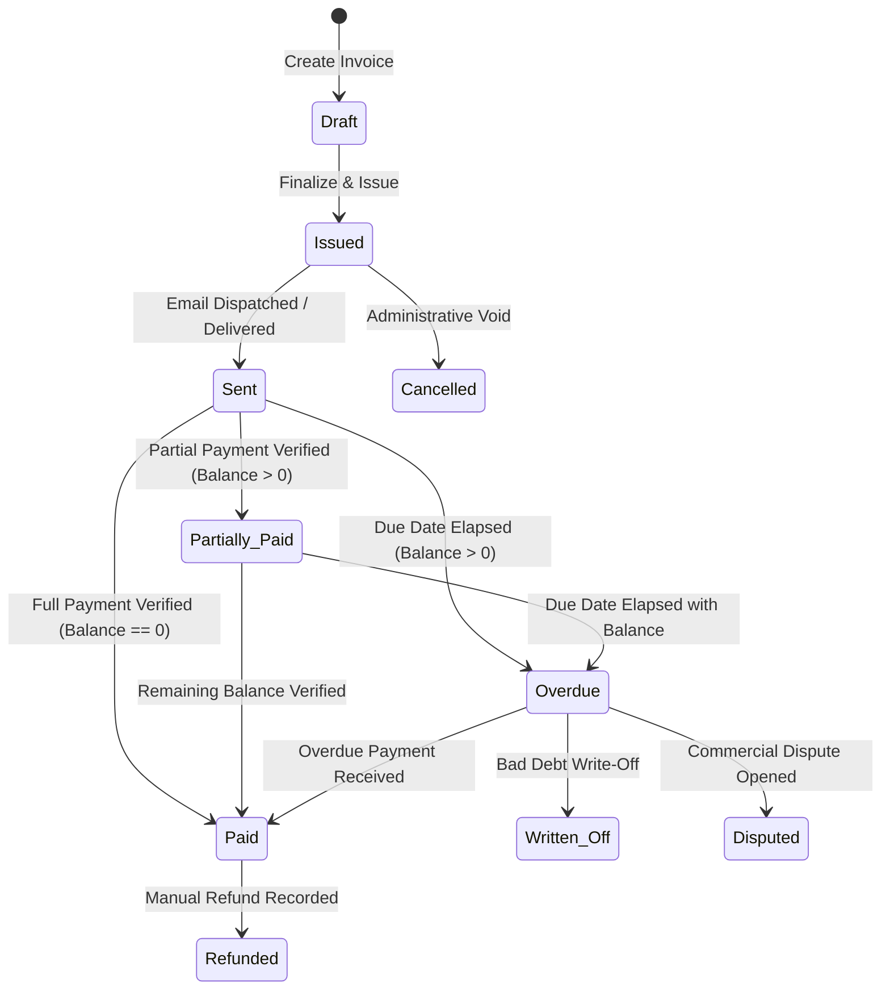

# Super Admin Internal B2B Finance & Invoicing Architecture

> **Document Status:** Authoritative Financial Architecture Blueprint  
> **System:** Talnova Onboarding Enterprise Platform  
> **Scope:** Manual Internal B2B Financial Control Plane, Invoicing, Payment Ledger, Expense Tracking, and Reconciliations.

---

## 1. Executive Business Constraint & Philosophy

> [!IMPORTANT]
> **STRICT CONSTRAINT: INTERNAL B2B RECONCILIATION ONLY (NO PAYMENT GATEWAYS)**  
> The Talnova Onboarding platform serves enterprise B2B customers. **It does NOT utilize automated consumer payment gateways (Stripe, PayPal, Paddle, Adyen).** All customer commercial contracts, invoices, and payments are managed through direct enterprise accounts, purchase orders (PO), bank wires, checks, and manual reconciliations.

The Super Admin Finance Center must provide a **fully transparent, customizable, auditable internal financial management system** where every number is deterministic and traceable to its root transaction.

---

## 2. Core Financial Source of Truth & Formulas

Financial metrics are never approximated, simulated, or multiplied by synthetic constants. They are calculated from deterministic accounting formulas:



### Deterministic Calculation Contracts

1. **Invoice Total Amount:**
   $$\text{Subtotal} = \sum (\text{item.quantity} \times \text{item.unitPrice})$$
   $$\text{Total Amount} = \text{Subtotal} - \text{discountAmount} + \text{taxAmount}$$

2. **Invoice Balance Due:**
   $$\text{Amount Paid} = \sum \text{PaymentRecord.amount where verificationStatus == 'verified'}$$
   $$\text{Balance Due} = \max(0, \text{Total Amount} - \text{Amount Paid})$$

3. **Platform Gross Cash Revenue (Selected Time Window):**
   $$\text{Revenue} = \sum \text{PaymentRecord.amount where paymentDate } \in [\text{start}, \text{end}] \text{ and verificationStatus == 'verified'}$$

4. **Outstanding Accounts Receivable (A/R):**
   $$\text{A/R} = \sum \text{Invoice.balanceDue where status } \in [\text{'issued'}, \text{'sent'}, \text{'partially\_paid'}, \text{'overdue'}]$$

5. **Net Operating Result (Profitability):**
   $$\text{Operating Result} = \text{Revenue} - \sum \text{ExpenseRecord.amount where expenseDate } \in [\text{start}, \text{end}] \text{ and approvalStatus == 'approved'}$$

---

## 3. Financial Entity Architecture



---

## 4. Multi-State Invoice Lifecycle State Machine

Invoices follow a strict, auditable enterprise lifecycle:



* **Draft:** Editable invoice before numbers are committed.
* **Issued:** Finalized with unique invoice number (`INV-XXXX`); locked from line-item tampering.
* **Sent:** Delivered to customer billing contact.
* **Partially Paid:** Verified payments recorded, but `balanceDue > 0`.
* **Paid:** Total payments equal or exceed invoice `totalAmount`.
* **Overdue:** System scheduler detects `dueDate < now` and `balanceDue > 0`.
* **Cancelled:** Voided prior to payment; does not count towards revenue or A/R.
* **Written Off:** Uncollectible bad debt approved by executive administrator.
* **Refunded:** Manual refund issued; generates reverse accounting entry.
* **Disputed:** Customer disputing terms; excluded from standard aging alerts.

---

## 5. Multi-Currency Discipline

The platform may bill global enterprises in different currencies (`USD`, `EUR`, `GBP`, `CAD`, `AUD`, `LKR`).

### Strict Rules:
1. **Never Silently Mix Currencies:** Adding `$1,000 USD` + `€1,000 EUR` + `1,000 LKR` into a single aggregate without explicit currency labeling is strictly forbidden.
2. **Dual Currency Storage:**
   * Every transaction stores its **Original Currency** (`currency`) and **Original Amount** (`amount`).
   * When displaying platform-wide aggregates, numbers are converted to **Base Reporting Currency (USD)** using configured exchange rate tables, with a visible badge indicating converted estimates (e.g. `USD Equiv. @ 1.08 EUR/USD`).
   * Currency filter dropdown allows viewing aggregates strictly in native currency (`Filter: EUR Only`).

---

## 6. Financial Auditability & Traceability Drill-Down

Every financial KPI allows progressive investigation:

```text
[Executive Command Center]
   └─ Monthly Revenue: $48,500.00 USD
         │
[Finance Center — Invoices Directory]
   └─ Customer: "Wayne Enterprises" -> Total Paid: $12,500.00 USD
         │
[Invoice Detail View]
   └─ Invoice #INV-8894 (Total: $12,500.00 | Status: PAID | Due: 2026-09-15)
         │  ├── Line 1: Enterprise Platform Annual License (1 x $10,000.00)
         │  └── Line 2: Frontline Kiosk Add-On Pack (5 x $500.00)
         │
[Payment Records Ledger]
   └─ Payment #PAY-1042 (Amount: $12,500.00 USD | Date: 2026-09-10)
         ├── Method: Bank Wire Transfer
         ├── Reference: "WIRE-FED-NY-8829104"
         ├── Recorded By: "SuperAdmin Jane Smith" (2026-09-10 14:22 UTC)
         └── Verification Status: VERIFIED (Bank Statement Checksum Match)
```

No financial mutation is ever silent. Every invoice creation, edit, payment entry, and expense record produces an immutable entry in the `AuditLog` collection.
