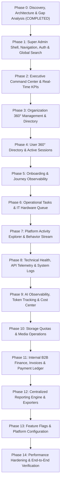

# Super Admin Incremental Implementation Roadmap & Vertical Slice Plan

> **Document Status:** Authoritative Implementation Roadmap  
> **System:** Talnova Onboarding Enterprise Platform  
> **Approach:** Incremental Vertical Slices (Real Data -> Backend API -> Security -> Frontend UI -> Verification)

---

## 1. Master Phasing Sequence

The Super Admin Command Center will be engineered across 14 sequential vertical slices to ensure that each phase produces a fully functional, testable operational capability:

---

## 2. Phase-by-Phase Engineering Specifications

---

### Phase 0: Discovery, Architecture & Gap Analysis `[DONE]`
* **Goal:** Understand platform architecture, 49 user journeys, 47 models, and identify all data and observability gaps.
* **Deliverables:** Complete documentation suite under `docs/super-admin/`.

---

### Phase 1: Super Admin Shell, Navigation, Auth & Global Search
* **Goal:** Establish the enterprise control plane layout, sidebar navigation, universal filter context, root route protection, and keyboard-driven global search.
* **Frontend Changes:**
  * Update `src/components/AppShell.tsx` and `src/components/Sidebar.tsx` to mount the expanded 7-cluster `superAdminNavSections`.
  * Create `SuperAdminShell` container with persistent header filter bar (Date Range, Tenant Selector, Environment, Severity).
  * Extend `CommandPalette.tsx` with root Super Admin search providers (search organizations, users, invoices, alerts).
* **Backend Changes:**
  * Create `GET /api/v1/super-admin/search` endpoint in Fastify with text indexes across Organizations, Users, Journeys, and Invoices.
* **Database Changes:** Text indexes on `organizations.name`, `users.profile.fullName`, `users.auth.email`.
* **Definition of Done:** Super Admin logs in, sees complete enterprise navigation, toggles global filter context, and searches across all platform entities using `Ctrl+K`.

---

### Phase 2: Executive Command Center & Real-Time KPIs
* **Goal:** Deliver an authoritative, high-level operational overview answering "What is happening across Talnova right now?".
* **Frontend Changes:**
  * Refactor `src/pages/SuperAdminDashboard.tsx` into a state-of-the-art Command Center.
  * KPI metric cards (Tenants, Active Users, Active Onboardings, Cash Revenue, Net Operating Result, Open Alerts, System Health).
  * Interactive 6-month growth area trajectories with toggleable metric layers (Organizations vs Revenue vs Users).
  * Live status pills and real-time refresh controls.
* **Backend Changes:**
  * Refactor `GET /api/v1/super-admin/dashboard/telemetry` to eliminate hardcoded multipliers (`orgsCount * 150`) and calculate real metrics.
* **Database Changes:** Daily rollup aggregation query over active collections.
* **Definition of Done:** Command Center renders live data without synthetic multipliers; metric cards link directly into drill-down sub-pages.

---

### Phase 3: Organization 360° Management & Directory
* **Goal:** Empower administrators to monitor every tenant workspace with a comprehensive 360° profile.
* **Frontend Changes:**
  * Upgrade `SuperAdminOrganizations.tsx` with enhanced sorting, filtering, plan tier badges, and seat usage indicators.
  * Create `SuperAdminOrganization360.tsx` with 8 modular tabs: Overview, Users/Employees, Onboarding/Journeys, Storage, Invoices/Billing, Activity, Alerts, Audit.
* **Backend Changes:**
  * Implement `GET /api/v1/super-admin/organizations/:id/360` aggregating single-tenant statistics.
  * Refactor `POST /api/v1/super-admin/organizations` and `PATCH /api/v1/super-admin/organizations/:id`.
* **Database Changes:** Compound indexes on `Organization` for fast lookup by ID or slug.
* **Definition of Done:** Admin can inspect any customer workspace, examine active users, inspect billing state, and update operational quotas with audit logging.

---

### Phase 4: User 360° Directory & Active Sessions
* **Goal:** Comprehensive user directory, role assignment, active session governance, and user 360° profiles.
* **Frontend Changes:**
  * Create `SuperAdminUsers.tsx` (paginated directory with role, org, department, and status filters).
  * Create `SuperAdminUser360.tsx` (profile, onboarding progression, assigned tasks, signed documents, security).
  * Create `SuperAdminSessions.tsx` (active device tokens, IP addresses, revoke session button).
* **Backend Changes:**
  * Endpoints: `GET /api/v1/super-admin/users`, `GET /api/v1/super-admin/users/:id/360`, `PATCH /api/v1/super-admin/users/:id/status`, `PATCH /api/v1/super-admin/users/:id/role`, `GET /api/v1/super-admin/users/sessions`, `POST /api/v1/super-admin/users/sessions/:id/revoke`.
* **Database Changes:** Indexes on `users.organizationId`, `users.employment.status`, `sessions.isValid`.
* **Definition of Done:** Admin can view any user's complete platform history, change roles, or terminate compromised sessions in real time.

---

### Phase 5: Onboarding & Journey Observability
* **Goal:** Global monitoring of all 50+ user journeys and 10-stage onboarding cases across all organizations.
* **Frontend Changes:**
  * Create `SuperAdminOnboarding.tsx` with onboarding case pipeline view (`created` -> `active` -> `completed`).
  * Drop-off risk radar and bottleneck visualizer.
  * Journey instance drill-down view (`SuperAdminJourneyDetail.tsx`).
* **Backend Changes:**
  * Endpoints: `GET /api/v1/super-admin/onboarding/overview`, `GET /api/v1/super-admin/onboarding/cases`, `GET /api/v1/super-admin/onboarding/bottlenecks`, `GET /api/v1/super-admin/onboarding/cases/:id`.
* **Database Changes:** Aggregation pipelines over `onboarding_cases`, `assignments`, and `onboarding_health`.
* **Definition of Done:** Admin can identify stalled journeys, inspect failed provisioning cases, and view step-by-step progress for any employee.

---

### Phase 6: Operational Tasks, IT Hardware Queue & Compliance Verification
* **Goal:** Oversee cross-role checklist tasks, IT equipment fulfillment, and cryptographic e-signature compliance.
* **Frontend Changes:**
  * Create `SuperAdminTasksOps.tsx` with tabs: Task Directory, IT Hardware Queue (MDM status, tracking links), and Verification Anomaly Workbench.
* **Backend Changes:**
  * Endpoints: `GET /api/v1/super-admin/tasks`, `GET /api/v1/super-admin/tasks/hardware`, `GET /api/v1/super-admin/tasks/anomalies`, `POST /api/v1/super-admin/tasks/:id/verify`.
* **Database Changes:** Indexes on `tasks.category`, `tasks.status`, `tasks.hardwareMetadata.mdmStatus`.
* **Definition of Done:** Admin can monitor hardware shipments, resolve quarantined verification anomalies, and inspect signed compliance PDFs.

---

### Phase 7: Platform Activity Explorer & Behavior Stream
* **Goal:** Centralized behavioral event explorer providing an audit-ready timeline of platform activity.
* **Frontend Changes:**
  * Create `SuperAdminActivityExplorer.tsx` with timeline view, category chips, and live search.
* **Backend Changes:**
  * Create `PlatformEvent` Mongoose model (`platform-event.model.ts`).
  * Connect `eventBus` to automatically persist domain events to `PlatformEvent`.
  * Implement `GET /api/v1/super-admin/activity` with filtering by organization, category, and date range.
* **Database Changes:** Create `platform_events` collection with 90-day TTL index.
* **Definition of Done:** Admin can filter activity by user, organization, or action and inspect event payloads.

---

### Phase 8: Technical Health, API Telemetry & System Logs
* **Goal:** Real-time infrastructure observability, API request percentiles, and application log search.
* **Frontend Changes:**
  * Create `SuperAdminApiObservability.tsx` (RPM, P50/P95/P99 latency cards, error distribution).
  * Create `SuperAdminLogs.tsx` (structured log explorer with severity filters, reqId lookup).
  * Create `SuperAdminInfrastructure.tsx` (V8 heap, process memory, OS load, MongoDB Atlas ping and connection pool stats).
* **Backend Changes:**
  * Implement in-memory `TelemetryBuffer` in Fastify `onResponse` hook.
  * Endpoints: `GET /api/v1/super-admin/observability/api-traffic`, `GET /api/v1/super-admin/observability/logs`, `GET /api/v1/super-admin/observability/infrastructure`.
* **Database Changes:** Connect to `db.stats()` and `db.admin().ping()`.
* **Definition of Done:** Admin can observe real-time API latency percentiles and inspect process memory and database latency without external monitoring agents.

---

### Phase 9: AI Observability, Token Tracking & Cost Center
* **Goal:** Track external AI invocations, token consumption, provider latency, and attributed costs.
* **Frontend Changes:**
  * Create `SuperAdminAiObservability.tsx` with token breakdown cards, provider distribution donut chart, cost trajectory, and knowledge gap review.
* **Backend Changes:**
  * Create `AIUsageRecord` model (`ai-usage-record.model.ts`).
  * Instrument `AIProviderService` to capture prompt/completion tokens, latency, and estimated cost.
  * Endpoints: `GET /api/v1/super-admin/ai/overview`, `GET /api/v1/super-admin/ai/usage`.
* **Database Changes:** Create `ai_usage_records` collection with indexes on `organizationId` and `createdAt`.
* **Definition of Done:** Every AI chat or course build records token usage and calculates dollar cost with zero prompt leakage.

---

### Phase 10: Storage Quotas & Media Operations
* **Goal:** Monitor Cloudflare R2 object storage usage, file types, and identify unlinked/orphaned assets.
* **Frontend Changes:**
  * Create `SuperAdminStorage.tsx` with storage breakdown by media type, top tenant consumers, and orphaned file cleaner.
* **Backend Changes:**
  * Endpoints: `GET /api/v1/super-admin/storage/overview`, `GET /api/v1/super-admin/storage/orphaned`, `DELETE /api/v1/super-admin/storage/orphaned/:id`.
* **Database Changes:** Aggregation pipelines over `uploads`.
* **Definition of Done:** Admin can inspect storage consumption across all tenants and clean orphaned files safely.

---

### Phase 11: Internal B2B Finance, Invoices & Payment Ledger
* **Goal:** Deliver an internal manual B2B financial control plane (NO external payment gateways) with deterministic traceability.
* **Frontend Changes:**
  * Refactor `SuperAdminFinance.tsx` to calculate real cash revenue, receivables, and operating results.
  * Create `SuperAdminInvoices.tsx` (multi-state invoice management, itemized lines, printable view).
  * Create `SuperAdminPayments.tsx` (record manual payments with bank wire references).
  * Create `SuperAdminExpenses.tsx` (record operational costs).
* **Backend Changes:**
  * Refactor `Invoice` model; create `PaymentRecord`, `ExpenseRecord`, and `CustomerAccount` models.
  * Endpoints: `/api/v1/super-admin/finance/*` for invoices, payments, expenses, and accounts.
* **Database Changes:** Create `payment_records`, `expense_records`, `customer_accounts` collections with strict indexes.
* **Definition of Done:** Admin can create itemized invoices, record manual payments with bank references, log operational expenses, and verify net operating results with zero synthetic numbers.

---

### Phase 12: Centralized Reporting Engine & Exporters
* **Goal:** Unified reporting center generating streaming CSV/JSON exports across Business, Product, Operations, Technical, and AI domains.
* **Frontend Changes:**
  * Create `SuperAdminReports.tsx` with categorized report catalog, date range selectors, and instant download buttons.
* **Backend Changes:**
  * Implement streaming report service in Fastify.
  * Endpoints: `GET /api/v1/super-admin/reports/catalog`, `POST /api/v1/super-admin/reports/run`.
* **Database Changes:** Add `DATA_EXPORTED` audit log on every export.
* **Definition of Done:** Admin can run and download any of the 15 standard reports in streaming format without server memory spikes.

---

### Phase 13: Feature Flags & Platform Configuration
* **Goal:** Dynamic feature flagging and global platform configuration without redeploying code.
* **Frontend Changes:**
  * Create `SuperAdminFeatureFlags.tsx` (toggle flags, percentage rollouts, organization targeting).
  * Create `SuperAdminPlatformSettings.tsx` (global session timeouts, default quotas, system alerts).
* **Backend Changes:**
  * Create `FeatureFlag` model (`feature-flag.model.ts`).
  * Endpoints: `GET /api/v1/super-admin/settings/flags`, `POST /api/v1/super-admin/settings/flags`, `PATCH /api/v1/super-admin/settings/flags/:id`.
* **Database Changes:** Create `feature_flags` collection with audit history.
* **Definition of Done:** Admin can toggle a feature flag for a specific tenant or percentage of users with instant effect.

---

### Phase 14: Performance Hardening & End-to-End Verification
* **Goal:** Comprehensive end-to-end testing, security penetration audit, performance validation, and documentation sign-off.
* **Engineering Activities:**
  * Execute Vitest test suite (`npm test`).
  * Verify P95 API response times `< 200ms`.
  * Validate zero console errors or unhandled promises in browser.
  * Finalize all operational runbooks and architectural walkthroughs.
* **Definition of Done:** All quality gates pass; system ready for enterprise production deployment.
