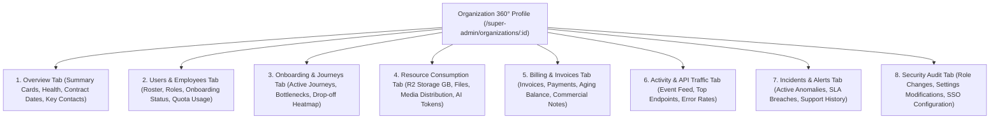

# Super Admin Information Architecture & UX Navigation Blueprint

> **Document Status:** Authoritative Information Architecture Specification  
> **System:** Talnova Onboarding Enterprise Platform  
> **Scope:** Navigation Hierarchy, URL Routing Matrix, 360° Views, Universal Filtering, Global Search, and Drill-Down Chains.

---

## 1. Executive Navigation Hierarchy

The Super Admin Command Center replaces the legacy 3-link stub with a comprehensive, modular enterprise navigation taxonomy organized into 7 functional clusters in the sidebar:

```text
SUPER ADMIN COMMAND CENTER
│
├── 1. PLATFORM CONTROL
│   ├── Platform Command Center         [/super-admin]
│   └── Unified Alert Center            [/super-admin/alerts]
│
├── 2. TENANTS & USERS
│   ├── Organizations Directory         [/super-admin/organizations]
│   │   └── Organization 360° View      [/super-admin/organizations/:id]
│   ├── Users & Access Directory        [/super-admin/users]
│   │   └── User 360° View              [/super-admin/users/:id]
│   └── Active Sessions & Security      [/super-admin/users/sessions]
│
├── 3. ONBOARDING & PRODUCT
│   ├── Onboarding & Journey Monitor    [/super-admin/onboarding]
│   │   └── Journey Instance Trace      [/super-admin/onboarding/:id]
│   ├── Feature Adoption & Analytics    [/super-admin/product/features]
│   └── Operational Tasks & Hardware    [/super-admin/tasks-ops]
│
├── 4. PLATFORM OBSERVABILITY
│   ├── Global Activity Explorer        [/super-admin/activity]
│   ├── API & Request Observability     [/super-admin/observability/api]
│   ├── System & Application Logs       [/super-admin/observability/logs]
│   ├── Technical Health & Database     [/super-admin/observability/infrastructure]
│   ├── AI Observability & Costs        [/super-admin/observability/ai]
│   └── Storage & Media Assets          [/super-admin/observability/storage]
│
├── 5. INTERNAL FINANCE & BILLING
│   ├── Financial Command Center        [/super-admin/finance]
│   ├── Customer Accounts Ledger        [/super-admin/finance/accounts]
│   ├── Invoicing & Receivables         [/super-admin/finance/invoices]
│   │   └── Invoice Detail & Print      [/super-admin/finance/invoices/:id]
│   ├── Manual Payment Records          [/super-admin/finance/payments]
│   └── Expense & Profitability Tracker [/super-admin/finance/expenses]
│
├── 6. AUDIT & GOVERNANCE
│   ├── Platform Audit & Security Logs  [/super-admin/audit]
│   └── Centralized Reporting Center    [/super-admin/reports]
│
└── 7. CONFIGURATION & SETTINGS
    ├── Feature Flags & Rollouts        [/super-admin/settings/flags]
    └── Global Platform Settings        [/super-admin/settings/platform]
```

---

## 2. Complete Routing & Capability Matrix

| Navigation Title | URL Route | Primary React Component | Required Capability | Key Icons |
| :--- | :--- | :--- | :--- | :--- |
| **Platform Command Center** | `/super-admin` | `SuperAdminDashboard` | `view_super_admin` | `LayoutDashboard` |
| **Unified Alert Center** | `/super-admin/alerts` | `SuperAdminAlerts` | `view_super_admin` | `AlertTriangle` |
| **Organizations Directory** | `/super-admin/organizations` | `SuperAdminOrganizations` | `view_super_admin` | `Building2` |
| **Organization 360° Profile** | `/super-admin/organizations/:id` | `SuperAdminOrganization360` | `view_super_admin` | `Building` |
| **Users & Access Directory** | `/super-admin/users` | `SuperAdminUsers` | `view_super_admin` | `Users` |
| **User 360° Profile** | `/super-admin/users/:id` | `SuperAdminUser360` | `view_super_admin` | `UserCheck` |
| **Active Sessions & Security** | `/super-admin/users/sessions` | `SuperAdminSessions` | `view_super_admin` | `KeyRound` |
| **Onboarding Monitor** | `/super-admin/onboarding` | `SuperAdminOnboarding` | `view_super_admin` | `GraduationCap` |
| **Journey Instance Trace** | `/super-admin/onboarding/:id` | `SuperAdminJourneyDetail` | `view_super_admin` | `Workflow` |
| **Feature Adoption Analytics** | `/super-admin/product/features`| `SuperAdminFeatureAnalytics` | `view_super_admin` | `Zap` |
| **Operational Tasks & Hardware**| `/super-admin/tasks-ops` | `SuperAdminTasksOps` | `view_super_admin` | `CheckSquare` |
| **Platform Activity Explorer** | `/super-admin/activity` | `SuperAdminActivityExplorer` | `view_super_admin` | `Clock` |
| **API & Request Observability** | `/super-admin/observability/api`| `SuperAdminApiObservability` | `view_super_admin` | `Activity` |
| **System & Application Logs** | `/super-admin/observability/logs`| `SuperAdminLogs` | `view_super_admin` | `FileText` |
| **Technical Health & Database** | `/super-admin/observability/infrastructure`| `SuperAdminInfrastructure` | `view_super_admin` | `Server` |
| **AI Observability & Costs** | `/super-admin/observability/ai`| `SuperAdminAiObservability` | `view_super_admin` | `Bot` |
| **Storage & Media Assets** | `/super-admin/observability/storage`| `SuperAdminStorage` | `view_super_admin` | `HardDrive` |
| **Financial Command Center** | `/super-admin/finance` | `SuperAdminFinance` | `view_super_admin` | `DollarSign` |
| **Customer Accounts Ledger** | `/super-admin/finance/accounts`| `SuperAdminFinanceAccounts`| `view_super_admin` | `Layers` |
| **Invoicing & Receivables** | `/super-admin/finance/invoices`| `SuperAdminInvoices` | `view_super_admin` | `FileSpreadsheet`|
| **Invoice Detail & Print** | `/super-admin/finance/invoices/:id`| `SuperAdminInvoiceDetail` | `view_super_admin` | `Receipt` |
| **Manual Payment Records** | `/super-admin/finance/payments`| `SuperAdminPayments` | `view_super_admin` | `CreditCard` |
| **Expense & Profitability** | `/super-admin/finance/expenses`| `SuperAdminExpenses` | `view_super_admin` | `TrendingUp` |
| **Platform Audit & Security** | `/super-admin/audit` | `SuperAdminAudit` | `view_super_admin` | `ShieldAlert` |
| **Centralized Reporting Center**| `/super-admin/reports` | `SuperAdminReports` | `view_super_admin` | `BarChart3` |
| **Feature Flags & Rollouts** | `/super-admin/settings/flags` | `SuperAdminFeatureFlags` | `view_super_admin` | `ToggleLeft` |
| **Global Platform Settings** | `/super-admin/settings/platform`| `SuperAdminPlatformSettings`| `view_super_admin` | `Settings` |

---

## 3. Organization 360° Profile Architecture

The Organization 360° profile (`/super-admin/organizations/:id`) functions as the definitive operational dossier for any enterprise tenant. It contains 8 modular tab panels:



---

## 4. User 360° Profile Architecture

The User 360° profile (`/super-admin/users/:id`) provides a comprehensive operational view of any platform user:

1. **Overview & Profile:** Full name, email, department, employment status, hire date, manager hierarchy, and assigned roles.
2. **Onboarding Roadmap & Progression:** Assigned journey instance, step-by-step progress, completion percentage, quiz scores, and certificates earned.
3. **Task & Document Queue:** Assigned checklist items, verification states, signed compliance PDFs, and canvas signature checksums.
4. **Activity & Session Timeline:** Login history, active device sessions, IP metadata, recent application events, and navigation breadcrumbs.
5. **AI Interaction & Usage:** Prompt counts, token consumption, feedback ratings (thumbs up/down), and reported knowledge gaps.
6. **Security & Administrative Controls:** Force password reset, terminate active sessions, toggle account status (Active/Suspended/Locked), modify roles, place legal compliance hold.

---

## 5. Universal Context Filtering System

The Super Admin Command Center includes a persistent header filter bar that synchronizes across all dashboard views using URL query parameters:

```text
+---------------------------------------------------------------------------------------------------------+
| [📅 Date Range: Last 30 Days ▼] [🏢 Tenant: All Organizations ▼] [🌍 Env: Production ▼] [⚡ Severity: All ▼] |
+---------------------------------------------------------------------------------------------------------+
```

* **Date Range:** `1h`, `24h`, `7d`, `30d`, `90d`, `1y`, or `custom` (`startDate` & `endDate`).
* **Tenant Filter:** Live searchable dropdown of all active customer workspaces, with an instant "All Organizations" aggregate view.
* **Environment Filter:** `production` (default), `staging`, `development`.
* **Severity Filter:** `critical`, `warning`, `info`, `all`.
* **Persistence Mechanism:** Query parameters (e.g., `?range=30d&org=acme-corp`) persist in browser history and sync with TanStack Query keys to trigger automatic refetches.

---

## 6. Global Search (`Ctrl+K` Command Palette)

The platform Command Palette (`CommandPalette.tsx`) is extended with root-level entity indexing for Super Admins:

* **Trigger:** Keyboard shortcut `Ctrl+K` / `Cmd+K` or clicking the search button in the top navigation bar.
* **Indexed Entities:**
  * **Organizations:** Matches by name, domain, slug, and support email.
  * **Users & Employees:** Matches by full name, email, employee ID, and department.
  * **Journeys & Courses:** Matches by template title, course title, and tag.
  * **Invoices & Payments:** Matches by invoice number (`INV-XXXX`), receipt number, and bank reference.
  * **Alerts & Incidents:** Matches by alert title and incident ID.
  * **System Routes:** Instant keyboard jump to any Super Admin sub-view.
* **Quick Navigation:** Selecting an entity immediately redirects to its corresponding 360° profile or detail view.
