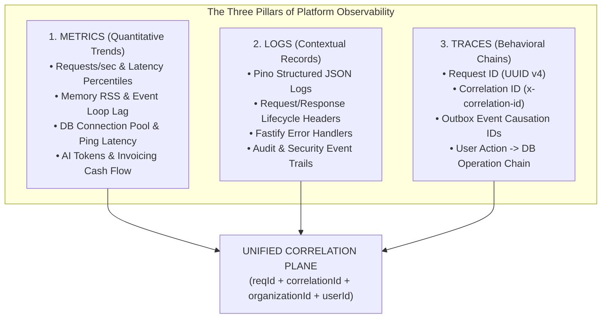

# Super Admin Platform Observability Model

> **Document Status:** Authoritative Observability Specification  
> **System:** Talnova Onboarding Enterprise Platform  
> **Scope:** Three-Pillar Observability Framework (Metrics, Logs, Traces), Request Correlation, Telemetry Buffers, and SRE Diagnostics.

---

## 1. The Three Pillars of Observability

The Super Admin Command Center provides complete end-to-end platform visibility by integrating the three canonical pillars of observability:



---

## 2. Request Correlation & Traceability

Every incoming HTTP request and asynchronous background process is tagged with immutable correlation metadata:

```text
Incoming Client Request (HTTP / WSS)
  │
  ├── Header: `x-correlation-id` (propagated from upstream or generated)
  └── Header: `x-request-id` (generated as UUID v4 if missing)
        │
Fastify Middleware Hook (`request-id.middleware.ts` + `logging.middleware.ts`)
  │
  ├── Injects `request.id` and `request.correlationId` into Fastify context
  ├── Records request start time via `process.hrtime()`
  └── Logs structured JSON payload via Pino:
      {
        reqId: "c18a2b3c-4d5e-6f7a-8b9c-0d1e2f3a4b5c",
        correlationId: "corr-9988-7766-5544",
        method: "POST",
        url: "/api/v1/journeys/quiz/submit",
        ip: "203.0.113.195",
        organizationId: "64f8a1b2c3d4e5f6a7b8c9d0",
        userId: "64f9b2c3d4e5f6a7b8c9d0e1"
      }
        │
Application Execution (Service -> Repository -> Mongoose)
  │
  ├── Propagates `correlationId` into Outbox events (`outbox_events.correlationId`)
  ├── Propagates `correlationId` into Background workers (`queue.service.ts`)
  └── Propagates `correlationId` into `AuditLog` and `PlatformEvent`
        │
Outgoing Response Hook (`onResponse`)
  │
  ├── Computes exact duration: `durationMs = diff[0] * 1e3 + diff[1] * 1e-6`
  ├── Stores record into In-Memory `TelemetryBuffer` (circular ring buffer)
  └── Writes `x-request-id` and `x-correlation-id` to client response headers
```

---

## 3. High-Performance In-Memory Telemetry Ring Buffer

To provide instant, zero-database-overhead API observability for the Super Admin Command Center, Fastify utilizes a high-throughput circular ring buffer (`TelemetryBuffer`):

* **Buffer Capacity:** Retains the last 5,000 HTTP requests in memory (~1.2 MB RAM footprint).
* **Buffer Slot Structure:**
  ```typescript
  export interface TelemetryRequestRecord {
    timestamp: number;
    reqId: string;
    correlationId?: string;
    method: string;
    url: string;
    route: string;
    statusCode: number;
    durationMs: number;
    organizationId?: string;
    userId?: string;
    ip: string;
    error?: string;
  }
  ```
* **Real-Time Statistical Calculations:**
  * **Throughput:** Requests per minute (RPM) and requests per hour (RPH).
  * **Latency Distribution:** Calculates **P50 (Median)**, **P95**, and **P99** response times over rolling 5-minute, 15-minute, and 60-minute windows:
    $$\text{P95} = \text{Value at 95th percentile of sorted duration array}$$
  * **Error Rate %:**
    $$\text{Error Rate} = \left( \frac{\text{Count of HTTP } 4xx + 5xx}{\text{Total Requests in Window}} \right) \times 100$$
  * **Top Endpoints & Heaviest Consumers:** Aggregates request counts and aggregate latency grouped by normalized route (e.g. `/api/v1/journeys/:id`) and `organizationId`.

---

## 4. Technical Infrastructure & SRE Health Telemetry

The Super Admin Command Center monitors technical system vitals through dedicated diagnostic endpoints:

### Node.js Process & Host Operating System
* **Process Memory (RSS / V8 Heap):**
  * `process.memoryUsage().rss`: Resident Set Size (total memory allocated to process).
  * `process.memoryUsage().heapUsed`: Actual V8 heap memory consumed.
  * `process.memoryUsage().heapTotal`: Total V8 heap size reserved.
* **Process Uptime:** Formatted in days, hours, minutes from `process.uptime()`.
* **Event Loop Lag:** Measurement of Node.js event loop scheduling latency (alerting if lag exceeds 50ms).
* **Host OS Metrics:** Host CPU model, core count, load average (1m, 5m, 15m from `os.loadavg()`), free RAM vs total system RAM (`os.freemem()` / `os.totalmem()`).

### MongoDB Atlas Database Observability
* **Connectivity State:** Mongoose connection status (`1 = connected`, `2 = connecting`, `0 = disconnected`).
* **Round-Trip Ping Latency:** Real-time database round-trip measurement using `mongoose.connection.db.admin().ping()` (reported in ms).
* **Connection Pool Telemetry:** Active connections, available connections, and queued connection requests.
* **Collection & Storage Metrics:** Database storage size, data size, index size, and total document counts across top collections (`users`, `organizations`, `assignments`, `tasks`, `uploads`, `auditLogs`) via `db.stats()`.

---

## 5. Background Jobs & Worker Observability

The platform runs two critical background engines:
1. **Transactional Outbox Engine (`outbox_events`):**
   * **Monitored States:** `pending`, `processing`, `published`, `failed`, `dead_letter`.
   * **Dead Letter Queue (DLQ):** Captures events exceeding 5 retry attempts with stack trace and last error message.
   * **Super Admin Control:** View DLQ items, inspect event payloads, and trigger manual event replay.
2. **Persistent Queue Worker (`queue.service.ts`):**
   * **Monitored Jobs:** Delayed workflows (`resume_delayed_workflow`), reminder notifications, and scheduled digest emails.
   * **Job Execution Metrics:** Active jobs, completed jobs, failed jobs, and backlog depth.

---

## 6. AI Observability & Cost Engineering

Every external LLM interaction is treated as an observable, billable platform event:

* **Monitored Telemetry:**
  * Provider (`openai`, `gemini`, `anthropic`, `azure_openai`).
  * Model (`gpt-4o-mini`, `gemini-1.5-flash`, `claude-3-5-sonnet-20241022`).
  * Prompt Tokens (Input), Completion Tokens (Output), and Total Tokens.
  * Network round-trip latency (ms).
  * HTTP status and provider error payload.
* **Cost Calculation Formula:**
  $$\text{Estimated Cost (\$) } = \left( \frac{\text{Input Tokens}}{1,000,000} \times \text{Rate}_{\text{input}} \right) + \left( \frac{\text{Output Tokens}}{1,000,000} \times \text{Rate}_{\text{output}} \right)$$
* **Privacy & Content Safety:** Raw prompt strings and sensitive company policy excerpts are **never** logged in full plain text within operational telemetry. Only high-level token counts, model names, and caller IDs are persisted in `AIUsageRecord`.
