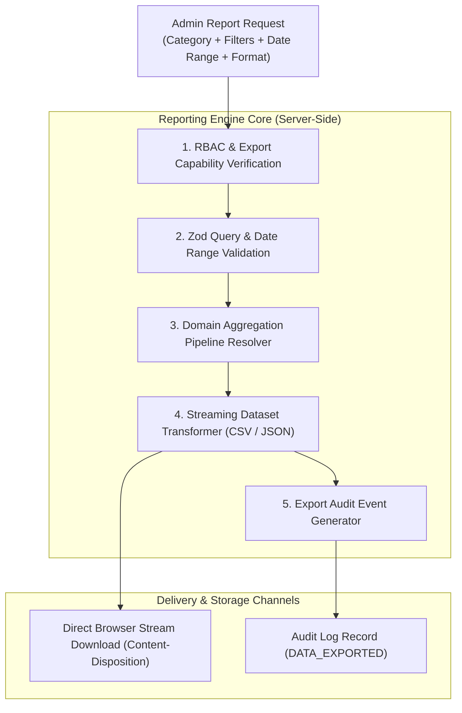

# Super Admin Centralized Reporting Engine Architecture

> **Document Status:** Authoritative Reporting Specification  
> **System:** Talnova Onboarding Enterprise Platform  
> **Scope:** Centralized Multi-Domain Reporting Engine, Report Definitions, Streaming Exports, and Governance.

---

## 1. Reporting Engine Architecture

The **Centralized Reporting Center** (`/super-admin/reports`) provides platform administrators with an authoritative, unified interface for generating, scheduling, and exporting cross-tenant operational datasets:



---

## 2. Master Report Catalog by Domain

The engine provides 15 canonical enterprise reports organized across 5 capability categories:

### A. Business & Financial Reports
1. **Tenant Growth & Subscription Roster:** Lists all organizations, subscription plans, seat quotas, user counts, creation dates, and current operational statuses.
2. **Accounts Receivable & Aging Ledger:** Detailed breakdown of all unpaid and overdue invoices categorized by aging buckets (Current, 1-30 days, 31-60 days, 61-90 days, 90+ days overdue).
3. **Cash Collection & Payment Ledger:** Itemized ledger of all verified manual payments, bank wire references, payment methods, and corresponding invoice numbers.
4. **Profitability & Operational Expense Statement:** Comprehensive statement comparing gross cash collected against recorded platform expenses by category.

### B. Product & Adoption Reports
5. **Feature Adoption & Engagement Matrix:** Usage metrics across key features (AI Assistant, AI Course Builder, Kiosks, Office Map, E-Signatures) by organization.
6. **Journey Completion & Drop-off Analysis:** Statistical analysis of journey assignments, completion rates, average days to graduate, and drop-off stages.
7. **Assessment Difficulty & Knowledge Gap Review:** Comprehensive list of LMS quiz questions with failure rates > 30% and unresolved knowledge gaps.

### C. Operational & Compliance Reports
8. **Onboarding SLA & Velocity Report:** Employee onboarding progression velocity, overdue milestone reviews, and stalled onboarding cases.
9. **IT Hardware Provisioning Audit:** Asset tags, serial numbers, MDM enrollment statuses, and shipment courier tracking for all hardware tasks.
10. **Legal Compliance & E-Signature Audit:** Master compliance log recording document templates, signed employee names, timestamps, IP addresses, and SHA-256 hashes.
11. **Onboarding Exception & Hold Log:** Detailed log of all active onboarding cases in paused, failed, or exception states.

### D. Technical & Reliability Reports
12. **API Traffic & Performance SLA Report:** Requests per minute, error rate percentiles (4xx, 5xx), and P50/P95/P99 latency trends.
13. **Application Error & Incident Post-Mortem:** Filtered log of all critical audit events, unhandled server exceptions, and dead-letter outbox events.
14. **Media Storage & Orphaned Asset Inventory:** Breakdown of Cloudflare R2 storage by organization, file type, and unlinked media.

### E. AI Consumption Reports
15. **AI Usage & Cost Attribution Report:** Input tokens, output tokens, total tokens, provider latency, and calculated costs attributed per organization.

---

## 3. Streaming Export & Memory Protection

To avoid Node.js buffer overflows or memory exhaustion when exporting datasets with tens of thousands of rows:
1. **Fastify Stream Response:** The backend queries MongoDB using Mongoose cursors (`Model.find().cursor()`) and transforms documents row-by-row directly into the Fastify reply stream:
   ```typescript
   reply.header("Content-Type", "text/csv; charset=utf-8");
   reply.header("Content-Disposition", `attachment; filename="${reportName}-${Date.now()}.csv"`);
   ```
2. **Chunked Transfer Encoding:** Data is streamed in chunks, maintaining a near-zero memory footprint on the server.
3. **Audit Emission:** The export handler records the total stream row count and filter parameters upon stream closure.
