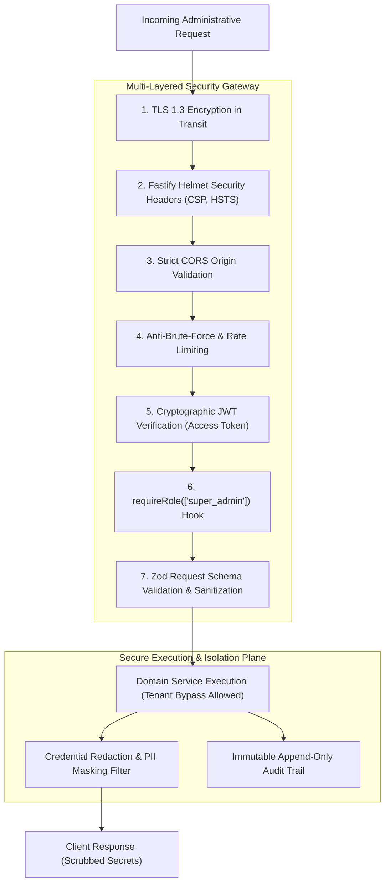

# Super Admin Security & Access Control Architecture

> **Document Status:** Authoritative Security Architecture Blueprint  
> **System:** Talnova Onboarding Enterprise Platform  
> **Scope:** Authentication, Root Authorization, Session Integrity, Threat Modeling, Data Minimization, and Defense-in-Depth.

---

## 1. Security Architecture & Threat Model

The Super Admin Command Center holds root-level keys to every organization, user, and compliance document in the Talnova ecosystem. Consequently, its defense architecture enforces **strict zero-trust boundaries, multi-layered authorization, and absolute credential protection**:



---

## 2. Authentication & Session Integrity

1. **Dual-Token Architecture:**
   * **Access Token:** Short-lived JWT (15-minute expiry) signed using `JWT_SECRET`. Contains `userId`, `organizationId`, and `role: "super_admin"`. Carried via HTTP `Authorization: Bearer <token>` header.
   * **Refresh Token:** Long-lived token (7-day expiry) signed with `JWT_REFRESH_SECRET`, stored in an HTTP-only, Secure, SameSite=Strict cookie.
2. **Session Model & Immediate Revocation (`Session`):**
   * Every active Super Admin session has a corresponding entry in the `sessions` collection.
   * When an administrator clicks "Terminate Session" or an account is flagged for compromise, setting `Session.isValid = false` or incrementing `Session.tokenVersion` immediately invalidates the session across all distributed instances.
3. **MFA Enforceability:**
   * Support for multi-factor authentication (TOTP authenticator app) enforced on Super Admin accounts.

---

## 3. Root Authorization vs. Tenant Isolation Boundaries

The platform enforces two distinct authorization paradigms:

```text
+-----------------------------------------------------------------------------------+
|                        STANDARD APPLICATION ROUTE PARADIGM                        |
|                                                                                   |
|  1. Requires: authenticate                                                        |
|  2. Enforces: verifyTenant (WHERE organizationId == context.user.organizationId)  |
|  3. Result: Absolute multi-tenant isolation. Zero cross-tenant data leakage.      |
+-----------------------------------------------------------------------------------+

+-----------------------------------------------------------------------------------+
|                        SUPER ADMIN CONTROL PLANE PARADIGM                         |
|                                                                                   |
|  1. Requires: authenticate                                                        |
|  2. Enforces: requireRole(["super_admin"])                                        |
|  3. Bypasses: Tenant query boundaries ONLY within /api/v1/super-admin/* routes.   |
|  4. Logs: Actor ID, target organization, action diff, and client IP in AuditLog.  |
+-----------------------------------------------------------------------------------+
```

* **Frontend Security Non-Reliance:** Frontend route guards (`<ProtectedRoute capability="view_super_admin">`) are used solely for user experience. Every backend endpoint independently validates the JWT claims.

---

## 4. Credential Masking & Secret Redaction

The Super Admin dashboard **never** transmits, exposes, or renders raw secrets:

| Entity / Resource | Field Name | Masking Rule |
| :--- | :--- | :--- |
| **User Account** | `auth.passwordHash` | **Strip Completely:** Excluded from Mongoose projections (`-auth.passwordHash`). |
| **SSO SAML / OIDC** | `ssoConfig.certificate` | **Fingerprint Only:** Expose SHA-256 fingerprint; strip raw private keys. |
| **AI Providers** | `secrets.apiKey` | **Mask Value:** Show only prefix and suffix (e.g., `sk-proj-...8a9F`). |
| **Storage Gateway** | `R2_SECRET_ACCESS_KEY` | **Never Expose:** Maintained solely in server-side environment context. |
| **Kiosk Device** | `pairingCode` | **Single-Use:** Invalidated immediately upon successful device enrollment. |

---

## 5. Defense-in-Depth Hardening Specifications

1. **Strict Input Sanitization (Zod):** Every request body and query parameter is validated against rigid Zod schemas in `common/validators/compiler.ts`. Unexpected fields are stripped to prevent mass-assignment vulnerabilities.
2. **IDOR (Insecure Direct Object Reference) Protection:** When performing administrative actions on entities (e.g. updating an organization, voiding an invoice, or resetting an employee password), services explicitly verify that the entity exists and belongs to the specified context.
3. **CORS & Origin Whitelisting:** Fastify CORS plugin (`cors.ts`) strictly validates `Origin` against configured production domains (`CORS_ALLOWED_ORIGINS`). Wildcard CORS (`*`) is disabled.
4. **Content Security Policy (CSP):** Fastify Helmet plugin enforces CSP headers blocking unauthorized inline script execution and restricting object sources.
