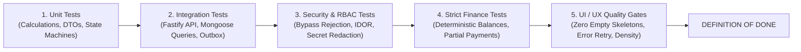

# Super Admin Testing & Verification Strategy

> **Document Status:** Authoritative Testing & Quality Assurance Specification  
> **System:** Talnova Onboarding Enterprise Platform  
> **Test Framework:** Vitest v2.1.5 (Node.js ESM)  
> **Scope:** Unit Tests, Integration Tests, Security Penetration, Financial Reconciliation, and UI Quality Gates.

---

## 1. Quality Philosophy & Gates

The Super Admin Command Center governs privileged operations, platform security, and financial transactions. As such, it is subject to rigorous testing standards before any phase is deemed complete:

---

## 2. Granular Test Suites

### 2.1 Backend Authorization & RBAC Test Suite
* **`TEST-SEC-001` SuperAdmin Root Bypass Verification:** Verify that requests with verified `role: "super_admin"` successfully query across tenant boundaries and bypass organization suspension hooks.
* **`TEST-SEC-002` Unauthorized Role Rejection:** Ensure requests from `owner`, `admin`, `manager`, and `employee` targeting `/api/v1/super-admin/*` receive immediate `HTTP 403 Forbidden` and trigger an unauthorized security alert.
* **`TEST-SEC-003` Expired & Malformed Token Rejection:** Ensure invalid, tampered, or expired tokens receive `HTTP 401 Unauthorized` with `TOKEN_EXPIRED`.
* **`TEST-SEC-004` Secret Redaction Verification:** Ensure endpoints returning user profiles and tenant configurations scrub `passwordHash`, private keys, and provider secrets.

### 2.2 Financial Calculation & Reconciliation Test Suite
* **`TEST-FIN-001` Itemized Line Item Summation:** Validate that an invoice with 5 line items, $150 discount, and 8.5% tax computes subtotal, taxAmount, and totalAmount with exact penny precision.
* **`TEST-FIN-002` Partial Payments & Balance Due:**
  * Invoice created for $5,000.
  * Payment 1 recorded: $2,000 -> Status transitions to `partially_paid`, balance due = $3,000.
  * Payment 2 recorded: $3,000 -> Status transitions to `paid`, balance due = $0.
* **`TEST-FIN-003` Overpayment Guardrail:** Recording a payment greater than remaining balance due must either reject with `400 BAD_REQUEST` or create an explicit credit record.
* **`TEST-FIN-004` Cancelled & Written-Off Invoices:** Verify that cancelled or written-off invoices are excluded from active Accounts Receivable (A/R) calculations.
* **`TEST-FIN-005` Net Operating Result Calculation:** Verify that `Operating Result = Total Verified Payments - Total Approved Expenses` across exact date boundaries.

### 2.3 Aggregation & Performance Test Suite
* **`TEST-AGG-001` Multi-Tenant User & Case Counts:** Verify aggregation pipeline counts across 50 simulated organizations match raw collection counts without N+1 query overhead.
* **`TEST-AGG-002` Telemetry Ring Buffer Latency Percentiles:** Populate `TelemetryBuffer` with 5,000 synthetic latency records (ranging from 10ms to 2,500ms) and verify P50, P95, and P99 percentiles are mathematically exact.
* **`TEST-AGG-003` Inactive Drop-off Score Sorting:** Verify `OnboardingHealth` query correctly ranks at-risk employees by `dropOffRiskScore: -1`.

### 2.4 Frontend UX Quality Gates
* **Gate 1: Meaningful Empty States:** If an organization has no active onboarding journeys or no invoices, the UI must render an instructive empty state with an actionable button (e.g. `[Create Invoice]`) rather than a blank table or generic "Nothing found".
* **Gate 2: Asynchronous State Resilience:** Every asynchronous card or table must gracefully handle `isLoading` (skeleton placeholders), `isError` (retry button with toast), and `isFetching` (subtle background refresh indicator).
* **Gate 3: Destructive Confirmation Gates:** Destructive actions (tenant suspension, invoice voiding, user role changes) must mandate confirmation modals with explicit reason inputs.
