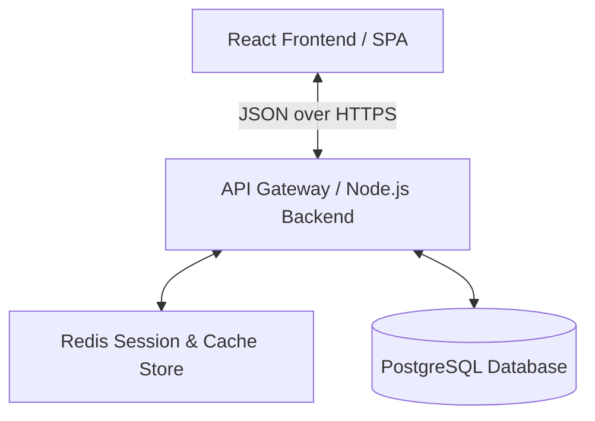
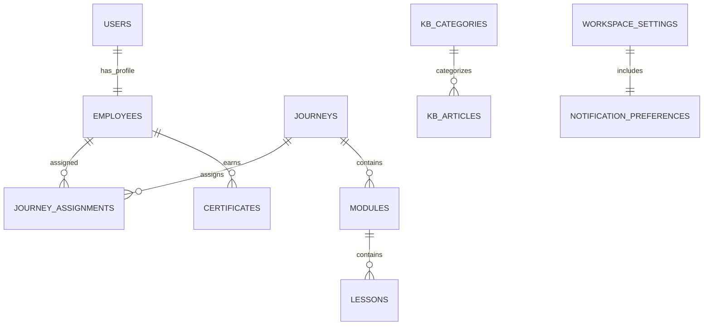

# Talnova Onboarding: Systems Architecture & Database Design

This document details the system architecture, hardware/server requirements, database schema design, and API specifications for the **Talnova Onboarding** enterprise training platform.

---

## 1. System Overview & Architecture

Talnova Onboarding is a modern, single-tenant or multi-tenant software-as-a-service (SaaS) application built to coordinate and track employee training. The application employs a decoupled client-server architecture:



- **Frontend SPA**: React 18+ powered by Vite, TanStack Query (React Query) for state caching, React Router v6, and a customized tailorable design system.
- **Backend API**: Stateless RESTful web service exposing JSON endpoints.
- **Database Layer**: Relational database (PostgreSQL 15+) for strong consistency, transactional integrity, and relational querying.
- **In-Memory Store**: Redis (optional but recommended) for session state and query caching.

---

## 2. Server & Environment Requirements

### Hardware Recommendations
| Environment | CPU Cores | RAM | Storage | Bandwidth | Target Concurrent Users |
| :--- | :--- | :--- | :--- | :--- | :--- |
| **Development** | 2 Cores | 4 GB | 20 GB SSD | 100 Mbps | 1–10 |
| **Staging / QA** | 2 Cores | 8 GB | 50 GB SSD | 1 Gbps | 10–100 |
| **Production (Min)** | 4 Cores | 16 GB | 100 GB NVMe | 1 Gbps | 100–1,000 |
| **Production (Scale)**| 8 Cores | 32 GB | 250 GB NVMe | 10 Gbps | 1,000+ (Clustered) |

### Software & Dependency Stack
- **Operating System**: Linux (Ubuntu 22.04 LTS, Debian 11, or Rocky Linux 9) recommended for hosting.
- **Runtime Environment**: Node.js `v18.x` or `v20.x` (LTS releases).
- **Package Manager**: npm `v9+` or Yarn `v1.22+`.
- **Database Server**: PostgreSQL `v14` or `v15` (or managed databases like AWS RDS / Supabase).
- **Web Server / Reverse Proxy**: Nginx `v1.22+` with SSL termination (Let's Encrypt / Certbot).
- **Process Manager**: PM2 `v5.3+` for Node process clustering and daemon auto-restarts.

---

## 3. Database Schema Design

The application data is relational. PostgreSQL is utilized to enforce constraints, check foreign keys, and ensure data integrity.

### Entity-Relationship Diagram (ERD)



---

### Detailed Schema Specifications

#### 1. `users` Table
Stores login credentials, core authentication metadata, and authorization roles.
```sql
CREATE TABLE users (
    id UUID PRIMARY KEY DEFAULT gen_random_uuid(),
    email VARCHAR(255) UNIQUE NOT NULL,
    password_hash VARCHAR(255) NOT NULL,
    name VARCHAR(100) NOT NULL,
    role VARCHAR(50) NOT NULL CHECK (role IN ('admin', 'employee')),
    avatar_url TEXT,
    company VARCHAR(150),
    created_at TIMESTAMP WITH TIME ZONE DEFAULT CURRENT_TIMESTAMP,
    updated_at TIMESTAMP WITH TIME ZONE DEFAULT CURRENT_TIMESTAMP
);
CREATE INDEX idx_users_email ON users(email);
```

#### 2. `employees` Table
Holds detailed profile records, departments, and enrollment/activity stats.
```sql
CREATE TABLE employees (
    id VARCHAR(50) PRIMARY KEY, -- Maps to User ID or custom ID (e.g. '1')
    user_id UUID UNIQUE REFERENCES users(id) ON DELETE CASCADE,
    name VARCHAR(100) NOT NULL,
    role VARCHAR(100) NOT NULL, -- Job title (e.g., Software Engineer)
    department VARCHAR(100) NOT NULL,
    status VARCHAR(50) NOT NULL CHECK (status IN ('Active', 'Onboarding', 'Inactive')),
    progress INT DEFAULT 0 CHECK (progress BETWEEN 0 AND 100),
    email VARCHAR(255),
    location VARCHAR(100),
    hire_date DATE,
    completed_journeys_count INT DEFAULT 0,
    certificates_count INT DEFAULT 0,
    created_at TIMESTAMP WITH TIME ZONE DEFAULT CURRENT_TIMESTAMP
);
CREATE INDEX idx_employees_department ON employees(department);
```

#### 3. `journeys` Table
Represents onboarding paths, training courses, or corporate tracks.
```sql
CREATE TABLE journeys (
    id UUID PRIMARY KEY DEFAULT gen_random_uuid(),
    title VARCHAR(255) NOT NULL,
    description TEXT,
    category VARCHAR(100),
    status VARCHAR(50) DEFAULT 'Draft' CHECK (status IN ('Active', 'Draft', 'Archived')),
    enrolled_count INT DEFAULT 0,
    completion_rate INT DEFAULT 0 CHECK (completion_rate BETWEEN 0 AND 100),
    created_at TIMESTAMP WITH TIME ZONE DEFAULT CURRENT_TIMESTAMP,
    updated_at TIMESTAMP WITH TIME ZONE DEFAULT CURRENT_TIMESTAMP
);
```

#### 4. `journey_assignments` Table
A junction table mapping Employees to Journeys with individual status metrics.
```sql
CREATE TABLE journey_assignments (
    id UUID PRIMARY KEY DEFAULT gen_random_uuid(),
    employee_id VARCHAR(50) REFERENCES employees(id) ON DELETE CASCADE,
    journey_id UUID REFERENCES journeys(id) ON DELETE CASCADE,
    progress INT DEFAULT 0 CHECK (progress BETWEEN 0 AND 100),
    status VARCHAR(50) DEFAULT 'In Progress' CHECK (status IN ('In Progress', 'Completed')),
    assigned_at DATE DEFAULT CURRENT_DATE,
    completed_at DATE,
    UNIQUE(employee_id, journey_id)
);
CREATE INDEX idx_journey_assignments_employee ON journey_assignments(employee_id);
```

#### 5. `modules` Table
Chapters or sections within a journey course.
```sql
CREATE TABLE modules (
    id UUID PRIMARY KEY DEFAULT gen_random_uuid(),
    journey_id UUID REFERENCES journeys(id) ON DELETE CASCADE,
    title VARCHAR(255) NOT NULL,
    sort_order INT NOT NULL DEFAULT 0,
    created_at TIMESTAMP WITH TIME ZONE DEFAULT CURRENT_TIMESTAMP
);
```

#### 6. `lessons` Table
Individual lessons, videos, quizzes, or tasks within modules.
```sql
CREATE TABLE lessons (
    id UUID PRIMARY KEY DEFAULT gen_random_uuid(),
    module_id UUID REFERENCES modules(id) ON DELETE CASCADE,
    title VARCHAR(255) NOT NULL,
    description TEXT,
    type VARCHAR(50) NOT NULL CHECK (type IN ('Video', 'Article', 'Task', 'Quiz')),
    duration VARCHAR(50) DEFAULT '5m',
    estimated_time INT DEFAULT 5, -- in minutes
    content TEXT,
    completion_rule VARCHAR(50) DEFAULT 'button' CHECK (completion_rule IN ('video', 'button', 'quiz')),
    sort_order INT NOT NULL DEFAULT 0
);
```

#### 7. `lesson_completions` Table
Tracks which employees completed specific lessons.
```sql
CREATE TABLE lesson_completions (
    employee_id VARCHAR(50) REFERENCES employees(id) ON DELETE CASCADE,
    lesson_id UUID REFERENCES lessons(id) ON DELETE CASCADE,
    completed_at TIMESTAMP WITH TIME ZONE DEFAULT CURRENT_TIMESTAMP,
    PRIMARY KEY (employee_id, lesson_id)
);
```

#### 8. `knowledge_base_categories` Table
```sql
CREATE TABLE kb_categories (
    id UUID PRIMARY KEY DEFAULT gen_random_uuid(),
    title VARCHAR(100) UNIQUE NOT NULL,
    icon_name VARCHAR(50) NOT NULL DEFAULT 'HelpCircle',
    description TEXT,
    created_at TIMESTAMP WITH TIME ZONE DEFAULT CURRENT_TIMESTAMP
);
```

#### 9. `knowledge_base_articles` Table
```sql
CREATE TABLE kb_articles (
    id UUID PRIMARY KEY DEFAULT gen_random_uuid(),
    category_id UUID REFERENCES kb_categories(id) ON DELETE SET NULL,
    title VARCHAR(255) NOT NULL,
    content TEXT,
    read_time VARCHAR(50) DEFAULT '5 min read',
    created_at TIMESTAMP WITH TIME ZONE DEFAULT CURRENT_TIMESTAMP,
    updated_at TIMESTAMP WITH TIME ZONE DEFAULT CURRENT_TIMESTAMP
);
```

#### 10. `workspace_settings` Table
```sql
CREATE TABLE workspace_settings (
    id SERIAL PRIMARY KEY,
    org_name VARCHAR(255) NOT NULL,
    workspace_url VARCHAR(255) UNIQUE NOT NULL,
    support_email VARCHAR(255) NOT NULL,
    logo_url TEXT,
    primary_color VARCHAR(7) DEFAULT '#000000',
    new_assignment_emails BOOLEAN DEFAULT TRUE,
    deadline_reminders BOOLEAN DEFAULT TRUE,
    weekly_manager_digest BOOLEAN DEFAULT FALSE
);
```

---

## 4. API Design Standards

All API endpoints must communicate using structured JSON envelopes:

### Success Envelope
```json
{
  "success": true,
  "data": { ... },
  "message": "Resource retrieved successfully"
}
```

### Error Envelope
```json
{
  "success": false,
  "error": {
    "code": "VALIDATION_ERROR",
    "message": "The provided email address is invalid."
  }
}
```

### Paginated Envelope
```json
{
  "success": true,
  "data": [ ... ],
  "total": 125,
  "page": 1,
  "limit": 10,
  "totalPages": 13
}
```

---

## 5. Security & Compliance Controls

1. **Authentication**: JWT (JSON Web Tokens) or Secure Cookie Sessions should be used. Refresh tokens should be kept in HTTP-Only, Secure, and SameSite cookies.
2. **Access Control (RBAC)**: Enforce role validation on the server for all endpoints starting with `/api/admin/*` or `/api/manage/*`.
3. **Data Encryption**:
   - SSL/TLS 1.3 enforced for transport encryption (Nginx configuration).
   - Password hashing via bcrypt (work factor 12) or Argon2id.
   - Sensitive database columns (e.g. settings parameters or API keys) encrypted at rest.
4. **Rate Limiting**: Apply rate-limiting middleware (e.g. `express-rate-limit`) restricting API endpoints to 100 requests per minute per IP address, and 5 attempts per 15 minutes for authentication routes.
