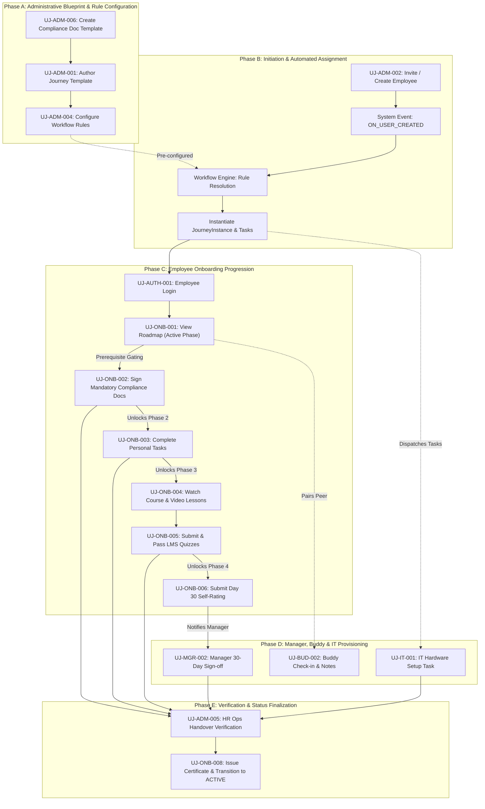
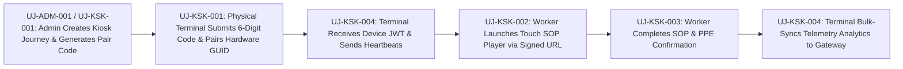

# Cross-Journey Workflow Dependency & State Transition Map

> **Document Status:** Authoritative Workflow Interdependency Specification  
> **Target System:** Talnova Onboarding Enterprise B2B SaaS Platform  
> **Reference Specifications:** `docs/product/04-unified-onboarding-lifecycle.md`, `docs/product/09-unified-product-contract.md`

---

## 1. End-to-End Enterprise Onboarding Flow

The diagram below illustrates the sequential and event-driven dependencies connecting administrative authoring, system triggers, employee execution, manager sign-offs, and final HR handover:

---

## 2. Hard Gating & Prerequisite Rules

### Rule 1: Compliance Document Hard Gate (BR-SIG-001)
* **Upstream Journey:** `UJ-ONB-002: Mandatory Compliance Document E-Signature`
* **Downstream Journeys Blocked:**
  - `UJ-ONB-004: Complete LMS Course Lessons`
  - `UJ-ONB-005: Submit LMS Quizzes`
* **Enforcement:**
  - Frontend: `EmployeeDashboard.tsx` locks Phase 3 and renders warning alert if unsigned mandatory documents exist.
  - Backend: `assignment.service.ts` rejects `completeLesson` and `submitQuiz` with HTTP 400 (`COMPLIANCE_DOCUMENTS_PENDING`) if unsigned mandatory documents remain.

### Rule 2: Prerequisite Journey Step Lock (BR-JRN-001)
* **Upstream Journey:** Preceding step in `JourneyTemplate.steps` (`prerequisiteStepId`).
* **Downstream Journey Blocked:** Subsequent steps in `JourneyInstance`.
* **Enforcement:**
  - Frontend: `JourneyViewer` and `EmployeeDashboard` mark locked steps with padlock badges.
  - Backend: Step progression APIs verify `step.prerequisiteStepId.status == 'COMPLETED'`.

### Rule 3: Authoritative HR Handover Gate (BR-HND-001)
* **Upstream Journeys:**
  - `UJ-ONB-002` (All compliance documents signed)
  - `UJ-ONB-003` & `UJ-IT-001` (All tasks marked `COMPLETED` or `VERIFIED`)
  - `UJ-ONB-004` & `UJ-ONB-005` (All course lessons completed and quizzes passed)
  - `UJ-MGR-002` (Day 30 milestone evaluated and approved)
* **Downstream Journey Blocked:**
  - `UJ-ADM-005: HR Operations Handover Verification`
  - `UJ-ONB-008: Certificate Issuance & Profile Transition to ACTIVE`
* **Enforcement:**
  - Backend: `hr-operations.service.ts` queries tasks, document signatures, assignments, and milestones; returns HTTP 400 error listing exact blocking items if any remain open.

---

## 3. Kiosk Sub-System Lifecycle Flow

